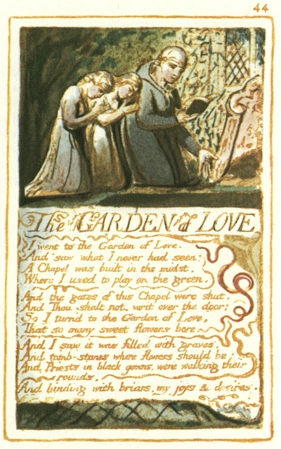

  
[Intangible Textual Heritage](../../../index.md)  [Legends and
Sagas](../../index)  [England](../index)  [Index](index.md) 
[Previous](sie35)  [Next](sie37.md) 

------------------------------------------------------------------------

[Buy this Book at
Amazon.com](https://www.amazon.com/exec/obidos/ASIN/1854377299/internetsacredte.md)

------------------------------------------------------------------------

  
*Songs of Innocence and of Experience*, by William Blake, \[1789-1794\],
at Intangible Textual Heritage

------------------------------------------------------------------------

p. 44

 

### The GARDEN of LOVE

I went to the Garden of Love.  
And saw what I never had seen:  
A Chapel was built in the midst,  
Where I used to play on the green.

And the gates of this Chapel were shut,  
And Thou shalt not, writ over the door;  
So I turn’d to the Garden of Love,  
That so many sweet flowers bore,

And I saw it was filled with graves,  
And tomb-stones where flowers should be:  
And Priests in black gowns, were walking their rounds,  
And binding with briars, my joys & desires.

------------------------------------------------------------------------

[Next: The Little Vagabond](sie37.md)
