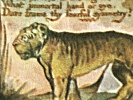

  
[Intangible Textual Heritage](../../../index.md)  [Legends and
Sagas](../../index)  [England](../index)  [Index](index.md) 
[Previous](sie38)  [Next](sie40.md) 

------------------------------------------------------------------------

[Buy this Book at
Amazon.com](https://www.amazon.com/exec/obidos/ASIN/1854377299/internetsacredte.md)

------------------------------------------------------------------------

  
*Songs of Innocence and of Experience*, by William Blake, \[1789-1794\],
at Intangible Textual Heritage

------------------------------------------------------------------------

p. 47

 

### The Human Abstract.

Pity would be no more,  
If we did not make somebody Poor:  
And Mercy no more could be,  
If all were as happy as we:

And mutual fear brings peace:  
Till the selfish loves increase.  
Then Cruelty knits a snare,  
And spreads his baits with care.

He sits down with holy fears,  
And waters the ground with tears:  
Then Humility takes its root  
Underneath his foot.

Soon spreads the dismal shade  
Of Mystery over his head;  
And the Catterpiller and Fly,  
Feed on the Mystery.

And it bears the fruit of Deceit,  
Ruddy and sweet to eat:  
And the Raven his nest has made  
In its thickest shade.

The Gods of the earth and sea,  
Sought thro’ Nature to find this Tree  
But their search was all in vain;  
There grows one in the Human Brain

------------------------------------------------------------------------

[Next: Infant Sorrow](sie40.md)
