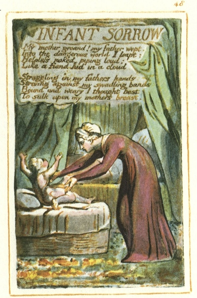

  
[Intangible Textual Heritage](../../../index)  [Legends and
Sagas](../../index)  [England](../index)  [Index](index) 
[Previous](sie39)  [Next](sie41) 

------------------------------------------------------------------------

[Buy this Book at
Amazon.com](https://www.amazon.com/exec/obidos/ASIN/1854377299/internetsacredte)

------------------------------------------------------------------------

  
*Songs of Innocence and of Experience*, by William Blake, \[1789-1794\],
at Intangible Textual Heritage

------------------------------------------------------------------------

p. 48

 

### INFANT SORROW

My mother groand! my father wept.  
Into the dangerous world I leapt:  
Helpless, naked, piping loud:  
Like a fiend hid in a cloud.

Struggling in my fathers hands:  
Striving against my swadling bands:  
Bound and weary I thought best  
To sulk upon my mothers breast.

------------------------------------------------------------------------

[Next: A Poison Tree](sie41)
