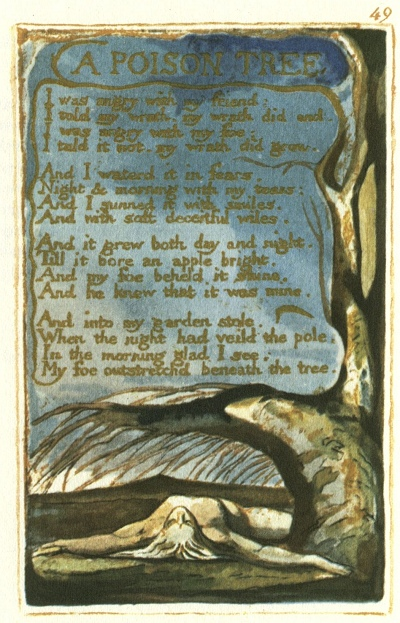

  
[Intangible Textual Heritage](../../../index.md)  [Legends and
Sagas](../../index)  [England](../index)  [Index](index.md) 
[Previous](sie40)  [Next](sie42.md) 

------------------------------------------------------------------------

[Buy this Book at
Amazon.com](https://www.amazon.com/exec/obidos/ASIN/1854377299/internetsacredte.md)

------------------------------------------------------------------------

  
*Songs of Innocence and of Experience*, by William Blake, \[1789-1794\],
at Intangible Textual Heritage

------------------------------------------------------------------------

p. 49

 

### A POISON TREE.

I was angry with my friend:  
I told my wrath, my wrath did end.  
I was angry with my foe:  
I told it not, my wrath did grow.

And I waterd it in fears,  
Night & morning with my tears:  
And I sunned it with smiles,  
And with soft deceitful wiles.

And it grew both day and night,  
Till it bore an apple bright.  
And my foe beheld it shine,  
And he knew that it was mine.

And into my garden stole,  
When the night had veild the pole;  
In the morning glad I see,  
My foe outstretchd beneath the tree.

------------------------------------------------------------------------

[Next: A Little Boy Lost](sie42.md)
