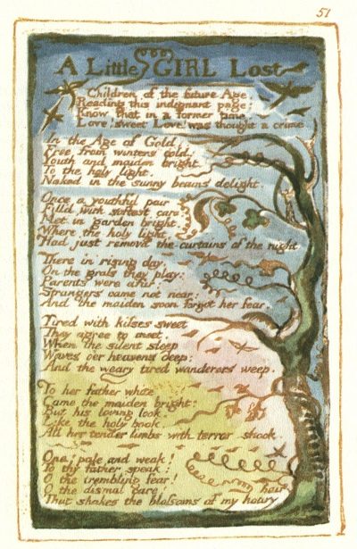

  
[Intangible Textual Heritage](../../../index.md)  [Legends and
Sagas](../../index)  [England](../index)  [Index](index.md) 
[Previous](sie42)  [Next](sie44.md) 

------------------------------------------------------------------------

[Buy this Book at
Amazon.com](https://www.amazon.com/exec/obidos/ASIN/1854377299/internetsacredte.md)

------------------------------------------------------------------------

  
*Songs of Innocence and of Experience*, by William Blake, \[1789-1794\],
at Intangible Textual Heritage

------------------------------------------------------------------------

p. 51

 

### A Little GIRL Lost

Children of the future Age,  
Reading this indignant page;  
Know that in a former time,  
Love! sweet Love! was thought a crime.

In the Age of Gold,  
Free from winters cold:  
Youth and maiden bright,  
To the holy light,  
Naked in the sunny beams delight.

Once a youthful pair  
Fill’d with softest care:  
Met in garden bright,  
Where the holy light,  
Had just removd the curtains of the night.

There in rising day,  
On the grass they play:  
Parents were afar:  
Strangers came not near:  
And the maiden soon forgot her fear.

Tired with kisses sweet  
They agree to meet,  
When the silent sleep  
Waves o’er heavens deep;  
And the weary tired wanderers weep.

To her father white  
Came the maiden bright:  
But his loving look,  
Like the holy book,  
All her tender limbs with terror shook.

Ona! pale and weak!  
To thy father speak:  
O the trembling fear!  
O the dismal care!  
That shakes the blossoms of my hoary hair

------------------------------------------------------------------------

[Next: To Tirzah](sie44.md)
