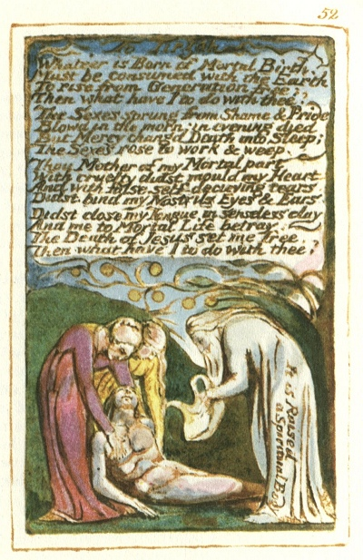

  
[Intangible Textual Heritage](../../../index)  [Legends and
Sagas](../../index)  [England](../index)  [Index](index) 
[Previous](sie43)  [Next](sie45) 

------------------------------------------------------------------------

[Buy this Book at
Amazon.com](https://www.amazon.com/exec/obidos/ASIN/1854377299/internetsacredte)

------------------------------------------------------------------------

  
*Songs of Innocence and of Experience*, by William Blake, \[1789-1794\],
at Intangible Textual Heritage

------------------------------------------------------------------------

p. 52

 

### To Tirzah

Whate’er is Born of Mortal Birth,  
Must be consumed with the Earth  
To rise from Generation free:  
Then what have I to do with thee?

The Sexes sprung from Shame & Pride  
Blowd in the morn; in evening died  
But Mercy changd Death into Sleep;  
The Sexes rose to work & weep.

Thou Mother of my Mortal part,  
With cruelty didst mould my Heart.  
And with false self-decieving tears,  
Didst bind my Nostrils Eyes & Ears.

Didst close my Tongue in senseless clay  
And me to Mortal Life betray:  
The Death of Jesus set me free.  
Then what have I to do with thee?

It is Raised  
    a Spiritual Body.

------------------------------------------------------------------------

[Next: The School-Boy](sie45)
