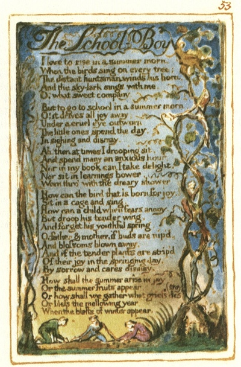

  
[Intangible Textual Heritage](../../../index.md)  [Legends and
Sagas](../../index)  [England](../index)  [Index](index.md) 
[Previous](sie44)  [Next](sie46.md) 

------------------------------------------------------------------------

[Buy this Book at
Amazon.com](https://www.amazon.com/exec/obidos/ASIN/1854377299/internetsacredte.md)

------------------------------------------------------------------------

  
*Songs of Innocence and of Experience*, by William Blake, \[1789-1794\],
at Intangible Textual Heritage

------------------------------------------------------------------------

p. 53

 

### The School-Boy

I love to rise in a summer morn,  
When the birds sing on every tree;  
The distant huntsman winds his horn,  
And the sky-lark sings with me.  
O! what sweet company.

But to go to school in a summer morn,  
O! it drives all joy away;  
Under a cruel eye outworn,  
The little ones spend the day,  
In sighing and dismay.

Ah! then at times I drooping sit,  
And spend many an anxious hour,  
Nor in my book can I take delight,  
Nor sit in learnings bower,  
Worn thro’ with the dreary shower.

How can the bird that is born for joy,  
Sit in a cage and sing.  
How can a child when fears annoy,  
But droop his tender wing,  
And forget his youthful spring.

0! father & mother, if buds are nip’d,  
And blossoms blown away,  
And if the tender plants are strip’d  
Of their joy in the springing day,  
By sorrow and cares dismay,

How shall the summer arise in joy  
Or the summer fruits appear.  
Or how shall we gather what griefs destroy  
Or bless the mellowing year,  
When the blasts of winter appear.

------------------------------------------------------------------------

[Next: The Voice of the Ancient Bard](sie46.md)
