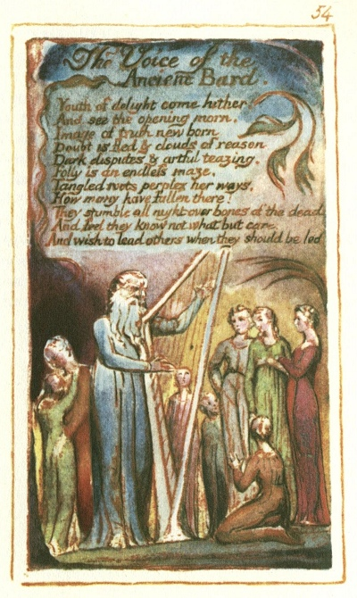

  
[Intangible Textual Heritage](../../../index)  [Legends and
Sagas](../../index)  [England](../index)  [Index](index) 
[Previous](sie45)  [Next](sie47) 

------------------------------------------------------------------------

[Buy this Book at
Amazon.com](https://www.amazon.com/exec/obidos/ASIN/1854377299/internetsacredte)

------------------------------------------------------------------------

  
*Songs of Innocence and of Experience*, by William Blake, \[1789-1794\],
at Intangible Textual Heritage

------------------------------------------------------------------------

p. 54

 

### The Voice of the Ancient Bard.

Youth of delight come hither,  
And see the opening morn,  
Image of truth new born.  
Doubt is fled & clouds of reason,  
Dark disputes & artful teazing.  
Folly is an endless maze.  
Tangled roots perplex her ways,  
How many have fallen there!  
They stumble all night over bones of the dead:  
And feel they know not what but care:  
And wish to lead others when they should be led

------------------------------------------------------------------------

[Next: A Divine Image](sie47)
