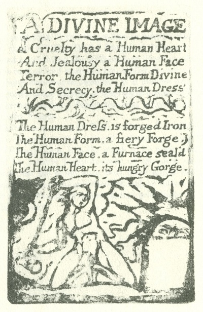

  
[Intangible Textual Heritage](../../../index)  [Legends and
Sagas](../../index)  [England](../index)  [Index](index) 
[Previous](sie46) 

------------------------------------------------------------------------

[Buy this Book at
Amazon.com](https://www.amazon.com/exec/obidos/ASIN/1854377299/internetsacredte)

------------------------------------------------------------------------

  
*Songs of Innocence and of Experience*, by William Blake, \[1789-1794\],
at Intangible Textual Heritage

------------------------------------------------------------------------

p. 55

 

### A DIVINE IMAGE

Cruelty has a Human Heart  
And Jealousy a Human Face  
Terror, the Human Form Divine  
And Secrecy, the Human Dress

The Human Dress, is forged Iron  
The Human Form, a fiery Forge.  
The Human Face, a Furnace seal’d  
The Human Heart, its hungry Gorge.

 

 

 
