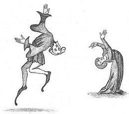

  
[Intangible Textual Heritage](../../../index) 
[Legends/Sagas](../../index)  [England](../index) 

------------------------------------------------------------------------

<table width="75%">
<colgroup>
<col style="width: 50%" />
<col style="width: 50%" />
</colgroup>
<tbody>
<tr class="odd">
<td data-valign="CENTER" width="50%"></td>
<td data-valign="CENTER" width="50%"><h1 id="sports-and-pastimes-of-the-people-of-england" data-align="CENTER">Sports and Pastimes of the People of England</h1>
<h2 id="by-joseph-strutt" data-align="CENTER">by Joseph Strutt</h2>
<h4 id="nd-ed.-1903" data-align="CENTER">[2nd ed., 1903]</h4></td>
</tr>
</tbody>
</table>

------------------------------------------------------------------------

[Start Reading](spe00)    [Contents](#contents)

------------------------------------------------------------------------

This book is a key source for information on leisure time activities in
'Olde England,' including sports, hunting, games, dancing, gymnastics,
music, festivals including Christmas and May Day and customs such as
Mumming, The Boy Bishop, and The Lord of Misrule. It answers questions
such as "How do you score a joust?," ([p. 125](spe11.htm#page_125))
"When did feral wolves become extinct in Britain?," ([p.
12](spe05.htm#page_12)) and "How much *do* you pay the piper?" ([p.
164](spe13.htm#page_164)) And what is Shakespeare talking about when he
mentions Shove-Groat ([p. 242](spe18.htm#page_242)) or Nine Men's Morris
([p. 256](spe19.htm#page_256))? (The modern equivalents are shuffleboard
and tic-tac-toe). Included are numerous quotes from original documents
and dozens of plates based on period illustrations.

Strutt documents the constant conflict between popular culture and the
religious and secular powers. The 'culture war' has been going on long
before modern attempts to censor videos, computer games and comic books.
In 1579, under Queen Elizabeth, a Puritan writer (John Northbrooke)
branded playing cards "an invention of the devill" ([p.
261](spe19.htm#page_261)), and complained ([p. 138](spe12.htm#page_138))
"Many can tary at a vayne Playe for two or three hours, when as they
will not abide scarce one houre at a Sermon." There was a class element
to this as well, with an open double standard. In 1541, a statute
forbade the lower classes from bowling and other games except under
certain closely supervised circumstances; however, nobles could obtain a
license to bowl on their own land ([p. 217](spe17.htm#page_217)).
Likewise, football ([p. 96](spe10.htm#page_96)) and tennis ([p.
85](spe10.htm#page_85)) were at times forbidden to everyone--except the
upper class.

Production notes: Since English spelling was still in a state of flux
when this book was originally published in 1801, and the book quotes
from many older documents, spelling varies widely in the body of the
text. I have left these spellings intact. The asterisks which appear in
front of many of the paragraphs were in the original book and do not
indicate footnotes; rather, they indicate material added in the second
edition.

------------------------------------------------------------------------

 [Title Page](spe00)  
[Preface](spe01)  
[Contents](spe02)  
[List of Illustrations](spe03)  
[Introduction](spe04)  

### Book I: Rural Exercises Practised By Persons Of Rank

[Chapter I](spe05)  
[Chapter II](spe06)  
[Chapter III](spe07)  

### II. Rural Exercises Generally Practised

[Chapter I](spe08)  
[Chapter II](spe09)  
[Chapter III](spe10)  

### Book III: Pastimes Usually Exercised in Towns and Cities, or Places Adjoining to Them

[Chapter I](spe11)  
[Chapter II](spe12)  
[Chapter III](spe13)  
[Chapter IV](spe14)  
[Chapter V](spe15)  
[Chapter VI](spe16)  
[Chapter VII](spe17)  

### Book IV. Domestic Amusements of Various Kinds; and Pastimes Appropriated to Particular Seasons

[Chapter I](spe18)  
[Chapter II](spe19)  
[Chapter III](spe20)  
[Chapter IV](spe21)  
