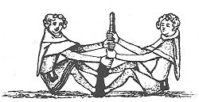

  
[Intangible Textual Heritage](../../../index.md) 
[Legends/Sagas](../../index)  [England](../index)  [Index](index.md) 
[Next](spe01.md) 

------------------------------------------------------------------------

[  
Click to enlarge](img/front.jpg.md)  
Joseph Strutt, 1749-1802.  
From the Portrait in the National Portrait Gallery.  

# THE SPORTS AND PASTIMES OF THE PEOPLE OF ENGLAND

## By Joseph Strutt

###### From the Earliest Period, Including the Rural and Domestic Recreations, May Games, Mummeries, Pageants, Processions and Pompous Spectacles, Illustrated by Reproductions From Ancient Paintings in which are Represented most of the Popular Diversions

 

##### A NEW EDITION, MUCH ENLARGED AND CORRECTED

#### BY J. CHARLES COX, LL.D., F.S.A.

#### London, Methuen & Co.

#### \[1903\]

**NOTICE OF ATTRIBUTION**  
Scanned at Intangible Textual Heritage, May 2005. John Bruno Hare,
redactor. This text is in the public domain in the United States because
it was published prior to 1923. These files may be used for any
non-commercial purpose, provided this notice of attribution is left
intact in all copies.

 

------------------------------------------------------------------------

[Next: Preface](spe01.md)
