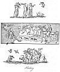

  
[Intangible Textual Heritage](../../../index) 
[Legends/Sagas](../../index)  [England](../index)  [Index](index) 
[Previous](spe05)  [Next](spe07) 

------------------------------------------------------------------------

p. 21

### CHAPTER II

Hawking practised by the Nobility--Its Origin not well known--A
favourite Amusement with the Saxons--Romantic Story relative to
Hawking--Grand Falconer of France, his State and Privileges--Edward III.
partial to Hawking--Saxon Hawking--Ladies fond of Hawking--Its
Decline--Caparison of a Hawk--Treatises concerning Hawking--Laws
respecting Hawks--Their great Value--The different Species of Hawks, and
their Appropriation--Terms used in Hawking--Fowling and Fishing--The
Stalking Horse--Lowbelling.

HAWKING BY THE NOBILITY.--Hawking, or the art of training and flying of
hawks, for the purpose of catching other birds, is very frequently
called falconry, and the person who had the care of the hawks is
denominated the falconer. The sport is generally placed at the head of
those amusements that can only be practised in the country, and probably
it obtained this precedency from its being a pastime so generally
followed by the nobility, not in this country only, but also upon the
continent. Persons of high rank rarely appeared without their dogs and
their hawks; the latter they carried with them when they journeyed from
one country to another, and sometimes even when they went to battle, and
would not part with them to procure their own liberty when taken
prisoners. Sometimes they formed part of the train of an ecclesiastic.
These birds were considered as ensigns of nobility; and no action could
be reckoned more dishonourable to a man of rank than to give up his
hawk. [1](#fn_162) The ancient English
illuminators have uniformly distinguished the portrait of king Stephen
by giving him a hawk upon his hand, to signify, I presume, by that
symbol, that he was nobly, though not royally born. [2](#fn_163)

Sebastian Brant, a native of Germany, the author of a work entitled
"Stultifera Navis," the Ship of Fools, published towards the conclusion
of the fifteenth century, accuses his countrymen of bringing their hawks
and hounds into the churches, and interrupting the divine service; which
indecency he severely reprobates and with the greatest justice. The
passage is thus translated by Alexander Barclay: [3](#fn_164)

Into the church then comes another sotte,  
Withouten devotion, jetting up and down,  
Or to be seene, and showe his garded cote.  
Another on his fiste a sparhawke or fawcone,  
Or else a cokow; wasting so his shone;  
Before the aulter he to and fro cloth wander,  
With even as great devotion as doth a gander.  
In comes another, his houndes at his tayle,  
With lynes and leases, and other like baggage;  
His dogges barke, so that withouten fayle,  
The whole church is troubled by their outrage.

p. 22

ORIGIN OF HAWKING.--I cannot trace the origin of hawking to an earlier
period than the middle of the fourth century. Julius Firmicus, who lived
about that time, is the first Latin author that speaks of falconers, and
the art of teaching one species of birds to fly after and catch
others. [1](#fn_165) Pliny is thought to have
attributed a sport of this kind to the inhabitants of a certain district
in Thrace, but his words are too obscure for much dependence to be
placed upon them. [2](#fn_166) An English
writer, upon what authority I know not, says, that hawking was first
invented and practised by Frederic Barbarossa, when he besieged
Rome.° [3](#fn_167) It appears, however, to be
very certain that this amusement was discovered abroad, where it became
fashionable, some time before it was known in this country: the period
of its introduction cannot be clearly determined; but, about the middle
of the eighth century, Boniface, archbishop of Mons, who was himself a
native of England, presented to Ethelbert, king of Kent, one hawk and
two falcons; and a king of the Mercians requested the same Boniface to
send to him two falcons that had been trained to kill cranes. [4](#fn_168) In the succeeding century, the sport was
very highly esteemed by the Anglo-Saxon nobility; and the training and
flying of hawks became one of the essentials in the education of a young
man of rank. Alfred the Great is commended for his early proficiency in
this, as well as in other fashionable amusements; [5](#fn_169) he is even said to have written a
treatise upon the subject of hawking, but there is no such work at
present in existence, that can with any degree of certainty be
attributed to him. The pastime of hawking must, no doubt, at this
period, have been very generally followed, to call for the prohibition
inserted in a charter granted to the Abbey of Abingdon, by Kenulph, king
of the Mercians; which restrains all persons carrying hawks or fellows
trespassing upon the lands belonging to the monastery. [6](#fn_170) This amusement continued to be a
fashionable one to the end of the Saxon era. Byrhtric, a Saxon nobleman,
who died towards the end of the tenth century, among other valuable
articles, left by will, to earl Ælfric, two hawks, and all his
hedge-hounds, which were, I suppose, spaniels, for the purpose of
flushing the game. [7](#fn_171) We have already
seen that Edward the Confessor was highly pleased with the sports of the
field, allotting the whole of his leisure time to hunting or hawking.

ROMANTIC STORY RELATIVE TO HAWKING.--The monkish writers, after the
conquest, not readily accounting for the first coming of the Danes, or
for the cruelties that they committed in this country, have assigned
several causes; and among others, the following story is related, which
if it might be depended upon, would prove that the pastime of hawking
was practised by the nobility of Denmark at a very early period; such a
supposition has at least probability on its side, even if it should not
be thought to derive much strength from the authority of this narrative.

p. 23

A Danish chieftain, of high rank, some say of royal blood, named
Lothbroc, amusing himself with his hawk near sea, upon the western
coasts of Denmark, the bird, in pursuit of her game, fell into the
water; Lothbroc, anxious for her safety, got into a little boat that was
near at hand, and rowed from the shore to take her up, but before he
could return to the land, a sudden storm arose, and he was driven out to
sea. After suffering great hardship, during a voyage of infinite peril,
he reached the coast of Norfolk, and landed at a port called Rodham: he
was immediately seized by the inhabitants, and sent to the court of
Edmund, king of the East Angles; when that monarch was made acquainted
with the occasion of his coming, he received him very favourably, and
soon became particularly attached to him, on account of his great skill
in the training and flying of hawks. The partiality which Edmund
manifested for this unfortunate stranger, excited the jealousy of
Beoric, the king's falconer, who took an opportunity of murdering the
Dane, whilst he was exercising of his birds in the midst of a wood, and
secreted the body: which was soon afterwards discovered by the vigilance
of a favourite spaniel. Beoric was apprehended, and, it seems, convicted
of the murder; for he was condemned to be put into an open boat (some
say the very boat in which the Danish chieftain came to England) without
oars, mast, or rudder, and in that condition abandoned to the mercy of
the ocean. It so chanced, that the boat was wafted to the very point of
land that Lothbroc came from; and Beoric, escaped from the danger of the
waves, was apprehended by the Danes, and taken before two of the
chieftains of the country, named Hinguar and Hubba; who were both of
them the sons of Lothbroc. The crafty falconer soon learned this
circumstance, and, in order to acquire their favour, made them
acquainted with the murder of their father, which he affirmed was
executed at the command of king Edmund, and that he himself had suffered
the hardship at sea, from which he had been delivered by reaching the
shore, because he had the courage to oppose the king's order, and
endeavoured to save the life of the Danish nobleman. Incited by this
abominable falsehood to revenge the murder of their father, by force of
arms, they invaded the kingdom of the East Angles, pillaged the country,
and having taken the king prisoner, caused him to be tied to a stake,
and shot to death with arrows.

This narration bears upon the face of it the genuine marks of a
legendary tale. Lidgate, a monk of Saint Edmund's Bury, has given it a
place, with the addition of several miraculous circumstances, in his
poetical life of king Edmund, who was the tutelar saint of the abbey to
which he belonged. [1](#fn_172) On the other
hand, every one who is acquainted with the history of the Anglo-Saxons
must know, that the Danish pirates had infested the coasts of England,
and committed many dreadful depredations, long before the time assigned
for the above event; and the success of the first parties encouraged
others to make the like attempts.

GRAND FALCONER OF FRANCE.--Hawking is often mentioned, says a

p. 24

modern author, in the capitularies of the eighth and ninth centuries.
The grand fauconnier of France was an officer of great eminence; his
annual salary was four thousand florins; he was attended by fifty
gentlemen, and fifty assistant falconers; he was allowed to keep three
hundred hawks, he licensed every vender of hawks in France, and received
a tax upon every bird sold in that kingdom, and even within the verge of
the court; and the king never rode out upon any occasion of consequence
without this officer attending upon him. [1](#fn_173)

In Doomsday-book a hawk's airy [2](#fn_174) is
returned among the most valuable articles of property; which proves the
high estimation these birds were held in at the commencement of the
Norman government; and probably some establishment, like that above
mentioned, was made for the royal falconer in England.

FONDNESS OF EDWARD III. &C. FOR HAWKING.--Edward III., according to
Froissart, had with him in his army when he invaded France, thirty
falconers on horseback, who had charge of his hawks; [3](#fn_175) and every day he either hunted, or went
to the river for the purpose of hawking, as his fancy inclined him. From
the frequent mention that is made of hawking by the water-side, not only
by the historians, but also by the romance writers of the middle ages, I
suppose that the pursuit of water-fowls afforded the most diversion. The
author last quoted, speaking of the earl of Flanders, says, he was
always at the river, where his falconer cast off one falcon after the
heron, and the earl another. In the poetical romance of the "Squire of
low Degree," the king of Hungary promises his daughter, that, at her
return from hunting, she should hawk by the river-side, with gos hawk,
gentle falcon, and other well-tutored birds; so also Chaucer, in the
rhime of sir Thopas, says that he could hunt the wild deer,

And ryde on haukynge by the ryver,  
With grey gos hawke in hande.

On the fourth plate is a representation of a Saxon nobleman and his
falconer, with their hawks, upon the bank of a river, waiting for the
rising of the game. The delineation is from a Saxon manuscript written
at the close of the ninth century, or at the commencement of the tenth;
in the Cotton Library. [4](#fn_176) Another
drawing upon the same subject, with a little variation, occurs in a
Saxon manuscript, somewhat more modern. [5](#fn_177) The two other engravings on the same
plate are from drawings in a manuscript written early in the fourteenth
century, preserved in the Royal Library. [6](#fn_178) We see a party of both sexes hawking by
the water side; the falconer is frightening the fowls to make them rise,
and the hawk is in the act of seizing upon one of them.

We may also here notice, that the ladies not only accompanied the
gentlemen in pursuit of this diversion, but often practised it by
themselves; and, if we

 

[  
Click to enlarge](img/pl04.jpg)  
Hawking  

 

p. 25

may believe a contemporary writer, [1](#fn_179)
in the thirteenth century, they even excelled the men in knowledge and
exercise of the art of falconry, which reason, he very ungallantly
produces, in proof that the pastime was frivolous and effeminate.
Hawking was forbidden to the clergy by the canons of the church; but the
prohibition was by no means sufficient to restrain them from the pursuit
of this favourite and fashionable amusement. On which account, as well
as for hunting, they were severely lashed by the poets and moralists;
and, indeed, the one was rarely spoken of without the other being
included; for those who delighted in hawking were generally proficients
in hunting also.

DECLINE OF HAWKING.--The practice of hawking declined, from the moment
the musket was brought to perfection, which pointing out a method more
ready and more certain of procuring game, and, at the same time,
affording an equal degree of air and exercise, the immense expense of
training, and maintaining of hawks became altogether unnecessary; it was
therefore no wonder that the assistance of the gun superseded that of
the bird; or that the art of hawking, when rendered useless, should be
laid aside. Its fall was very rapid. Hentzner, who wrote his "Itinerary"
in 1598, assures us that hawking was the general sport of the English
nobility; at the same time, most of the best treatises upon this subject
were written. At the commencement of the seventeenth century, it seems
to have been in the zenith of its glory. At the close of the same
century, the sport was rarely practised, and a few years afterwards
hardly known.

\* The great Civil War brought the use of the musket and hence of the
fowling piece much more into fashion, to the still further decay of
hawking. Charles II. did his best to revive it from a characteristic
reason; "of all the diversions of the chase," said a contemporary, "the
king likes none but hawking, because it is the most convenient for the
ladies." [2](#fn_180) In *The Compleat
Sportsman* by Giles Jacob, published in 1718, the author excuses himself
for taking no notice of this sport for the following excellent
reasons:--"The diversion of hawking, by reason of the trouble and
expence in keeping and breeding the hawk, and the difficulty in the
management of her in the field, is in a great measure disused:
especially since sportsmen are arrived to such a perfection in shooting,
and so much improved in the making of dogs, which facilitates the
pleasures in taking all sorts of game." [3](#fn_181) The Earl of Oxford, who died in 1791,
made strenuous efforts to revive falconry; and at the opening of the
nineteenth century it was supported with some spirit on different
estates in Yorkshire and Norfolk.

\* The most recent treatise on hawking, published in 1892,
says:--"Falconry has never for a single hour been extinct in Great
Britain; and there are probably at the present time more hawks in
training, well and ably trained too, both by

p. 26

amateurs and professionals, than ever there were since the beginning of
the century." [1](#fn_182)

CAPARISON OF A HAWK.--When the hawk was not flying at her game, she was
usually hood-winked, with a cap or hood provided for that purpose, and
fitted to her head; and this hood was worn abroad, as well as at home.
All hawks taken upon "the fist," the term used for carrying them upon
the hand, had straps of leather called jesses, put about their legs. The
jesses were made sufficiently long for the knots to appear between the
middle and the little fingers of the hand that held them, so that the
lunes, or small thongs of leather, might be fastened to them with two
tyrrits, or rings; and the lunes were loosely wound round the little
finger. It appears that sometimes the jesses were of silk. Lastly, their
legs were adorned with bells, fastened with rings of leather, each leg
having one; and the leathers, to which the bells were attached, were
denominated bewits; and to the bewits was added the creance, or long
thread, by which the bird in tutoring, was drawn back, after she had
been permitted to fly; and this was called the reclaiming of the hawk.
The bewits, we are informed, were useful to keep the hawk from "winding
when she bated," that is, when she fluttered her wings to fly after her
game.

Respecting the bells, it is particularly recommended that they should
not be too heavy, to impede the flight of the bird; and that they should
be of equal weight, sonorous, shrill, and musical; not both of one
sound, but the one a semitone below the other; and they ought not to be
broken, especially in the sounding part, because, in that case, the
sound emitted would be dull and unpleasing. There is, says the Book of
St Albans, great choice of sparrow-hawk bells, and they are cheap
enough; but for gos-hawk bells, those made at Milan are called the best;
and, indeed, they are excellent; for they are commonly sounded with
silver, and charged for accordingly. But we have good bells brought from
Dordreght (Dort), which are well paired, and produce a very shrill, but
pleasant sound.

I am told, that silver being mixed with the metal when the bells are
cast, adds much to the sweetness of the tone; and hence probably the
allusion of Shakespear, when he says,

How silver sweet sound lovers' tongues by night.

I cannot help adding in this place a passage from an old play, written
by Thomas Heywood; wherein one of the characters, speaking of a hawk
flying, says

Her bels, Sir Francis, had not both one waight,  
Nor was one semitune above the other.  
Mei thinkes these Millane bels do sound too full,  
And spoile the mounting of your hawke. [2](#fn_183)

So much for the birds themselves; but the person who carried the hawk

p. 27

was also to be provided with gloves for that purpose, to prevent their
talons from hurting his hand. In the inventories of apparel belonging to
king Henry VIII., such articles frequently occur; at Hampton Court, in
the jewel house, were seven hawkes' gloves embroidered. [1](#fn_184)

EARLY TREATISES ON HAWKING.--We have a poetical fragment, written in old
Norman French, as early as the thirteenth century, containing some
general observations respecting the management of hawks, which the
author informs us he found in a book made for, or by, the good king
Edward. [2](#fn_185) Wanley, in his catalogue
of the Harleian manuscripts, suspects there is some mistake in the name;
and that this fragment is really part of a treatise upon hawking, which
he tells us was written by king Alfred; but I rather think the author is
correct in this particular; for another manuscript [3](#fn_186) in English, and about a century more
modern, treating upon the same subject, has the following indication at
the close, "Here endith the booke of haukyng, after Prince Edwarde,
kynge of Englande."

\* The manuscript treatises named under Hunting, as well as "The Boke of
St Albans" (1486), all begin with description of hawking. In 1575 George
Turbervile, a Dorsetshire gentleman, published the first separate
English treatise on the subject entitled "The Booke of Faulconrie or
Hawking; for the onely delight and pleasure of all Noblemen and
Gentlemen." It is, in the main, a compilation from Italian and French
sources, and covers upwards of 370 pages. It is divided into three
parts, the first gives a description of all kinds of hawks; the second
deals with "The reclayming, imping, mewing, and fleyng both the fielde
and river of the same haukes"; whilst the third part, which is far the
longest, is solely concerned with the diseases of the hawks. In 1615
Symon Latham wrote and printed "Falconry, or the Faulcon's Luere and
Cure," considered by experts to be a good and practical work, even for
those who now may desire to follow up this ancient sport; a fourth
edition appeared in 1158. This was followed by an original work by
Edmund Bert, issued in 1619 under the title, "An Approved Treatise of
Hawkes and Hawking," divided into three books. [4](#fn_187) The author was a gentleman of Essex.
When hawking on the Sussex downs for just five weeks with "an intermewed
goshawke," he killed in that time, "with that one hawke foure score and
odd partridges, five pheasants, seven rayles, and foure hares." For one
of his goshawks he was once offered £40, and subsequently completed a
sale for £30.

In the last quoted Harley manuscript, we find not only the general rules
relative to hawking, but an account of the diseases incident to the
birds themselves, and the medicines proper to be administered to them
upon such occasions. I shall only mention the following superstitious
ceremonies: after a hawk has been ill, and is sufficiently recovered to
pursue the game, the owner has this admonition given to him; "On the
morrow tyde, when thou goest oute to haukyng, say, In

p. 28

the name of the Lord, the birds of heaven shall be beneath thy feet:
also, if he be hurt by the heron, say, The Lion of the tribe of Judah,
the root of David, has conquered; Hallelujah; and if he be bitte of any
man, say, He that the wicked man doth bind, the Lord at his coming shall
set free." These sentences, I suppose, were considered as charms, but
how far they operated, I shall leave the reader to judge.

LAWS RESPECTING HAWKING.--No persons but such as were of the highest
rank were permitted under the Norman government to keep hawks, as
appears from a clause inserted in the Forest Charter: this charter king
John was compelled to sign; and by it the privilege was given to every
free man to have airies of hawks, sparrow-hawks, falcons, eagles, and
herons in his own woods. [1](#fn_188) In the
thirty-fourth year of the reign of Edward III. a statute was made, by
which a person finding a falcon, tercelet, laner, laneret, or any other
species of hawk, that had been lost by its owner, was commanded to carry
the same to the sheriff of the county wherein it was found; the duty of
the sheriff was to cause a proclamation to be made in all the principal
towns of the county, that he had such a hawk in his custody, and that
the nobleman to whom it belonged, or his falconer, might ascertain the
same to be his property, and have it restored to him, he first paying
the costs that had been incurred by the sheriff; and, if in the space of
four months no claimant appeared, it became the property of the finder,
if he was a person of rank, upon his paying the costs to the sheriff; on
the contrary, if he was an unqualified man, the hawk belonged to the
sheriff: but the person who found it was to be rewarded for his trouble.
If the person who found the hawk concealed the same from the owner or
his falconer, he was liable upon discovery to pay the price of the bird
to the owner, and to suffer two years' imprisonment; and if he was
unable to pay the fine, his imprisonment was extended to a longer
term. [2](#fn_189) In the thirty-seventh year
of the same monarch this act was confirmed, with additional severity;
and the stealing and concealing of a hawk, was made felony. [3](#fn_190) In the same reign the bishop of Ely
excommunicated certain persons for stealing a hawk that was sitting upon
her perch in the cloisters of Bermondsey, in Southwark; but this piece
of sacrilege was committed during divine service in the choir, and the
hawk was the property of the bishop. [4](#fn_191)

In the reign of Henry VII. a restrictive act was established,
prohibiting any man from bearing a hawk bred in England, called a
nyesse, [5](#fn_192) a gos-hawk, a tassel, a
laner, a laneret, or a falcon, upon pain of forfeiting the same to the
king, but that he should use such hawks as were brought from
abroad; [6](#fn_193) what good purpose this
ordinance was to promote, I am at a loss to say. The laws respecting
these birds were frequently varied in the succeeding times, and the
alterations seem, in some instances, to have been exceedingly
capricious.

p. 29

As the hawk was a bird so highly esteemed by the nobility of England,
there will be no wonder if we find the royal edicts established for the
preservation of their eggs; accordingly, in the eleventh year of Henry
VII. it was decreed, that if any person was convicted of taking from the
nests, or destroying the eggs of a falcon, a gos-hawk, a laner, or a
swan, he should suffer imprisonment for one year and one day, and be
liable to a fine at the king's pleasure; one half of which belonged to
the crown, and the other half to the owner of the ground whereon the
eggs were found; and, if a man destroyed the same sort of eggs upon his
own ground, he was equally subject to the penalty. [1](#fn_194) This act was somewhat meliorated in the
reign of Elizabeth, and tilt imprisonment reduced to three months: but
then the offender was obligated to find security for his good behaviour
for seven years, or remain in prison until he did.

VALUE OF HAWKS.--The severity of the above-mentioned laws may probably
excite the surprise of such of my readers, as are not informed how
highly this kind of birds was formerly appreciated. At the commencement
of the seventeenth century, we find, that a gos-hawk and a tassel-hawk
were sold for one hundred marks, which was a large sum in those days.
Such as were properly trained and exercised were esteemed presents
worthy the acceptance of a king or an emperor. In the eighth year of the
reign of Edward III. the king of Scotland sent him a falcon gentle as a
present, which he not only most graciously received, but rewarded the
falconer who brought it with the donation of forty shillings; a proof
how highly the bird was valued. [2](#fn_195) It
is further said, that in the reign of James I. Sir Thomas Monson gave
one thousand pounds for a cast of hawks.

DIFFERENT SPECIES OF HAWKS.--The books of hawking assign to the
different ranks of persons the sort of hawks proper to be used by them:
and they are placed in the following order:

The eagle, the vulture, and the merloun, for an emperor.  
The ger-faulcon, and the tercel of the ger-faulcon, for a king.  
The faulcon gentle, and the tercel gentle, for a prince.  
The faulcon of the rock, for a duke.  
The faulcon peregrine, for an earl.  
The bastard, for a baron.  
The sacre, and the sacret, for a knight.  
The laner, and the laneret, for an esquire.  
The marlyon, for a lady.  
The hobby, for a young man.  
The gos-hawk, for a yeoman.  
The tercel, for a poor man.  
The sparrow-hawk, for a priest.  
The musket, for a holy water clerk.  
The kesterel, for a knave or servant.

p. 30

This list includes, I presume, the greater part, if not all, of the
names appertaining to the birds used in hawking. The Mews at
Charing-cross, Westminster, is so called, from the word mew, which in
the falconers' language, is the name of a place wherein the hawks are
put at the moulting time, when they cast their feathers. The king's
hawks were kept at this place as early as the year 1377, an. I Richard
II.; but A.D. 1537, the 27th year of Henry VIII., it was converted into
stables for that monarch's horses, and the hawks were removed. [1](#fn_196)

\* The conversion of this building, in which the king's hawks were kept
while they *mewed* or moulted, into a stable, gave an entirely new
general signification to the word *mews*.

TERMS USED IN HAWKING.--AS in hunting, so in hawking, the sportsmen had
their peculiar impressions, and therefore the tyro in the art of
falconry is recommended to learn the following arrangement of terms as
they were to be applied to the different kinds of birds assembled in
companies. A sege of herons, and of bitterns; an herd of swans, of
cranes, and of curlews; a dopping of sheldrakes; a spring of teels; a
covert of cootes; a gaggle of geese; a badelynge of ducks; a sord or
sute of mallards; a muster of peacocks; a nye of pheasants; a bevy of
quails; a covey of partridges; a congregation of plovers; a flight of
doves; a dule of turtles; a walk of snipes; a fall of wood-cocks; a
brood of hens; a building of rooks; a murmuration of starlings; an
exaltation of larks; a flight of swallows; a host of sparrows; a watch
of nightingales; and a charm of goldfinches.

FOWLING AND FISHING--THE STALKING HORSE--LOWBELLING.--The arts of
Fowling and Fishing are usually added to the more modern treatises upon
hunting and hawking. I shall select a few observations that occur
respecting the former; but with regard to the latter, I have not met
with any particulars sufficiently deviating from the present methods of
taking fish to claim a place in this work.

Fowling, says Burton, may be performed with guns, lime-twigs, nets,
glades, gins, strings, baits, pit-falls, pipe-calls, stalking horses,
setting dogs, and decoy ducks; or with chaff-nets for smaller
birds [2](#fn_197); there may also be added
bows and arrows, which answered the purpose of guns before they were
invented and brought to perfection.

The Stalking Horse, originally, was a horse trained for the purpose and
covered with trappings, so as to conceal the sportsman from the game he
intended to shoot at. It was particularly useful to the archer, by
affording him an opportunity of approaching the birds unseen by them, so
near that his arrows might easily reach them; but as this method was
frequently inconvenient, and often impracticable, the fowler had
recourse to art, and caused a canvas figure to be stuffed, and painted
like a horse grazing, but sufficiently light, that it might be moved at
pleasure with one hand. These deceptions were also made in the

p. 31

form of oxen, cows, and stags, either for variety, or for conveniency
sake. In the inventories of the wardrobes, belonging to king Henry
VIII., we frequently find the allowance of certain quantities of stuff
for the purpose of making stalking coats, and stalking hose for the use
of his majesty." [1](#fn_198)

There is also another method of fowling, which, says my author, for I
will give it nearly in his own words, is performed with nets, and in the
night time; and the darker the night the better.--"This sport we call in
England, most commonly bird-batting, and some call it lowbelling; and
the use of it is to go with a great light of cressets, or rags of linen
dipped in tallow, which will make a good light; and you must have a pan
or plate made like a lanthorn, to carry your light in, which must have a
great socket to hold the light, and carry it before you, on your breast,
with a bell in your other hand, and of a great bigness, made in the
manner of a cow-bell, but still larger; and you must ring it always
after one order.--If you carry the bell, you must have two companions
with nets, one on each side of you; and what with the bell, and what
with the light, the birds will be so amazed, that when you come near
them, they will turn up their white bellies: your companions shall then
lay their nets quietly upon them, and take them. But you must continue
to ring the bell; for, if the sound shall cease, the other birds, if
there be any more near at hand, will rise up and fly away."--"This is,"
continues the author, "an excellent method to catch larks, woodcocks,
partridges, and all other land birds." [2](#fn_199)

The pipe-call, mentioned by Burton, is noticed under a different
denomination by Chaucer; "Lo," says he, "the birde is begyled with the
merry voice of the foulers' whistel, when it is closed in your
nette,"--alluding to the deceptive art of the bird-catchers in his
time. [3](#fn_200)

I shall just observe, that there are twelve prints, published by John
Overton, upon the popular subjects of hunting, hawking, and fishing,
etc., engraved by Hollar, from designs by Francis Barlow, which
perfectly exemplify the manner in which those pastimes were practised,
somewhat more than a century back.

------------------------------------------------------------------------

### Footnotes

[21:1](spe06.htm#fr_162) *Memoirs des Inscrip.*
tom. ix. p. 542.

[21:2](spe06.htm#fr_163) See Struth's *Regal
and Ecclesiastical Antiquities of England*.

[21:3](spe06.htm#fr_164) Printed by Pynson A.
D. 1508.

[22:1](spe06.htm#fr_165) Lib. v. cap. 8.

[22:2](spe06.htm#fr_166) Pliny *Nat. Hist.*
lib. x. cap. 8.

[22:3](spe06.htm#fr_167) Peacham's *Complete
Gentleman*, p. 183.

[22:4](spe06.htm#fr_168) See Warton's *Hist.
Eng. Poet.* vol. ii. p. 405.

[22:5](spe06.htm#fr_169) See p. 3. sec. iii.

[22:6](spe06.htm#fr_170) This charter was
granted A.D. 821. Dugdale's *Monasticon*, vol. i. p. 100.

[22:7](spe06.htm#fr_171) See the whole of the
curious will in Lambarde's *Perambulation of Kent*, p. 540.

[23:1](spe06.htm#fr_172) Lidgate presented this
poem to King Henry VI. when that monarch held his court at Bury. The
presentation MS. is yet extant in the Harleian Library, No. 2278.

[24:1](spe06.htm#fr_173) Warton's *Hist. of
English Poetry*, vol. ii. p. 406.

[24:2](spe06.htm#fr_174) *Aira Accipitris*.

[24:3](spe06.htm#fr_175) *Trente fauconniers à
cheval, charges d’oiseaux*. Froissart's Chron. vol. i. cap. 210.

[24:4](spe06.htm#fr_176) Tiberius, C. vi.

[24:5](spe06.htm#fr_177) Julius, A. vi.

[24:6](spe06.htm#fr_178) Marked 2 B. vii.

[25:1](spe06.htm#fr_179) Johan. Sarisburiensis,
lib. i. cap. 4.

[25:2](spe06.htm#fr_180) *Memoirs of Count
Grammont*, ii. 279.

[25:3](spe06.htm#fr_181) Shooting with guns
became a recognised and customary sport in the second half of the
seventeenth century, Brome's *Gentleman's Recreation* (1686), and
Fairfax's *Compleat Sportsman* (1689) have chapters on Shooting and
Shooting Flying.

[26:1](spe06.htm#fr_182) Badminton Library:
*Falconry*, by Hon. G. Lascelles. For the literature of this subject,
see Harting's *Bibliotheca Accipitraria*.

[26:2](spe06.htm#fr_183) "A Woman killed with
Kindness," third edition, 1617. Garrick's Coll. E. vol. iv.

[27:1](spe06.htm#fr_184) MS. Harl. 1419.

[27:2](spe06.htm#fr_185) MS. Harl. 978.

[27:3](spe06.htm#fr_186) MS. Harl. 2340.

[27:4](spe06.htm#fr_187) Reprinted by Quaritch
in 1891.

[28:1](spe06.htm#fr_188) Carta de Forresta,
cap. xi.

[28:2](spe06.htm#fr_189) Rot. Parl. 34 Ed. III.

[28:3](spe06.htm#fr_190) *Ibid*. 37 Ed. III.

[28:4](spe06.htm#fr_191) A. D. 1337. Regist.
Adami Orleton. Epis. Wint. fol. 56.

[28:5](spe06.htm#fr_192) A hawk was called a
nyesse, or an eyesse, from her having watery eyes.

[28:6](spe06.htm#fr_193) Stat. xi. Hen. VII.

[29:1](spe06.htm#fr_194) Stat. xi. Hen. VII.

[29:2](spe06.htm#fr_195) MS. Cott. Nero, C.
viii. p. 275.

[30:1](spe06.htm#fr_196) Stow's *Survey of
London*.

[30:2](spe06.htm#fr_197) Burton's *Anatomy of
Melancholy*, book v. chap. 8, edit. Lond. 1660.

[31:1](spe06.htm#fr_198) MS. Harl. 2284.

[31:2](spe06.htm#fr_199) *Jewel for Gentrie*,
Lond. 1614.

[31:3](spe06.htm#fr_200) *Testament of Love*,
book ii.

------------------------------------------------------------------------

[Next: Chapter III](spe07)
