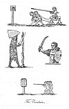
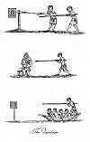
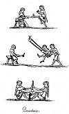
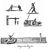
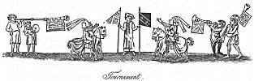
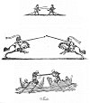

  
[Intangible Textual Heritage](../../../index.md) 
[Legends/Sagas](../../index)  [England](../index)  [Index](index.md) 
[Previous](spe10)  [Next](spe12.md) 

------------------------------------------------------------------------

p. 105

# BOOK III

# PASTIMES USUALLY EXERCISED IN TOWNS AND CITIES, OR PLACES ADJOINING TO THEM

### CHAPTER I

Tournament a general Name for several Exercises--The Quintain an ancient
Military Exercise--Various Kinds of the Quintain--Derivation of the
Term--The Water Quintain--Running at the Quintain practised by the
Citizens of London; and why--The Manner in which it was
performed--Exhibited for the Pastime of Queen Elizabeth--Tilting at a
Water Butt--The Human Quintain--Exercises probably derived from
it--Running at the Ring--Difference between the Tournaments and the
Jousts--Origin of the Tournament--The Troy Game; the Bohordicum or Cane
Game--Derivation of Tournament; How the Exercise was performed--Lists
and Barriers--When the Tournament was first practised--When first in
England--Its Laws and Ordinances--Pages, and Perquisites of the Kings at
Arms, etc.--Preliminaries of the Tournament--Lists for Ordeal
Combats--Respect paid to the Ladies--Jousts less honourable than
Tournaments--The Round Table--Nature of the Jousts--Made in Honour of
the Fair Sex--Great Splendour of these Pastimes; The Nobility partial to
them--Toys for initiating their Children in them--Boat Jousts, or
Tilting on the Water--Challenges to all corners.

TOURNAMENT.--Every kind of military combat made in conformity to certain
rules, and practised by the knights and their esquires for diversion or
gallantry, was anciently called a tournament; yet these amusements
frequently differed materially from each other, and have been
distinguished accordingly by various denominations in the modern times.
They may, however, I think, be all of them included under the four
following heads: tilting and combating at the quintain, tilting at the
ring, tournaments, and jousts.

All these, and especially the two last, were favourite pastimes with the
nobility of the middle ages. The progress and decline of tournaments in
this country has already been mentioned in a general way; [1](#fn_424.md) I shall in this place be a little more
particular with respect to the nature and distinction of these
celebrated diversions.

THE QUINTAIN.--Tilting or combating at the quintain is certainly a
military exercise of high antiquity, and antecedent, I doubt not, to the
jousts and tournaments. The quintain, originally, was nothing more than
the trunk of a tree or post set up for the practice of the tyros in
chivalry. [2](#fn_425.md) Afterward a staff or
spear was fixed in the earth, and a shield being hung upon it, was the
mark to strike at: the dexterity of the performer consisted in smiting
the shield in such a manner as to break the ligatures and bear it to the
ground. In process of time this diversion was improved, and instead of
the staff and the shield, the resemblance of a human figure carved in
wood was introduced. To render the

p. 106

appearance of this figure more formidable, it was generally made in the
likeness of a Turk or a Saracen armed at all points, [1](#fn_426.md) bearing a shield upon his left arm, and
brandishing a club or a sabre with his right. Hence this exercise was
called by the Italians, "running at the armed man, or at the Saracen."
The quintain thus fashioned was placed upon a pivot, and so contrived as
to move round with facility. In running at this figure it was necessary
for the horseman to direct his lance with great adroitness, and make his
stroke upon the forehead between the eyes or upon the nose; for if he
struck wide of those parts, especially upon the shield, the quintain
turned about with much velocity, and, in case he was not exceedingly
careful, would give him a severe blow upon the back with the wooden
sabre held in the right hand, which was considered as highly disgraceful
to the performer, while it excited the laughter and ridicule of the
spectators. [2](#fn_427.md) When many were engaged
in running at the Saracen, the conqueror was declared from the number of
strokes he had made, and the value of them; for instance, if he struck
the image upon the top of the nose between the eyes, it was reckoned for
three; if below the eyes, upon the nose, for two; if under the nose to
the point of the chin, for one; all other strokes were not counted; but
whoever struck upon the shield and turned the quintain round, was not
permitted to run again upon the same day, but forfeited his courses as a
punishment for his unskilfulness. [3](#fn_428.md)

VARIOUS QUINTAINS.--The quintain in its original state was not confined
to the exercise of young warriors on horseback: it was an object of
practice for them on foot, in order to acquire strength and skill in
assaulting an enemy with their swords, spears, and battle-axes. I met
with a manuscript in the Royal Library, [4](#fn_429.md) written early in the fourteenth century,
entitled "Les Etablissmentz des Chevalerie," wherein the author, who
appears to have been a man scientifically skilled in the military
tactics of his time, strongly recommends a constant and attentive attack
of the *pel* (from the Latin *palus*), for so he calls the
post-quintain. The pel, he tells us, ought to be six feet in height
above the ground, and so firmly fixed therein as not to be moved by the
strokes that were laid upon it. The practitioner was then to assail the
pel, armed with sword and shield in the same manner as he would an
adversary, aiming his blows as if at the head, the face, the arms, the
legs, the thighs, and the sides; taking care at all times to keep
himself so completely covered with his shield, as not to give any
advantage supposing he had a real enemy to cope with: so far my author;
and prefixed to the treatise is a neat little painting representing the
*pel*, with a young soldier performing his exercise, which is copied on
. Immediately opposite is the quintain in the form of a Saracen, from
Pluvinel.

An English poet who has taken up the subject of chivalry under the title
of

 

[  
Click to enlarge](img/pl13.jpg.md)  
The Quintain (1)  

 

p. 107

"Knighthood and Battle," [1](#fn_430.md) describes
the attack of the pel in the following curious manner:--

Of fight, the disciplyne, and exercise  
Was this. To have a pale or pile upright  
Of mannys hight, thus writeth olde and wise;  
Therewith a bacheler, or a yong knyght,  
Shal first be taught to stonde and lerne to fight.--  
And fanne of doubil wight, tak him his shelde  
Of doubil wight, a mace of tre to welde.

This fanne and mace whiche either doubil wight,  
Of shelde, and swayed in conflicte, or bataile,  
Shal exercise as well swordmen, as knyghtes.  
And noe man, as they sayn, is seyn prevaile,  
In field, or in castell, thoughe he assayle,  
That with the pile, nathe firste grete exercise,  
Thus writeth Werrouris olde and wyse.

Have eche his pile or pale upfixed fast,  
And as it were uppon his mortal foe;  
With mightyness and weapon most be cast  
To fight stronge, that he ne skape hym fro.  
On hym with shield, and sword avised so,  
That thou be cloos, and preste thy foe to smyte,  
Lest of thyne own dethe thou be to wite.

Empeche [2](#fn_431.md) his head, his face, have
at his gorge,  
Beare at the breste, or sperne him one the side.  
With myghte knyghtly poost, [3](#fn_432.md) ene as
Seynt George  
Lepe o thy foe; looke if he dare abide:  
Will he not flee? wounde him; make woundis wide,  
Hew of his honde, his legge, his theyhs, his armys,  
It is the Turk, though he be sleyn noon harm is.

Both the treatises commend the use of arms of double weight upon these
occasions, in order to acquire strength, and give the warrior greater
facility in wielding the weapons of the ordinary size; to which the poet
adds,

And sixty pounds of weight ’tis good to bear.

\[paragraph continues\] The lines just now quoted evidently allude to
the quintain in the form of a Turk or Saracen, which, I presume, was
sometimes used upon this occasion. The pel was also set up as a mark to
cast at with spears, as the same poet informs us:

A dart of more wight then is mester, [4](#fn_433.md)  
Take hym in honde and teche him it to stere;  
And cast it at the pile as at his foo,  
So that it conte and right uppon him go.

\[paragraph continues\] And likewise for the practice of archery:--

Set hert and eye uppon the pile or pale,  
Shoot nyghe or onne; and if so be thou ride  
On horse, is eck the bowls bigge up hale,  
Smyte in the face, or breste, or back or side,  
Compelle to fle, or falle, yf that he bide.

p. 108

\*Shakespeare, in *As You Like It*, says:

                              My better parts  
Are all thrown down, and that which here stands up  
Is but a quintain, a mere lifeless block.

DERIVATION OF QUINTAIN.--This exercise is said to have received the name
of quintain from Quinctus or Quintas the inventor, [1](#fn_434.md) but who he was, or when he lived, is not
ascertained. The game itself, I doubt not, is of remote origin, and
especially the exercise of the pel, or post quintain, which is spoken of
at large by Vegetius; and from him the substance of what the two authors
above quoted have said upon the subject is evidently taken. He tells us
that this species of mock combat was in common use among the Romans, who
caused the young military men to practise at it twice in the day, at
morning and at noon; he also adds that they used clubs and javelins,
heavier than common, and fought at the pel as if they were opposing an
adversary, etc. [2](#fn_435.md)

In the code of laws established by the emperor Justinian, the quintain
is mentioned as a well-known sport; and permitted to be continued, upon
condition that it should be performed with pointless spears, contrary to
the ancient usage, which it seems required them to have heads or points.

THE WATER QUINTAIN.--To the best of my recollection, Fitzstephen is the
first of our writers who speaks of an exercise of this kind, which he
tells us was usually practised by the young Londoners upon the water
during the Easter holidays. A pole or mast, he says, is fixed in the
midst of the Thames, with a shield strongly attached to it; and a boat
being previously placed at some distance, is driven swiftly towards it
by the force of oars and the violence of the tide, having a young man
standing in the prow, who holds a lance in his hand with which he is to
strike the shield; and if he be dexterous enough to break the lance
against it and retain his place, his most sanguine wishes are satisfied;
on the contrary, if the lance be not broken, he is sure to be thrown
into the water, and the vessel goes away without him, but at the same
time two other boats are stationed near to the shield, and furnished
with many young persons who are in readiness to rescue the champion from
danger. It appears to have been a very popular pastime; for the bridge,
the wharfs, and the houses near the river were crowded with people on
this occasion, who come, says the author, to see the sports and make
themselves merry. [3](#fn_436.md) A representation
of the water quintain, taken from a manuscript of the fourteenth century
in the Royal Library, is given upon [plate fourteen](#img_pl14.md), where a
square piece of board is substituted for the shield. [4](#fn_437.md)

RUNNING AT THE QUINTAIN PRACTISED BY THE LONDONERS; AND WHY.--Matthew
Paris mentions the quintain by name, but he speaks of it in a cursory
manner as a well-known pastime, and probably would have said nothing
about

 

[  
Click to enlarge](img/pl14.jpg.md)  
The Quintain (2)  

 

p. 109

it, had not the following circumstance given him the occasion. In the
thirty-eighth year of the reign of Henry III., A.D. 1254, the young
Londoners, who, he tells us, were expert horsemen, assembled together to
run at the quintain, and set up a peacock as a reward for the best
performer. The king then keeping his court at Westminster, some of his
domestics came into the city to see the pastime, where they behaved in a
very disorderly manner, and treated the Londoners with much insolence,
calling them cowardly knaves and rascally clowns, which the Londoners
resented by beating them soundly; the king, however, was incensed at the
indignity put upon his servants, and not taking into consideration the
provocation on their parts, fined the city one thousand marks. [1](#fn_438.md) Some have thought these fellows were
sent thither purposely to promote a quarrel, it being known that the
king was angry with the citizens of London for refusing to join in the
crusade. [2](#fn_439.md)

We may here observe, that the rules of chivalry, at this time, would not
admit of any person, under the rank of an esquire, to enter the lists as
a combatant at the jousts and tournaments; for which reason the
burgesses and yeomen had recourse to the exercise of the quintain, which
was not prohibited to any class of the people; but, as the performers
were generally young men whose finances would not at all times admit of
much expense, the quintain was frequently nothing better than a stake
fixed into the ground, with a flat piece of board made fast to the upper
part of it, as a substitute for the shield that had been used in times
remote; and such as could not procure horses, contented themselves with
running at this mark on foot. On [plate thirteen](#img_pl13.md) we see a
representation of a lad mounted on a wooden horse with four wheels,
drawn by two of his comrades, tilting at the immoveable quintain; it is
taken from a MS. in the Bodleian Library at Oxford, dated 1344. [3](#fn_440.md) Others, again, made use of a moveable
quintain, which was also very simply constructed; consisting only of a
cross-bar turning upon a pivot, with a broad part to strike against on
one side, and a bag of earth or sand depending from the other: there was
a double advantage in these kind of quintains, they were cheap and
easily to be procured. Their form, at an early period in the fourteenth
century, is illustrated on plates and [fourteen](#img_pl14.md), from the
same manuscript. Both these quintains are marked, I know not why, with
the figure of a horseshoe.

MANNER OF EXERCISING WITH THE QUINTAIN.--But to return: Stow, in his
*Survey of London*, having related the above-mentioned disturbance from
Matthew Paris, goes on as follows: "This exercise of running at the
quintain was practised in London, as well in the summer as in the
winter, but especially at the feast of Christmas. I have seen,"
continues my author, "a quintain set upon Cornhill by Leadenhall, where
the attendants of the lords of merry disports have run and made great
pastime; for he that hit not the board end of the quintain was laughed
to scorn, and he that hit it full, if he rode not the faster, had a
sound blow upon his neck with a bag full of sand hanged on the other

p. 110

end." [1](#fn_441.md) But the form of the modern
quintain is more fully described by Dr Plott, in his *History of
Oxfordshire*: [2](#fn_442.md) "They first set a
post perpendicularly into the ground, and then place a slender piece of
timber on the top of it on a spindle, with a board nailed to it on one
end, and a bag of sand hanging at the other; against this board they
anciently rode with spears. Now I saw it at Deddington in this county,
only with strong staves, which violently bringing about the bag of sand,
if they make not good speed away, it strikes them in the neck or
shoulders, and sometimes knocks them off their horses; the great design
of this sport being to try the agility both of horse and man, and to
break the board. It is now," he adds, "only in request at marriages, and
set up in the way for young men to ride at as they carry home the bride;
he that breaks the board being counted the best man."

\* A writer in *Notes and Queries* in 1866 mentions a quintain as then
standing at Offham Green, near Maidstone, supposed to be of Elizabethan
date. "The cross-piece and weight at one end turned readily upon its
pivot." [3](#fn_443.md)

THE QUINTAIN, A PASTIME BEFORE QUEEN ELIZABETH.--Among other sports
exhibited for the amusement of queen Elizabeth, during her residence at
Kenilworth Castle, in Warwickshire, then the seat of the earl of
Leicester, who entertained her majesty there for several days, A.D.
1575, there was, says Laneham, "a solemn country bridal; when in the
castle was set up a comely quintane for feats at armes, where, in a
great company of young men and lasses, the bridegroom had the first
course at the quintane, and broke his spear "très hardiment" (very
boldly, or with much courage). But his mare in his manage did a little
stumble, that much ado had his manhood to sit in his saddle. But after
the bridegroom had made his course, ran the rest of the band, awhile in
some order, but soon after tag and rag, cut and long tail; where the
speciality of the sport was to see how some for his slackness had a good
bob with the bag, and some for his haste to topple downright, and come
tumbling to the post; some striving so much at the first setting out,
that it seemed a question between man and beast, whether the race should
be performed on horseback or on foot; and some put forth with spurs,
would run his race byas, among the thickest of the throng, that down
they came together hand over head. Another while he directed his course
to the quintane, his judgment would carry him to a mare among the
people; another would run and miss the quintane with his staff, and hit
the board with his head." [4](#fn_444.md) This
whimsical description may possibly be somewhat exaggerated, but no doubt
the inexpertness of the riders subjected them to many laughable
accidents.

\* The use of the quintain survived in many parts of rural England in
the eighteenth century, particularly as a wedding sport. The following
passage from Baker's *History of Northamptonshire* records its late use
in that county:--"The quintain consisted of a high upright post, at the
top of which was placed

 

[  
Click to enlarge](img/pl15.jpg.md)  
Quintain (3)  

 

p. 111

a cross piece on a swivel, broad at one end and pierced full of holes,
and a bag of sand suspended at the other. The mode of running at the
quintain was by an horseman full speed and striking at the broad part
with all his force; if he missed his aim he was derided for his want of
dexterity; if he struck it and the horse slackened pace, which
frequently happened through force of the shock, he received a violent
blow on the neck from the bag of sand which swung round from the
opposite end; but if he succeeded in breaking the board he was hailed
the hero of the day. The last and indeed only instance of this sport
which I have met with in this county was in 1722, on the marriage of two
servants at Brington, when it was announced in the *Northampton Mercury*
that a quintain was to be erected on the green at Kingsthorp, and the
reward of the horseman that splinters the board is to be a fine garland
as a crown of victory, which is to be borne before him to the wedding
house, and another is to be put round the neck of his steed; the victor
is to have the honour of dancing with the bride, and to sit on her right
hand at supper.'" [1](#fn_445.md)

TILTING AT A WATER BUTT.--At the bottom of plate thirteen is a picture,
from a MS. in the Bodleian Library, dated 1343, of three boys tilting
jointly at a tub full of water, which is to be struck in such a manner
as not to throw it over them. I presume they are learners only, and that
therefore they are depicted without their clothes; they undressed
themselves, I apprehend, in order to save their garments from being
wetted in case the attempt should prove unsuccessful.

This farcical pastime, according to Menestrier, was practised
occasionally in Italy, where, he says, a large bucket filled with water
is set up, against which they tilt their lances; and if the stroke be
not made with great dexterity, the bucket is overset and the lanceman
thoroughly drenched with the contents. [2](#fn_446.md)

THE HUMAN QUINTAIN.--I shall here say a few words concerning the human
quintain, which has escaped the notice of most of the writers upon this
subject; it is, however, very certain that the military men in the
middle ages would sometimes practise with their lances at a man
completely armed; whose business it was to act upon the defensive, and
parry their blows with his shield. A representation of this exercise
occurs upon , taken from the same Bodleian manuscript, dated 1344.

This representation is justified by the concurrent testimony of an
ancient author, cited by Du Cange, who introduces one knight saying to
another, "I do not by any means esteem you sufficiently valiant (si bons
chevalier) for me to take a lance and just with you; therefore I desire
you to retire some distance from me, and then run at me with all your
force, and I will be your quintain." [3](#fn_447.md) The satirist Hall, who wrote in the time
of Elizabeth, evidently alludes to a custom of this kind, in a
satire [4](#fn_448.md) first printed in 1599, when
he was twenty-five years of age. He says:

Pawne thou no glove for challenge of the deed,  
Nor make thy quintaine other's armed head.

p. 112

EXERCISES PROBABLY DERIVED FROM THE QUINTAIN.--The living quintain,
according to the representation just given, is seated upon a stool with
three legs without any support behind; and the business, I presume, of
the tilter, was to overthrow him; while, on his part, he was to turn the
stroke of the pole or lance on one side with his shield, and by doing so
with adroitness occasion the fall of his adversary.

Something of a similar kind of exercise, though practised in a different
way, appears on [plate fifteen](#img_pl15.md), where a man seated, holds up
one of his feet, opposed to the foot of another man, who, standing upon
one leg, endeavours to thrust him backwards; and again where his
opponent is seated in a swing and drawn back by a third person, so that
the rope being left at liberty in the swing, the man, of course,
descended with great force, and striking the foot of his antagonist with
much violence, no doubt very frequently overthrew him. The two last
sports were probably never exhibited by military men, but by rustics and
others in imitation of the human quintain. The contest between the two
figures at the bottom of the same plate seems to depend upon the
breaking of the stick which both of them hold, or is a struggle to
overthrow each other.

At the top of plate sixteen, taken from a manuscript book of prayers of
the fourteenth century, in the possession of Mr Douce, is a
representation of two men or boys with a pole or headless spear, who
grasp it at either end, and are contending which shall dispossess the
other of his hold. This feat the single figure on the same plate, from
the Oxford MS. of 1344, seems to have achieved, and is bearing away the
pole in triumph.

RUNNING AT THE RING.--Tilting, or, as it is most commonly called,
running at the ring, was also a fashionable pastime in former days; the
ring is evidently derived from the quintain, and indeed the sport itself
is frequently called running or tilting at the quintain. With the
Italians, says Du Cange, *quintana* sometimes signifies a ring, hence
the Florentines say, "*correr alla quintana*," which with us is called
running at the ring: the learned author produces several quotations to
the same purpose. [1](#fn_449.md) Commenius also,
in his vocabulary, [2](#fn_450.md) says, "At this
day tilting at the quintain is used where a hoop or ring is struck with
a lance." Hence it is clear that the ring was put in the place of the
quintain. The excellency of the pastime was to ride at full speed, and
thrust the point of the lance through the ring, which was supported in a
case or sheath, by the means of two springs, but might be readily drawn
out by the force of the stroke, and remain upon the top of the lance.
The form of the ring, with the sheath, and the manner in which it was
attached to the upright supporter, taken from Pluvinel, are given upon
plate sixteen, and also the method of performing the exercise. The
letter A indicates the ring detached from the sheath; B represents the
sheath with the ring inserted and attached to the upright post, in which
there are several holes to raise or lower the ring to suit\_ the
conveniency of the performer. At the commencement of the seventeenth
century, the

 

[  
Click to enlarge](img/pl16.jpg.md)  
Tilting at the Ring  

 

p. 113

pastime of running at the ring was reduced to a science. Pluvinel, who
treats this subject at large, says, the length of the course was
measured, and marked out according to the properties of the horses that
were to run: for one of the swiftest kind, one hundred paces from the
starting-place to the ring, and thirty paces beyond it, to stop him,
were deemed necessary; but for such horses as had been trained to the
exercise, and were more regular in their movements, eighty paces to the
ring, and twenty beyond it, were thought to be sufficient. The ring,
says the same author, ought to be placed with much precision, somewhat
higher than the left eyebrow of the practitioner, when sitting upon his
horse; because it was necessary for him to stoop a little in running
towards it. [1](#fn_451.md)

In tilting at the ring, three courses were allowed to each candidate;
and he who thrust the point of his lance through it the oftenest, or, in
case no such thing was done, struck it the most frequently, was the
victor; but if it so happened, that none of them did either the one or
the other, or that they were equally successful, the courses were to be
repeated until the superiority of one put an end to the contest. [2](#fn_452.md)

DIFFERENCE BETWEEN TOURNAMENTS AND JOUSTS.--Tournaments and jousts,
though often confounded with each other, differed materially. The
tournament was a conflict with many knights, divided into parties and
engaged at the same time. The joust was a separate trial of skill, when
only one man was opposed to another. The latter was frequently included
in the former, but not without many exceptions; for the joust, according
to the laws of chivalry, might be made exclusive of the
tournament. [3](#fn_453.md)

In the romantic ages, both these diversions were held in the highest
esteem, being sanctioned by the countenance and example of the nobility,
and prohibited to all below the rank of an esquire; but at the same time
the jousts were considered as less honourable than the tournaments; for
the knight who had paid his fees and been admitted to the latter, had a
right to engage in the former without any further demand, but he who had
paid the fees for jousting only, was by no means exempted from the fees
belonging to the tournament, as will be found in the laws relative to
the lance, sword, and helmet, a little further on.

ORIGIN OF THE TOURNAMENT.--It is an opinion generally received, that the
tournament originated from a childish pastime practised by the Roman
youths called Ludus Troiæ (the Troy game), said to have been so named
because it was derived from the Trojans, and first brought into Italy by
Ascanius, the son of Æneas. Virgil has given a description of this
pastime, according to the manner, I presume, in which it was practised
at Rome. If he be accurate, it seems to have been nothing more than a
variety of evolutions performed on horseback. The poet tells us that the
youth were each of them armed with two little cornel spears, headed with
iron.

Cornea bina ferunt præfixa hastilia ferro.--*Æneid*, lib. v. l. 556.

p. 114

\[paragraph continues\] Having passed in review before their parents,
upon a signal given, they divided themselves into three distinct
companies; and each company consisted of twelve champions exclusive of
its appropriate leader, when, according to Trapp's translation, which,
if not so poetical, is more literal than Dryden's, the tutor of
Ascanius, and overseer of the sports,

                                           Epityden, from far  
Loud with a shout, and with his sounding lash  
The signal gave: they equally divide,  
The three commanders open their brigades  
In sep’rate bodies: straight recall’d they wheel  
Their course, and onward bear their hostile darts.  
Then diff’rent traverses on various grounds,  
And diff’rent counter traverses they form;  
Orbs within orbs alternately involve,  
And raise th' effigy of a fight in arms,  
Now show their backs in flight--now furious turn  
Their darts;---now all in peace together ride.

\[paragraph continues\] Under the domination of the first emperors,
these games were publicly practised by the young nobility in the circus
at Rome. [1](#fn_454.md)

The same kind of sports, or others bearing close resemblance to them,
were established in this kingdom in the twelfth century, and probably at
a much earlier period. Fitzstephen, an author then living, informs us,
"that every Sunday in Lent, immediately after dinner, it was customary
for great crowds of young Londoners mounted on war horses, well trained,
to perform the necessary turnings and evolutions, to ride into the
fields in distinct bands, armed with shields and headless lances; where
they exhibited the representation of battles, and went through a variety
of warlike exercises: at the same time many of the young noblemen who
had not received the honour of knighthood, came from the king's court,
and from the houses of the great barons, to make trial of their skill in
arms; the hope of victory animating their minds. The youth being divided
into opposite companies, encountered one another: in one place they
fled, and others pursued, without being able to overtake them; in
another place one of the bands overtook and overturned the other."
According to Virgil, the Roman youth presented their lances towards
their opponents in a menacing position, but without striking with them.
The young Londoners in all probability went further, and actually tilted
one against the other. At any rate, the frequent practice of this
exercise must have taught them, insensibly as it were, to become
excellent horsemen.

THE TROY GAME.--I am clearly of opinion, that the jousts and tournaments
arose by slow degrees from the exercises appointed for the instruction
of the military tyros in using their arms, but which of the two had the
pre-eminence in point of antiquity cannot easily be determined; we know
that both of them were in existence at the time the Troy game was
practised by the citizens of London, and also that they were not
permitted to be exercised in this kingdom.

p. 115

In the middle ages, when the tournaments were in their splendour, the
Troy game was still continued, though in a state of improvement, and
distinguished by a different denomination it was then called in Latin
*behordicum*, and in French *bohourt* or *behourt*, and was a kind of
lance game, in which the young nobility exercised themselves, to acquire
address in handling of their arms, and to prove their strength.

TOURNAMENTS.--Our word tournament, or tournoyement, which signifies to
turn or wheel about in a circular manner, [1](#fn_455.md) comes from the French word *tournoy*. I
am led to adopt the opinion of Fauchet, [2](#fn_456.md) who thinks it came from the practice of
the knights running *par tour*, that is, by turns, at the quintain, and
wheeling about successively in a circle to repeat their course; but,
says he, in process of time they improved upon this pastime, and to make
it more respectable ran one at another, which certainly bore a much
greater similitude to a real engagement, especially when they were
divided into large parties, and meeting together combated with clubs or
maces, beating each other soundly, without any favour or paying the
least respect to rank or dignity. In one of these encounters, Robert,
earl of Cleremont, son of Saint Louis, and head of the house of Bourbon,
was so severely bruised by the blows he received from his antagonist,
that he was never well afterwards. This, says Fauchet, was possibly the
cause of the ordinance, that the kings and princes should not afterwards
enter the lists as combatants at these tournaments; which law, indeed,
continues he, has been ill observed by the succeeding kings, and in our
time by Henry II., who, unfortunately for France, was killed at the
jousts he made in honour of his daughter's marriage. It was, in fact,
very common for some of the combatants to be beat or thrown from their
horses, trampled upon and killed upon the spot, or hurt most grievously.
Indeed, a tournament at this period was rarely finished without some
disastrous accident; and it was an established law, that if any one of
the combatants killed or wounded another, he should be indemnified;
which made them less careful respecting the consequences, especially
when any advantage gave them an opportunity of securing the conquest.
Tournaments were consequently interdicted by the ecclesiastical decrees.

The following quotation from an ancient manuscript romance, in the
Harleian Collection, entitled *Ipomydon*, [3](#fn_457.md) plainly indicates the performance of the
tournament in an open field; and also, that great numbers of the
combatants were engaged at one time, promiscuously encountering with
each other; we learn, moreover, that the champion who remained unhorsed
at the conclusion of the sports, besides the honour he attained,
sometimes received a pecuniary reward.

The kyng his sonne a knyght gan make,  
And many another for his sake;  
Justes were cryed ladyes to see,  
Thedyr came lordes grete plente.  
Tournementis atyred in the felde,  
A thousand armed with spere and shelde;  
A thousand armed with spere and shelde; p.
116  
Knyghtis began togedre to ryde,  
Some were unhorsyd on every side,  
Ipomydom that daye was victorius,  
And there he gaff many a tours;  
For there was none that he mette,  
But he hys spere on hym woulde sette:  
Then after within a lytell stounde, [1](#fn_458.md)  
Horse and man both went to grounde.  
The Heraudes [2](#fn_459.md) gaff the child the
gree, [3](#fn_460.md)  
A thousand pound he had to fee;  
Mynstrellys had giftes of golde  
And fourty dayes this fest was holde.

\[paragraph continues\] In some instances the champions depended upon
their military skill and horsemanship, and frequently upon their bodily
strength; but at all times it was highly disgraceful to be unhorsed, by
whatever exertion it might be effected.

Thomas of Walsingham tells us, [4](#fn_461.md)
that when Edward I. returned from Palestine to England, and was on his
passage through Savoy, the earl of Chabloun invited him to a
tournament, [5](#fn_462.md) in which himself and
many other knights were engaged. The king with his followers, although
fatigued by the length of their journey, accepted the challenge. On the
day appointed both parties met, and, being armed with swords, the
engagement commenced; the earl singled out the king, and on his
approach, throwing away his sword, cast his arms about the neck of the
monarch, and used his utmost endeavour to pull him from his horse.
Edward, on the other hand, finding the earl would not quit his hold, put
spurs to his horse, and drew him from his saddle hanging upon his neck,
and then shaking him violently, threw him to the ground. The earl having
recovered himself and being remounted, attacked the king a second time,
but finding his hand "too heavy," he gave up the contest, and
acknowledged him to be the conqueror. The knights of the earl's party
were angry when they saw their leader drawn from his horse, and run upon
the English with so much violence, that the pastime assumed the
tumultuous appearance of a real battle; the English on their side
repelled force by force; and had not the resignation of the earl put an
end to the conflict, in all probability the consequences would have been
very serious.

LISTS AND BARRIERS.--It was a considerable time after the establishment
of jousts and tournaments, before the combatants thought of making
either lists or barriers; they contented themselves, says
Menestrier, [6](#fn_463.md) with being stationed
at four angles of an open place, whence they run in parties one against
another. There were cords stretched before the different companies,
previous to the commencement of the tournaments, as we learn from the
following passage in an old English romance, among the Harleian
manuscripts: [7](#fn_464.md) "All these thinges
donne thei were embatailed eche ageynste the othir, and the corde drawen

p. 117

before eche partie, and whan the tyme was, the cordes were cutt, and the
trumpettes blew up for every man to do his devoir, *duty*. And for to
assertayne the more of the tourney, there was on eche side a stake, and
at eache stake two kyngs of armes, with penne, and inke, and paper, to
write the names of all them that were yolden, for they shold no more
tournay." As these pastimes were accompanied with much danger, they
invented in France the double lists, where the knights might run from
one side to the other, without coming in contact, except with their
lances; other nations followed the example of the French, and the usage
of lists and barriers soon became universal.

WHEN THE TOURNAMENT WAS FIRST PRACTISED.--It is impossible to ascertain
the precise period when tournaments first made their appearance; nor is
it less difficult to determine by whom they were invented. Peacham, on
the authority of Nicetas, tells us, that the emperor Emanuel Comminus,
at the siege of Constantinople, invented tilts and tournaments; [1](#fn_465.md) but this is certainly a mistake. The
French and the Germans both claim the honour. The historian, Nithard,
mentions a military game, frequently exhibited in Germany, before the
emperor Louis, and his brother Charles the Bald, about the year 842,
which bears great resemblance to the tournament; for he speaks of many
knights of different nations, divided into parties equal in number, and
running at each other with great velocity, as though they were in
battle. [2](#fn_466.md) Most of the German
writers, however, make the emperor Henry I., surnamed L’oiseleur, who
died in 936, the institutor of these pastimes; but others attribute
their origin to another Henry, at least a century posterior. The French,
on their side, quote an ancient history, [3](#fn_467.md) which asserts, that Geoffrey, lord of
Previlli in Anjou, who was slain at Gaunt in 1066, was the inventor of
the tournament.

THE TOURNAMENT IN ENGLAND.--It seems to be certain that tournaments were
held in France and Normandy before the conquest, and, according to our
own writers, they were not permitted to be practised in this country for
upwards of sixty years posterior to that event. The manner of performing
the tournament, as then used, says Lambarde, "not being at the tilt, as
I think, but at random and in the open field, was accounted so dangerous
to the persons having to do therein, that sundry popes forbad it by
decree; and the kings of this realm before king Stephen would not suffer
it to be frequented within their land, so that such as for exercise of
this feat of arms were desirous to prove themselves, were driven to pass
over the seas, and to perform it in some different place in a foreign
country." [4](#fn_468.md) This author's statement
of the fact is perfectly correct. In the troublesome reign of king
Stephen, the rigour of the laws was much relaxed, and tournaments, among
other splendid species of dissipation, were permitted to be exercised;
they were, however, again suppressed by Henry II.; and therefore it was,
I presume, that the young king Henry, son of Henry II., went every third
year, as Matthew Paris assures us he did, over the seas, and expended

p. 118

vast sums of money "in conflictibus Gallicis," or French combats,
meaning tournaments. [1](#fn_469.md) But Richard
I. having, as it is said, observed that the French practising frequently
in the tournaments, were more expert in the use of their arms than the
English, permitted his own knights to establish the like martial sports
in his dominions; but at the same time he imposed a tax, according to
their quality, upon such as engaged in them. An earl was subjected to
the fine of twenty marks for his privilege to enter the field as a
combatant; a baron, ten; a knight having a landed estate, four; and a
knight without such possession, two; but all foreigners were
particularly excluded.

\* The holding of tournaments was restricted by Richard to five places
or districts, namely between (1) Salisbury and Wilton, (2) Warwick and
Kenilworth, (3) Stamford and Warmington, [2](#fn_470) (4) Brackley and Mixbury, and (5.md)
Tickhill and Blyth. To these must be added Smithfield for the use of the
citizens of London on Saturdays. Frequent endeavours were made in the
thirteenth and fourteenth centuries to hold tournaments elsewhere, but
they were always proclaimed, save when they were held under royal
license. The act also specifies that the peace should not be broken
thereby, nor justice hindered, nor damage done to the royal
forests. [3](#fn_471.md)

How long these imposts continued to be collected does not appear; but
tournaments were occasionally exhibited with the utmost display of
magnificence in the succeeding reigns, being not only sanctioned by
royal authority, but frequently instituted at the royal command, until
the conclusion of the sixteenth century. From that period they declined
rapidly, and fifty years afterwards were entirely out of practice.

LAWS AND ORDINANCES OF JOUSTS AND TOURNAMENTS.--All military men, says
Fauchet, [4](#fn_472.md) who bore the title of
knights or esquires, were not indiscriminately received at these
tournaments: there were certain laws to which those who presented
themselves became subject, and which they swore to obey before they were
permitted to enter the lists.

In one of the Harleian manuscripts, [5](#fn_473.md) I met with the following ordinance for
the conducting of the jousts and tournaments according to the ancient
establishment. It is preceded by a proclamation that was to be
previously made, which is couched in these terms: Be it known, lords,
knights, and esquires, ladies, and gentlewomen; you are hereby
acquainted, that a superb achievement at arms, and a grand and noble
tournament will be held in the parade [6](#fn_474.md) of Clarencieux, king-at-arms, on the
part of the most noble baron, lord of T. C.B., and on the part of the
most noble baron, the lord of C. B.D., in the parade of

p. 119

\[paragraph continues\] Norroy, king-at-arms. The regulations that
follow are these: The two barons on whose parts the tournament is
undertaken, shall be at their lodges (pavilions) two days before the
commencement of the sports, when each of them shall cause his arms to be
attached [1](#fn_475.md) to his pavilion, and set
up his banner in the front of his parade; and all those who wish to be
admitted as combatants on either side, must in like manner set up their
arms and banners before the parades allotted to them. Upon the evening
of the same day they shall show themselves in their stations, and expose
their helmets to view at the windows of their pavilions; and then "they
may depart to make merry, dance, and live well." On the morrow the
champions shall be at their parades by the hour of ten in the morning,
to await the commands of the lord of the parade, and the governor, who
are the speakers of the tournament; at this meeting the prizes of honour
shall be determined.

In the document before us, it is said, that he who shall best resist the
strokes of his adversary, and return them with most adroitness on the
party of Clarencieux, shall receive a very rich sword, and he who shall
perform in like manner the best on the part of Norroy, shall be rewarded
with an helmet equally valuable.

On the morning of the day appointed for the tournament, the arms,
banners, and helmets of all the combatants shall be exposed at their
stations, and the speakers present at the place of combat by ten of the
clock, where they shall examine the arms and approve or reject them at
their pleasure; the examination being finished, and the arms returned to
the owners, the baron who is the challenger shall then cause his banner
to be placed at the beginning of the parade, and the blazon of his arms
to be nailed to the roof of the pavilion: [2](#fn_476.md) his example is to be followed by the
baron on the opposite side, and all the knights of either party who are
not in their stations before the nailing up of the arms, shall forfeit
their privileges, and not be permitted to tourney.

The kings-at-arms and the heralds are then commanded by the speakers to
go from pavilion to pavilion, crying aloud, "To achievement, knights and
esquires, to achievement"; [3](#fn_477.md) being
the notice, I presume, for them to arm themselves; and soon afterwards
the company of heralds shall repeat the former ceremony, having the same
authority, saying, "Come forth, knights and esquires, come forth": [4](#fn_478.md) and when the two barons have taken their
places in the lists, each of them facing his own parade, the champions
on both parties shall arrange themselves, every one by the side of his
banner; and then two cords shall be stretched between them, and remain
in that position until it shall please the speakers to command the
commencement of the sports. The combatants shall each of them be armed
with a pointless sword having the edges rebated,

p. 120

and with a baston, or truncheon, hanging from their saddles, and they
may use either the one or the other so long as the speakers shall give
them permission, by repeating the sentence, "Laisseir les aler," Let
them go on. After they have sufficiently performed their exercises, the
speakers are to call to the heralds, and order them to "ployer vos
baniers," fold up the banners, which is the signal for the conclusion of
the tournament. The banners being rolled up, the knights and the
esquires are permitted to return to their dwellings.

PAGES AND PERQUISITES OF THE KINGS-AT-ARMS, ETC.--Every knight or
esquire performing in the tournament was permitted to have one page,
armed, within the lists, but without a truncheon or any other defensive
weapon, to wait upon him and give him his sword, or truncheon, as
occasion might require; and also in case of any accident happening to
his armour, to amend the same. In after times, three servitors were
allowed for this purpose.

The laws of the tournament permitted any one of the combatants to unhelm
himself at pleasure, if he was incommoded by the heat; none being
suffered to assault him in any way, until he had replaced his helmet at
the command of the speakers.

The kings-at-arms, and the heralds who proclaimed the tournament, had
the privilege of wearing the blazon of arms of those by whom the sport
was instituted; besides which they were entitled to six ells of scarlet
cloth as their fee, and had all their expenses defrayed during the
continuation of the tournament: by the law of arms they had a right to
the helmet of every knight when he made his first essay at the
tournament, which became their perquisite as soon as the sports were
concluded; they also claimed every one of them six crowns as nail money,
for affixing the blazon of arms to the pavilions. The kings-at-arms held
the banners of the two chief barons on the day of the tournament, and
the other heralds the banners of their confederates according to their
rank.

PRELIMINARIES OF THE TOURNAMENT.--An illumination to a manuscript
romance in the Royal Library, [1](#fn_479.md)
entitled *St Graal*, written in the thirteenth century, represents the
manner in which the two chief barons anciently entered the lists at the
commencement of a tournament. The king-at-arms standing in the midst of
the ground holds both the banners, and the instruments of the minstrels
are ornamented with the blazonry of the arms (plate seventeen). The
action of the two combatants, who have not yet received their weapons,
seems to be that of appealing to heaven in proof of their having no
charm to protect them, and no inclination to make use of any unlawful
means to secure the conquest; which I believe was a ceremony usually
practised upon such occasions.

In the reign of Henry V. a statute was enacted by the parliament,
containing the following regulations relative to the tournaments, which
regulations were said to have been established at the request of all the
nobility of England. [2](#fn_480.md) The act
prohibits any combatant from entering the lists with more than three
esquires to bear his arms, and wait upon him for that day. In another
clause it

 

[  
Click to enlarge](img/pl17.jpg.md)  
Tournament  

 

p. 121

is said, If any of the great lords, or others, keep a public table, they
shall not be allowed any additional esquires, excepting those who carve
for them. It further specifies, that no knight or esquire, who was
appointed to attend in the lists as a servitor, should wear a sword or a
dagger, or carry a truncheon, or any other weapon excepting a large
sword used in the tournament; and that all the combatants who bore
lances, should be armed with breastplates, thigh-pieces,
shoulder-pieces, and bascinets, without any other kind of armour. No
earl, baron, or knight might presume to infringe upon the regulations of
this statute, under the forfeiture of his horse and his arms, and the
pain of imprisonment for a certain space of time, at the pleasure of the
governors of the tournament. Another clause, which probably refers to
such as were not combatants for the day, runs thus: No one except the
great lords, that is to say, earls or barons, shall be armed otherwise
than above expressed; nor bear a sword, pointed knife, mace, or other
weapon, except the sword for the tournament. In case of transgression,
he forfeited his horse, and was obnoxious to imprisonment for one year.
If an esquire transgressed the law in any point, he not only lost his
horse and his arms, but was sent to prison for three years. But if the
knights or esquires in the above cases were possessed of lands, and
appeared in arms for the service of their lords, it seems they might
recover their horses. The "Roys des harnoys," kings-at-arms, the
heralds, and the minstrels, were commanded not to wear any kind of sharp
weapons, but to have the swords without points which belonged to them.
Those who came as spectators on horseback were strictly forbidden to be
armed with any kind of armour, or to bear any offensive weapons, under
the penalty that was appointed to the esquires; and no boy or man on
foot, coming for the same purpose, might appear with a sword, dagger,
cudgel, or lance; they were to be punished with one year's imprisonment
in case of disobedience to the statute.

LISTS FOR ORDEAL COMBATS.--The lists for the tilts and tournaments
resembled those, I doubt not, appointed for the ordeal combats, which,
according to the rules established by Thomas, duke of Gloucester, uncle
to Richard II., were as follows: "The king shall find the field to fight
in, and the lists shall be made and devised by the constable; and it is
to be observed, that the list must be sixty paces long and forty paces
broad, set up in good order, and the ground within hard, stable, and
level, without any great stones or other impediments; also that the
lists must be made with one door to the east, and another to the west,
and strongly barred about with good bars seven feet high or more, so
that a horse may not be able to leap over them." [1](#fn_481.md)

RESPECT PAID TO LADIES IN THE TOURNAMENT.--After the conclusion of the
tournament, the combatants, as we have seen above, returned to their
dwellings; but in the evening they met again in some place appropriated
for the purpose, where they were joined by the ladies, and others of the
nobility who had been spectators of the sports; and the time, we are
told, was passed in

p. 122

feasting, dancing, singing, and making merry. But, "after the noble
supper and dancing," according to the ancient ordinance above quoted,
the speakers of the tournament called together the heralds appointed on
both parties, and demanded from them, alternately, the names of those
who had best performed upon the opposite sides; the double list of names
was then presented to the ladies who had been present at the pastime,
and the decision was referred to them respecting the awardment of the
prizes; [1](#fn_482.md) who selected one name for
each party, and, as a peculiar mark of their esteem, the favourite
champions received the rewards of their merits from the hands of two
young virgins of quality. The statutes and ordinances for jousts and
tournaments made by John Tiptoft, earl of Worcester, at the command of
Edward IV., in the sixth year of his reign, conclude thus: "Reserving
always to the queenes highness and the ladyes there present, the
attribution and gift of the prize after the manner and forme
accustomed." [2](#fn_483.md)

Neither was this the only deference that was paid to the fair sex by the
laws of the tournament, for we are told, that if a knight conducted
himself with any impropriety, or transgressed the ordinances of the
sport, he was excluded from the lists with a sound beating, which was
liberally bestowed upon him by the other knights with their truncheons,
to punish his temerity, and to teach him to respect the honour of the
ladies and the rights of chivalry; the unfortunate culprit had no other
resource in such case for escaping without mischief, but by supplicating
the mercy of the fair sex, and humbly intreating them to interpose their
authority on his behalf, because the suspension of his punishment
depended entirely upon their intercession.

JOUSTS INFERIOR TO TOURNAMENTS.--The joust or lance-game, in Latin
*justa*, and in French *jouste*, which some derive from *jocare*,
because it was a sort of sportive combat, undertaken for pastime only,
differed materially, as before observed, from the tournament, the former
being often included in the latter, and usually took place when the
grand tournamental conflict was finished. But at the same time it was
perfectly consistent with the rules of chivalry, for the jousts to be
held separately; it was, however, considered as a pastime inferior to
the tournament, for which reason a knight, who had paid his fees for
per-mission to joust, was not thereby exempted from the fees of the
tournament; but, on the contrary, if he had discharged his duties at the
tournament, he was privileged to joust without being liable to any
further demand. This distinction seems to have arisen from the weapons
used, the sword being appropriated to the tournament, and the lance to
the joust, and so it is stated in an old document cited by Du
Cange. [3](#fn_484.md) "When," says this author,
"a nobleman makes his first appearance in the tournament, his helmet is
claimed by the heralds, notwithstanding his having jousted before,
because the lance cannot give the freedom of the sword, which the sword
can do of the lance; for it is to be observed, that

p. 123

he who has paid his helmet at the tournament is freed from the payment
of a second helmet at the joust; but the helmet paid at jousting does
not exclude the claim of the heralds when a knight first enters the
lists at the tournament."

THE ROUND TABLE.--The joust, as a military pastime, is mentioned by
William of Malmsbury, and said to have been practised in the reign of
king Stephen. [1](#fn_485.md) During the
government of Henry III. the joust assumed a different appellation, and
was also called the Round Table game. [2](#fn_486.md) This name was derived from a fraternity
of knights who frequently jousted with each other, and accustomed
themselves to eat together in one apartment, and, in order to set aside
all distinction of rank or quality, seated themselves at a circular
table, where every place was equally honourable. Athenæus, cited by Du
Cange, [3](#fn_487.md) says, the knights sat round
the table, bearing their shields at their backs: I suppose for safety
sake. Our historians attribute the institution of the round table to
Arthur, the son of Uter Pendragon, a celebrated British hero, whose
achievements are so disguised with legendary wonders, that it has been
doubted if such a person ever existed in reality.

In the eighth year of the reign of Edward I., Roger de Mortimer, [4](#fn_488.md) a noble-man of great opulence,
established a round table at Kenilworth, for the encouragement of
military pastimes; where one hundred knights, with as many ladies, were
entertained at his expense. The fame of this institution occasioned, we
are told, a great influx of foreigners, who came either to initiate
themselves, or make some public proof of their prowess. About seventy
years afterwards Edward III. erected a splendid table of the same kind
at Windsor, but upon a more extensive scale. It contained the area of a
circle two hundred feet in diameter; and the weekly expense for the
maintenance of this table, when it was first established, amounted to
one hundred pounds; which, afterwards, was reduced to twenty pounds, on
account of the large sums of money required for the prosecution of the
war with France. This receptacle for military men gave continual
occasion for the exercise of arms, and afforded to the young nobility an
opportunity of learning, by the way of pastime, all the requisites of a
soldier. The example of king Edward was followed by Philip of Valois,
king of France, who also instituted a round table at his court, and by
that means drew thither many German and Italian knights who were coming
to England. [5](#fn_489.md) The contest between
the two monarchs seems to have had the effect of destroying the
establishment of the round table in both kingdoms, for after this period
we hear no more concerning it. In England the round table was succeeded
by the Order of the Garter, the ceremonial parts of which order are
retained to this day, but the spirit of the institution ill accords with
the present manners.

p. 124

NATURE OF THE JOUSTS.--The cessation of the round table occasioned
little or no alteration respecting the jousts which had been practised
by the knights belonging to it; they continued to be fashionable
throughout the annals of chivalry, and latterly superseded the
tournaments, which is by no means surprising, when we recollect that the
one was a confused engagement of many knights together, and the other a
succession of combats between two only at one time, which gave them all
an equal opportunity of showing individually their dexterity and
attracting the general notice.

In the jousts the combatants most commonly used spears without heads of
iron; and the excellency of the performance consisted in striking the
opponent upon the front of his helmet, so as to beat him backwards from
his horse or break the spear. Froissart [1](#fn_490.md) mentions a trick used by Reynaud de Roy,
at a tilting match between him and John de Holland: he fastened his
helmet so slightly upon his head that it gave way, and was beaten off by
every stroke that was made upon the vizor with the lance of John of
Holland, and of course the shock he received was not so great as it
would have been, had he made the helmet fast to the cuirass; this
artifice was objected to by the English on the part of Holland; but John
of Gaunt, duke of Lancaster, who was present, permitted Roye to use his
pleasure; though he at the same time declared, that for his part, he
should prefer a contrary practice, and have his helmet fastened as
strongly as possible. And again the same historian, speaking of a
jousting between Thomas Harpingham and Sir John de Barres, says, "As me
thought the usage was thanne, their helmes wer tied but with a lace, to
the entente the spere should take no hold"; by which it seems the trick
became more common afterwards. [2](#fn_491.md)

On [plate eighteen](#img_pl18.md) is a representation of the joust, taken
from a manuscript in the Royal Library, [3](#fn_492.md) of the thirteenth, or early in the
fourteenth century, where two knights appear in the action of tilting at
each other with the blunted spears.

This delineation was made before the introduction of the barrier, which
was a boarded railing erected in the midst of the lists, but open at
both ends, and between four and five feet in height. In performing the
jousts, the two combatants rode on separate sides of the barrier, and
were thereby prevented from running their horses upon each other.

\* This dividing of the lists was at first done by having a long cloth
(*toile*) suspended on a rope along the centre of the ground. The riders
stationed themselves one at each side and end of this *toile*, which was
called in English the tilt. [4](#fn_493.md)The
first time the tilt is mentioned in the chronicles of Froissart and
Monstrelet is on the occasion of some jousting at Dijon in 1443; it was
not introduced until the beginning of the fifteenth century. At Dijon on
this

p. 125

occasion the cloth and cord, or tilt, was six feet high. This form of
tilt or division was soon, however, found to be ineffective and
occasionally dangerous, and gave way generally, by the middle of the
fifteenth century, to a wooden partition. The rules for tilting, or
jousting over the tilt, were, according to Viscount Dillon, to this
effect: [1](#fn_494.md)--

|                                                                                                       |          |
|-------------------------------------------------------------------------------------------------------|----------|
| Breaking a spear between the saddle and the fastening of the helmet to the breast                     | 1 point  |
| Breaking a spear above this place                                                                     | 2 points |
| Breaking a spear so as to unhorse the opponent or unarm him, so that he could not run the next course | 3 points |

But--

|                                          |          |
|------------------------------------------|----------|
| Breaking a spear on the saddle forfeited | 1 point  |
| Striking the tilt once forfeited         | 2 points |
| Striking the tilt twice forfeited        | 3 points |

\* The striking of a horse or an opponent on the back, or after he was
disarmed, or striking the tilt thrice, disqualified the offender from
further contention.

\* In Henry VIII.'s reign this tilting was frequently practised. The
grand tilting of the king and chief nobles is splendidly pourtrayed on
the Tournament Roll of the Heralds' College.

\* Tilting, notwithstanding all precautions, was a dangerous sport. On
the occasion of king Francis' marriage at Paris in February 1515, the
duke of Suffolk wrote to Henry VIII. that many had been hurt at the
tilting, and one in the throat like to die. [2](#fn_495.md) At the Field of the Cloth of Gold in
1520, where both Henry and Francis distinguished themselves, a Frenchman
died of a blow he had received on the previous day.

\* There were permanent tilt-yards in the sixteenth century at
Westminster, Hampton Court, and Greenwich. The tilt is marked on old
maps of Westminster; it was on the site of the Horse Guards Parade, and
the guardroom there is still known as the Tilt Guard. In the Tower
collection are several fine examples of the tilt lance. The largest is
that attributed to Charles Brandon, duke of Suffolk; its total length is
14 ft. 4 in., and the girth just in front of the grip is 27½ in.; it is
hollow and weighs 20 lbs. Six other examples average twelve feet in
length.

JOUSTS PECULIARLY IN HONOUR OF THE LADIES.--We have seen that the
privilege of distributing the prizes and remitting the punishment of
offenders was, by the laws of the tournament, invested with the fair
sex, but at the jousts their authority was much more extensive. In the
days of chivalry the jousts were usually made in honour of the ladies,
who presided as judges paramount over the sports, and their
determinations were in all cases decisive; hence in the spirit of
romance, arose the necessity for every "true knight" to have a favourite
fair one, who was not only esteemed by him as the paragon of beauty and
of virtue, but supplied the place of a tutelar saint, to whom he paid
his

p. 126

vows and addressed himself in the day of peril; or it seems to have been
an established doctrine, that love made valour perfect, and incited the
heroes to undertake great enterprises. "Oh that my lady saw me!" said
one of them as he was mounting a breach at the head of his troops and
driving the enemy before him. The French writer St Foix, who mentions
this, [1](#fn_496.md) says in another place, "It
is astonishing that no author has remarked the origin of this devotion
in the manners of the Germans, our ancestors, as drawn by Tacitus, who,"
he tells us, "attributed somewhat of divinity to the fair sex." [2](#fn_497.md) Sometimes it seems the knights were
armed and unarmed by the ladies; but this, I presume, was a peculiar
mark of their favour, and only used upon particular occasions, as, for
instance, when the heroes undertook an achievement on their behalf, or
combating in defence of their beauty or their honour. [3](#fn_498.md)

GREAT SPLENDOUR OF THESE SPORTS ATTRACTIVE TO THE NOBILITY.--At the
celebration of these pastimes, the lists were superbly decorated, and
surrounded by the pavilions belonging to the champions, ornamented with
their arms, banners, and banerolls. The scaffolds for the reception of
the nobility of both sexes who came as spectators, and those especially
appointed for the royal family, were hung with tapestry and embroideries
of gold and silver. Every person, upon such occasions, appeared to the
greatest advantage, decked in sumptuous array, and every part of the
field presented to the eye a rich display of magnificence. We may also
add the splendid appearance of the knights engaged in the sports;
themselves and their horses were most gorgeously arrayed, and their
esquires and pages, together with the minstrels and heralds who
superintended the ceremonies, were all of them clothed in costly and
glittering apparel. Such a show of pomp, where wealth, beauty, and
grandeur were concentred, as it were, in one focus, must altogether have
formed a wonderful spectacle, and made a strong impression on the mind,
which was not a little heightened by the cries of the heralds, the
clangour of the trumpets, the clashing of the arms, the rushing together
of the combatants, and the shouts of the beholders; and hence the
popularity of these exhibitions may be easily accounted for.

The tournament and the joust, and especially the latter, afforded to
those who were engaged in them an opportunity of appearing before the
ladies to the greatest advantage; they might at once display their taste
and opulence by the costliness and elegancy of their apparel, and their
prowess as soldiers; therefore these pastimes became fashionable among
the nobility; and it was probably for the same reason that they were
prohibited to the commoners.

TOYS FOR INITIATING CHILDREN IN THESE SPORTS.--Persons of rank were
taught in their childhood to relish such exercises as were of a martial

 

[  
Click to enlarge](img/pl18.jpg.md)  
Jousts  

 

p. 127

nature, and the very toys that were put into their hands as playthings
were calculated to bias the mind in their favour. These toy figures
could be readily separated from the horses, and were so contrived as to
be thrown back-wards by a smart blow upon the top of the shield or the
front of his helmet, and replaced again with much ease; two such toys
were requisite, and by the concussion of the spears and shields, if
dexterously managed, one or both of the men were cast to the ground.
These toys, as we may see on [plate sixteen](#img_pl16.md), from a curious
engraving on wood by Hans Burgmair, which makes one of a series of
prints representing the history and achievements of the emperor
Maximilian the First, were pushed by the hand upon a table towards each
other.

BOAT JOUSTS, OR TILTING ON THE WATER.--It has been previously observed,
that all persons below the rank of an esquire were excluded from the
jousts and the tournaments; but the celebration of these pastimes
attracted the common mind in a very powerful manner, and led to the
institution of sports, that bore at least some resemblance to them:
tilting at the quintain was generally practised at a very early
period, [1](#fn_499.md) and jousting upon the ice
by the young Londoners. The early inclination to join in such kind of
pastimes is strongly indicated by the two boys represented upon the top
of [plate eighteen](#img_pl18.md): the place of the horse is supplied by a
long switch, and that of a lance by another. The original delineation
occurs in a beautiful MS. book of prayers, written in the fourteenth
century, in the possession of Mr Douce. Here we may also add the boat
jousts, or tilting upon the water. The representation of a pastime of
this kind is given at the bottom of the [same plate](#img_pl18.md), from a
manuscript of the fourteenth century in the Royal Library. [2](#fn_500.md)

The conqueror at these jousts was the champion who could dexterously
turn aside the blow of his antagonist with his shield, and at the same
time strike him with his lance in such a manner as to overthrow him into
the river, himself remaining unmoved from his station; and perhaps not a
little depended upon the skill of the rowers. When queen Elizabeth
visited Sandwich in 1573, she was entertained with a tilting upon the
water, "where certain wallounds that could well swym had prepared two
boates, and in the middle of each boate was placed a borde, upon which
borde there stood a man, and so they met together, with either of them a
staff and a shield of wood; and one of them did overthrowe another, at
which the queene had good sport." [3](#fn_501.md)
The same kind of laughable pastime was practised at London, as we learn
from Stow. "I have seen," says he, "in the summer season, upon the river
of Thames, some rowed in wherries, with staves in their hands flat at
the fore end, running one against another, and for the most part one or
both of them were overthrown and well ducked."

CHALLENGES TO ALL COMERS.--I shall now conclude this long chapter with
the two following extracts from a manuscript in the Harleian
Collection. [4](#fn_502.md) Six gentlemen
challenged "all commers at the just roial, to runne in osting harnies

p. 128

along a tilte, and to strike thirteen strokes with swordes, in honour of
the marriage of Richard duke of York [1](#fn_503.md) with the Lady Anne, daughter to the duke
of Norfolk."

When Henry VII. created his second son Henry prince of Wales, four
gentlemen offered their service upon the occasion. First, they made a
declaration that they do not undertake this enterprise in any manner of
presumption, but only "for the laude and honour of the feaste, the
pleasure of the ladyes, and their owne learning, and exercise of deedes
of armes, and to ensewe the ancient laudable customs."

They then promised to be ready at Westminster on a given day, the
twenty-fourth of November, to keep the jousts in a place appointed for
that purpose by the king. To be there by "eleven of the clock before
noone to answer all gentlemen commers, and to runne with every commer
one after another, six courses ensewingly; and to continue that daye as
long as it shal like the kynges grace, and to tilt with such speares as
he shall ordeyn, of the which speares, the commers shall have the
choise; but if the said six courses by every one of the commers shall be
performed, and the day not spent in pleasure and sport according to the
effect of these articles, it shall then be lawful for the said commers
to begin six other courses, and so continue one after another as long as
it shall be at the king's pleasure. If it shall happen to any gentleman
that his horse fayleth him, or himself be unarmed in such wise as he
cannot conveniently accomplish the whole courses, then it shall be
lawful for his felowe to finish up the courses."

Again, they promise upon a second day, the twenty-ninth of November, to
be in readiness to mount their horses at the same place and hour as
before, to tourney with four other gentlemen, with such swordes as the
king shall ordain, until eighteen strokes be given by one of them to the
other; and add that it shall be lawful to strike all manner of ways, the
foyne only excepted, and the commers shall have their choice of the
swords. Here it may be observed, that to foyne, is to thrust, as in
fencing, which was exceedingly dangerous when the swords were pointed.
The author of a MS. poem, in the Cotton Collection, [2](#fn_504.md) frequently referred to in the course of
this work, entitled *Knyghthode and Batayle*, says, in fighting with an
enemy, "to foyne is better than to smyte," and afterwards two inches,
"entre foyned," hurteth more than a broader wound with the edge of a
sword.

"Whosoever," continues the Harleian manuscript, "shall certifye and give
knowledge of his name and of his comming to one of the three kings of
arms, whether it be to the jousts or at the tourney, he shall be first
answered, the states alwayes reserved which shall have the preheminence.
If any one of the said commers shall think the swordes or spears be too
easy for him, the said four gentlemen will be redye to answer him or
them after their owne minde, the king's licence obteyned in that
behalf."

p. 129

The gentlemen then entreat the king to sign the articles with his own
hand, as sufficient licence for the heralds to publish the same in such
places as might be thought requisite. The king accepted their offer, and
granted their petition; at the same time he promised to reward the best
performer at the jousts royal with a ring of gold set with a ruby; and
the best performer at the tournament with another golden ring set with a
diamond, equal in value to the former.

Upon some particular occasions the strokes with the sword were performed
on foot, and so were the combats with the axes; the champions having,
generally, a barrier of wood breast-high between them.

------------------------------------------------------------------------

### Footnotes

[105:1](spe11.htm#fr_424.md) In the Introduction.

[105:2](spe11.htm#fr_425.md) Vegetius, *De re
militari*, lib. i. cap. xi. et xiv.

[106:1](spe11.htm#fr_426.md) Menestrier, *Traité
des Tournois, Joustes*, etc., p. 264.

[106:2](spe11.htm#fr_427.md) Menestrier, *ut
supra*; Du Cange, *Glossary*, in voce *quintana*; Pluvinel, *Sur
l’exercise de monter à cheval*, part iii. p. 177.

[106:3](spe11.htm#fr_428.md) Menestrier, p. 112,
et Pluvinel *ut supra*.

[106:4](spe11.htm#fr_429.md) 20 B. xi.

[107:1](spe11.htm#fr_430.md) *Knyghthode and
Batayle*, MS. Cott. Titus A. xxiii. fols. 6 and 7. This curious poem,
written early in the fifteenth century, appears to be a translation of a
former treatise, or rather a paraphrase upon it.

[107:2](spe11.htm#fr_431.md) From the French
*empêcher*, to hinder or withstand, here used for attack.

[107:3](spe11.htm#fr_432.md) Power, strength.

[107:4](spe11.htm#fr_433.md) Than is required,
that is in time of real action.

[108:1](spe11.htm#fr_434.md) A quincto auctore
nomen habebat, vide Joan Meursi, de Ludis Græcorum, in tit. Κονταξ
Κυντανος. But this is probably an error. The *Century Dictionary*
gives--"*Quintana*, a street in a camp between the fifth and sixth
maniples, where were the market and forum of the camp, and, it is
supposed, the place of martial exercise, etc., whence the Middle Latin
use *quintana*, a quintain."

[108:2](spe11.htm#fr_435.md) Vegetius, *De re
militari*, lib. i. cap. xi. et xiv.

[108:3](spe11.htm#fr_436.md) Stephanides,
*Descrip. Lond*.

[108:4](spe11.htm#fr_437.md) 2 B. vii.

[109:1](spe11.htm#fr_438.md) Matthew Paris, *Hist.
Angl.* sub. an 1253.

[109:2](spe11.htm#fr_439.md) Strype's *Stow*, etc.

[109:3](spe11.htm#fr_440.md) Bod. 264.

[110:1](spe11.htm#fr_441.md) *Survey of London*.

[110:2](spe11.htm#fr_442.md) First published in
1677.

[110:3](spe11.htm#fr_443.md) *Notes and Queries*,
Ser. III. x. 312.

[110:4](spe11.htm#fr_444.md) Lanham in *Queen
Elizabeth's Progresses*, by Mr Nichols, vol. i. p. 249.

[111:1](spe11.htm#fr_445.md) Baker's
*Northamptonshire*, i. 40.

[111:2](spe11.htm#fr_446.md) *Traité de Tournois*,
1669, p. 347.

[111:3](spe11.htm#fr_447.md) Le Roman de Giron le
courtois. Du Cange, Gloss. in voce *quintana*.

[111:4](spe11.htm#fr_448.md) Lib. iv. Sat. 3.

[112:1](spe11.htm#fr_449.md) *Glossary*, in voce
*quintana*.

[112:2](spe11.htm#fr_450.md) *Orbis Sensualium
Pictus*, by Hoole, 1658.

[113:1](spe11.htm#fr_451.md) *Art de monter à
cheval*, part iii. p. 156.

[113:2](spe11.htm#fr_452.md) Menestrier, *Traité
de Tournois*, p. 112.

[113:3](spe11.htm#fr_453.md) Du Cange, *Glossary*,
in voce *justa*.

[114:1](spe11.htm#fr_454.md) Tacitus, *Annal*.
lib. xi.

[115:1](spe11.htm#fr_455.md) Cotgrave.

[115:2](spe11.htm#fr_456.md) *Origins des
Chevaliers*, etc., p. 9.

[115:3](spe11.htm#fr_457.md) No. 2252, fol. 61.

[116:1](spe11.htm#fr_458.md) A small space of
time.

[116:2](spe11.htm#fr_459.md) Heralds, whose office
it was to superintend the ceremonious parts of the tournaments.

[116:3](spe11.htm#fr_460.md) Reward.

[116:4](spe11.htm#fr_461.md) *Hist. Angl.* fol. 3,
A.D. 1274.

[116:5](spe11.htm#fr_462.md) *Ludum militarum*
(qui vulgo torneamentum dicitur). *Ibid*.

[116:6](spe11.htm#fr_463.md) *Traité de Tournois*.

[116:7](spe11.htm#fr_464.md) No. 326.

[117:1](spe11.htm#fr_465.md) *Complete Gentleman*,
p. 178.

[117:2](spe11.htm#fr_466.md) See more upon this
subject in the *Encyclopédie François*, art. "Tournoi."

[117:3](spe11.htm#fr_467.md) *Chronique de Tours*.

[117:4](spe11.htm#fr_468.md) *Perambulation of
Kent*, p. 492.

[118:1](spe11.htm#fr_469.md) *Hist. Angl.* A.D.
1179.

[118:2](spe11.htm#fr_470.md) "Stamford and
Wallingford" is mistakenly given in Godwin's Archeologist's Hand-Book
and elsewhere. Wallingford, Berks, is absurdly remote from Stamford;
Warmington is but a little distance from Stamford, on the main road to
Oundle.

[118:3](spe11.htm#fr_471.md) Harl. MS. 69. "The
Booke of Certaine Triumphs," which opens with an account of the
"Just-Roiall" at the marriage of Richard, duke of York, son of Edward
IV.

[118:4](spe11.htm#fr_472.md) *Origines des
Chevaliers*, etc.

[118:5](spe11.htm#fr_473.md) No. 69.

[118:6](spe11.htm#fr_474.md) *Marche*, part of the
lists, I presume, or portion of ground appropriated to the tournament.

[119:1](spe11.htm#fr_475.md) *Feront clouer leurs
armes*, literally nail them; the clouage or nail money, as we shall see
afterwards, was the perquisite of the heralds.

[119:2](spe11.htm#fr_476.md) "*Mettra sa banier,
an commencement dedits bastons at clouera la blason de ses armes, à
lautre vout*." The passage is by no means clear; I have therefore given
the words of the original.

[119:3](spe11.htm#fr_477.md) *A l’aschevier,
chevaliers*, etc.

[119:4](spe11.htm#fr_478.md) *Hors chevaliers*,
etc.

[120:1](spe11.htm#fr_479.md) No. 14, E. iii.

[120:2](spe11.htm#fr_480.md) Harl. MS. 69.

[121:1](spe11.htm#fr_481.md) Cotton MS. Nero D.
vi. and Harl. MS. 69, *ut supra*.

[122:1](spe11.htm#fr_482.md) "Avec une grêle de
coups." *Encyclop. Fran*. in voce *tournoi*.

[122:2](spe11.htm#fr_483.md) Harl. MS. 69.

[122:3](spe11.htm#fr_484.md) *Glossary*, in voce
*justa*.

[123:1](spe11.htm#fr_485.md) "Pugnæ facere quod
justam vocant." *Hist. Novellæ*, fol. 106, sub an. 1142.

[123:2](spe11.htm#fr_486.md) Matthew Paris
properly distinguishes it from the tournament. "Non hastiludio, quod
torneamentum dicitur, sed--ludo militari, qui mensa rotunda dicitur."
*Hist. Angl.* sub an. 1252.

[123:3](spe11.htm#fr_487.md) *Glossary*, in voce
*Mensa Rotunda*.

[123:4](spe11.htm#fr_488.md) Rogerus de Mortuo
Mari. Tho. Walsingham, *Hist. Angl.* sub an. 1280, fol. 8.

[123:5](spe11.htm#fr_489.md) Tho. Walsingham,
*Hist. Angl.* sub an. 1344, fol. 154.

[124:1](spe11.htm#fr_490.md) Vol. iii. chap. lix.

[124:2](spe11.htm#fr_491.md) Froissart, vol. iii.
chap. cxxxiii. fol. 148, Lord Berners' translation.

[124:3](spe11.htm#fr_492.md) No. 14, E. iii.

[124:4](spe11.htm#fr_493.md) This word in its
original signification tarries with us in the term "waggon-*tilt*,"
which means a canvas cover.

[125:1](spe11.htm#fr_494.md) *Archæological
Journal*, v. 296-321, "Tilting in Tudor Times."

[125:2](spe11.htm#fr_495.md) Calig. D. vi. fol.
165.

[126:1](spe11.htm#fr_496.md) *Essais Hist. sur
Paris*, vol. iii. p. 263.

[126:2](spe11.htm#fr_497.md) *Ibid*. vol. i. p.
327.

[126:3](spe11.htm#fr_498.md) As the ladies, say
some modern authors, were *l’âme*, the soul of the jousts, it was proper
that they should be therein distinguished by some peculiar homage; and
accordingly, at the termination of a joust with lances, the last course
was made in honour of the sex, and called the lance of the ladies. The
same deference was paid to them in single combats with the sword, the
axe, and the dagger.

[127:1](spe11.htm#fr_499.md) See sect. vii. p.
118.

[127:2](spe11.htm#fr_500.md) No. I, B. vii.

[127:3](spe11.htm#fr_501.md) Nichols'
*Progresses*, vol. i. p. 56.

[127:4](spe11.htm#fr_502.md) No. 69.

[128:1](spe11.htm#fr_503.md) Son to king Edward
IV., who lost his life with his brother Edward in the Tower.

[128:2](spe11.htm#fr_504.md) Titus, A. xxiii. part
i. fol. 7.

------------------------------------------------------------------------

[Next: Chapter II](spe12.md)
