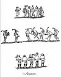

  
[Intangible Textual Heritage](../../../index.md) 
[Legends/Sagas](../../index)  [England](../index)  [Index](index.md) 
[Previous](spe11)  [Next](spe13.md) 

------------------------------------------------------------------------

p. 130

### CHAPTER II

Ancient Plays--Miracle Plays, Dramas from Scripture, etc. continued
several days--The Coventry Play--Mysteries described--How enlivened--The
"Pageant" or Stage--Cornish Miracle Plays--Moralities described--Secular
Plays--Interludes--Chaucer's Definition of the Tragedies of his
Time--Plays on Holy Days--Royal Companies of Players--The
Puritans--Court Plays--Play in honour of the Princess Mary's
Marriage--The Play of Hock-Tuesday--Decline of Secular Plays--Sir Miles
Stapleton and Yorkshire Players--Origin of Puppet Plays--Nature of the
Performances--Giants and other Puppet Characters--Puppet Plays
superseded by Pantomimes--The modern Puppet-show Man--Moving Pictures
described.

ANCIENT PLAYS.--It is not my design to enter deeply upon the origin and
progress of scenic exhibitions in England: this subject has already been
so ably discussed, that very little new matter can be found to excite
the public attention: I shall, therefore, be as brief as possible, and
confine myself chiefly to the lower species of comic pastimes, many of
which may justly claim the sanction of high antiquity.

MIRACLE PLAYS, DRAMAS FROM SCRIPTURE, ETC. CONTINUED SEVERAL DAYS.--The
theatrical exhibitions in London, in the twelfth century, were called
Miracles, because they consisted of sacred plays, or representations of
the miracles wrought by the holy confessors, and the sufferings by which
the perseverance of the martyrs was manifested. [1](#fn_505.md) Such subjects were certainly very
properly chosen, because the church was usually the theatre wherein
these pious dramas were performed, and the actors were the ecclesiastics
or their scholars. [2](#fn_506.md) The first play
of this kind specified by name, is that of St Katherine, *Ludus de St
Katharine*. According to Matthew Paris, it was written by Geoffrey, a
Norman, afterwards abbot of St Albans: he was sent over into England by
abbot Richard, to take upon him the direction of the school belonging to
that monastery, but coming too late, he went to Dunstable and taught
there, where he caused his play to be performed about the year 1110, and
borrowed from the sacrist of St Albans some of the choir copes of the
abbey, to adorn the actors.

\* In the first half of the twelfth century three Latin plays were
composed by Hilarius, an Englishman of French education; they deal
respectively with the stories of Daniel, Lazarus, and St Nicholas. The
earliest known manuscript that gives any sequence of Scriptural plays
dates from the same century, and pertains to Tours, in France. In this
series occurs the first mention of a stage

p. 131

erected outside the church door. From that date the plays which had
originated in the quire, and hence transferred to the nave of the
church, took up their position in the churchyard. In the thirteenth
century various bishops protested against the use of churchyards as
consecrated places for the miracle plays with their somewhat coarse
associations, and priests were often forbidden to take part in them.
Nevertheless, down to Reformation days, these dramas were usually
written by the clergy and controlled by them, whilst the actors were
frequently drawn from the ranks of the minor orders of the ministry and
from the friars. Particularly was this the case with the parish clerks,
like Chaucer's "Joly Absolon," of whom the poet says:--

Sometimes to show his lightness and maistrie,  
He plaieth Herod on a scaffold hie.

According to the Wife of Bath's prologue in the *Canterbury Tales*, the
miracle plays of Chaucer's days were exhibited during the season of
Lent, and sometimes a sequel of Scripture histories was carried on for
several days. In the reign of Richard II. (1391 the parish clerks of
London put forth a play at Skinners Wells, near Smithfield, which
continued three days; the king, queen, and many of the nobility, being
present at the performance. [1](#fn_507.md) In the
succeeding reign, 10 Henry IV. A.D. 1409, another play was acted by them
at the same place, and lasted eight days; this drama began with the
creation of the world, and contained the greater part of the history of
the Old and New Testament. It does not appear to have been honoured with
the royal presence, but was well attended by most of the nobility and
gentry of the realm.

\* Although Gregory I X. prohibited in strong terms the exhibition of
dramatic spectacles in consecrated places, and secured their prohibition
by the Council of Treves in 1227, the first year of his papacy, the
Church almost inadvertently gave a great impetus to religious pageantry
and plays at the hands of one of his immediate successors. Pope Urban
IV. instituted the festival of Corpus Christi in 1263, and its general
use was established by the Council of Vienne in 1311. The peculiar
honour paid to this new festival by the trading gilds and corporations
of our English towns and cities led to their seizing on the occasion of
the great Corpus Christi procession as the appropriate time for the
setting forth of the miracle plays with much pageantry.

\* Chester claims by tradition to have been the first, *circa* 1270, to
start its cycle of Corpus Christi plays. In the fourteenth and fifteenth
centuries it is known that religious plays were performed at
Bassingbourne, Bath, Bethersden, Beverley, Cambridge, Coventry,
Heybridge, Kendal, Lancaster, Leeds, Lincoln, London, Morebath,
Newcastle-on-Tyne, Northampton, Norwich, Oxford, Preston, Reading,
Shrewsbury, Sleaford, Tewkesbury, Tintinhull, Winchester, Worcester,
Woodkirk near Wakefield, Wymondham, and York. Such a list as this proves
how thoroughly these religious plays had taken hold of the English

p. 132

people, especially as the names given are probably not a tithe of those
whose definite performances of this character were regularly enacted. At
several of these places, not only in villages of Somersetshire,
Cambridgeshire, Kent or Essex, but in small towns such as Reading and
Tewkesbury, the churchwardens' accounts are charged with the expenses of
the performance. This points to the probability that, where there were
no flourishing trading gilds to support them, these performances were
carried on under a certain amount of clerical direction.

THE COVENTRY PLAY.--The best known of °these mysteries is that entitled
Corpus Christi, or *Ludus Coventrie*, the Coventry Play; transcripts of
this play, nearly if not altogether coeval with the time of its
representation, are yet in existence; one in particular is preserved in
the Cotton Library. [1](#fn_508.md) The prologue
to this curious drama is delivered by three persons, who speak
alternately, and are called vexillators; it contains the argument of the
several pageants, or acts, that constitute the piece, and they amount to
no less than forty; and every one of these acts consists of a detached
subject from the Holy Writ, beginning with the creation of the universe
and concluding with the last judgment. In the first pageant, or act, the
Deity is represented seated on His throne by Himself, delivering a
speech of forty lines beginning thus:

Ego sum de Alpha et Omega principium et finis.  
  
    My name is knowyn God and Kynge,  
    My worke for to make now wyl I wende,  
    In myself restyth my reyneynge,  
    It hath no gynnyg ne non ende.

\[paragraph continues\] The angels then enter, singing from the *Te
Deum*, "To Thee all angels cry aloud, the heavens and all the powers
therein; To Thee Cherubin and Seraphin continually do cry, Holy, holy,
holy Lord God of Sabaoth." Lucifer next makes his appearance, and
desires to know if the hymn they sang was in honour of God or in honour
of him? The good angels readily reply, in honour of God; the evil angels
incline to worship Lucifer, and he presumes to seat himself in the
throne of the Deity, who commands him to depart from heaven to hell,
which dreadful sentence he is compelled to obey, and with his wicked
associates descends to the lower regions. I have given a much fuller
account of this curious mystery in the third volume of the *Manners and
Customs of the English People*, with long extracts, and from several
others nearly equal in antiquity, to which the reader is referred. This
play was acted by the Friars Minors, or Mendicant Friars, of Coventry;
and commenced on Corpus Christi day, whence it received its title. [2](#fn_509.md)

p. 133

MYSTERIES DESCRIBED.--The mysteries often consisted of single subjects,
and made but one performance. In the Bodleian Library at Oxford [1](#fn_510.md) I met with two mysteries that to the
best of my knowledge have not been mentioned: the subject of one is the
conversion of Saint Paul, and of the other the casting out of the devils
from Mary Magdalene; they are both very old and imperfect, especially
the latter, which seems to want several leaves. The first is entitled
*Saulus*; and after a short prologue the stage direction follows, "Here
outeyth Saul, goodly besene in the best wyse lyke an adventrous knyth,
thus sayynge:

Most dowtyd man, I am lyvynge upon the grounde  
Goodly besene with many a ryche harlement;  
My pere on lyve I trow ys nott yfound  
Thorow the world, fro the oryent to the occydent."

\[paragraph continues\] The interlocutors, besides the poet who speaks
the prologue, and Saul, are Caiaphas, Ananias, first and second
soldiers, the "Stabularyus," or hostler, the servant, and Belial.

MYSTERIES, HOW ENLIVENED.--Notwithstanding the seriousness of the
subjects that constituted these mysteries, it seems clear that they were
not exhibited without a portion of pantomimical fun to make them
palatable to the vulgar taste; and indeed the length and the dulness of
the speeches required some such assistance to enliven them, and keep the
spectators in good humour; and this may be the reason why the mysteries
are in general much shorter than the modern plays. Beelzebub seems to
have been the principal comic actor, assisted by his merry troop of
under-devils, who, with variety of noises, strange gestures, and
contortions of the body, excited the laughter of the populace. [2](#fn_511.md)

\* In towns such as York, Chester, and Coventry, where the cycle of
plays was divided into a number of pageants or acts that extended over
several days, great care was taken that the scenes should be divided
amongst those gilds or companies who could most readily furnish the
desired "properties." Thus the shipwrights were called upon to build up
Noah's ark, the plasterers to represent the creation of the earth, the
goldsmiths to have charge of the Adoration of the Magi, the vintners the
turning of water into wine, and the bakers the Last Supper.

\* THE "PAGEANT" OR STAGE.--The term *pageant* was originally applied in
England to the movable platform that served as a stage, and hence to the
play exhibited upon it. The original pageant was a wooden structure of
two stories on wheels, the lower of which was the "green room," and the
upper the stage proper. Archdeacon Rogers, who died in 1595, and who saw
the Whitsuntide

p. 134

plays performed at Chester in the previous year, gives a clear
description of these stages and the method-of procedure:--

"The maner of these playes were, every company had his pagiant,
wth pagiante were a high scafold with 2 roomes, a higher and
a lower, upon 4 wheeles. In the lower they apparelled themselves, and in
the higher roome they played, beinge all open on the tope, that all
behoulders might heare and see them. The places where they played them
was in every streete. They began first at the Abay gates, and when the
first pagiante was played, it was wheeled to the highe crosse before the
Mayor, and so to every streete, and soe every streete had a pagiante
playing before them at one time, till all the pagiantes for the day
appointed were played, and when one pagiant was neere ended, worde was
brought from streete to streete, that soe they might come in place
thereof, exceedinge orderly." [1](#fn_512.md)

CORNISH MIRACLE PLAYS.--In Cornwall the miracle plays were differently
represented: they were not performed in the churches, nor under any kind
of cover, but in the open air, as we learn from Carew, whose words upon
this subject are as follow: "The guary-miracle, in English, a miracle
play, is a kind of interlude compiled in Cornish out of some scripture
history, with that grossness which accompanied the Romanes vetus
comedia. For representing it, they raise an earthen amphitheatre in some
open field, having the diameter of his enclined plain some forty or
fifty feet. The country people flock from all sides many miles of, to
hear and see it, for they have therein devils and devices to delight as
well the eye as the Bare. The players conne not their parts without
booke, but are prompted by one called the ordinary, who followeth at
their backs with the book in his hand, and telleth them what to
say." [2](#fn_513.md) In the Harleian Library is
preserved a miracle play of this kind in the Cornish language, written
by William Gordon, A.D. 1611, accompanied with an English translation by
John Keygwyn, A.D. 1693. It begins with the creation and ends with
Noah's flood. Noah himself concludes the play, with an address to the
spectators, desiring them to "come to-morrow betimes" to see another
play on the redemption of man; and then speaking to the musicians, says,
"Musicians, play to us, that we may dance together as is the manner of
the sport." This species of amusement continued to be exhibited in
Cornwall long after the abolition of the miracles and moralities in the
other parts of the kingdom, and when the establishment of regular plays
had taken place. [3](#fn_514.md)

MORALITIES DESCRIBED.--When the mysteries ceased to be played, the
subjects for the drama were not taken from historical facts, but
consisted of moral reasonings in praise of virtue and condemnation of
vice, on which account they were called Moralities; and these
performances requiring some degree of

p. 135

invention, laid the foundation for our modern comedies and tragedies.
The dialogues were carried on by allegorical characters, such as Good
Doctrine, Charity, Faith, Prudence, Discretion, Death, and the like, and
their discourses were of a serious and exceedingly dull cast; but the
province of making the spectators merry, descended from the Devil in the
mystery, to Vice or Iniquity of the morality, who usually personified
some bad quality incident to human nature, as Pride, or Lust, or any
other evil propensity. Alluding to the mimicry of this motley character,
Jonson, in Epig. 159, has these lines:--

      But the old Vice  
Acts old Iniquity, and in the fit  
Of mimicry gets th' opinion of a wit.

\[paragraph continues\] In the *Staple of Newes*, acted in 1625, it is
said, "Iniquity came in like Hokos-pokos in a jugler's jerkin, with
false skirts like the knave of clubs"; and afterward, "Here is never a
fiend to carry him, the Vice, away; besides, he has never a wooden
dagger: I'd not give a rush for a Vice that has not a wooden dagger to
snap at every one he meetes": in another part, the Vice is described,
"in his long coat, shaking his wooden dagger." Hence it appears this
character had a dress peculiar to himself. Philip Stubs, in his
*Anatomie of Abuses*, printed A.D. 1595, says, "You must go to the
playhouse if you will learne to play the Vice, to sweare, teare, and
blaspheme both heaven and hell": and again, "Who can call him a wise
man, who playeth the part of a Foole or a Vice?" I remember to have seen
a stage direction for the Vice, to lay about him lustily with a great
pole, and tumble the characters one over the other with great noise and
riot, "for dysport sake." Even when regular tragedies and comedies were
introduced upon the stage, we may trace the descendants of this
facetious Iniquity in the clowns and the fools which so frequently
disgraced them. The great master of human nature, in compliance with the
false taste of the age in which he lived, has admitted this motley
character into the most serious parts of one of his best tragedies. The
propensity to laugh at the expense of good sense and propriety, is well
ridiculed in the "Intermeane" at the end of the first act of the *Staple
of Newes*, by Jonson, and again in the prelude to the *Careless
Shepherdess*, a pastoral tragi-comedy by Thomas Goffe, in 1656, where
several characters are introduced upon the stage as spectators, waiting
for the commencement of the performance. One of them says:--

Why, I would have a fool in every act,  
Be’t comedy or tragedy: I've laugh’d  
Until I cr’yd again, to see what faces  
The rogue will make. Oh! it does me good  
To see him hold out's chin, hang down his hands,  
And twirle his bawble. There is nere a part  
About him but breaks jests. I heard a fellow  
Once on the stage, cry doodle doodle dooe  
Beyond compare; I’de give th’ other shilling  
To see him act the Changling once again.

\[paragraph continues\] To this another character replies:--

p. 136

And so would I; his part has all the wit,  
For none speakes, carps, and quibbles besides him;  
I'd rather see him leap, or laugh, or cry,  
Than hear the gravest speech in all the play;  
I never saw Rheade peeping through the curtain,  
But ravishing joy entered into my heart.

A boy then comes upon the stage, and the first speaker inquires for the
Fool; but being told he is not to perform that night, he says:

Well, since there will be nere a fool i’ th’ play,  
I'll have my money again; the comedy  
Will be as tedious to me as a sermon.

SECULAR PLAYS.--The plays mentioned in the preceding pages, and
especially the miracles and mysteries, differed greatly from the secular
plays and interludes which were acted by strolling companies, composed
of minstrels, jugglers, tumblers, dancers, bourdours or jesters, and
other performers properly qualified for the different parts of the
entertainment, which admitted of a variety of exhibitions. These
pastimes are of higher antiquity than the ecclesiastical plays; and they
were much relished not only by the vulgar part of the people, but also
by the nobility. The courts of the kings of England, and the castles of
the great earls and barons, were crowded with the performers of the
secular plays, where they were well received and handsomely rewarded.

INTERLUDES.--The interludes, which, I presume, formed a material part of
the performances exhibited by the secular players, were certainly of a
jocular nature, consisting probably of facetious or satirical dialogues,
calculated to promote mirth, and therefore they are censured by Matthew
Paris [1](#fn_515.md) as "vain pastimes."
Something of this kind was the representation made before king Henry
VIII. at Greenwich, in 1528, thus related by Hall: "Two persons plaied a
dialogue, the effect whereof was, whether riches were better than love;
and, when they could not agree upon a conclusion, each called in thre
knightes all armed; thre of them woulde have entered the gate of the
arche in the middle of the chambre, and the other thre resisted; and
sodenly betweene the six knightes, out of the arche fell downe a bar all
gilte, at the which bar the six knightes fought a fair battail, and then
they departed, and so went out of the place; then came in an olde man
with a silver berd, and he concluded that love and riches bothe be
necessarie for princes, that is to say, by love to be obeyed and served,
and with riches to rewarde his lovers and frendes; and with this
conclusion the dialogue ended." We hereby find, that these dialogues
were not only a part of the entertainment, but also ingeniously made the
vehicles for the introduction of other sports. Sometimes they were of a
satirical nature; and, when occasion required, they took another turn,
and became the agents of flattery and adulation: both these purposes
were answered by the following dialogue, taken from the author just now
quoted: "On Sonday at night the fifteenth of June, 1523, in the great
halle at Wyndsore," the emperor Maximilian

p. 137

and Henry VIII. being present, "was a disguisiyng or play; the effect of
it was, that there was a proud horse which would not be tamed nor
bridled; but Amitie sent Prudence and Policie which tamed him, and Force
and Puissance brideled him. This horse was meant by the Frenche kyng,
and Amitie by the kynge of England, and the emperor and the other
persons were their counsail and power."

TRAGEDIES IN CHAUCER'S TIME.--Comedies were not known, nor tragedies
according to the modern acceptation of the word in Chaucer's time; for
what he calls tragedies, are simply tales of persons who have fallen
from a state of prosperity, or worldly grandeur, to great adversity; as
he himself tells us in the following lines:--

Tragedy is to tel a certayne story,  
As olde bokes maken memory,  
Of them that stode in great prosperite,  
And be fallen out of hye degre  
Into misery and ended wretchedly. [1](#fn_516.md)

PLAYS ON HOLY DAYS.--A short poem in the Harleian Collection, *temp*.
Henry VI., which is a quaint amalgam of English and Latin, shows that
the performance of plays, even on God's holidays, was then frequent. The
author says:

Ingland goith to noughte, *plus fecit horn viciosus*,  
To lust man is brought, *nimis est homo deliciosus*;  
Goddis halidays *non observantur honeste*,  
For unthryfty pleyis *in eis regnant manifeste*. [2](#fn_517.md)

\* The households of Henry VI. and of Edward IV. included twelve
minstrels who were permanently engaged; possibly they occasionally
played interludes. A sumptuary law of 1464 exempted "players in their
enterludes" from its enactments. In the Rolls of Winchester College for
1466 is the entry of a payment of 4s. to *iiij interludentibus et J.
Meke cithariste*. The Household Book of the duke of Norfolk, from 1483
to 1501, contains entries of payments to the players of the duke of
Gloucester (afterwards Richard III.), and to the players of Cocksale,
Chelmsford, and Lavenham. [3](#fn_518.md)

\* ROYAL COMPANIES OF PLAYERS.--Dramatic performances were frequent
throughout England in the reign of Henry VII. The king had two distinct
sets of actors, namely the "players of interludes," and the "players of
the chapel," who performed set pieces at Christmas-tide; each of the
former received a salary of five marks yearly. The king's household
books from 1492 to 1509 show that the players of the duke of Buckingham
and of the earls of Oxford and Northumberland performed at court; and
that separate companies of players were attached to London, Coventry,
Wycombe, Mile-End, Wimborne Minster, and Kingston. [4](#fn_519.md)

\* On the accession of Henry VIII. every form of court amusement was at

p. 138

once placed on a more costly and extensive footing. He retained "the
King's old players," but added a new company of "the King's players";
the children of the chapel were converted at particular seasons into a
company of comedians; and masks and revels of every kind were fostered
on extravagant lines. On the death of Henry VIII. there was a
considerable reduction in the establishment of both musicians and
players; only four of the latter were retained by Protector Somerset.
The number of "Players of Enterludes" sustained by royalty, was raised
to eight under queen Mary.

\* In the first year of Elizabeth, the performance of plays and
interludes was forbidden unless licensed by mayors of towns, or lords
lieutenant, or two justices of counties. In June 1559, Sir Robert Dudley
(afterwards earl Leicester), wrote to the earl of Shrewsbury, as lord
president of the North, asking that his company of "plaiers of
interludes," already licensed to perform in divers shires, might have
his sanction to play in Yorkshire. Between July 1567 and March 1568
"seven plays and one tragedy" were performed before the queen. There is
abundance of evidence of the frequency of play-acting throughout the
kingdom during Elizabeth's reign. The companies of actors belonging to
the nobility did not disdain to perform in the open air by daylight in
towns, when suitable buildings could not be found. Towards the latter
part of this reign there was much discord between the Court and the City
of London on the subject of plays, particularly as to Sunday acting. In
1591 the lord mayor and aldermen addressed themselves to the archbishop
of Canterbury, representing the evils produced by the number of players
and playing houses within the city, and requesting his help towards
reforming and banishing the same.

\* THE PURITANS.--Considerable use was at the same time made by the
Puritans of the printing press as an engine against players. One of the
earliest and the fiercest of these publications was a treatise issued in
1579 by John Northbrooke, "Minister and Preacher of the Worde of God"
against "Dicing, Dancing, Vaine Plaies or Enterludes, with other idle
pastimes, commonly used on the Sabbath day." The section against players
comes first, and occupies more than half of the book. The writer in his
list of persons "to be rejected and cast out of this Commonwealth"
places "Enterlude plaiers" between Thieves and Cutpurses. He names
separately the "histrioners which play upon Scaffoldes and Stages
Enterludes and Comedies or otherwise with gestures, etc.," and those who
acted in places specially constructed for them with theatre and curtain.
He complains that "Many can tary at a vayne Playe two or three houres,
when as they will not abide scarce one houre at a Sermon. They will
runne to everie Plaie, but scarce will come to a preached Sermon."

COURT PLAYS.--There was another species of entertainment which differed
materially from any of the pastimes mentioned in the preceding pages, I
mean the ludi, or plays exhibited at court in the Christmas holidays: we
trace them as far back as the reign of Edward III. The preparations made
for them at that time are mentioned without the least indication of
novelty, which admits of the

 

[  
Click to enlarge](img/pl19.jpg.md)  
Mummeries  

 

p. 139

supposition that they were still more ancient. From the numeration of
the dresses appropriated in 1348 to one of these plays, which consisted
of various kinds of disguisements, they seem to have merited rather the
denomination of mummeries than of theatrical divertisements. [1](#fn_520.md) The king then kept his Christmas at his
castle at Guildford; the dresses are said to be *ad faciendum ludos
domini regis*, and consisted of eighty tunics of buckram of various
colours; forty-two visors of different similitudes, namely, fourteen of
faces of women, fourteen of faces of men, and fourteen heads of angels
made with silver; twenty-eight crests; fourteen mantles embroidered with
heads of dragons; fourteen white tunics wrought with the heads and wings
of peacocks; fourteen with the heads of swans with wings; fourteen
tunics painted with the eyes of peacocks; fourteen tunics of English
linen painted; and fourteen other tunics embroidered with stars of
gold. [2](#fn_521.md) How far these plays were
enlivened by dialogues, or interlocutory eloquence is not known; but
probably they partook more of the feats of pantomime than of colloquial
excellency, and were better calculated to amuse the sight than to
instruct the mind.

The magnificent pageants and disguisings frequently exhibited at court
in the succeeding times, and especially in the reign of Henry VIII., no
doubt originated from the ludi above mentioned. These mummeries, as a
modern writer justly observes, were destitute of character and humour,
their chief aim being to surprise the spectators "by the ridiculous and
exaggerated oddity of the visors, and by the singularity and splendour
of the dresses; every thing was out of nature and propriety. Frequently
the masque was attended with an exhibition of gorgeous machinery,
resembling the wonders of a modern pantomime." [3](#fn_522.md)

The reader may form some judgment of the appearance the actors made upon
these occasions, from the masquerade figures at the top and bottom of
[plate nineteen](#img_pl19.md), which are taken from a beautiful manuscript
in the Bodleian written and illuminated in the reign of Edward
III. [4](#fn_523.md)

The performance seems to have consisted chiefly in dancing, and the
mummers are usually attended by the minstrels playing upon different
kinds of musical instruments.

These pageants were frequently movable and drawn upon wheels. In honour
of the marriage of Arthur, prince of Wales, with Catherine of Spain,
there were three pageants exhibited in Westminster Hall, which succeeded
each other, and were all of them drawn upon wheels: the first was a
castle with ladies; the second a ship in full sail, that cast anchor
near the castle; and the third a mountain with several armed knights
upon it, who stormed the castle, and obliged the ladies to surrender.
The show ended in a dance, and the pageantry disappeared. [5](#fn_524.md)

p. 140

PLAY IN HONOUR OF THE PRINCESS MARY.--In the tenth year of the same
king's reign, in honour of his sister the princess Mary's marriage with
the king of France, there was exhibited in the great hall at Greenwich,
"a rock full of al maner of stones very artificially made, and on the
top stood five trees: the first was an olive tree, on which hanged a
shield of the armes of the church of Rome; the second was a pyne aple
tree, [1](#fn_525.md) with the arms of the
emperor; the third was a rosyer, [2](#fn_526.md)
with the armes of England; the fourth a braunche of lylies, bearing the
armes of France; and the fifth a pomegranet tree, bearing the armes of
Spayn; in token that all these five potentates were joined together in
one league against the enemies of Christe's fayth: in and upon the
middes of the rock satte a fayre lady, richely appareyled, with a
dolphin in her lap. In this rock were ladies and gentlemen appareled, in
crimosyn sattyn, covered over with floures of purple satyn, embroudered
with wrethes of gold knit together with golden laces, and on every
floure a hart of gold moving. The ladies' tyer [3](#fn_527.md) was after the fashion of Inde, with
kerchiefes of pleasaunce [4](#fn_528.md) hached
with fyne gold, and set with letters of Greeke in gold of bullion, and
the edges of their kerchiefes were garnished with hanging perle. These
gentlemen and ladyes sate on the neyther part of the rock, and out of a
cave in the same rock came ten knightes armed at all poyntes, and
faughte together a fayre tournay. And when they were severed and
departed, the disguysers dissended from the rock and daunced a great
space, and sodeynly the rock moved and receaved the disguysers and
imediately closed agayn. Then entred a person called report, appareled
in crymosyn satin full of tongues, sitting on a flying horse with wynges
and feete of gold called Pegasus; this person in Frenche declared the
meaning of the rocks, the trees, and the tourney." [5](#fn_529.md)

PLAY OF HOCK-TUESDAY.--Among the pastimes exhibited for the
entertainment of queen Elizabeth during her stay at Kenilworth Castle,
Warwickshire, was a kind of historical play, or old storial show,
performed by certain persons who came for that purpose from Coventry. It
was also called the old Coventry play of Hock-Tuesday, but must not be
confounded with the *Ludus de Corpus Christi*, or Coventry Mystery,
mentioned before, to which it did not bear the least analogy. The
subject of the Hock-Tuesday show was the massacre of the Danes, a
memorable event in the English history, on St Brice's night, November
13, 1002, which was expressed "in action and in rhimes." It is said to
have been annually acted in the town of Coventry, according to ancient
custom; but that it was suppressed soon after the Reformation, at the
instance of some of their preachers, whose good intention the
towns-people did not deny, but complained of their severity; urging in
behalf of the show, that it was "without ill example of manners,
papistry, or any superstition." [6](#fn_530.md)
The rhimes originally belonging to the play, I presume, were omitted
upon the abovementioned

p. 141

occasion; for it appears to have been performed without any recitation
in mere dumb show, and consisted of hot skirmishes and furious
encounters between the English and the Danish forces: first by the
launce knights on horseback, armed with spears and shields, who being
many of them dismounted, fought with swords and targets. Then followed
two "host of foot men," one after the other, first marching in ranks,
then, turning about in a warlike manner, they changed their form from
ranks into squadrons, then into triangles, then into rings, and then
"winding out again they joined in battle; twice the Danes had the
better, but at the last conflict they were beaten down, overcome, and
many of them led captive for triumph by our English women." Her majesty
was much pleased with this performance, "whereat," says my author," she
laughed well," and rewarded the actors with two bucks, and five marks in
money; and with this munificence they were highly satisfied. [1](#fn_531.md)

DECLINE OF SECULAR PLAYS.--The secular plays, as we have seen, consisted
of a medley of different performances, calculated chiefly to promote
mirth without any view to instruction; but soon after the production of
regular plays, when proper theatres were established, the motley
exhibitions of the strolling actors were, as a rule, only relished by
the vulgar; the law set her face against them, the performers were
stigmatised with the names of rogues and vagabonds, and access was
usually denied them at the houses of the opulent.

\* Certain companies, however, continued to move about the country, as
has been shown in the Introduction in the account given of the licensing
by the Master of the Revels.

\* Moreover, in many a place there were local companies formed to visit
the houses of the gentlefolk of the immediate district at Christmas and
other festive seasons. Such companies could not properly be termed
either amateurs or professionals. They were not amateurs, for they
received largesse from their patrons; they were not professionals, for
at ordinary seasons they followed their usual town or country
occupations.

\* SIR MILES STAPLETON AND YORKSHIRE PLAYERS.--After the Restoration
such local companies came greatly into favour in certain districts. The
extracts recently published from the Household Books of Sir Miles
Stapleton, of Carlton, Yorkshire, afford various interesting particulars
of this character. [2](#fn_532.md)

\* Sir Miles was ever ready to encourage local or itinerant players and
musicians to entertain the household at Carlton. In Easter week, 1661,
he gave to Joseph Robinson and the Selby players 10s. "for playing the
play called Musidorus." *Mucedorus and Amadine* was a comedy frequently
acted at the Globe and at Whitehall; it was first published in 1598, and
had passed through eleven editions by 1668. The gaieties of
Christmas-tide 1662, were duly observed by the newly-made baronet at
Carlton. The following entries

p. 142

in his accounts show that he did his best to make it a bright season for
his neighbours:--

|     |                                                                                                                                                                                                                                                                             |     |      |      |
|-----|-----------------------------------------------------------------------------------------------------------------------------------------------------------------------------------------------------------------------------------------------------------------------------|-----|------|------|
|     |                                                                                                                                                                                                                                                                             | *£* | *s*. | *d*. |
| It. | Given to two fidlers of Selbye that was here one day in Christmas when I had invited some neighbours to diner                                                                                                                                                               | 00  | 02   | 00   |
| It. | Given to Bartle Fular and his boy who was here fidling two days in Christmas when I invited some neighbours and tenants to diner                                                                                                                                            | 00  | 03   | 00   |
| It. | Given to Will. Peares and the rest of our neighbours of Carleton when they played their play in the house on Tuesday, December the 30th, 1662, the play is called the gentle craft                                                                                          | 00  | 10   | 00   |
| It. | Given to some mumers yt came in Christmas                                                                                                                                                                                                                        | 00  | 00   | 06   |
| It. | Given to Nicholas Daniell and the rest of the players yt came from about Beedall when they played their two playes here on Friday night, January the 23rd, 1662-3 one of the playes was the tragadye of Baitman and the other was called the courageous generall | 01  | 00   | 00   |

\* The *Gentle Craft or the Shoemaker's Holiday* was a play by Thomas
Deaker, first printed in 1638. *The Tragedy of Bateman* was probably
another name for *The Fair Maid of Bristol*, by John Day, first played
before the king and given at Hampton in 1605. *The Courageous General*
was probably *The General*, a tragi-comedy by James Shirley; Pepys saw
it acted in 1669 and was pleased with it.

\* The accounts for 1664 contain various entries relative to
entertainments. The following are all of this year:--

|     |                                                                                                                                                                                                                      |     |      |      |
|-----|----------------------------------------------------------------------------------------------------------------------------------------------------------------------------------------------------------------------|-----|------|------|
|     |                                                                                                                                                                                                                      | *£* | *s*. | *d*. |
| It. | Given then to Marmaduke Grainge and his son and daughter Pearson and their boy for playing on the musicke that time when wee were all merry together at Will Lodge                                                   | 00  | 07   | 00   |
| It. | Given to a trumpeter yt came and sounded his trumpett                                                                                                                                                     | 00  | 01   | 00   |
| It. | Given to a poore fidler yt came in Christmas and was here two or three dayes &c.                                                                                                                          | 00  | 02   | 06   |
| It. | Given to Pocklington players yt played the shepherdes play                                                                                                                                                | 00  | 05   | 00   |
| It. | Given to Rickall players yt played the play here called wilye beguilee in Christmas                                                                                                                                  | 00  | 10   | 00   |
| It. | Given to Nickolas Daniell and the players that came from about Beedall January the 19th, 1664 (5) for playing two playes here, the one called the two constant lovers, and the other called a maidens head well lost | 01  | 01   | 00   |
| It. | Given to Selbye musicke yt came beging March the 11th                                                                                                                                                     | 00  | 00   | 06   |

\* The cultivation of the dramatic art at this period in the small towns
and large villages of Yorkshire is not a little remarkable. The actors
were no mere country mummers, for the plays chosen were all ones of some
repute. *The Shepherd's Holiday* was a pastoral tragi-comedy which had
been presented before their Majesties at Whitehall by the queen's
servants in 1635; the author was Joseph Rutter, a dependant of the
family of Lord Dorset, and a playwright of some experience. *Wily
Beguiled* was "a pleasant comedy," of which there are four editions
extant between 1606 and 1638. *The Two Constant Lovers* was probably
another name for *The Constant Maid*, by James Shirley, first

p. 143

published in 1640. *A Maiden-head Well Lost* was a comedy by that
well-known early dramatist, Thomas Heywood; it was first acted at the
Cockpit, Drury Lane, in 1633.

The following is a later entry of expenditure in the like direction:--

1668

|     |                                                                                                                                                                                                   |     |      |      |
|-----|---------------------------------------------------------------------------------------------------------------------------------------------------------------------------------------------------|-----|------|------|
|     |                                                                                                                                                                                                   | £   | *s*. | *d*. |
| It. | Given to Beedale players when they acted here January 11th Sir John Dauncy and his company and Sir Tho. Yarbrough and his being here yt night and the play is called a girl worth gold | 00  | 15   | 00   |

But the frequent bands of professional strolling players undoubtedly
diminished most rapidly in numbers as permanent theatres multiplied. The
tragitour now became a mere juggler, and played a few paltry tricks
occasionally, assisted by the jester, transformed into a modern
jack-pudding. It is highly probable, that necessity suggested to him the
idea of supplying the place of his human confederates by automaton
figures made of wood, which, by means of wires properly attached to
them, were moved about, and performed many of the actions peculiar to
mankind; and, with the assistance of speeches made for them behind the
scenery, produced that species of drama commonly distinguished by the
appellation of a droll, or a puppet-play; wherein a facetious performer,
well known by the name of Punchinello, supplied the place of the Vice,
or mirth-maker, a favourite character in the moralities. In modern days
this celebrated actor, who has something to say to the greater part of
his auditory, is called plain Punch. In the moralities, the Devil
usually carried away the Iniquity, or Evil, at the conclusion of the
drama; and, in compliance with the old custom, Punch, the genuine
descendant of the Iniquity, is constantly taken from the stage by the
Devil at the end of the puppet-show. Ben Jonson, by way of burlesque, in
the comedy entitled *The Devil is an Asse*, reverses the ancient usage,
and makes the Iniquity run away with the Fiend, saying

The Divell was wont to carry away the Evill,  
But now the Evill out carries the Divell.--Act v. scene 6.

The first appearance of a company of wooden actors excited, no doubt,
the admiration of the populace, and the novelty of such an exhibition
was probably productive of much advantage to the inventor. I cannot
pretend to determine the time that puppet-plays were first exhibited in
England. I rather think this species of entertainment originated upon
the Continent. Cervantes has made Don Quixote a spectator at a
puppet-show, and the knight's behaviour upon this occasion is described
with great humour. The puppets were originally called motions: we find
them mentioned in *Gammer Gurton's Needle*, which is supposed to have be
written in 1517; and there the master of the puppet-show seems to have
been considered as no better than an idle vagrant. One of the characters
says, he will go "and travel with young Goose, the motion-man, for a
puppet-player."

p. 144

ORIGIN OF PUPPET-PLAYS.--Previous to the invention of puppets, or rather
to the incorporating of them into companies, there were automatons that
performed variety of motions. The jack of the clock-house, often
mentioned by the writers of the sixteenth century, was also an
automaton, that either struck the hours upon the bell in their proper
rotation, or signified by its gestures that the clock was about to
strike. In a humorous pamphlet called *Lanthorn and Candle, or the
Bellman's Second Walk*, published at London, 1605, it is said, "The
Jacke of the Clocke-house goes upon screws, and his office is to do
nothing but strike"; and in an old play still more early, "He shakes his
heade and throws his arms about like the Jacke of the Clocke-house."

\* There are also references to these Jacks in Shakespeare's plays of
*Richard II*. and *Richard III*. The figure was at one time a fairly
common adjunct of the larger church clocks of the fifteenth and
seventeenth centuries. There are two Jacks o’ the Clock still to be seen
in neighbouring Suffolk churches. At Southwold the figure clad in armour
has been removed from the tower window and placed over the screen at the
east end of the north aisle. Jack strikes a bell suspended before him
with a battle-axe, and it is customary to make him ring just before the
beginning of service. At Blythburgh, the Jack has also been removed from
the tower to the body of the church; in this case the somewhat mutilated
figure, which is about four feet high, is also clad in plate armour, but
with the addition of a flowing beard. [1](#fn_533.md)

NATURE OF PERFORMANCES BY PUPPETS.--From such figures as these
originated the more modern heroes of the puppet-show. The puppet-shows
usually made their appearance at great fairs, and especially at those in
the vicinity of the metropolis; they still (1801) continue to be
exhibited in Smithfield at Bartholomew-tide, though with very little
traces of their former greatness; indeed, of late years, they have
become unpopular, and are frequented only by children. It is, however,
certain, that the puppet-shows attracted the notice of the public at the
commencement of the last century, and rivalled in some degree the more
pompous exhibitions of the larger theatres. [2](#fn_534.md) Powel, a famous puppet-show man, is
mentioned in one of the early papers of the *Spectator*, [3](#fn_535.md) and his performances are humorously
contrasted with those of the Opera House. At the same time there was
another motion-master, who also appears to have been of some celebrity,
named Crawley; I have before me two bills of his exhibition, one for
Bartholomew Fair, and the other for Southwark Fair. These are preserved
in a miscellaneous collection of advertisements and title-pages among
the Harleian MSS. [4](#fn_536.md) The first of
these bills runs thus: "At Crawley's Booth, over against the Crown
Tavern in Smithfield, during the time of Bartholomew Fair, will be
presented a little opera, called the Old Creation of the World, yet
newly revived; with the addition of Noah's Flood; also several fountains
playing water during the time of the play.--The last scene does

p. 145

present Noah and his family coming out of the Ark, with all the beasts
two and two, and all the fowls of the air seen in a prospect sitting
upon trees; likewise over the ark is seen the Sun rising in a most
glorious manner: moreover, a multitude of Angels will be seen in a
double rank, which presents a double prospect, one for the sun, the
other for a palace, where will be seen six Angels ringing of
bells.--Likewise Machines descend from above, double and treble, with
Dives rising out of Hell, and Lazarus seen in Abraham's bosom, besides
several figures dancing jiggs, sarabands, and country dances, to the
admiration of the spectators; with the merry conceits of squire Punch
and Sir John Spendall." This curious medley was, we are told, "completed
by an Entertainment of singing, and dancing with several naked swords,
performed by a Child of eight years of age." In the second bill, we find
the addition of "the Ball of little Dogs"; it is also added, that these
celebrated performers had danced before the queen (Anne) and most of the
quality of England, and amazed everybody. [1](#fn_537.md)

GIANTS AND OTHER PUPPET CHARACTERS.--The subjects of the puppet-dramas
were formerly taken from some well-known and popular stories, with the
introduction of knights and giants; hence the following speech in the
*Humorous Lovers*, a comedy, printed in 1617: "They had like to have
frighted me with a man dressed up like a gyant in a puppet-show." In my
memory, these shows consisted of a wretched display of wooden figures,
barbarously formed and decorated, without the least degree of taste or
propriety; the wires that communicated the motion to them appeared at
the tops of their heads, and the manner in which they were made to move,
evinced the ignorance and inattention of the managers; the dialogues
were mere jumbles of absurdity and nonsense, intermixed with low immoral
discourses passing between Punch and the fiddler, for the orchestra
rarely admitted of more than one minstrel; and these flashes of
merriment were made offensive to decency by the actions of the puppet.
In the reign of James II. there was a noted merry-andrew named Philips.
"This man," says Granger, "was some time fiddler to a puppet-show; in
which capacity he held many a dialogue with Punch, in much the same
strain as he did after-wards with the mountebank doctor, his master upon
the stage. This zany, being regularly educated, had confessedly the
advantage of his brethren." [2](#fn_538.md)

PUPPET-PLAYS SUPERSEDED BY PANTOMIMES.--The introduction, or rather the
revival of pantomimes, which indeed have long disgraced the superior
theatres, proved the utter undoing of the puppet-show men; in fact, all
the absurdities of the puppet-show, except the discourses, are retained
in the pantomimes, the difference consisting principally in the
substitution of living Puppets for wooden ones; but it must be
confessed, though nothing be added to the rationality of the
performances, great pains is taken to supply the defect, by fascinating
the eyes and the ears; and certainly the brilliancy of the dresses and
scenery, the skilful management of the machinery, and the excellence of
the

p. 146

music, in the pantomimes, are great improvements upon the humble
attempts of the vagrant motion-master.

THE MODERN PUPPET-SHOW MAN.\*--In April 1751 the tragedy of "Jane Shore"
was advertised for representation at "Punch's Theatre in James Street in
the Haymarket," by puppets. Italian Fantoccini were exhibited in the
same place, better known as Hickford's Rooms, in 1770. There was another
like exhibition at No. 22 Piccadilly, in 1780, on an elaborate scale,
when comic operas, harlequinades, and other pieces were represented by
puppets. It was a fashionable entertainment, for the tickets were 5s.
and 2s. 6d. "The room," say the advertisements, "is neatly fitted up,
kept warm, and will be illuminated with wax." [1](#fn_539.md)

In the present day (1801) the puppet-show man travels about the streets
when the weather will permit, and carries his motions, with the theatre
itself, upon his back! The exhibition takes place in the open air; and
the precarious income of the miserable itinerant depends entirely on the
voluntary contributions of the spectators, which, as far as one may
judge from the square appearance he usually makes, is very trifling.

MOVING PICTURES.--Another species of scenic exhibition with moving
figures, bearing some distant analogy to the puppets, appeared at the
commencement of the eighteenth century. Such a show is thus described in
the reign of queen Anne, by the manager of a show exhibited at the great
house in the Strand, over against the Globe Tavern, near Hungerford
Market; the best places at 1s., and the others at 6d. each: "To be seen,
the greatest Piece of Curiosity that ever arrived in England, being made
by a famous engineer from the camp before Lisle, who, with great labour
and industry, has collected into a moving picture the following figures:
first, it doth represent the confederate camp, and the army lying
intrenched before the town; secondly, the convoys and the mules with
prince Eugene's baggage; thirdly, the English forces commanded by the
duke of Marlborough; likewise, several vessels, laden with provisions
for the army, which are so artificially done as to seem to drive the
water before them. The city and the citadel are very fine, with all its
outworks, ravelins, hornworks, counter-scarps, half-moons, and
palisados; the French horse marching out at one gate, and the
confederate army marching in at the other; the prince's travelling coach
with two generals in it, one saluting the company as it passes by; then
a trumpeter sounds a call as he rides, at the noise whereof a sleeping
centinel starts, and lifts up his head, but, not being espied, lies down
to sleep again; besides abundance more admirable curiosities too tedious
to be inserted here." He then modestly adds, "In short the whole piece
is so contrived by art, that it seems to be life and nature." These
figures, I presume, were flat, painted images moving upon a flat
surface, like those frequently seen upon the tops of clocks, where a
carpenter's shop, or a stone-mason's yard, are by no means unusually
represented. A juggler named Flockton, some few years back,

p. 147

had an exhibition of this kind, which he called a grand piece of
clock-work. In this machine the combination of many different motions,
and tolerably well contrived, were at one time presented to the eye.

Pinkethman's Pantheon, mentioned in the *Spectator*, was, I presume, an
exhibition something similar to that above described, and probably the
heathen deities were manufactured from pasteboard, and seated in rows
one above the other upon clouds of the same material; at least I have
seen them so fabricated, and so represented, about 1760, at a show in
the country, which was contrived in such a manner, that the whole group
descended and ascended with a slow motion to the sound of music.

------------------------------------------------------------------------

### Footnotes

[130:1](spe12.htm#fr_505.md) Fitzstephen's
*Description of London*.

[130:2](spe12.htm#fr_506.md) \* Dr A. W. Ward, in
his *English Dramatic Literature* (1899), vol. i. chap. i, has pointed
out how the dramatic illustration of the liturgy of the Church, such as
the Office of the Shepherds after the *Te Deum* on Christmas Day, or the
use of the Sepulchre in Holy Week, gradually developed into the popular
mystery plays.

See, too, the opening chapter of *The English Religious Drama*, by K. L.
Bates, 1893.

[131:1](spe12.htm#fr_507.md) Stow's *Survey of
London*, p. 76.

[132:1](spe12.htm#fr_508.md) *Vesp. D.* viii.

[132:2](spe12.htm#fr_509.md) \* It is thought best
to leave Strutt's brief account of the Coventry Play and his subsequent
reference to the two plays of St Paul and St Mary Magdalene just as they
were issued in 1801. To attempt to deal with this great subject in a
page or two would be altogether vain, for so much has come to light
during the nineteenth century about these miracle plays, and they have
been subjected to so much critical scholarship. In addition to Miss
Bates's admirable *English Religious Drama*, already cited, Hone's
*Ancient Mysteries Described*, Pollard's *English Miracle Plays*, and
Wright's *Early Mysteries* may be named. A large number of the original
cycles of plays of Chester, Coventry, Woodkirk, and York are extant, and
many have been separately edited. There is a good bibliography at the
end of Miss Bates's book.

[133:1](spe12.htm#fr_510.md) Digby, 113.

[133:2](spe12.htm#fr_511.md) "Dr Ward, in his
discussion of the literary features of these mystery plays (*English
Dramatic Literature*, vol. i. PP. 63, 64), has some admirable remarks on
the homeliness and vigour of their style, from which the following
sentence may be quoted:--"It certainly would not have occurred either to
author or audience that the former were dishonouring the sacred
narrative by patching it with rude lappets of their own invention; or
that a bit of buffoonery introduced into a religious play implied
irreverence towards its holy theme, any more than a grotesque head
disfigured the columns in a church of which it diversified the
ornamentation,"

[134:1](spe12.htm#fr_512.md) See Wright's *Introd.
to Chester Plays*, xix. xx.

[134:2](spe12.htm#fr_513.md) *Survey of Cornwall*,
Lond. 1602, p. 71.

[134:3](spe12.htm#fr_514.md) \* Three of these
Cornish miracle plays, in the native Cymric dialect, were edited and
translated by Mr Edward Norris, in two volumes, in 1859, under the
title, *The Ancient Cornish Drama*. He considers their date to be
fifteenth century, but the language used shows their origin to belong to
a period earlier than the fourteenth.

[136:1](spe12.htm#fr_515.md) *Vitæ Abbatum*, p. 6.

[137:1](spe12.htm#fr_516.md) Prologue to the
Monk's Tale, which consists of seventeen short stories or tragedies, of
which, he tells us, he had an hundred in his cell.

[137:2](spe12.htm#fr_517.md) There were two
copies, Nos. 536 and 941.

[137:3](spe12.htm#fr_518.md) Collier's *Hist. of
Dramatic Poetry*, i. 34-37.

[137:4](spe12.htm#fr_519.md) Collier's *Hist. of
Dramatic Poetry*, i. 43.64.

[139:1](spe12.htm#fr_520.md) Wardrobe Roll of
Edward III.

[139:2](spe12.htm#fr_521.md) Warton's *Hist. Eng.
Poet.* vol. i. p. 238.

[139:3](spe12.htm#fr_522.md) Warton, vol. iii. p.
156. See also Henry's *Hist. Brit.* vol. vi. book vi. chap. 7.

[139:4](spe12.htm#fr_523.md) No. 264. This MS. was
completed in the year 1343.

[139:5](spe12.htm#fr_524.md) Harl. MS. 69, p. 31.

[140:1](spe12.htm#fr_525.md) Pine-apple.

[140:2](spe12.htm#fr_526.md) A rose tree.

[140:3](spe12.htm#fr_527.md) Head-dress.

[140:4](spe12.htm#fr_528.md) Pleasaunce was a fine
thin species of gauze, which was striped with gold.

[140:5](spe12.htm#fr_529.md) Hall, *ut sup.* fol.
59.

[140:6](spe12.htm#fr_530.md) Laneham's account of
the sports at Kenilworth Castle, in Nichols' *Progresses of Queen
Elizabeth*, vol. i. p. 22.

[141:1](spe12.htm#fr_531.md) Laneham, *ut supra*,
p. 24.

[141:2](spe12.htm#fr_532.md) See papers of Rev. Dr
Cox in *Ancestor*, Nos. 2 and 3, 1902.

[144:1](spe12.htm#fr_533.md) In vol. xxv. of the
*Journal of Brit. Arch. Assoc.* there is an article on this subject.

[144:2](spe12.htm#fr_534.md) See the Introduction.

[144:3](spe12.htm#fr_535.md) No. xiv. vol. i.
first published in 1711.

[144:4](spe12.htm#fr_536.md) No. 5931.

[145:1](spe12.htm#fr_537.md) \* See H. Morley's
*Memoirs of Bartholomew's Fair*, first issued in 1859.

[145:2](spe12.htm#fr_538.md) *Biogr. Hist.* vol.
iv. p. 350.

[146:1](spe12.htm#fr_539.md) *Notes and Queries*,
Ser. III. v. 52.

------------------------------------------------------------------------

[Next: Chapter III](spe13.md)
