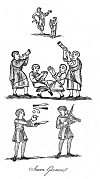

  
[Intangible Textual Heritage](../../../index.md) 
[Legends/Sagas](../../index)  [England](../index)  [Index](index.md) 
[Previous](spe12)  [Next](spe14.md) 

------------------------------------------------------------------------

p. 148

### CHAPTER III

The British Bards--The Northern Scalds--The Anglo-Saxon Gleemen--The
Nature of their Performances--A Royal Player with three Darts--Bravery
of a Minstrel in the Conqueror's Army--Other Performances by
Gleemen--The Harp an Instrument of Music much used by the
Saxons--Harpers at Durham--The Norman Minstrels, and their different
Denominations and Professions--Troubadours--Jestours--Tales and Manners
of the Jesters--Further Illustration of their Practices--Patronage,
Privileges, and Excesses of the Minstrels--A Guild of Minstrels--Abuses
and Decline of Minstrelsy--Minstrels were Satirists and
Flatterers--Anecdotes of offending Minstrels, Women Minstrels--The Dress
of the Minstrels--The King of the Minstrels, why so called--Rewards
given to Minstrels--Payments to Minstrels--Durham Minstrels and
Players--Minstrels at Parish Festivals.

THE BRITISH BARDS.--The Britons were passionately fond of vocal and
instrumental music: for this reason, the bards, who exhibited in one
person the musician and the poet, were held in the highest estimation
among them. "These bards," says an early historian, "celebrated the
noble actions of illustrious persons in heroic poems which they sang to
the sweet sounds of the lyre; [1](#fn_540.md) and
to this testimony we may add another of equal authority: "The British
bards are excellent and melodious poets, and sing their poems, in which
they praise some, and censure others, to the music of an instrument
resembling a lyre." [2](#fn_541.md) Their songs
and their music are said, by the same writer, to have been so
exceedingly affecting, that "sometimes when two armies are standing in
order of battle, with their swords drawn, and their lances extended upon
the point of engaging in a most furious conflict, the poets have stepped
in between them, and by their soft and fascinating songs calmed the fury
of the warriors, and prevented the bloodshed. Thus, even among
barbarians," adds the author, "rage gave way to wisdom, and Mars
submitted to the Muses."

THE NORTHERN SCALDS.--The scalds [3](#fn_542.md)
were the poets and the musicians of the ancient northern nations; they
resembled the bards of the Britons, and were held in equal veneration by
their countrymen. The scalds were considered as necessary appendages to
royalty, and even the inferior chieftains had their poets to record
their actions and indulge their vanity.

THE ANGLO-SAXON GLEEMEN.--Upon the establishment of the Saxons in
Britain, these poetical musicians were their chief favourites; the
courts of the kings and the residences of the opulent afforded them a
constant asylum; their persons were protected, and admission granted to
them without the least restraint. In the Anglo-Saxon language they were
distinguished by two appellations; the one equivalent to the modern term
of gleemen or merry-makers, and the other harpers, derived from the
harp, an instrument on which

 

[  
Click to enlarge](img/pl20.jpg.md)  
Saxon Gleemen  

 

p. 149

they usually played. The appellation of harper was long retained by the
English rhymists. The gleemen added mimicry, and other means of
promoting mirth to their profession, as well as dancing and tumbling,
with sleights of hand, and variety of deceptions to amuse the
spectators: it was therefore necessary for them to associate themselves
into companies, by which means they were enabled to diversify their
performances, and render many of them more surprising through the
assistance of their confederates. In Edgar's oration to Dunstan, the
mimi, or minstrels, are said to sing and dance; and, in the canons made
in that king's reign, A.D. 960 (Can. 58), it is ordered that no priest
shall in any wise act the gleeman with himself or with other men, but
be, as becomes his order, wise and reverend. [1](#fn_543.md)

NATURE OF THE PERFORMANCES BY THE GLEEMEN.--Representations of some of
these pastimes are met with occasionally in early manuscripts; and where
they do occur, we uniformly find that the illuminators, being totally
ignorant of ancient customs and the habits of foreign nations, have not
paid the least regard to propriety in the depicting of either, but
substituted those of their own time, and by this means they have,
without design on their part, become the communicators of much valuable
information. The following observations upon two very early paintings
will, I doubt not, in great measure confirm the truth of this assertion.

On [plate twenty](#img_pl20.md) are two persons dancing to the music of the
horn and the trumpet, and it does not appear to be a common dance in
which they are engaged; on the contrary, their attitudes are such as
must have rendered it very difficult to perform. On the [same
plate](#img_pl20.md) is a curious specimen of a performer's art.

We here see a man throwing three balls and three knives alternately into
the air, and catching them one by one as they fall, but returning them
again in a regular rotation. To give the greater appearance of
difficulty to this feat, it is accompanied with the music of an
instrument resembling the modern violin. It is necessary to add, that
these two figures, as well as those dancing, previously exhibited, form
a part only of two larger paintings, which, in their original state, are
placed as frontispieces to the Psalms of David; and in both, the artists
have represented that monarch seated upon his throne in the act of
playing upon the harp or the lyre, and surrounded by the masters of
sacred music. In each the king is depicted considerably larger than the
other performers, a compliment usually paid to saints and dignified
persons; which absurdity has been frequently practised by the more
modern painters. The inferior figures form a sort of border to the sides
and bottom of the royal portrait. In addition to the four figures in the
middle of the Plate, and exclusive of the king, there are four more, all
of them instrumental performers; one playing upon the horn, another upon
the trumpet, and the other two upon a kind of tabor or drum, which,
however, is beaten with a single drum-stick: the manuscript in which
this illumination is

p. 150

preserved, was written as early as the eighth century, and is in the
Cotton Collection at the British Museum. [1](#fn_544.md) The second painting, which is more
modern than the former by full two centuries, contains four figures
besides the royal psalmist; the two not engraved are musicians: the one
is blowing a long trumpet supported by a staff he holds in his left
hand, and the other is winding a crooked horn. [2](#fn_545.md) In a short prologue, immediately
preceding the psalms, we read as follows: *David, filius Jesse, in regno
suo quatuor elegit qui psalmos fecerunt, id est Asaph, Æman, Æthan, et
Idithun*; which may be thus translated literally, "David, the son of
Jesse, in his reign elected four persons who composed psalms, that is to
say, Asaph, Æman, Æthan, and Idithun." In the painting these four names
are separately appropriated, one to each of the four persons there
represented; the player upon the violin is called Idithun, and Æthan is
tossing up the knives and the balls.

I have been thus particular in describing these curious delineations,
because I think they throw much light upon the profession of the
Anglo-Saxon gleeman, and prove that his exhibitions were diversified at
a very early period; for the reader, I doubt not, will readily agree
with me, that dancing and sleights of hand were better calculated for
secular pastimes than for accompaniments to the solemn performances of
sacred psalmody. The honest illuminators having no ideas, as I before
observed, of foreign or ancient manners, saw not the absurdity of making
the Jewish monarch a president over a company of Saxon gleemen; they had
heard, no doubt, that these persons whose names they found recorded in
the book of Psalms, were poets and musicians; and therefore naturally
concluded that they were gleemen, because they knew no others who
performed in that double capacity but the gleemen: they knew also that
these facetious artists were greatly venerated by persons of the highest
rank, and their company requested by kings and princes, who richly
rewarded them for the exercise of their talents, and for this reason,
conceived that they were proper companions for the royal psalmist.

A ROYAL PLAYER WITH THREE DARTS.--The sleight of casting up a certain
number of sharp instruments into the air, and catching them alternately
in their fall, though part of the gleeman's profession, was not entirely
confined to this practice. It is said of Olaf Fryggeson, one of the
ancient kings of Norway, that he could play with three darts at once,
tossing them in the air, and always kept two up while the third was down
in his hand. [3](#fn_546.md) Our Saxon joculator,
however, has the advantage of the monarch by adding the three balls,
which of course must have made the trick more difficult to be performed.

BRAVERY OF A MINSTREL IN THE CONQUEROR'S ARMY.--The celebrated minstrel
or juggler Taillefer, who came into England with William the Norman, was
a warrior as well as a musician. He was present at the battle of
Hastings, and appeared at the head of the Conqueror's army, singing the
songs of Charlemagne and of Roland; but previous to the commencement of
the action, he

p. 151

advanced on horseback towards the army of the English, and, casting his
spear three times into the air, he caught it as often by the iron head;
and the fourth time he threw it among his enemies, one of whom he
wounded in the body: he then drew his sword, which he also tossed into
the air as many times as he had done his spear, and caught it with such
dexterity, that those who saw him attributed his manœuvres to the power
of enchantment. After he had performed these feats he galloped among the
English soldiers, thereby giving the Normans the signal of battle; and
in the action it appears he lost his life. [1](#fn_547.md)

OTHER PERFORMANCES BY GLEEMEN.--One part of the gleeman's profession, as
early as the tenth century, was, teaching animals to dance, to tumble,
and to put themselves into variety of attitudes, at the command of their
masters.

Upon [plate twenty-five](spe16.htm#img_pl25.md) we see the copy of a
curious though rude delineation, being little more than an outline,
which exhibits a specimen of this pastime. The principal joculator
appears in the front, holding a knotted switch in one hand, and a line
attached to a bear in the other; the animal is lying down in obedience
to his command; and behind them are two more figures, the one playing
upon two flutes or flageolets, and elevating his left leg while he
stands upon his right, supported by a staff that passes under his
armpit; the other dancing, in an attitude exceedingly ludicrous. This
performance takes place upon an eminence resembling a stage made with
earth; and in the original a vast con-course are standing round it in a
semicircle as spectators of the sport, but they are so exceedingly ill
drawn, and withal so indistinct, that I did not think it worth the pains
to copy them. The dancing, if I may so call it, of the flute player, is
repeated twice in the same manuscript. I have thence selected two other
figures and placed them upon [plate twenty](#img_pl20.md).

Here we see a youth playing upon a harp with only four strings, and
apparently singing at the same time, while an elderly man is performing
the part of a buffoon or posture master, holding up one of his legs, and
hopping upon the other to the music. Both these drawings occur in a MS.
psalter in the Harleian Collection, [2](#fn_548.md) written in Latin, and apparently about
the middle of the tenth century. It contains many drawings, all of them
exceedingly rude, and most of them merely outlines. We shall have
occasion farther on to speak more largely concerning all these kinds of
diversions.

THE HARP USED BY THE SAXONS.--The bards and the scalds most assuredly
used the harp to accompany their songs and modulate their voices. The
Saxon gleemen and joculators followed their example, and are frequently
called harpers for that reason; but, at the same time, it is equally
certain, that they were well acquainted with several other instruments
of music, as the violin, or something very similar to it; pipes or
flutes of various kinds; horns and trumpets; to which may be added the
tabor, or drum. The harp, indeed, was the most

p. 152

popular, and frequently exercised by persons who did not follow the
profession of gleemen. We learn from Bede, an unquestionable authority,
that, as early as the seventh century, it was customary at convivial
meetings to hand a harp from one person to another, and every one who
partook of the festivity played upon it in his turn, singing a song to
the music for merriment sake. [1](#fn_549.md) The
historian adds, that Cædmon, not being acquainted with such sort of
songs, gat up when he saw the harp brought near him, and went home; the
king adds the reason, namely, that he arose for shame, not being able to
comply with the general practice. Probably this was not the practice
when the professional harper was present, whose province it was to amuse
the company.

\* HARPERS AT DURHAM.--The Account Rolls of the abbey of Durham for the
fourteenth century yield frequent reference to the harp and harpers. The
prior had a harper attached to his great establishment; a harp was
bought in 1335 for Thomas the harper at a cost of 3s.; in 1330 an
itinerant harper received 12d.; in 1357 William, a blind harper,
received 2s. at Christmas; and in 1360 a Welsh harper obtained 3s. 4d.
In 1362 a harper belonging to the bishop of Norwich visited the abbey at
the feast of the translation of St Cuthbert, and was rewarded with 5s.;
he was an actor or jester as well as a harper, for he is termed *histrio
harper*. [2](#fn_550.md)

THE NORMAN MINSTRELS.--Soon after the Conquest, these itinerant
musicians lost the ancient Saxon appellation of gleemen, and were called
ministraulx, in English minstrels, a term well known in Normandy some
time before. As the minstrel's art consisted of several branches, the
professors were distinguished by different denominations, as, "rimours,
chanterres, conteours, jougleours or jongleurs, jestours, lecours, and
troubadours or trouvers"; in modern language, rhymers, singers,
story-tellers, jugglers, relaters of heroic actions, buffoons, and
poets; but all of them were included under the general name of minstrel.
In the Latin, *ministerellus*, or *ministrallus*, is also called
*mimus*, *mimicus*, *histrio*, *joculator*, *versificator*, *cantor*,
and *scurra*. An eminent French antiquary says of the minstrels, that
some of them themselves composed the subjects they sang or related, as
the trouvers and the conteurs; and some of them used the compositions of
others, as the jugleours and the chanteurs. He farther remarks, that the
trouvers may be said to have embellished their productions with rhyme,
while the conteurs related their histories in prose; the jugleours, who
in the middle ages were famous for playing upon the vielle accompanied
the songs of the trouvers. The vielle was a stringed instrument, sounded
by the turning of a wheel within it, resembling that which we frequently
see about the streets played by the Savoyards, vulgarly called a
hurdy-gurdy. [3](#fn_551.md)

p. 153

These jugleours were also assisted by the chanteurs; and this union of
talents rendered the compositions more harmonious and more pleasing to
the auditory, and increased their rewards, so that they readily joined
each other, and travelled together in large parties. [1](#fn_552.md) It is, however, very certain, that the
poet, the songster, and the musician, were frequently united in the same
person.

TROUBADOURS.--The Norman rhymers appear to have been the genuine
descendants of the ancient Scandinavian scalds; they were well known in
the northern part of France long before the appearance of the provincial
poets called troubadours, and trouvers, that is, finders, probably from
the fertility of their invention. The troubadours brought with them into
the north a new species of language called the Roman language, which in
the eleventh and twelfth centuries was commonly used in the southern
provinces of France, and there esteemed as the most perfect of any in
Europe. It evidently originated from the Latin, and was the parent of
the French tongue; and in this language their songs and their poems were
composed. [2](#fn_553.md) These poets were much
admired and courted, being, as a very judicious modern writer [3](#fn_554.md) says, the delight of the brave and the
favourites of the fair; because they celebrated the achievements of the
one and the beauties of the other. Even princes became troubadours, and
wrote poems in the provincial dialect; among others, a monarch of our
own country certainly composed verses of this kind. The reader will, I
doubt not, readily recollect the common story of Richard I., who, being
closely confined in a castle belonging to the duke of Austria, was
discovered by his favourite minstrel Blondel, a celebrated troubadour,
through the means of a poem composed by the poet, in conjunction with
his royal master. The story is thus related in a very ancient French
author, quoted by Claude Fauchet: Blondel, seeing that his lord did not
return, though it was reported that he had passed the sea from Syria,
thought that he was taken by his enemies, and probably very evilly
entreated; he therefore determined to find him, and for this purpose
travelled through many countries without success: at last he came to a
small town, near which was a castle belonging to the duke of Austria;
and, having learned from his host that there was a prisoner in the
castle who had been confined for upwards of a year, he went thither, and
cultivated an acquaintance with the keepers; for a minstrel, says the
author, can easily make acquaintance. However, he could not obtain a
sight of the prisoner, nor learn his quality; he therefore placed
himself near to a window belonging to the tower wherein he was shut up,
and sang a few verses of a song which had been composed conjointly by
him and his patron. The king, hearing the first part of the song,
repeated the second; which convinced the poet that the prisoner was no
other than Richard himself. Hastening therefore into England, he
acquainted the barons with his adventure, and they, by means of a large
sum of money, procured the liberty of the monarch. [4](#fn_555.md)

p. 154

JESTOURS.--The conteurs and the jestours, who are also called dissours,
and seggers, or sayers, and, in the Latin of that time, *fabulatores*
and *narratores*, were literally, in English, tale-tellers, who recited
either their own compositions or those of others, consisting of popular
tales and romances, for the entertainment of public companies, on
occasions of joy and festivity. Gower, a writer contemporary with
Chaucer, describing the coronation of. a Roman emperor, says,

When every ministrell had playde,  
And every dissour had sayde,  
Which was most pleasaunt in his ear. [1](#fn_556.md)

In a manuscript collection of old stories, in the Harleian Library, we
read of a king who kept a tale-teller on purpose to lull him to sleep
every night; but some untoward accident having prevented him from taking
his repose so readily as usual, he desired the fabulator to tell him
longer stories; who obeyed, and began one upon a more extensive scale,
and fell asleep himself in the midst of it.

TALES AND MANNERS OF THE JESTOURS.--The jestours, or, as the word is
often written in the old English dialect, gesters, were the relaters of
the gestes, that is, the actions of famous persons, whether fabulous or
real; and these stories were of two kinds, the one to excite pity, and
the other to move laughter, as we learn from Chaucer: [2](#fn_557.md)

And jestours that tellen tales,  
Both of wepying and of game.

The tales of game, as the poet expresses himself, were short jocular
stories calculated to promote merriment, in which the reciters paid
little respect to the claims of propriety, or even of common decency.
The tales of game, however, were much more popular than those of
weeping, and probably for the very reason that ought to have operated
the most powerfully for their suppression. The jestours, or jesters,
whose powers were chiefly employed in the hours of conviviality, finding
by experience that lessons of instruction were much less seasonable at
such times than idle tales productive of mirth and laughter,
accommodated their narrations to the general taste of the times,
regardless of the mischiefs they occasioned by vitiating the morals of
their hearers; hence it is, that the author of the *Vision of Pierce the
Ploughman* calls them contemptibly "japers, and juglers, and janglers of
gests." [3](#fn_558.md) He describes them also as
haunters of taverns and common ale-houses, amusing the lower classes of
the people with "myrth of minstrelsy and losels tales," loose vulgar
tales, and calls them tale-tellers and "tutelers in ydell," tutors of
idleness, occasioning their auditory, "for love of tales, in tavernes to
drink," where they learned from them to jangle and to jape, instead of
attending to their more serious duties; he therefore makes one to say,

I can not parfitly my pater noster as the priest it singeth,  
But I can ryms of Roben Hode, and Randol erl of Chester  
But of our Lord or our Lady I lerne nothing at all:  
I am occupied every daye, holy daye, and other,  
With idle tales at the ale.--

p. 155

He then blames the opulent for rewarding these "devils dissours," as he
calls them, and adds,

He is worse than Judas that giveth a japer silver. [1](#fn_559.md)

The japers, I apprehend, were the same as the bourdours, or rybauders,
an inferior class of minstrels, and properly called jesters in the
modern acceptation of the word; whose wit, like that of the
merry-andrews of the present day, consisted in low obscenity,
accompanied with ludicrous gesticulation. They sometimes, however, found
admission into the houses of the opulent. Knighton indeed mentions one
of these japers who was a favourite in the English court, and could
obtain any grant from the king "*a burdando*," that is, by jesting. They
are well described by the poet:

As japers and janglers, Judas chyldren,  
Fayneth them fantasies, and fooles them maketh.

\[paragraph continues\] It was a very common and a very favourite
amusement, so late as the sixteenth century, to hear the recital of
verses and moral speeches, learned for that purpose, by a set of men who
obtained their livelihood thereby, and who, without ceremony, intruded
themselves, not only into taverns and other places of public resort, but
also into the houses of the nobility.

FURTHER ILLUSTRATION OF THEIR PRACTICES.--The different talents of the
minstrels are sarcastically described by an ancient French poet; [2](#fn_560.md) who, supposing a company of them
assembled in the hall of an opulent nobleman, says, the count caused it
to be made known to them, that he would give his best new scarlet robe
to the minstrel who should occasion the most merriment, either by
ridiculous words or by actions. This proposal occasioned them to strive
with each other; some of them imitated the imbecility of drunkards,
others the actions of fools; some sang, others piped; some talked
nonsense, and some made scurrilous jests; those who understood the
juggler's art played upon the vielle; others of them depended on the
narration of quaint fables, which were productive of much laughter.

PATRONAGE, PRIVILEGES, AND EXCESSES OF THE MINSTRELS.--There is great
reason to conclude that the professors of music were more generally
encouraged, and of course more numerous in this country, subsequent to
the Norman conquest, than they had been under the government of the
Saxons. We are told, that the courts of princes swarmed with poets and
minstrels. The earls also and great barons, who in their castles
emulated the pomp and state of royalty, had their poets and minstrels:
they formed part of their household establishment; and, exclusive of
their wages, were provided with board, lodging, and clothing by their
patrons, and frequently travelled with them when they went from home.
These minstrels, as well as those belonging to the court, were permitted
to perform in the rich monasteries, and in the mansions of the nobility,
which they frequently visited in large parties, and especially upon
occasions of festivity. They entered the castles without the least
ceremony, rarely waiting for any

p. 156

previous invitation, and there exhibited their performances for the
entertainment of the lord of the mansion and his guests. They were, it
seems, admitted without any difficulty, and handsomely rewarded for the
exertion of their talents.

It was no uncommon thing with the itinerant minstrels to find admission
into the houses of the opulent. The Saxon and the Danish gleemen
followed the armies in the time of war, and had access to both the camps
without the least molestation. The popular story of king Alfred,
recorded by William of Malmsbury and other writers, may be mentioned in
proof of this assertion. He, it is said, assumed the character of a
gleeman, [1](#fn_561.md) and entered the Danish
camp, where he made such observations as were of infinite service. This
stratagem was afterwards repeated by Aulaff, the Dane, who was equally
successful. He assumed, says the historian, the profession of the mimic,
"who by this species of art makes a daily gain;" and then adds, "being
commanded to depart, he took with him the reward for his song." [2](#fn_562.md)

The extensive privileges enjoyed by the minstrels, and the long
continuance of the public favour, inflated their pride and made them
insolent; they even went so far as to claim their reward by a
prescriptive right, and settled its amount according to the estimation
they had formed of their own abilities, and the opulence of the noblemen
into whose houses they thought proper to intrude. The large gratuities
collected by these artists not only occasioned great numbers to join
their fraternity, but also induced many idle and dissipated persons to
assume the characters of minstrels, to the disgrace of the profession.
These evils became at last so notorious, that in the reign of king
Edward II. it was thought necessary to restrain them by a public edict,
which sufficiently explains the nature of the grievance. It states, that
many indolent persons, under the colour of minstrelsy, intruded
themselves into the residences of the wealthy, where they had both meat
and drink, but were not contented without the addition of large gifts
from the householder. To restrain this abuse, the mandate ordains, that
no person should resort to the houses of prelates, earls, or barons, to
eat, or to drink, who was not a professed minstrel; nor more than three
or four minstrels of honour at most in one day, meaning, I presume, the
king's minstrels and those retained by the nobility, except they came by
invitation from the lord of the house.

Thus we read in the old romance of Launfel,

They had menstrelles of moche honours,  
Fydelers, sytolyrs, and trompoters.

The edict also prohibits a professed minstrel from going to the house of
any person below the dignity of a baron, unless invited by the master;
and, in that case, it commands him to be contented with meat and drink,
and such reward as the housekeeper willingly offered, without presuming
to ask for anything. For the first offence the minstrel lost his
minstrelsy, and for the second

p. 157

he was obliged to forswear his profession, and was never to appear again
as a minstrel. [1](#fn_563.md) This edict is dated
from Langley, an. 9 Edward II. A.D. 1315.

A GILD OF MINSTRELS.--In little more than a century afterwards, the same
grievances became again the subject of complaint; and in the ninth year
of Edward IV. (1469) it was stated, that certain rude husbandmen and
artificers of various trades had assumed the title and livery of the
king's minstrels, and, under that colour and pretence, had collected
money in divers parts of the kingdom, and committed other disorders; the
king therefore granted to Walter Haliday, marshal, and to seven others,
his own minstrels, named by him, a charter, by which he created, or
rather restored, a fraternity, or perpetual gild, such as the king
understood the brothers and sisters of the fraternity of minstrels to
have possessed in former time. This fraternity was to be governed by a
marshal appointed for life, the same office as that anciently possessed
by the king of the minstrels, and two wardens, who were empowered to
admit members into the gild, and to regulate and govern, and to punish,
when necessary, all such as exercised the profession of minstrels
throughout the kingdom. [2](#fn_564.md)

\* This gild was attached to the cathedral church of St Paul's for its
religious functions. The minstrels of Chester, who had already several
charter privileges, were exempted from the operations of the general
charter of 1469. There was also a famous gild of minstrels at Beverley.
The ordinances of gilds of minstrels at York and Canterbury are still
extant. [3](#fn_565.md)

ABUSES AND DECLINE OF MINSTRELSY.--It does not appear that much good was
effected by the foregoing institution or general gild; it neither
corrected the abuses practised by the fraternity, nor retrieved their
reputation, which declined apace from this period. Under queen
Elizabeth, the minstrels had lost the protection of the opulent; and
their credit was sunk so low in the public estimation, that, by a
statute in the thirty-ninth year of her reign against vagrants, they
were included among the rogues, vagabonds, and sturdy beggars, and
subjected to the like punishments. This edict also affected all fencers,
bearwards, common players of interludes (with the exception of such
players as belonged to great personages, or had obtained licences from
town or country authorities), as well as minstrels wandering abroad,
jugglers, tinkers, and pedlars; and seems to have given the death's
wound to the profession of the minstrels, who had so long enjoyed the
public favour, and basked in the sunshine of prosperity. The name,
however, remained, and was applied to itinerant fiddlers and other
musicians, whose low estate is thus described by Putenham, in his *Arte
of English Poesie*, printed in 1589: [4](#fn_566.md) "Ballads and small popular musickes sung
by these cantabanqui upon benches and barrels heads, where they have
none other audience than boyes or countrye fellowes that passe by them
in the streete, or else by blind harpers, or such like taverne minstrels
that give a fit of mirth for a groat; and their matters being for the
most part stories of old time, as the

p. 158

tale of Sir Topas, Bevis of Southampton, Guy of Warwick, Adam Bell and
Clymme of the Clough, and such other old romances or historical rhimes,
made purposely for the recreation of the common people at Christmas
dinners and bride ales, and in tavernes and alehouses, and such other
places of base resort." Bishop Hall, the satirist, adverts to the poor
plight of the minstrels at this time, in the last two lines of the
following couplet:--

Much better than a Paris-garden beare,  
Or prating puppet on a theatre,  
Or Mimoes whistling to his tabouret,  
Selling a laughter for a cold meales meat. [1](#fn_567.md)

It is necessary, however, to observe, that public and private bands of
musicians were called minstrels for a considerable time after this
period, and without the least indication of disgrace; but then the
appellation seems to have been confined to the instrumental performers,
and such of them as were placed upon a regular establishment: the
musicians of the city of London, for instance, were called indifferently
waits and minstrels. [2](#fn_568.md)

We hear of the itinerant musicians again in an ordinance from Oliver
Cromwell, dated 1656, during his protectorship, which prohibits "all
persons commonly called fidlers, or minstrells," from "playing, fidling,
and making music, in any inn, alehouse, or tavern"; and also from
"proffering themselves, or desireing, or intreating any one to hear them
play, or make music in the places aforesaid." The only vestige of these
musical vagrants now remaining, is to be found in the blind fiddlers
wandering about the country, and the ballad singers, who frequently
accompany their ditties with instrumental music, especially the fiddle,
vulgarly called a crowd, and the guitar. And here we may observe, that
the name of fiddlers was applied to the minstrels as early at least as
the fourteenth century: it occurs in the *Vision of Pierce the
Ploughman*, [3](#fn_569.md) where we read, "not to
fare as a fydeler, or a frier, to seke feastes." It is also used, but
not sarcastically, in the poem of Launfel.

MINSTRELS WERE SATIRISTS AND FLATTERERS.--The British bards employed
their musical talents in the praise of heroic virtue, or in the censure
of vice, apparently without any great expectation of reward on the one
hand, or fear of punishment on the other. The Scandinavian scalds
celebrated the valiant actions of their countrymen in appropriate
verses; and sometimes accompanied the warriors to the field of battle,
that they might behold their exploits and describe them with more
accuracy. The gleemen of the Saxons imitated their predecessors, and
attached themselves to the persons of princes and chieftains, and
retained their favour by continual adulation. The minstrels of the
Normans trod in the same steps, but seem to have been more venal, and
ready at all times to flatter or to satirise, as best suited their
interest, without paying much regard to justice on either side.

ANECDOTES OF OFFENDING MINSTRELS.--It IS said of William Longchamp,

p. 159

bishop of Ely, chancellor and justiciary of England, who was also the
Pope's legate, and a great favourite of Richard I., that he kept a
number of poets in his pay, to make songs and poems in his praise; and
also, that with great gifts he allured many of the best singers and
minstrels from the Continent, to sing those songs in the public streets
of the principal cities in England. [1](#fn_570.md)

It was, on the other hand, a very dangerous employment to censure the
characters of great personages, or hold their actions up to ridicule;
for, though the satirist might be secure at the moment, he was uncertain
that fortune would not one day or another put him into the power of his
adversary, which was the case with Luke de Barra, a celebrated Norman
minstrel; who, in his songs having made very free with the character of
Henry I. of England, by some untoward accident fell into the hands of
the irritated monarch. He condemned him to have his eyes pulled out:
and, when the earl of Flanders, who was present, pleaded warmly in his
favour, the king replied: "This man, being a wit, a poet, and a
minstrel, composed many indecent songs against me, and sung them openly
to the great entertainment of mine enemies; and, since it has pleased
God to deliver him into my hands, I will punish him, to deter others
from the like petulance." The cruel sentence was executed, and the
miserable satirist died soon after with the wounds he had received in
struggling with the executioner. [2](#fn_571.md)

Again, in the reign of king Edward II., at the solemnisation of the
feast of Pentecost in the great hall at Westminster, when that prince
was seated at dinner in royal state, and attended by the peers of the
realm, a woman habited like a minstrel, riding upon a great horse
trapped in the minstrel fashion, entered the hall, and, going round the
several tables, imitated the gestures of a mimic, [3](#fn_572.md) and at length mounted the steps to the
royal table, upon which she deposited a letter; and, having so done, she
turned her horse, and saluting all the company, retired. The letter was
found to contain some very severe reflections upon the conduct of the
monarch, which greatly angered him; and the actress, being arrested by
his command, discovered the author of the letter, who acknowledged the
offence and was pardoned; but the door-keeper, being reprimanded on
account of her admission, excused himself, by declaring it had never
been customary to prevent the entry of minstrels and persons in
disguisements, upon the supposition that they came for the entertainment
of his majesty. This woman had probably assumed the habit of a man, and
a female was chosen on this occasion, according to the opinion of Dr
Percy, [4](#fn_573.md) because, upon detection,
her sex might plead for her, and disarm the king's resentment. It is,
however, certain that at this time, and long before it, there were women
who practised the minstrel's art, or at least. some branches of it. We
read of the glee-maidens, or

p. 160

female minstrels, in the Saxon records; and I believe that their
province in general was to dance and to tumble, whence they acquired the
name of tomblesteres, from the Saxon ȝumbian, to dance or tumble, and
saylours, from salio, to leap or dance, in the time of Chaucer, who uses
both these denominations. [1](#fn_574.md)

THE DRESS OF THE MINSTRELS.--It is very clear, that the minstrels wore a
peculiar kind of dress by which they might readily be distinguished: the
woman above mentioned is expressly said to have been habited like a
mimic or a minstrel, and by that means obtained admission without the
least difficulty to the royal presence. I remember also a story recorded
in a manuscript, written about the reign of Edward III., of a young man
of family, who came to a feast, where many of the nobility were present,
in a vesture called a coat hardy, cut short in the German fashion, and
resembling the dress of a minstrel. The oddity of his habit attracted
the notice of the company, and especially of an elderly knight, to whom
he was well known, who thus addressed him: "Where, my friend, is your
fiddle, your ribible, or such-like instrument belonging to a minstrel?"
"Sir," replied the young man, "I have no crafte nor science in using
such instruments." "Then," returned the knight, "you are much to blame;
for, if you choose to debase yourself and your family by appearing in
the garb of a minstrel, it is fitting you should be able to perform his
duty." [2](#fn_575.md) On a column in Saint Mary's
church at Beverley in Yorkshire is the following. inscription: "This
pyllor made the maynstrels"; its capital is decorated with small figures
of men in short coats painted blue, with red stockings and yellow
girdles and stocks. The instruments they bear are a crowth (fiddle), a
guitar, a treble and base flute, and a side drum and tabor. The date is
early sixteenth century. The minstrels retained in noblemen's families
wore their lords' livery; and those appertaining to the royal household
did the same. The edict of Edward IV. against the pretended minstrels,
mentioned above, expressly says, that they assumed the name, and the
livery or dress, of the king's own minstrels. The queen had also
minstrels in her service, who probably wore a livery different from
those of the king for distinction sake. The following lines, which are
somewhat to the purpose, occur in an old historical poem, in the
Harleian Collection: they relate to Sir Edward Stanley, who is highly
praised by the author for his great skill in playing upon all kinds of
instruments:--

He stood before the kinge, doubtless this was true,*  
*In a fayre gowne of cloth of gold, and of tilshewe,*  
*Lyke no common mynstrel, to shew taverne mirth,*  
*But lyke a noble man, both of lands, and of birth. [3](#fn_576.md)

\[paragraph continues\] And again, in the history of John Newchombe, the
famous clothier of Newbury, usually called Jack of Newbury, it is said,
"They had not sitten long, but in comes a noise of musicians in tawnie
coats; who, putting off their caps, asked if they would have any music?"

p. 161

THE KING OF THE MINSTRELS.--The king's minstrel, frequently in Latin
called joculator regis, or the king's juggler, was an officer of rank in
the courts of the Norman monarchs. He had the privilege of accompanying
his master when he journeyed, and of being near his person; and probably
was the regulator of the royal sports, and appointed the other minstrels
belonging to the house-hold; for which reason, I presume, he was also
called the king, or chief of the minstrels. At what time this title was
first conferred on him does not appear: we meet with it, however, in an
account of the public expenditures made in the fifth year of Edward I.;
at which time, the king of the minstrels, whose name was Robert,
received his master's pay for military services. [1](#fn_577.md) The same name, with the same title
annexed to it, occurs again in a similar record, dated the fourth year
of Edward II.; when he, in company with various other minstrels,
exhibited before the king and his court, then held in the city of York;
and received forty marks, to be by him distributed among the
fraternity. [2](#fn_578.md)

The title of royalty was not confined to the king's chief minstrel: it
was also bestowed upon the regent of other companies of musicians, as we
find in a charter granted by John of Gaunt, duke of Lancaster, to the
minstrels of Tutbury in Staffordshire. This document he addresses, under
his seal, at the castle of Tutbury, August 24, in the fourth year of
Richard II., to *nostre bene ame le roy des ministraulx*, his well
beloved the king of the minstrels; and con-cedes to him full power and
commission to oblige the minstrels belonging to the honour of Tutbury to
perform their services and minstrelsies in the same manner that they had
been accustomed to be done in ancient times. [3](#fn_579.md) In a ballad intituled "The marriage of
Robin Hood and Clorinda the Queen of Tutbury Feast," [4](#fn_580.md) written probably after the disgrace of
the minstrels, this officer is called the king of the fidlers. The poet
supposes himself to have been present at the wedding, and witness of the
facts he relates; and therefore he speaks thus:

This battle was fought near to Titbury town,  
  When the bagpipes baited the bull.  
I am king of the fidlers, and swear ’tis a truth,  
  And I call him that doubts it a gull.

Claude Fauchet, a French author of eminence, before quoted, speaking
concerning the title of king, formerly given to many officers belonging
to the court, makes these observations: "I am well assured, the word
king signifies comptroller, or head, as the chief heralds are called
kings at arms, because it belonged solely to them to regulate the
ceremonies of the justs and tournaments." He then applies this reasoning
to the Roy des Ribaulx, an officer in the ancient court of France; [5](#fn_581.md) and says, his charge was to clear the
palace of

p. 162

indolent and disorderly persons, who followed the court, and had no
business there; and had his title as king of vagabonds, because he was
the examiner and corrector of dissolute persons. [1](#fn_582.md) In like manner, I presume, in this
country, the king of the minstrels was the governor and director of the
fraternity over which he presided. The title was dropped in the reign of
Edward IV., and that of marshal became its substitute.

REWARDS GIVEN TO MINSTRELS.--In the middle ages, the courts of princes,
and the residences of the opulent, were crowded with minstrels; and such
large sums of money were expended for their maintenance, that the public
treasuries were often drained. Matilda, queen to Henry I., is said to
have lavished the greater part of her revenue upon poets and minstrels,
and oppressed her tenants to procure more. [2](#fn_583.md) She was, however, by no means singular
in so doing, as the invectives of the monks sufficiently demonstrate.
These selfish professors of religion grudged every act of munificence
that was not applied to themselves, or their monasteries; and could not
behold the good fortune of the minstrels without expressing their
indignation; which they often did in terms of scurrilous abuse, calling
them janglers, mimics, buffoons, monsters of men, and contemptible
scoffers. They also severely censured the nobility for patronising and
rewarding such a shameless set of sordid flatterers, and the populace
for frequenting their exhibitions, and being delighted with their
performances, which diverted them from more serious pursuits, and
corrupted their morals. [3](#fn_584.md) On the
other hand, the minstrels appear to have been ready enough to give them
ample occasion for censure; and, indeed, I apprehend that their own
immorality and insolence contributed more to their downfall than all the
defamatory declamations of their opponents. The ecclesiastics were
mightily pleased with the conduct of the emperor Henry III., because, at
his marriage with Agnes of Poictou, he disappointed the poor minstrels
who had assembled in great multitudes on the occasion, giving them
neither food nor rewards, but "sent them away," says a monkish author,
"with empty purses, and hearts full of sorrow." [4](#fn_585.md) But to go on.

The rewards given to the minstrels did not always consist in money, but
frequently in rich mantles and embroidered vestments: they received,
says Fauchet, great presents from the nobility, who would sometimes give
them even the robes with which they were clothed. It was a common custom
in the middle ages to give vestments of different kinds to the
minstrels. In an ancient poem, cited by Fauchet, called "La Robe
Vermeille," or, The Red Robe, the wife of a vavaser, that is, one who,
holding of a superior lord, has tenants under him, reproaches her
husband for accepting a robe. "Such gifts," says she, "belong to
jugglers, and other singing men, who receive garments from the nobility,
because it is their trade:

p. 163

S’appartient à ces jorgleours,  
Et à ces autres chanteours,  
Quils ayent de ces chevaliers,  
Les robes car c’est lor mestier." [1](#fn_586.md)

These garments the jugglers failed not to take with them to other
courts, in order to excite a similar liberality. Another artifice they
often used, which was, to make the heroes of their poems exceedingly
bountiful to the minstrels, who appear to have been introduced for that
purpose: thus, in the metrical romance of Ipomedon, where the poet
speaks of the knight's marriage, he says:--

Ipomydon gaff, in that stound,  
To mynstrelles five hundred pound. [2](#fn_587.md)

The author of *Pierce the Ploughman*, who lived in the reign of Edward
III., gives the following general description of the different
performances of the minstrels, and of their rewards, at that period:--

I am mynstrell, quoth that man; my name is Activa Vita;  
All Idle iche hate, for All Active is my name;  
A wafirer [3](#fn_588.md) well ye wyt; and serve
many lordes,  
And few robes I get, or faire furred gownes.  
Could I lye, to do men laugh; then lachen [4](#fn_589.md) I should  
Nother mantill, nor money, amonges lords minstrels:  
And, for I can neither taber, ne trumpe, ne tell no gestes,  
Fartin ne fislen, at feastes, ne harpen;  
Jape, ne juggle, ne gentilly pype,  
Ne neither saylen ne saute, [5](#fn_590.md) ne
singe to the gytterne,  
I have no good giftes to please the great lordes.

And, if we refer to history, we shall find that the poets are not
incorrect in their statement. Gaston, earl of Foix, whose munificence is
much commended by Froissart, lived in a style of splendour little
inferior to that of royalty. The historian, speaking of a grand
entertainment given by this nobleman, which he had an opportunity of
seeing, says, "Ther wer many mynstrells, as well of his own, as of
straungers; and each of them dyd their devoyre, in their
faculties. [6](#fn_591.md) The same day the earl
of Foix gave to the heraulds and minstrelles the som of five hundred
frankes; and gave to the duke of Tourayn's minstrelles gownes of cloth
of gold, furred with ermyne, valued at two hundred frankes." [7](#fn_592.md)

Respecting the pecuniary rewards of the minstrels, we have, among
others, the following accounts. At the marriage of Elizabeth, daughter
of Edward I. to John, earl of Holland, every king's minstrel received
forty shillings. [8](#fn_593.md) In the fourth of
Edward II. Perrot de la Laund, minstrel to Lord Hugh de Nevill, received
twenty shillings for performing his minstrelsy before the king. [9](#fn_594.md) In the same year, Janino la Cheveretter,
who is called Le Tregettour, [10](#fn_595.md) was
paid at one

p. 164

time forty shillings, and at another twenty, for the same service; and
John le Mendlesham, the servant of Robert le Foll, twenty
shillings; [1](#fn_596.md) the same sum was also
given to John le Boteller, the servant of Perrot Duzedeys, for his
performances; and, again, Perrot Duzedeys, Roger the Trumpeter, and
Janino le Nakerer, all of them king's minstrels, received from the king
sixty shillings for the like service.

PAYMENTS TO MINSTRELS.--In the eighth year of Edward III. licence was
granted to Barbor the bagpiper to visit the schools for minstrels in
parts beyond the seas, [2](#fn_597.md) with thirty
shillings to bear his expenses. Licence was also granted to Morlan the
bagpiper to visit the minstrels' schools; and forty shillings for his
expenses. A little lower we find a present of five shillings made by the
king to a minstrel, for performing his minstrelsy before the image of
the Blessed Virgin. [3](#fn_598.md) In the
eleventh year of the same reign, John de Hoglard, minstrel to John de
Pulteney, was paid forty shillings for exhibiting before the king at
Hatfield, and at London; and to Roger the Trumpeter, and to the
minstrels his associates, performing at the feast for the queen's
delivery, held at Hatfield, ten pounds. The permanent salary of the
royal minstrels of Edward III. was 7½d. a day. [4](#fn_599.md)

\* Henry V., in 1415, engaged eighteen minstrels to follow him to
Guyenne at a wage of 12d. a day each for three months. [5](#fn_600.md) Henry VI., as has been already stated,
retained twelve minstrels among his household servants. Two of the court
minstrels of Edward IV. obtained grants of ten marks yearly.

In the ninth year of Henry VII. "Pudesay the piper in bagpipes,"
received six shillings and eight pence from the king, for his
performance. [6](#fn_601.md) In the fourteenth
year of his reign, five pounds were paid to three stryng-mynstrels for
wages, but the time is not specified; in a subsequent entry, however, we
find that fifteen shillings were given to "a stryng-mynstrel, for one
moneth's wages"; also to a "straunge taberer, in reward, sixty-six
shillings and eight pence." [7](#fn_602.md)

\* MINSTRELS AND PLAYERS AT DURHAM.--The *Durham Account Rolls* yield
much information as to minstrels. In 1278 a minstrel of
Newcastle-on-Tyne obtained 2s. from the prior of Durham. In 1336 a band
of minstrels were rewarded with 20s. A trumpeter and a minstrel received
5s. on the festival of St Cuthbert 1369, and on the like occasion in
1374 twelve minstrels received 20s. 8d. March 10th was the original
festival of St Cuthbert, but his translation on September 14th was
considered the greater festival; at the former of these, in 1375, the
minstrels received 13s. 4d., and at the latter 20s. In the

p. 165

same year three minstrels of the earl of March obtained 6s. 8d.; one of
the king's minstrels, who came with Lord Neville, 5s.; four minstrels of
the prince of Wales, on the feast of the Exaltation of the Cross, 13s.
4d.; a minstrel on St Matthew's day, 20d.; two minstrels at Easter, 2s.;
and a certain minstrel who played before the prior in his chamber, 18d.
Earl Percy's minstrels visited the abbey in 1376, at Christmas, and
received 6s. 8d. A minstrel accompanied by a dancer performed before the
prior in his chamber in 1382; they received 6s. 8d. for their pains. In
the year 1394 duly rewarded visits were paid to the abbey by the
minstrels of Earl Percy, of the duke of Lancaster, of Lord Neville, of
the duke of York, and of the earl of Kent, as well as by a royal
trumpeter. Various minstrel entries occur in the fifteenth century. The
last reference in these Durham Rolls is at an interesting date in
ecclesiastical history. March 3, 1555, was the day that "the
proclamation and bonefyres war made for receyving of the Pope in this
realm agayn," when three pottles of wine were drunk in the dean's
chamber, and two gallons of ale in the garth, in addition to the wine
and ale consumed by the servants. Four pence was paid for a tar barrel,
and eight pence "for two mynstralles."

\* All these payments just cited are entered under the head of minstrels
(*ministralli*); but there are an almost equal number entered under the
head or title of players (*histriones*), which extend in date from 1301
to 1360. There probably was but slight difference between the two, and
the use of the varied terms mainly depended on the fashion of the time
or the caprice of the scribe. Nevertheless, although the actor might be
also a musician or juggler, the phrase *histrio* seems to convey more
definite notion of a play actor than that of *ministrallus*, and the
former word is possibly usually entered in these accounts when the
strolling band of entertainers were capable of representing certain set
pieces. This would doubtless be the case when particular companies
visited the abbey. In 1334, the king's players received 40s. when the
king was returning from Newcastle; and in the following year the players
of the king of Scotland obtained 5s. from the prior. The king's players
at Christmas 1343 were rewarded with 10s. At Christmas 1352, one William
Pyper and other players received 6s. At St Cuthbert's feast in March
1353, two players of the lord bishop together with two players of the
earl of Northampton obtained 6s. 8d. The two players of the bishop, who
were probably merely harpers or genuine minstrels, received 3s. 4d. at
Easter in the same year. [1](#fn_603.md)

\* MINSTRELS AT PARISH FESTIVALS.--The hiring of minstrels for parish
festivals at the end of the fifteenth and beginning of the sixteenth
century is testified by various churchwardens' accounts, such as those
of St Mary's, Reading. The parish accounts of Yatton, Somerset, show
that the wardens paid with considerable regularity for a minstrel or
minstrels at Whitsuntide. The first entry is for the year 1521, when
12d. was "payd to a mynnystrelle." In 1531 the "mynestrell att
Wytsonday" received 2s. 8d.; in 1532, 6s.; and

p. 166

in 1533, 8s. 4d. Occasionally as much as ten shillings is entered for
the Whitsuntide minstrel, as though only one; but in these larger
payments, the entry probably means that the money was given to the head
minstrel. In 1536 two minstrels were paid 6s., and the same number in
1540 received 6s. 9d. Three were given 13s. 8d. in 1543. The last
minstrel entry of these accounts is under the year 1559, when ten
shillings was their fee. [1](#fn_604.md) It is
clear that this minstrelsy had no connection with music in church, but
was rather for the festivities of the Whitsun Ale.

------------------------------------------------------------------------

### Footnotes

[148:1](spe13.htm#fr_540.md) Ammianus Marcell.
lib. xv. cap. 9.

[148:2](spe13.htm#fr_541.md) Diodorus Siculus,
lib, v. cap. 31.

[148:3](spe13.htm#fr_542.md) Bartholin, *De causis
contemp. a Danis Mortis*, lib. i. cap. 2, et Wormii, *Lit. Run.* ad
finim.

[149:1](spe13.htm#fr_543.md) *Ancient Laws and
Institutes*, p. 400.

[150:1](spe13.htm#fr_544.md) Vespasian, A. i.

[150:2](spe13.htm#fr_545.md) Tiberius, C. vi.

[150:3](spe13.htm#fr_546.md) Pontoppidan, *Hist.
Norway*, p. 148.

[151:1](spe13.htm#fr_547.md) Wace, *Hist. de tut
les Reys de Brittaigne*, continued by Geoffrai Gaimer, MS. in the Royal
Library, marked 13 A. xxi.

\* See Freeman's Norman Conquest, iii. 478; v. 582.

[151:2](spe13.htm#fr_548.md) No. 603.

[152:1](spe13.htm#fr_549.md) Bede's *Eccles.
Hist.* lib. iv. cap. 24.

[152:2](spe13.htm#fr_550.md) Fowler's *Durham
Account Rolls*, 3 vols. (1898-1900), *passim*.

[152:3](spe13.htm#fr_551.md) \* A reward of 6s.
8d. was given to a *rotour* or player on a rotour on St Cuthbert's Day
1395, at Durham. It is described as "a sort of fiddle"; it was probably
the same as the vielle described in the next paragraph. *Durham Account
Rolls*, iii. 599, 955.

A man playing on a lute and his wife singing were awarded 2s. at
Christmas 1361, by the prior of Durham. *Ibid*.

[153:1](spe13.htm#fr_552.md) Fauchet, *Origine de
la Langue et Poësie Françoise*, 1581, liv. i. chap. viii. fol. 72.

[153:2](spe13.htm#fr_553.md) Le Grand, *Fables, ou
Contes des 12. 13. Siècles*, tom, v.

[153:3](spe13.htm#fr_554.md) Henry's *Hist. Brit.*
vol. viii. sect. 3. chap. v. p. 502.

[153:4](spe13.htm#fr_555.md) Fauchet, *Des anciens
Poets François*, liv. ii. chap. vii. p. 92 7 and see Walpole, *Royal and
Noble Authors*, vol. i. p. 6.

[154:1](spe13.htm#fr_556.md) *Confessio Amantis*,
lib. viii.

[154:2](spe13.htm#fr_557.md) The thirde boke of
Fame.

[154:3](spe13.htm#fr_558.md) Edition of 1550.

[155:1](spe13.htm#fr_559.md) A reward.

[155:2](spe13.htm#fr_560.md) *Fabliaux et Contes*,
edit. Par. tom. ii. p. 161.

[156:1](spe13.htm#fr_561.md) Malmsb. lib. ii. cap.
4.

[156:2](spe13.htm#fr_562.md) Hist. lib. ii. cap.
6.

[157:1](spe13.htm#fr_563.md) App. to Leland's
*Collect*. vol. vi. p. 36.

[157:2](spe13.htm#fr_564.md) Patent Rolls of Edw.
IV. pt. i. m. 17.

[157:3](spe13.htm#fr_565.md) \* Jusseraud's
*English Wayfaring Life*, 205-6; Lambert's *Two Thousand Years of Gild
Life*, 132-137.

[157:4](spe13.htm#fr_566.md) Book ii. chap. 9.

[158:1](spe13.htm#fr_567.md) Lib. iv. sat. i.

[158:2](spe13.htm#fr_568.md) Stow's *Survey of
London*, pp. 84, 85.

[158:3](spe13.htm#fr_569.md) Pass. xi.

[159:1](spe13.htm#fr_570.md) Benedict. Abbas, sub
an. 1190. Hoveden writes thus: "*Cantores et joculatares de illo
canerent in plateis; ut jam dicebatur ubique quad non erat talis in
orbe*"; declaring everywhere that his equal was not in the world.
*Hist*. p. 103.

[159:2](spe13.htm#fr_571.md) Orderic. Vitalis,
*Eccles. Hist*. pp. 880, 881.

[159:3](spe13.htm#fr_572.md) Walsingham, *Hist.
Anglæ*. sub an. 1317, p. 85.

[159:4](spe13.htm#fr_573.md) Essay upon Ancient
Minstrels, in *Reliques of Ancient Poetry*.

[160:1](spe13.htm#fr_574.md) The first in the
"Pardoner's Tale," and the last in the "Romance of the Rose."

[160:2](spe13.htm#fr_575.md) Harl. MS. 1764.

[160:3](spe13.htm#fr_576.md) Harl. MS. 541.

[161:1](spe13.htm#fr_577.md) MS. Cott.
Vespasianus, C. xvi.

[161:2](spe13.htm#fr_578.md) "*Regi Roberto, et
aliis ministrallis diversis, facientibus ministralsias suas coram rege
et aliis magnatibus, de done ipsius regis, per manus dicti regis
Roberti, recipientis denarios ad participandum inter eosdem, apud
Eboracum 20 die Feb. 40 marc*." MS. Cott. Nero, C. viii.

[161:3](spe13.htm#fr_579.md) Dugd. *Monast*. vol.
i. fol. 355.

[161:4](spe13.htm#fr_580.md) *Collection of Old
Ballads*, London, 1723.

[161:5](spe13.htm#fr_581.md) Chaucer, in the
*Romance of the Rose*, where the title *Roy des Ribaulx* occurs in the
original, translates it "king of harlotes."

[162:1](spe13.htm#fr_582.md) *Origines des
Dignitez et Magistrats de France*, fol. 43.

[162:2](spe13.htm#fr_583.md) Will. Malmsb. p. 93,
col. 1.

[162:3](spe13.htm#fr_584.md) Johan.
Sarisburiensis, *De Nugis Curial*. lib. i. cap. 8; lib. iii. cap. 7.
Matt. Paris, in *Vit. Hen. III.* sub an. 1251, etc.

[162:4](spe13.htm#fr_585.md) "*Infinitum
histrionum et joculatorum multitudinem, sine cibo et muneribus, vacuam
et mœrentum abire permisit*." Chron. Virtziburg.

[163:1](spe13.htm#fr_586.md) *Origin de la Langue
et Poësie Françoise*, lib. i. cap. 4.

[163:2](spe13.htm#fr_587.md) Harl. MS. 2252.

[163:3](spe13.htm#fr_588.md) A confectioner.

[163:4](spe13.htm#fr_589.md) Lack, or want.

[163:5](spe13.htm#fr_590.md) Dance, nor jump.
Pass. xiv.

[163:6](spe13.htm#fr_591.md) Duty in their several
stations.

[163:7](spe13.htm#fr_592.md) Lord Berners'
*Froissart*, vol. iv. cap. 41.

[163:8](spe13.htm#fr_593.md) Anstis, *Ord. Gart.*
vol. ii. p. 303.

[163:9](spe13.htm#fr_594.md) *Liber de Computis
Garderobæ*, MS. Cott. Lib. Nero, C. viii. fol. 82.

[163:10](spe13.htm#fr_595.md) *Cheveretter*, or
bagpiper; from chevre, a bagpipe, and tregettor, or juggler, a sleight
of hand player. *Ibid*. See more on this subject in the next chapter
relating to the joculator.

[164:1](spe13.htm#fr_596.md) 1 Another entry
specifies twenty shillings paid to Robert le Foil to buy himself
*boclarium*, a buckler, to play, *aa ’ludendum*, before the king. *Liber
de Computis Garderobæ*, MS. Cott. Lib. Nero, C. viii. f. 85.

[164:2](spe13.htm#fr_597.md) *Scolas ministrallis
in partibus trans mare*. *Ibid*. f. 276.

[164:3](spe13.htm#fr_598.md) *Facienti
ministralsiam suam coram imagine Beata Mariæ in Veltam, rege presente*,
5 sol. *Ibid*. f. 277.

[164:4](spe13.htm#fr_599.md) *Issue Roll of Tho.
de Brantingham*, pp. 54-57.

[164:5](spe13.htm#fr_600.md) Rymer's *Fædera*, ix.
260.

[164:6](spe13.htm#fr_601.md) MS. in the
Remembrancer's Office. See the extract in Henry's *British History*,
vol. vi. Appendix No. V.

[164:7](spe13.htm#fr_602.md) From another MS. in
the same office. *Ibid*.

[165:1](spe13.htm#fr_603.md) Fowler's *Durham
Account Rolls*, 3 vols. (1898-1900), passim.

[166:1](spe13.htm#fr_604.md) Bishop Hobhouse's
*Churchwarden Accounts* (Somerset Record Society, vol. iv.).

------------------------------------------------------------------------

[Next: Chapter IV](spe14.md)
