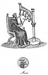

  
[Intangible Textual Heritage](../../../index.md) 
[Legends/Sagas](../../index)  [England](../index)  [Index](index.md) 
[Previous](spe17)  [Next](spe19.md) 

------------------------------------------------------------------------

p. 229

# BOOK IV

# DOMESTIC AMUSEMENTS OF VARIOUS KINDS; AND PASTIMES APPROPRIATED TO PARTICULAR SEASONS

### CHAPTER I

Secular Music fashionable--Ballad-singers encouraged by the
Populace--Music Houses--Introduction of the Harpsichord--Origin of
Vauxhall--Ranelagh--Sadler's Wells--Marybone
Gardens--Operas--Oratorios--Bell-ringing--Its
Antiquity--Hand-bells--Burlesque Music--Shovel-board--Billiards--French
Billiards--Trucks--Mississipi--The Rocks of
Scilly--Shove-groat--Swinging--Tetter-totter--Shuttlecock.

SECULAR MUSIC FASHIONABLE.--The national passion for secular music
admitted of little or no abatement by the disgrace and dispersion of the
minstrels. Professional musicians, both vocal and instrumental, were
afterwards retained at the court, and also in the mansions of the
nobility. In the sixteenth century, a knowledge of music was considered
as a genteel accomplishment for persons of high rank. Henry VIII. not
only sang well, but played upon several sorts of instruments; he also
wrote songs, and composed the tunes [1](#fn_770.md) for them; and his example was followed
by several of the nobility, his favourites.

\* During Elizabeth's long reign, music was not only fashionable, but
held in almost universal esteem. "Tinkers sang catches; milkmaids sang
ballads; carters whistled; each trade, and even the beggars, had their
special songs; the base-viol hung in the drawing-room for the amusement
of waiting visitors; and the lute, cittern, and virginals, for the
amusement of waiting customers, were the necessary furniture of the
barber's shop. They had music at dinner; music at supper; music at
weddings; music at funerals; music at night; music at dawn; music at
work; and music at play." [2](#fn_771.md) Dekker,
in the *Gull's Horn Book* of this reign, tells us that it was the
customary part of the education of a young gentlewoman "to read and
write; to play upon the virginals, lute, and cittern; and to read
prick-song at first sight."

An author, who lived in the reign of James I., says, "We have here,"
that is, in London, "the best musicians in the kingdom, and equal to any
in Europe for their skill, either in composing and setting of tunes, or
singing, and playing upon any kind of instruments. The musicians have
obtained of our sovereign lord the king, his letters patent to become a
society and corporation." [3](#fn_772.md) To which
we may add, that the metropolis never abounded more, if so much as at

p. 230

present, with excellent musicians, not such only as make a profession of
music, but with others who pursue it merely for their amusement; nor
must we omit the fair sex; with them the study of music is exceedingly
fashionable; and indeed there are few young ladies of family who are not
in some degree made acquainted with its rudiments. [1](#fn_773.md)

PUBLIC BALLAD-SINGERS.--The minstrel being deprived of all his honours,
and having lost the protection of the opulent, dwindled into a mere
singer of ballads, which sometimes he composed himself, and usually
accompanied his voice with the notes of a violin. The subjects of these
songs were chiefly taken from popular stories, calculated to attract the
notice of the vulgar, and among them the musical poets figured away at
wakes, fairs, and church-ales. The ballads multiplied with extraordinary
rapidity in the reigns of Elizabeth, James I., and Charles I. Warton
speaks of two celebrated trebles; the one called Outroaringe Dick; and
the other Wat Wimbas, who occasionally made twenty shillings a day by
ballad-singing; [2](#fn_774.md) which is a strong
proof that these itinerants were highly esteemed by the common people.

MUSIC HOUSES.--Towards the close of the seventeenth century, the
professed musicians assembled at certain houses in the metropolis,
called music houses, where they performed concerts, consisting of vocal
and instrumental music, for the entertainment of the public, at the same
period there were music booths at Smithfield during the continuance of
Bartholomew fair. An author of the time, [3](#fn_775.md) however, speaks very contemptibly of
these music meetings, professing that he "had rather have heard an old
barber ring Whittington's bells upon a cittern than all the music the
houses afforded."

INTRODUCTION OF THE HARPSICHORD.--An important event occurred in the
musical world of London on October 5th, 1664, namely, the introduction
of the harpsichord; it is recorded under that date by both Evelyn and
Pepys in their diaries. The graver Evelyn enters:--"To our Society.
There was brought a new-invented instrument of music, being a
harpsichord with gut-strings, sounding like a concert of viols with an
organ, made vocal by a wheel, and a zone of parchment that rubbed
horizontally against the strings." The more garrulous Pepys enters, on
the same evening: "To the musique-meeting at the Post-Office, where I
was once before. And thither anon came all the Gresham College, and a
great deal of noble company; and the new instrument was brought called
the Arched Viall, where, being tuned with lute strings, and played on
with keys like an organ, a piece of parchment is always kept moving; and
the strings, which by the keys are pressed down upon it, are grated in
imitation of a bow, by the parchment; and so it is intended to resemble
several vialls

p. 231

played on with one bow, but so harshly and so basely, that it will never
do. But, after three hours' stay, it could not be fixed in tune; and so
they were fain to go to some other musique of instrument."

\* Nor was Pepys any better pleased with the music he heard three years
later, on October 1st, 1667, at Whitehall. "To White Hall; and there in
the Boarded Gallery did hear the musick with which the King is presented
this night by Monsieur Grebus, the Master of his Musicke; both
instrumental--I think twenty-four violins--and vocall, an English song
upon Peace. But, God forgive me! I never was so little pleased with a
concert of music in my life. The manner of setting of words and
repeating them out of order, and that with a number of voices, makes me
sick, the whole design of vocall musick being lost by it. Here was great
press of people; but I did not see many pleased with it; only the
instrumental musick he had brought by practice to play very just."

The music clubs or private meetings for the practice of music, became
exceedingly fashionable with people of opulence. Hence, in *The Citizen
turned Gentleman*, a comedy by Edw. Ravenscroft, published in 1675, the
citizen is told that, in order to appear like a person of consequence,
it was necessary for him "to have a music club once a week at his
house." The music houses first mentioned were sometimes supported by
subscription; and from them originated three places of public
entertainment well known in the present day; namely, Vauxhall, Ranelagh,
and Sadler's Wells.

ORIGIN OF VAUXHALL.--Spring Gardens, now better known by the name of
Vauxhall Gardens, is mentioned in the *Antiquities of Surrey*, by
Aubrey, who informs us that Sir Samuel Moreland "built a fine room at
Vauxhall (in 1667), the inside all of looking-glass, and fountains very
pleasant to behold; which," adds he, "is much visited by strangers. It
stands in the middle of the garden, covered with Cornish slate, on the
point whereof he placed a punchinello, very well carved, which held a
dial; but the winds have demolished it." [1](#fn_776.md)

'The exact date at which the grounds were first opened to the public is
not known; but it is evident that the gardens were public before ever
Sir Samuel built his house there. Evelyn names the "New Spring Garden"
in 1661, as "a pretty contrived plantation"; whilst Pepys, under date
May 27th, 1667, enters:--"Went by water to Fox (*sic*) Hall, and there
walked in Spring Gardens; a great deal of company; the weather and
gardens pleasant, and cheap going thither; for a man may go to spend
what he will or nothing at all; all is one. But to hear the nightingale
and other birds, and here fiddles and there a harp, and here a Jew's
harp, and there laughing, and there fine people walking is very
diverting."

\* The house," says a more modern author, Sir John Hawkins, [2](#fn_777.md) "seems to have been rebuilt since the
time that Sir Samuel Moreland dwelt in it; and, there being a large
garden belonging to it, planted with a

p. 232

great number of stately trees, and laid out in shady walks, it obtained
the name of Spring Gardens; and, the house being converted into a
tavern, or place of entertainment, it was frequented by the votaries of
pleasure." This account is perfectly consonant with the following
passage in a paper of the *Spectator*, [1](#fn_778.md) dated May 20, 1712: "We now arrived at
Spring Gardens, which is exquisitely pleasant at this time of the year.
When I considered the fragrancy of the walks and bowers, with the choirs
of birds that sung upon the trees, and the loose tribe of people that
walked underneath their shades, I could not but look upon the place as a
kind of Mahometan paradise." In 1730 the house and gardens came into the
hands of a gentleman whose name was Jonathan Tyers, who opened it with
an advertisement of a *ridotto al fresco*; [2](#fn_779.md) a term which the people of this country
had till then been strangers to. These entertainments were several times
repeated in the course of the summer, and numbers resorted to partake of
them; which encouraged the proprietor to make his garden a place of
musical entertainment for every evening during the summer season: to
this end he was at great expense in decorating the gardens with
paintings; he engaged an excellent band of musicians, and issued season
silver tickets for admission at a guinea each; and receiving great
encouragement, he set up an organ in the orchestra; and in a conspicuous
part of the gardens erected a fine statue of Handel, the work of
Roubiliac, a very famous statuary, to whom we owe several of the best
monuments in Westminster Abbey.

In 1760 a guide to Vauxhall Gardens was issued, [3](#fn_780.md) dedicated to the Princess Augusta. They
are said to be "the first gardens of the kind in England." The season
was from the beginning of May till the end of August; they were opened
at five o'clock every evening, Sundays excepted. "In that part of the
grove which fronts the orchestra a considerable number of tables and
benches are placed for the company; and at a small distance from them,
fronting the orchestra, is a large pavilion, of the composite order,
which particularly attracts the eye by its size, beauty, and ornaments;
it was built for his late royal highness, Frederic Prince of Wales, who
frequently visited these gardens, and was peculiarly fond of them." The
grove is described "as illuminated with about fifteen hundred glass
lamps." The fifty pages of the booklet were chiefly taken up with
descriptions of Mr Hayman's paintings; but a price list of provisions is
appended. Burgundy and Fontiniac was 6s. a bottle; claret, 5s.;
champagne, or a quart of arrack, 8s.; old hock, with or without sugar,
5s.; "Rhenish and sugar," or mountain, 7s. 6d.; red port and sherry,
2s.; table beer, a quart mug, 4d.; two pound of ice, 6d.; a dish of ham
or beef, 1s.; and an orange or a lemon, 3d.

\* Mr Tyers, the proprietor, who had a beautiful house and grounds at
Dorking, died in 1767, and so great was the delight he took in this
place, that,

p. 233

possessing his faculties to the last, he caused himself to be carried
into Vauxhall Gardens a few hours before his death to take a last look
at them. The gardens were left equally between his four children. The
average number of the company used to be about one thousand; but on June
25th, 1781, when the Duke and Duchess of Cumberland supped there, after
an annual sailing match for a cup, eleven thousand were present. On July
10th, 1813, a great dinner was held here, in honour of the battle of
Vittoria, when the six royal dukes were present; ten, and even fifteen,
guineas were given for a dinner ticket. [1](#fn_781.md) In 1822 they were sold by the Tyers'
family to Messrs Bish, Gye, & Hughes for £28,000.

\* Fireworks were exhibited here as early as 1780. In 1802 the first
balloon ascent was made from the Gardens by Garnerin and two companions.
The fashion of the place began to decline in the reign of William IV.,
but the end did not come until 1855. [2](#fn_782.md)

RANELAGH.--The success of the Vauxhall Gardens was an encouragement to
another of a similar kind. A number of persons purchased the house and
gardens of the late Earl of Ranelagh; in 1740 they erected a spacious
building of timber, of a circular form, and within it an organ, and an
orchestra capable of holding a numerous band of performers. It was
opened by a public breakfast in 1742, and for a short time there were
morning concerts, but they were soon abandoned for those held in the
evening. The entertainment of the auditors during the performance is,
either walking round the room, or refreshing themselves with tea and
coffee in the recesses thereof, which are conveniently adapted for that
purpose. Sir John Hawkins [3](#fn_783.md) says,
"The performance here, as at Vauxhall, is instrumental, intermixed with
songs and ballad airs, calculated rather to please the vulgar than
gratify those of a better taste."

\* Besides the great Rotunda, which had a diameter of 185 feet, there
was a lake with a small Venetian pavilion on an island in the centre. An
advertisement of August 23d, 1749, states that the admission was one
shilling and that the music began at six o'clock; a postscript states
that "The Fire-Trees will be Lighted this Evening." The charge for
admission was raised on special occasions. On a firework night in 1764,
each person paid 2s. 6d., but coffee and tea were included. On June
18th, 1764, a charge was made of 5s.; this payment, however, included
not only coffee and tea, but choruses from Handel's "Acis and Galatea"
and "The Messiah," together with "a ball with which the whole
concludes." The place became specially celebrated for its masquerade
balls, the first of which was given on May 24th, 1759, "being the Birth
Day of his Royal Highness, George Prince of Wales." [4](#fn_784.md)

p. 234

\* Various curious particulars as to social England of the latter half
of the eighteenth century can be gleaned from the Ranelagh
advertisements at the time when it was the height of fashion to be
present. "There will be an armed Guard on Horseback to patrol the roads
till all the Company is gone" is a frequent feature of the
advertisements from 1760 to 1780. In the colder season "The Amphitheatre
and other Rooms are well aired, and particular Care will be taken to
have good Fires." "The Company that come by Hyde Park Corner are
requested to order their Carriages to keep the Turnpike Road by Pimlico,
to prevent the Accidents that must unavoidably happen by going down the
Descent of the new Road by the Fire Engine." "The Footway from
Buckingham Gate is lately mended and enlarged, so as to make it very
safe and easy for chairs." During these years the usual evening
admission to the music and fireworks, etc., was 2s. 6d., whilst 1s. was
charged to walk in the gardens during the daytime. By the year 1788 a
reaction set in, the attendance dropped from thousands to hundreds. A
daily paper of April 22nd of that year, stated that--"Ranelagh has been
voted a bore with the fashionable circles. The distance from town, the
total want of attendance and accommodation, the want of a respectable
band of vocal and instrumental music--with a variety of other wants too
numerous for description--render this once gay circle the dullest of all
dull public amusements." Grand firework nights, with 5s. tickets, and
masquerades with guinea tickets did something to restore its fading
fortunes as a fashionable resort. The guinea tickets included "an
elegant supper served at one o'clock, with champagne, burgundy, claret,
etc." The masquerade on April 30th, 1794, was under the patronage of the
Prince of Wales; from that date to the end of the century, special
nights were frequently under royal patronage. Shortly after the dawn of
the nineteenth century Ranelagh Gardens ceased to attract, and the
Rotunda and the whole of the premises were taken down in 1805.

SADLER'S WELLS.--We meet with what is said to be "a true account of
Sadler's Well," in a pamphlet published by a physician at the close of
the seventeenth century. "The water," says he, "of this well, before the
Reformation, was very much famed for several extraordinary cures
performed thereby, and was thereupon accounted sacred, and called
Holy-well. The priests, belonging to the priory of Clerkenwell using to
attend there, made the people believe that the virtues of the water
proceeded from the efficacy of their prayers; but at the Reformation the
well was stopped, upon the supposition that the frequenting of it was
altogether superstitious: and so by degrees it grew out of remembrance,
and was wholly lost until then found out; when a gentleman named Sadler,
who had lately built a new music-house there, and being surveyor of the
highways, had employed men to dig gravel in his garden, in the midst
whereof they found it stopped up and covered with an arch of
stone." [1](#fn_785.md)

\* In the summer of 1700 Sadler's Wells came into high repute. In 1733

p. 235

the Wells were so fashionable that the Princesses Amelia and Caroline
frequented the gardens almost daily during June.

After the decease of Sadler, one Francis Forcer, a musician and composer
of songs, became occupier of the wells and music-room; he was succeeded
by his son, who first exhibited there the diversion of rope-dancing and
tumbling, which were then performed abroad in the garden. [1](#fn_786.md) The place was taken afterwards by Mr
Rosoman, and the wooden house was replaced in 1765 by a brick building.
There is now (1800) a small theatre appropriated to feats of activity,
but also furnished with a stage, scenes, and other decorations proper
for the representation of dramatic pieces and pantomimes. The diversions
of this place are of various kinds, and form upon the whole a succession
of performances very similar to those displayed in former ages by the
gleemen, the minstrels, and the jugglers.

MARY-BONE GARDENS--ORATORIOS.--To the three preceding places of public
entertainment, we may add a fourth, not now indeed in existence, but
which about 1770 was held in some degree of estimation, and much
frequented; I mean Mary-bone Gardens; where, in addition to the music
and singing, there were burlettas and fire-works exhibited. The site of
these gardens is now covered with buildings.

\* This place of resort is named by the gay-hearted Pepys. He records
that the Lord Mayor and Aldermen dined there on July 318t, 1667. On May
7th, 1668, he enters in his diary:--"Then we abroad to Marrowbone, and
there walked in the garden; the first time I ever was there, and a
pretty place it is." These gardens were formed almost immediately after
the Restoration by throwing together a place of public resort called
'The Rose,' and an adjoining bowling-green; they were on the east side
of Marylebone Lane, and the site is partly covered by Manchester Square.
In the days of Pope this bowling-green was a place of most fashionable
resort. During the last phase of their existence, the Mary-bone Gardens
were turned into a regular place of musical and scenic entertainment.

There were also other places of smaller note where singing and music
were introduced, but none of them of any long continuance; for being
much frequented by idle and dissolute persons, they were put down by the
magistrates.

The success of these musical assemblies, I presume, first suggested the
idea of introducing operas upon the stage, which were contrived at once
to please the eye and delight the ear; and this double gratification,
generally speaking, was procured at the expense of reason and propriety.
Hence, also, we may trace the establishment of oratorios in England. I
need not say that this noble species of dramatic music was brought to
great perfection by Handel: the oratorios produced by him display in a
wonderful manner his powers as a composer of music; and they continue to
be received with that enthusiasm of applause which they most justly
deserve. Under this title, oratorios, are included several of his
seranatas, as "Acis and Galatea," "Alexander's Feast," etc.; but
generally speaking,

p. 236

the subjects of the oratorios are taken from the Scriptures, and
therefore they are permitted to be performed on the Wednesdays and
Fridays in Lent when plays are prohibited.

BELL-RINGING.--It has been remarked by foreigners that the English are
particularly fond of bell-ringing; [1](#fn_787.md)
and indeed most of our churches have a ring of bells in the steeple,
partly appropriated to that purpose. These bells are rung upon most
occasions of joy and festivity, and sometimes at funerals, when they are
muffled, and especially at the funerals of ringers, with a piece of
woollen cloth bound about the clapper, and the sounds then emitted by
them are exceedingly unmelodious, and well fitted to inspire the mind
with melancholy. Ringing of rounds; that is, sounding every bell in
succession, from the least to the greatest, and repeating the operation,
produces no variety; on the contrary, the reiteration of the same
cadences in a short time becomes tiresome: for which reason the ringing
of changes has been introduced, wherein the succession of the bells is
shifted continually, and by this means a varied combination of different
sounds, exceedingly pleasant to the ear, is readily produced. This
improvement in the art of ringing is thought to be peculiar to the
people of this country. [2](#fn_788.md)

\* Archbishop Egbert, in 750, ordered that "all priests, at the
appointed hours of day and night, do sound the bells of their churches,
and then celebrate the sacred offices to God, and instruct the people.
These bells (*signa*) were probably hand-bells formed of rivetted sheets
of metal, of which various early examples survive. But ere long bells
were swinging in church towers in this country. In the
beautifully-illuminated Benedictional of St Æthelwold, executed in the
tenth century, four bells are represented hung in a lofty open
campanile.

\* Bells were cast for Abingdon and Canterbury in the tenth century; and
we also know there were bells in the towers of the cathedral churches of
Exeter and Winchester, and of the minsters of Beverley and Southwell,
and doubtless in many other churches prior to the Norman conquest.

\* It is supposed that change ringing originated in England and was not
practised after any regular fashion until the sixteenth century. The
earliest definite promoter of change ringing is said to have been one
Fabian Steadman, who was born at Cambridge in 1631. He was a printer by
trade, and introduced various peals of five and six bells, printing the
numbers on slips of paper. The Society of College Youths, the oldest
association of ringers, founded in the sixteenth century, visited
Cambridge in 1657, when he presented them with his new and elaborate
principle that has ever since been known by his name. [3](#fn_789.md)

\* "The School of Recreation, or the Gentleman's Tutor," first issued in
1684, gives instructions in twelve "most ingenious exercises." One of
these is Ringing. The following is the opening paragraph of the
forty-five pages that he (the author) devotes to this subject:--"Since
the Recreation of Ringing is become so highly esteemed, for its
excellent Harmony of Musick it affords the ear, for its Mathematical
Invention delighting the Mind, and for the Violence of its

 

[  
Click to enlarge](img/pl32.jpg.md)  
Music  

 

p. 237

\[paragraph continues\] Exercise bringing Health to the Body, causing it
to transpire plentifully, and by Sweats dissipate and expel those
Fuliginous thick Vapours, which Idleness, Effeminacy, and Delicacy
subject men to; I say for these and sundry other Reasons, I was induced
to bring this of Ringing into the Company of Exercises in this Treatise,
that I might as well recreate you with some health-conducing Pleasure at
home, as I have carried you abroad, and there endeavoured to please you
in what Pastime your Inclinations may most peculiarly select."

\* The author (R. D.) urges his reader to become "enrolled amongst that
Honoured Society of Colledge Youths," and "not to let thy frequent
coming to the Bell-fire on Week-days for thy Diversion, make thee absent
thyself on Sundays from thy Devotion."

HAND-BELLS.--These, which probably first appeared in the religious
pro-cessions, were afterwards used by the secular musicians, and
practised for the sake of pastime. The joculator dancing before the
fictitious goat, depicted by the engraving No. 85, has two large
hand-bells, and nearly of a size; but in general, they are regularly
diminished, from the largest to the least; and ten or twelve of them,
rung in rounds or changes by a company of ringers, sometimes one to each
bell, but more usually every ringer has two. I have seen a man in
London, who I believe is. now (1800) living, ring twelve bells at one
time; two of them were placed upon his head, he held two in each hand,
one was affixed to each of his knees, and two upon each foot; all of
which he managed with great adroitness, and performed a vast variety of
tunes.

The small bells were not always held in the hand; they were sometimes
suspended upon a stand, and struck with hammers, by which means one
person could more readily play upon them. An example of this kind, of
the fourteenth century, is given on [plate thirty-two](#img_pl32.md). [1](#fn_790.md)

The figure in the original is designed as a representation of King
David, and affixed to one of his psalms.

\* An earlier instance of five small bells as thus suspended in frame
and struck by a single hammer held in one hand occurs in a MS. of the
ninth century. [2](#fn_791.md)

BURLESQUE MUSIC.--The minstrels and joculators seem to have had the
knack of converting every kind of amusement into a vehicle for
merriment, and among others, that of music has not escaped them. At the
bottom of we see one of these drolls holding a pair of bellows by way of
a fiddle, and using the tongs as a substitute for the bow.

This, and such like vagaries, were frequently practised in the
succeeding times; and they are neatly ridiculed in one of the papers
belonging to the *Spectator*, [3](#fn_792.md)
where the author mentions "a tavern keeper who amused his company with
whistling of different tunes, which he performed by applying the edge of
a case knife to his lips. Upon laying down the knife he took up a pair
of

p. 238

clean tobacco pipes, and after having slid the small ends of them over a
table in a most melodious trill, he fetched a tune out of them,
whistling to them at the same time in concert. In short the tobacco
pipes became musical pipes in the hands of our virtuoso, who," says the
writer, "confessed ingenuously that he broke such quantities of pipes
that he almost broke himself, before he brought this piece of music to
any tolerable perfection." [1](#fn_793.md) This
man also "played upon the frying-pan and gridiron, and declared he had
layed down the tongs and key because it was unfashionable." I have heard
an accompaniment to the violin exceedingly well performed with a
rolling-pin and a salt-box, by a celebrated publican named Price, who
kept the Green Man, formerly well known by the appellation of the
Farthing Pye House, at the top of Portland Row, St. Marylebone. I have
also seen a fellow who used to frequent most of the public houses in and
about the town, blow up his cheeks with his breath, and beat a tune upon
them with his fists, which feat he seemed to perform with great
facility. The butchers have a sort of rough music, made with
marrow-bones and cleavers, which they usually bring forward at weddings;
and in the *Knave in Grain*, a play first acted in 1640, [2](#fn_794.md) ringing of basons is mentioned. This
music, or something like it, I believe, is represented at the bottom of
the twenty-third plate.

SHOVEL-BOARD.--Among the domestic pastimes, playing at shovel-board
claims a principal place. In former times the residences of the
nobility, or the mansions of the opulent, were not thought to be
complete without a shovel-board table; and this fashionable piece of
furniture was usually stationed in the great hall. [3](#fn_795.md) The tables for this diversion were
sometimes very expensive, owing to the great pains and labour bestowed
upon their construction. "It is remarkable," says Dr Plott, in his
History of Staffordshire, "that in the hall at Chartley the
shuffle-board table, though ten yards one foot and an inch long, is made
up of about two hundred and sixty pieces, which are generally about
eighteen inches long, some few only excepted, that are scarce a foot,
which, being laid on longer boards for support underneath, are so
accurately joined and glewed together, that no shuffle-board whatever is
freer from rubbs or casting.--There is a joynt also in the shuffle-board
at Madeley Manor exquisitely well done."

The length of these tables, if they be perfectly smooth and level, adds
to their value in proportion to its increase; but they rarely exceed
three feet or three feet and a half in width. At one end of the
shovel-board there is a line drawn across parallel with the edge, and
about three or four inches from it; at four feet distance from this line
another is made, over which it is necessary for the weight to pass when
it is thrown by the player, otherwise the go is not reckoned. The
players stand at the end of the table, opposite to the two marks above
mentioned, each of them having four flat weights of metal, which they
shove from them one at a time alternately: and the judgment of the play
is, to

p. 239

give sufficient impetus to the weight to carry it beyond the mark
nearest to the edge of the board, which requires great nicety, for if it
be too strongly impelled, so as to fall from the table, and there is
nothing to prevent it, into a trough placed underneath for its
reception, the throw is not counted; if it hangs over the edge, without
falling, three are reckoned towards the player's game; if it lie between
the line and the edge without hanging over, it tells for two; if on the
line, and not up to it, but over the first line, it counts for one. The
game, when two play, is generally eleven; but the number is extended
when four or more are jointly concerned. I have seen a
shovel-board-table at a low public-house in Benjamin Street, near
Clerkenwell Green, which is about three feet in breadth and thirty-nine
feet two inches in length, and said to be the longest at this time in
London.

\* There was no known pastime in which Henry VIII. did not indulge. The
privy purse expenses of 1532 show that in January Lord William won £9 of
the King at "shovilla bourde," and "My lord of Rocheforde won of the
King at shovilla bourde and betting at the game £45." In the following
month Lord Rocheford won £41, 12s. 6d. of the King at the same
pastime. [1](#fn_796.md) It must be remembered
that these accounts take no notice of the royal wins, only of the
losses.

\* Shovel-board is now chiefly confined to the decks of passenger
vessels, where it is often much used to relieve the tedium of long
voyages.

BILLIARDS.--This pastime, which in the present day has superseded the
game of shovel-board, and is certainly a more elegant species of
amusement, admits of more variety, and requires at least an equal degree
of skill in the execution. The modern manner of playing at billiards,
and the rules by which the pastime is regulated, are so generally known,
that no enlargement upon the subject is necessary. I cannot help
thinking it originated from an ancient game played with small bowls upon
the ground; or indeed that it was, when first instituted, the same game
transferred from the ground to the table. [2](#fn_797.md)

\* The word Billiards is derived from the old French word *billard*, a
stick with a curved end, hence a billiard mace or cue. The earliest
references given in the Oxford Dictionary are from Spenser's *Mother
Hubbard*, 1591, "With all the thriftless games that may be found . . .
with dice, with cards, with balliards"; and from Florio's *Trucco*, "a
kinde of play with balles upon a table called billiards." Shakespeare,
in *Anthony and Cleopatra*, has, "Let it alone, let's to billiards."
Cotsgrave, in 1611, defines Billiard, as "a short and thicke trunchion
or cudgell: hence the sticke wherewith we touch the ball at billyards."

\* It is probably a game of English and not French origin as was at one
time maintained; but nothing is really known of it in this country until
the end of the sixteenth century. The first printed account of the game
in English hitherto noted is that given by Charles Cotton in *The
Compleat Gamester*, first published in 1674, where it is said that, "The
gentile, cleanly, and most

p. 240

ingenious game at Billiards had its first original from Italy, and for
the excellency of the recreation is much approved of and plaid by most
nations in Europe, especially in England, there being few towns of note
therein which hath not a publick billiard table, neither are they
wanting in many noble and private families in the country for the
recreation of the mind and exercise of the body." Cotton describes the
form of the billiard table as oblong, and it had six pockets after the
fashion of the present table. [1](#fn_798.md) The
bed of the table was made of oak, covered with fine green cloth, and the
cushions were stuffed with "fine flox or cotton." Maces, then called
masts, were used, made of lignum vitae or some other heavy wood and
tipped with ivory. The balls were usually ivory, but occasionally wood.
The peculiarity of the game of those days, as shown in Cotton's cut,
consisted in the use of a small arch of ivory called the *port*, which
was placed where the pyramid spot now stands, and of an ivory tapering
peg or king placed on a corresponding spot at the other end of the
table. There were only two balls used, and the game is five by daylight
or seven if odds be given, and three by candle-light or more, according
to odds in houses that make a livelihood thereof." The first contest was
who should first pass the port, "and herein much pains is taken, and all
the art and cunning possible used to do it." The king had to be "touched
finely and gently without throwing it down. Breaking the king was
subject to a fine of 1s., for the stick 5s., and for the port 10s. Some
of the instructions to players given in *The School of Recreation*,
1684, are sufficiently quaint, as may be instanced by citing number
five:--

"Be careful that you lay not your hand on the Table when you strike nor
let your sleeve drag upon it, if you do it is a loss; or if you smoke a
pipe of Spanish or Virginia, being so wedded to that Fume, that were you
sure to smother all the rest of the Company you are insensible of the
Indecency, be careful that the ashes fall not on the Table, lest the
cloth be burnt which many times falls out: In these two cases, let the
mulcts and forfeitures of both, but especially the hinderance the last
gives a man in the skilfull managing his game, deter you from the
lolling slovenly posture of the first, and the stinking indecency of the
latter; because this Pastime being of a neat and cleanly composition,
will not admit any such Irregularities and Indecorums, without an
absolute Violation of its Laws and a Punishment attending such
unhandsome offences."

\* Cotton's *Compleat Gamester* was reprinted in 1676, 1680, 1709, 1721,
and 1725. In all these editions, the original account of billiards was
simply reproduced *verbatim*.

\* FRENCH BILLIARDS.--In the seventh edition of this work, which was
issued in 1734, "French Billiards" is described, "so called from their
manner of

p. 241

playing the game, which is now only with masts and balls, port and king
being now wholly laid aside." The rules show that cues were then
permitted; but for many years after this date, only known good players
were allowed to use the cue on public tables, the proprietors being
alarmed at the risk of damage to the cloth. By the beginning of the
nineteenth century cues had come into general use by all good players.
The leather tip to the cue, which worked a revolution in play, was
invented in 1807, by a French professional player named Mingaud. [1](#fn_799.md)

\* TRUCKS.--*The Compleat Gamester*, of 1674, gives several pages to an
account of a game called Trucks. It is described as an Italian game,
much used in Spain and Ireland, and not very unlike billiards, "but more
boisterous and less gentill." Tables were rarely met with in England,
but one was at Tower Hill, though bunglingly composed and irregularly
formed. A truck table was at least three feet longer than a billiard
table; it had three holes at each end besides the corner holes, and ten
holes at each side. The *argolio* was a strong hoop of iron fixed to the
table in the place where the *port* stood at billiards. The *sprigg* was
another piece of iron, driven into the board at the spot where the
*king* stood at billiards. The balls were ivory of the size of tennis
balls, "The tacks with which they play are much bigger than billiard
sticks, and are headed at each end with iron; the small end is round
from the middle, or farther running taperwise, but the great end is flat
beneath, though rounding atop; good gamesters play for the most part
with the small end." This description of Trucks was repeated in the
editions of 1676, 1680, and 1710, but not in the later issues of the
eighteenth century.

MISSISSIPI.--Mississipi is played upon a table made in the form of a
parallelogram. It much resembles a modern billiard-table, excepting
that, instead of pockets, it has a recess at one end, into which the
balls may fall; and this recess is faced with a thin board equal in
height to the ledge that surrounds the table; and in it are fifteen
perforations, or small arches, every one of them surmounted by a number
from one to fifteen inclusive, the highest being placed in the middle,
and the others intermixed on either side. The players have four or six
balls at pleasure. These balls, which are usually made of ivory, and
distinguished from each other by their colour, some being red and some
white, they cast alternately, one at a time, against the sides of the
table, whence acquiring an angular direction, and rolling to the arches,
they strike against the intervening parts, or pass by them. In the first
instance the cast is of no use; in the second the value of the number
affixed to the arches through which they run is placed to the score of
the player; and he who first attains one hundred and twenty wins the
game. This pastime is included in the statute above mentioned relating
to billiards, and the same penalty is imposed upon the publican who
keeps a table in his house for the purpose of playing.

p. 242

THE ROCKS OF SCILLY.--This diversion requires a table oblong in its
form, and curved at the top, which is more elevated than the bottom.
There is a hollow trunk affixed to one side, which runs nearly the whole
length of the table, and is open at both ends: The balls are put in
singly at the bottom, and driven through it by the means of a round
batoon of wood. When a ball quits the trunk it is impelled by its own
gravity towards the lower part of the table, where there are arches
similar to those upon the mississipi-table, and numbered in like manner;
but it is frequently interrupted in its descent by wires inserted at
different distances upon the table, which alter its direction, and often
throw it entirely out of the proper track. The game is reckoned in the
same manner as at mississipi, and the cast is void if the ball does not
enter any of the holes.

SHOVE-GROAT, ETC.--Shove-groat, named also Slyp-groat, and Slide-thrift,
are sports occasionally mentioned by the writers of the sixteenth and
seventeenth centuries, and probably were analogous to the modern pastime
called Justice Jervis, or Jarvis, which is confined to common
pot-houses, and only practised by such as frequent the tap-rooms. [1](#fn_800.md) It requires a parallelogram to be made
by chalk, or by lines cut upon the middle of a table, about twelve or
fourteen inches in breadth, and three or four feet in length: which is
divided, latitudinally, into nine equal partitions, in every one of
which is placed a figure, in regular succession from one to nine. Each
of the players provides himself with a smooth halfpenny, which he places
upon the edge of the table, and striking it with the palm of his hand,
drives it towards the marks; and according to the value of the figure
affixed to the partition wherein the halfpenny rests, his game is
reckoned; which generally is stated at thirty-one, and must be made
precisely: if it be exceeded, the player goes again for nine, which must
also be brought exactly, or the turn is forfeited; and if the halfpenny
rests upon any of the marks that separate the partitions, or overpasses
the external boundaries, the go is void. It is also to be observed, that
the players toss up to determine who shall go first, which is certainly
a great advantage. Some add a tenth partition, with the number ten, to
the marks above mentioned; and then they play with four halfpence, which
are considered as equivalent to so many cards at cribbage; and the game
is counted, in like manner, by fifteens, sequences, pairs, and pairials,
according to the numbers appertaining to the partitions occupied by the
halfpence.

\* This game is nearly akin to shovel-board. It will be remembered that
Shakespeare's Falstaff says--

"Quoit him down, Baudolph, like a shove-groat shilling."

SWINGING is a childish sport, in which the performer is seated upon the
middle of a long rope, fastened at both ends, a little distance from
each other, and the higher above his head the better. The rope we call
the Swing, but

p. 243

formerly it was known by the name of Meritot, or Merry-trotter. [1](#fn_801.md) This simple pastime was not confined to
the children, at least in the last century, but practised by grown
persons of both sexes, and especially by the rustics. Hence Gay:

On two near elms the slacken’d cord I hung,  
Now high, now low, my Blouzalinda swung.

\[paragraph continues\] It was also adopted at the watering-places by
people of fashion, and the innovation is justly ridiculed in the
*Spectator*. [2](#fn_802.md)

Of late years a machine has been introduced to answer the purpose of the
swing, [3](#fn_803.md) It consists of an axletree,
with four or six double arms inserted into it, like the spokes of a
large water-wheel; every pair of arms is connected at the extremities by
a round rod of iron, of considerable thickness, and upon it a box is
suspended, resembling the body of a post-chaise, which turns about and
passes readily between the two spokes, in such a manner as to continue
upright whatever may be the position of its supporters. These carriages
usually contain two or three persons each, and being filled with
passengers, if I may be allowed the term, the machine is put into
action, when they are successively elevated and depressed by the
rotatory motion. This ridiculous method of riding was in vogue for the
space of two summers, and was exhibited at several places in the
neighbourhood of London; and the places where the machines were erected
frequented by persons of both sexes, and by some whose situation in
life, one might have thought, would have prevented their appearance in
such a mixed, and generally speaking, vulgar company; but the charms of
novelty may be pleaded in excuse for many inadvertencies.

TITTER-TOTTER.--To the foregoing we may add another pastime well known
with us by the younger part of the community, and called Titter-totter.
It consists in simply laying one piece of timber across another, so as
to be equipoised; and either end being occupied by a boy or a girl, they
raise or depress themselves in turn. This sport was sometimes played by
the rustic lads and lasses, as we find from Gay:

Across the fallen oak the plank I laid,  
And myself pois’d against the tott’ring maid;  
High leap’d the plank, adown Buxoma fell, etc.

\* This children's sport is now almost universally known as See-Saw; but
the name "Tittermetotter" lingers in Norfolk.

SHUTTLE-COCK is a boyish sport of long standing. It is represented on
the thirty-seventh plate, the original of which occurs in Mr Douce's MS.
of the fourteenth century.

p. 244

"Shuttlecocks" are named by Spenser in *Mother Hubbard*.

It appears to have been a fashionable pastime among grown persons in the
reign of James I. In the *Two Maids of Moreclacke*, a comedy printed in
1609, it is said, "To play at shuttle-cock methinks is the game now."
And among the anecdotes related of Prince Henry, son to James I., is the
following: "His highness playing at shittle-cocke, with one farr taller
than himself, and hittyng him by chance with the shittle-cocke upon the
forehead, 'This is,' quoth he, 'the encounter of David with
Goliath.'" [1](#fn_804.md)

------------------------------------------------------------------------

### Footnotes

[229:1](spe18.htm#fr_771.md) Hall, in the life of
that monarch.

[229:2](spe18.htm#fr_772.md) Chappell's *Popular
Music of the Olden Time*, i. 98.

[229:3](spe18.htm#fr_773.md) A.D. 1604, in the
second year of the reign of James I. Treatise on College and Schools in
and about London, printed 1615.

[230:1](spe18.htm#fr_774.md) Some time ago the
spinnet was a favourite instrument among the ladies; afterwards the
guitar; and now (1800) the harpsichord, or forte-piano.

[230:2](spe18.htm#fr_775.md) At Braintree fair in
Essex. *Hist. Eng. Poet.* vol. iii. p. 292. This was a century and a
half back, when twenty shillings was a considerable sum. The ancient
ballads have frequently this colophon: "Printed by A.B. and are to be
sold at the stalls of the ballad-singers." But an ordinance published by
Oliver Cromwell against the strolling fiddlers, silenced the
ballad-singers, and obliged the sellers to shut up shop. Hawkins, Hist.
Music, vol. iv. p. 113.

[230:3](spe18.htm#fr_776.md) Edward Ward, author
of the *London Spy*, part xi. p. 255.

[231:1](spe18.htm#fr_777.md) Vol. i. p. 12.

[231:2](spe18.htm#fr_778.md) *Hist. Music*, vol.
v. p. 352 (1776).

[232:1](spe18.htm#fr_779.md) Vol. v. No. 383.

[232:2](spe18.htm#fr_780.md) Or entertainment of
music in the open air.

[232:3](spe18.htm#fr_781.md) *A Description of
Vauxhall Gardens, being a proper companion and guide for all who visit
that place. Illustrated with copper plates*. G. Hooper, 1762.

[233:1](spe18.htm#fr_782.md) *A Brief Account of
the Royal Gardens, Vauxhall*. Published by the Proprietors, 1822.

[233:2](spe18.htm#fr_783.md) The best account of
Vauxhall and its array of distinguished visitors is in Walford's edition
of Thornbury's *Old and New London*, vol. vi. pp. 447-467.

[233:3](spe18.htm#fr_784.md) *Hist. of Music*,
vol. v. pp. 352.3.

[233:4](spe18.htm#fr_785.md) A large coloured
print of this ball was issued by Robert Sayn, Fleet Street. There is a
copy of it in a collection of Ranelagh views, advertisements, etc., in
the British Museum, 840, m., 28.

[234:1](spe18.htm#fr_786.md) A.D. 1683.

[235:1](spe18.htm#fr_787.md) There is no footnote
1 at this point, even though there is a reference to it in the body of
the text--JBH.

[236:1](spe18.htm#fr_788.md) See the Introduction.

[236:2](spe18.htm#fr_789.md) Hawkins' *Hist. of
Music*, vol. iv. p. 211.

[236:3](spe18.htm#fr_790.md) Gatty's *The Bell*
(1848) 58-9.

[237:1](spe18.htm#fr_791.md) Roy. Lib. 20. B. xi.

[237:2](spe18.htm#fr_792.md) Figured on p. 4 of
North's *English Bells and Bell Lore* (1888).

[237:3](spe18.htm#fr_793.md) Vol. v. No. 570.

[238:1](spe18.htm#fr_794.md) Vol. v. No. 570.

[238:2](spe18.htm#fr_795.md) Garrick's *Col. Old
Plays*, G. vol. ii.

[238:3](spe18.htm#fr_796.md) See the Introduction.

[239:1](spe18.htm#fr_797.md) Add MSS. 20,030.

[239:2](spe18.htm#fr_798.md) See the
representation of ground billiards on the [thirty-second
plate](#img_pl32.md).

[240:1](spe18.htm#fr_799.md) \* In Strutt's short
account of this game, which we have omitted, the strange mistake is made
of saying that, at the beginning of the eighteenth century, the table
was square with only three pockets all on one side. This blunder arose
from misunderstanding a small illustration on the frontispiece of *The
School of Recreation*, first published in 1684, and which is a poor
reduced copy of the wood-cut in Cotton's book.

[241:1](spe18.htm#fr_800.md) \* Bennett's
*Billiards* (4th edit.). p. 9.

[242:1](spe18.htm#fr_801) \* Now (1902.md) better
known and occasionally practised as "shove-halfpenny."

[243:1](spe18.htm#fr_802.md) The first occurs in
Chaucer; the second in the vocabulary called *Orbis Sensualium Pictus*,
as translated by Hoole, chap. cxxxvi. In Latin it is called *Oscillum*,
and is described by an old author as a sort of game played with a rope
depending from a beam, in which a boy or girl being seated, is driven
backwards and forwards. Speght's *Glossary to Chaucer*.

[243:2](spe18.htm#fr_803.md) Vol. viii. No. 496;
and again No. 492 in the same volume.

[243:3](spe18.htm#fr_804.md) \* A picture of one
is given in a chap-book of a fair, printed in 1778, where it is called
an "Up and Down."

[244:1](spe18.htm#fr_805.md) Harl. MS. 6391.

------------------------------------------------------------------------

[Next: Chapter II](spe19.md)
