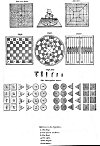
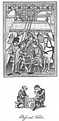
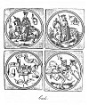

  
[Intangible Textual Heritage](../../../index) 
[Legends/Sagas](../../index)  [England](../index)  [Index](index) 
[Previous](spe18)  [Next](spe20) 

------------------------------------------------------------------------

p. 245

### CHAPTER II

Sedentary Games--Dice-playing--Its Prevalency and bad Effects--Ancient
Dice-box--Dicing Games without Tables--Dicing Games within
Tables--Backgammon--Its former and present Estimation--Chess--Its
Antiquity--The Morals of Chess--Early Chess-play in France and
England--The Chess-Board--The Pieces and their Form--The various Games
of Chess--Ancient Games similar to Chess--The Philosopher's
Game--Draughts, French and Polish--Merelles, or Nine Men's
Morris--Boy-Games in Cloisters--Fox and Geese--The Solitary
Game--Dominoes--Cards--When Invented--Card-playing in England--Primero
and Maw--Ombre--Whist and other Games--Ancient Cards--The Game of
Goose--and of the Snake--Cross and Pile.

SEDENTARY GAMES.--This chapter is appropriated to sedentary games, and
in treating upon most of them I am under the necessity of confining
myself to very narrow limits. To attempt a minute investigation of their
properties, to explain the different manners in which they have been
played, or to produce all the regulations by which they have been
governed, is absolutely incompatible with my present design. Instead,
therefore, of following the various writers upon these subjects, whose
opinions are rarely in unison, through the multiplicity of their
arguments, I shall content myself by selecting such of them as appear to
be most cogent, and be exceedingly brief in my own observations.

DICE-PLAY--ITS PREVALENCY AND BAD EFFECTS.--There is not, I believe, any
species of amusement more ancient than dice-playing; none has been more
universally prevalent, and, generally speaking, none is more pernicious
in its con-sequences. It is the earliest, or at least one of. the most
early pastimes in use among the Grecians. Dice are said to have been
invented, together with chess, by Palamedes, the son of Nauplius, King
of Eubœa. Others, agreeing to the time of the invention of dice,
attribute it to a Greek soldier named Alea, and therefore say that the
game was so denominated. But Herodotus attributes both dice and chess to
the Lydians, a people of Asia; in which part of the world, it is most
probable, they originated at some very remote but uncertain period. We
have already seen that the ancient Germans, even in their state of
barbarism, indulged the propensity for gambling with the dice to a
degree of madness, not only staking all they were worth, but even their
liberty, upon the chance of a throw, and submitted to slavery if fortune
declared against them. The Saxons, the Danes, and the Normans, their
descendants, were all of them greatly addicted to the same infatuating
pastime. One would not, at first sight, imagine that the dice could
afford any great variety of amusement, especially if they be
abstractedly considered; and yet John of Salisbury, in the twelfth
century, speaks of ten different games of dice then in use; but as he
has only given us the names, their properties cannot be investigated. He
calls it, [1](#fn_805) "The damnable

p. 246

art of dice-playing." Another author, contemporary with him, says, "The
clergymen and bishops are fond of dice-playing." [1](#fn_806)

\* It was customary to use a Dice-board in some forms of dice throwing.
The board was divided by diagonal lines into ten spaces, and the value
of the cast depended not only upon the upper markings of the dice, but
upon the particular space into which they fell. One of these Dice-boards
is figured on the top of a most beautifully inlaid Elizabethan games
table, which was made for Bess of Hardwick, and is still to be seen at
Hardwick Hall. It measures 15 inches by 19½. Upon the board, in one of
the divisions, are the representations of three dice. On the same table,
which is 10 feet in length, there are also inlaid representations of
full-sized chess and backgammon boards. [2](#fn_807)

ANCIENT DICE-BOX--ANECDOTE RELATING TO FALSE DICE.--The common method of
throwing the dice is with a hollow cylinder of wood, called the
dice-box, into which they are put, and thence, being first shaken
together, thrown out upon the table; but in one of the prints which
occur in the *Vocabulary of Commenius*, [3](#fn_808) we meet with a contrivance for playing
with the dice that does not require them to be numbered upon their
faces. This curious machine [4](#fn_809)
appears on plate thirty-three.

The dice are thrown into the receptacle at the top, whence they fall
upon the circular part of the table below, which is divided into six
compartments, numbered as the dice usually are; and according to the
value of the figures affixed to the compartments into which they fall
the throw is estimated. The inner part of the circle, with the apparatus
above it, was so constructed as to move round with great rapidity when
the dice were put into the funnel. [5](#fn_810)
It would thus be analogous to the E O tables of the present day, wherein
a ball is used, and the game is determined by the letters E or O being
marked upon the compartment into which it falls. The E O tables may have
derived their origin from the above contrivance.

Dice-playing has been reprobated by the grave and judicious authors of
this country for many centuries back; the legislature set its face
against it at a very early period; [6](#fn_811)
and in various statutes promulgated for the suppression of unlawful
games, from Richard II. to Elizabeth, it is constantly particularised
and strictly prohibited.

\* In Northbrooke's treatise against dicing, etc., published in 1579,
the most unrestrained language is used against dicing, of which the
following sentence is but a brief specimen:--"This arte is the mother of
lies, of perjuries, of theft, of debate, of injuries, of manslaughter,
the verie invention of the Divels of hell." It must, however, be
remembered that this strenuous condemnation was directed

 

[  
Click to enlarge](img/pl33.jpg)  
Sedentary Games  

 

p. 247

against mere dice-throwing, and not against "tables," by which was
implied such a game as backgammon, wherein the dice were thrown within a
limited space to direct certain moves. "Playing at tables," says
Northbrooke, "is far more tollerable (although in all respects not
allowable) than Dice and Cardes are, for that it leaneth partlie to
chance, and partlie to industrie of the minde."

Supposing the play to be fair on either side, the chances upon the dice
are equal to both parties; and the professed gamblers being well aware
of this, will not trust to the determination of fortune, but have
recourse to many nefarious arts to circumvent the unwary; hence we hear
of loaded dice, and dice of the high cut. The former are dice made
heavier on one side than the other by the insertion of a small portion
of lead; and the latter may be known by the following anecdote in an
anonymous MS. written about the reign of James I., and preserved in the
Harleian Collection. [1](#fn_812) "Sir William
Herbert, playing at dice with another gentleman, there rose some
questions about a cast. Sir William's antagonist declared it was a four
and a five; he as positively insisted that it was a five and a six; the
other then swore, with a bitter imprecation, [2](#fn_813) that it was as he had said: Sir William
then replied, 'Thou art a perjured knave; for give me a sixpence, and if
there be a four upon the dice, I will return you a thousand pounds'; at
which the other was presently abashed, for indeed the dice were false,
and of a high cut, without a four." The dice are usually made of bone or
ivory, but sometimes of silver, and probably of other metals. The wife
of the unfortunate Arden of Feversham, sent to Mosbie, her paramour, a
pair of silver dice, in order to reconcile a disagreement that had
subsisted between them, and occasioned his abstaining from her
company. [3](#fn_814)

\* DICING GAMES WITHOUT "TABLES."--Under the general head of Dicing used
to be included two distinct sets of games that were termed "games within
the tables" and "games without the tables." The latter were of a purely
gambling character; in the *Compleat Gamester*, of 1674, three games of
this nature are described. *Inn and Inn* is named as very much used in
an ordinary, and could be played by two or three, each having a box in
his hand. It was played with four dice, the players depositing
sixpences, shillings, or guineas. For an Inn throw nothing was scored,
for an Out throw the adversary or adversaries won; for an Inn and Inn
throw all was swept by the thrower. An Inn throw was doublets of any
sort; an Out throw had no doublets; an Inn and Inn was all doublets,
whether of a sort or otherwise. The battle point was fixed beforehand,
from twenty shillings to twenty pounds, or on to a thousand; "the
battail is not ended till every penny of that money agreed upon for the
battail be won."

\* PASSAGE was played by two with three dice. The caster threw
continually

p. 248

\* HAZARD was played with two dice, but as many could play it as could
stand round the largest round table. Cotton dilates on "main," "chance,"
"nick," "ames-ace," "deuce-ace," and the like, describing it as "the
most bewitching game that is plaid on the dice"; nevertheless he
somewhat illogically thus ends his long explanation:--"To conclude,
happy is he that having been much inclined to this time-spending,
money-wasting Game, hath took up in time, and resolved for the future
never to be concerned with it more; but more happy is he that hath never
heard the name thereof."

\* DICING GAMES WITHIN TABLES.--Of "Games within the Tables" Cotton
names seven, of which backgammon is the most important, and has proved
the most enduring. *Irish* is described as an ingenious game requiring
much skill, and not to be learned without much observation and practice.
From the description given it seems to have been much like backgammon,
save that it was slower, inasmuch as doublets were not reckoned
fourfold. In *Tick-tack* all the men stood on the ace-point, and from
thence played forward. If you hit your adversary and neglected the
advantage you lost a man. At *Doublets* fifteen men were used. At
*Site-ace* five could play with six men a piece. At *Ketch-dolt* the men
were laid down according to the throw from the heap of men without the
tables.

\* BACKGAMMON.--In Howell's *Letters*, *circa* 1645, occur these words,
cited in the Oxford Dictionary:--"Though you have learnt to play at
Baggammon, you must not forget Irish, which is a more serious and solid
game." Tables was the term always employed for these dice games of mixed
chance and skill, until the seventeenth century, when the word
backgammon came gradually into general use. The name is apparently
derived from back-game or back-play, because the men, under certain
circumstances, are hit or taken up and obliged to go back and re-enter
the table.

The ancient form of the backgammon-table may be seen at the bottom of
[plate thirty-four](#img_pl34); the original occurs in a beautifully
illuminated manuscript of the fourteenth century. [1](#fn_815) The table, as here delineated, is not
divided in the middle, but the points, on either side, are contained in
a single compartment. If we turn to the [thirty-third plate](#img_pl33)
we shall find a table of fifteenth century date. In this the division is
fairly made, but the points are not distinguished by different colours,
according to the present, and indeed more ancient usage. The writer of
the manuscript, from which the latter table is taken, says, "There are
many methods of playing at the tables with the dice. The first of these,
and the longest, is called the English game, Ludus Anglicorum, which is
thus performed: he who sits on the side of the board marked 1--12 has
fifteen men (homines) in the part marked 24, and he who sits on the side
marked 13--24

p. 249

has a like number of men in the part 1. They play with three dice, or
else with two, allowing always six for a third die. Then he who is
seated at 1--12 must bring all his men placed at 24 through the
partitions (paginas), from 24 to 19, from 18 to 13, and from 12 to 7,
into the division 6--1, and then bear them off; his opponent must do the
same from 1 to 7, thence to 12, thence to 18, into the compartment
19--24; and he who first bears off all his men is conqueror." Here we
may observe, that the most material circumstances in which the game
differed, at this remote period, from the present method of playing it,
are, first, in having three dice instead of two, or reckoning a certain
number for the third; and secondly, in placing all the men within the
antagonist's table, which, if I do not mistake the author, must be put
upon his ace-point. But to go on: "There is," says he, "another game
upon the tables called *Paume Carie*, which is played with two dice, and
requires four players, that is, two on either side; or six, and then
three are opposed to three." He then speaks of a third game, called
*Lucius Lumbardorum*, the Game of Lombardy, and thus played: he who sits
on the side marked 13--24 has his men at 6, and his antagonist has his
men at 19"; which is changing the ace point in the English game for the
size point: and this alteration probably shortened the game. He then
mentions the five following variations by name only; the Imperial game,
the Provincial game, the games called Baralie, Mylys, and Faylis. [1](#fn_816)

\* The various table games given in the 1674 edition of the *Compleat
Gamester* continued to be reprinted in subsequent issues until 1721,
when "The Famous Game called *Verqnere*" was placed first among "Games
within the Tables." It came from Holland, where they are said to
practise it from infancy; the chief feature of it was that "all the
table-men are placed on the ace-point, where you set two men at
backgammon." The description of Tick-tack is repeated, and that is
followed by "The Noble and Courtly Game at Tables called Grand
Trick-track," played after the same fashion as Tick-tack, but with three
other pieces, in addition to the table-men, which were termed markers.

ITS FORMER AND PRESENT ESTIMATION.--At the commencement of the
eighteenth century backgammon was a very favourite amusement, and
pursued at leisure times by most persons of opulence, and especially by
the clergy, which occasioned Dean Swift, when writing to a friend of his
in the country, sarcastically to ask the following question: "In what
esteem are you with the vicar of the parish; can you play with him at
backgammon?" But of late years (1800) this pastime is become
unfashionable, and of course it is not often practised. The tables,
indeed, are frequently enough to be met with in the country mansions;
but upon examination you will generally find the men deficient, the dice
lost, or some other cause to render them useless. Backgammon is
certainly a diversion by no means fitted for company, which cards are
made to accommodate in a more extensive manner; and therefore it is no
wonder they have gained the ascendancy.

p. 250

CHESS--ITS ANTIQUITY.--This noble, or, as it is frequently called, royal
pastime, is said, by some authors, to have originated, together with
dice-playing, at the siege of Troy; and the invention of both is
attributed to Palamedes, the son of Nauplius, king of Eubœa; [1](#fn_817) others make Diomedes, and others again,
Ulysses, the inventor of chess. [2](#fn_818)
The honour has also been attributed to Ledo and Tyrrheno, two Grecians,
and brothers, who being much pressed by hunger, sought to alleviate
their bodily sufferings by diverting the mind. [3](#fn_819) None of these stories have any solid
foundation for their support; and I am inclined to follow the opinion of
Dr Hyde and other learned authors, who readily agree that the pastime is
of very remote antiquity, but think it first made its appearance in
Asia.

THE MORALS OF CHESS.--John de Vigney wrote a book which he called *The
Moralisation of Chess*, wherein he assures us that this game was
invented by a philosopher named Xerxes in the reign of Evil Merodach,
king of Babylon, and was made known to that monarch in order to engage
his attention and correct his manners. "There are three reasons," says
de Vigney, "which induced the philosopher to institute this new pastime:
the first, to reclaim a wicked king; the second, to prevent idleness;
and the third, practically to demonstrate the nature and necessity of
nobleness." He then adds, "The game of chess passed from Chaldea into
Greece, and thence diffused itself all over Europe." I have followed a
MS. copy at the Museum in the Harleian Library. [4](#fn_820) Our countryman Chaucer, on what
authority I know not, says it was

--Athalus that made the game  
First of the chesse, so was his name. [5](#fn_821)

The Arabians and the Saracens, who are said to be admirable players at
chess, have new-modelled the story of de Vigney and adapted it to their
own country, changing the name of the philosopher from Xerxes to
Sisa. [6](#fn_822)

EARLY CHESS-PLAY IN FRANCE AND ENGLAND.--It is impossible to say when
the game of chess was first brought into this kingdom; but we have good
reason to suppose it to have been well known here at least a century
anterior to the Conquest, and it was then a favourite pastime with
persons of the highest rank.

\* The Emperor Charlemagne is known to have had much taste for chess,
and his chessmen are celebrated. The English scholar Alcuin was on the
most intimate terms with the emperor and his family; he visited his
native country from 790 to 793, and it is at the least highly probable
that he was the first to introduce chess into this country. [7](#fn_823)

 

[  
Click to enlarge](img/pl34.jpg)  
Chess and Tables  

 

p. 251

Canute the Dane, who ascended the throne of England A.D. 1017, was
partial to this pastime. [1](#fn_824) The
following story is told of William, duke of Normandy, afterwards king of
England. When a young man, he was invited to the court of the French
king, and during his residence there, being one day engaged at chess
with the king's eldest son, a dispute arose concerning the play; and
William, exasperated at something his antagonist had said, struck him
with the chess-board, which obliged him to make a precipitate retreat
from France, in order to avoid the consequences of so rash an
action. [2](#fn_825) A similar circumstance is
said by Leland to have happened in England. [3](#fn_826) John, the youngest son of Henry II.,
playing at chess one day with Fulco Guarine, a nobleman of Shropshire, a
quarrel ensued, and John broke the head of Guarine with the chess-board,
who in return struck the prince such a blow that he almost killed him.
It seems, however, that Fulco found means of making his peace with King
Henry, by whom he was knighted, with three of his brethren, a short time
afterwards. John did not so easily forgive the affront; but, on the
contrary, showed his resentment long after his accession to the English
throne, by keeping him from the possession of Whittington Castle, to
which he was the rightful heir. [4](#fn_827) It
is also said of this monarch, that he was engaged at chess when the
deputies from Rouen came to acquaint him that the city was besieged by
Philip, king of France, but he would not hear them out till he had
finished the game. In like manner Charles I. was playing at chess when
he was told that the final resolution of the Scots was to sell him to
the parliament; and he was so little discomposed by the alarming
intelligence, that he continued the game with great composure. [5](#fn_828) Several other instances to the same
purpose might be produced, but these may suffice; and in truth, I know
not what interpretation to put upon such extraordinary conduct; it
proves at least that the fascinating powers of this fashionable
diversion are very extensive upon the minds of those who pursue it
earnestly.

THE CHESS-BOARD.--The number of the pieces and the manner in which they
are placed do not appear to have undergone much, if any, variation for
several centuries. If the reader will turn to plate thirty-four, he will
find the most ancient representation of the pastime that I have met
with. [6](#fn_829) On the thirty-third plate he
will see two boards with the manner of placing the pieces upon them,
taken from a MS. of the thirteenth century, and one of them, a perfect
singularity, is of circular form. [7](#fn_830)

p. 252

In this representation is exhibited the manner of placing the pieces,
which are thus called in Latin verse

*Miles et Alphinus, rex, roc, regina, pedinus*.

CHESS-PIECES, AND THEIR FORM.--The names of the chess pieces, as they
are given in the foregoing manuscript, are these: Rey--Reyne, or
Ferce--Roc--Alfin--Chivaler--Poun: that is: 1. The King--2. The Queen,
or Ferce [1](#fn_831)--3. The Rock--4. The
Alfin--5. The Knight--6. The Pawn. Their forms are copied on the
[thirtieth plate](spe17.htm#img_pl30).

In more modern times the roc is corruptedly called a rook, but formerly
it signified a rock or fortress (now castle); the alfin was denominated
by the French *fol*, and with us an archer, and at last a bishop.

THE VARIOUS GAMES OF CHESS.--In a manuscript in the Royal Library, [2](#fn_832) written about the same time as that last
mentioned, we find no less than forty-four different names given to so
many games of chess, and some of them are played more ways than one, so
that on the whole they may be said to amount to fifty-seven; [3](#fn_833) and under every title there are
directions for playing the game, but I apprehend they would be of little
use to a modern player. I shall, however, give the several denominations
as they occur, with an attempt at a translation. If the learned reader
should find that I have mistaken the meaning of any of these titles,
which is very likely to be the case, he will consider the difficulty I
had to encounter, and remember I give the translation with diffidence.

1\. Guy de chivaler, *played three ways*--2. De dames--3. De
damoyseles--4. De alfins, *two ways*--5. De anel--6. De covenant--7. De
propre confusion, *three ways*--8. Mal assis--9. Cotidian, *two
ways*--10. Poynt estraunge, *two ways*--11. Ky perde sey sauve--12. Ky
ne doune ces ke it eyme, ne prendrant ke disire--13. Bien trove--14.
Beal petit--15. Mieut vaut engyn ke force--16. Ky est larges est
sages--17. Ky doune ganye--18. Ly enginous e ly coveytous--19. Covenaunt
fet ley--20. De pres seu joyst ke loyns veyt--21. Meschief fet hom
penser--22. La chace de chivaler--23. La chace de ferce et de
chivaler--24. Bien fort--25. Fol si prent--26. Ly envoyns--27. Le seon
sey envoye--28. Le veyl conu--29. Le haut enprise--30. De cundut--31. Ky
put se prenge--32. La batalie sans array--33. Le tret emble, *two
ways*--34. Ly desperes--35. Ly marvelious, *two ways*--36. Ne poun ferce
home fet--37. Muse vyleyn--38. De dames et de damoyceles--39. Fol si sey
fie, *two ways*--40. Mal veysyn, *two ways*--41. Je mat de ferces--42.
Flour de guys--43. La batalie de rokes--44. Double eschec.

1\. The knights' game--2. The ladies' game--3. The damsels' game--4. The
game of the alfins--5. The ring--6. The agreement--7. Self-confounded
-8. Ill placed or bad enough--9. Day by day--10. The foreign point--11.
The loser wins--12. He that gives not what he esteems, shall not take
that

p. 253

he desires--13. Well found--14. Fair and small--15. Craft surpasses
strength -16. He that is bountiful is wise--17. Who gives gains--18.
Subtilty and covetousness--19. Agreement makes law--20. He sees his play
at hand who sees it at a distance--21. Misfortunes make a man think--22.
The chace of the knight--23. The chace of the queen and the knight--24.
Very strong--25. He is a fool if he takes--26. The messengers--27. Sent
by his own party--28. The old one known--29. The high place taken--30.
Perhaps for conduit, managed or conducted--31. Take if you can--32. The
battle without arrangement-33. The stolen blow--34. The desperates--35.
The wonder--36. A pawn cannot make a queen--37. The clown's lurking
place--38. The ladies and the damsels--39. A fool if he trusts--40. Bad
neighbour--41. I mate the queen--42. The flower or beauty of the
games--43. The battle of the rooks--44. Double chess.

\* So great a hold did the game of chess take upon England--a hold that
seems to strengthen with every decade of national life--that almost
every English writer of repute, from the earliest days, has made
reference to this royal pastime, or drawn similes and figures of speech
from the chess-board. Such a list includes the names of Chaucer,
Lydgate, Gower, Skelton, Sir Philip Sidney, Sir Walter Raleigh, Spenser,
Shakespeare, Cowley, Beaumont, Fletcher, Middleton and Dryden.

\* The prolific dramatist Thomas Middleton wrote a satirical play called
*Game at Chess*, which was first acted at the Globe in 1624. Ignatius
Loyola, in the induction, discovers Error asleep, who had seen a strange
game of chess in a dream. Loyola expresses a desire to see the game, and
the play begins. The dramatis personæ were the chessmen, the white being
Protestants and the black Papists. At the conclusion the blacks receive
checkmate and are put in a bag. The Spanish Ambassador complained to the
authorities that the king of Spain and others were being ridiculed and
dishonoured on the stage, with the result that the players were severely
reprimanded, the play suppressed, and the author imprisoned. Middleton,
however, erelong secured his release by presenting to the king the
following rhymed petition:--

"A harmless game, coyned only for delight,  
Was played betwixt the black house and the white.  
The white house won--yet still the black doth brag,  
They had the power to put me in the bag.  
Use but your royal hand, ’twill set me free:  
’Tis but removing of a man, that's me." [1](#fn_834)

ANCIENT GAMES SIMILAR TO CHESS.--The ancient pastimes, if more than one
be meant, which bear the names of ludus latrunculorum, ludus calculorum,
et ludus scrupulorum, have been generally considered as similar to
chess, if not precisely the same; but the authors of the *Encyclopédie
Françoise*, assure us they did not bear any resemblance to it, at least
in those essential parts of the

p. 254

game which distinguish it from all others; but were played with stones,
shells, or counters. The ancients, we are told, used little stones,
shells, and nuts, in making their calculations without the assistance of
writing. These little stones were called by the Greeks ψηφοι, and
calculi or scrupuli by the Romans; and such articles, it is supposed,
were employed by them in playing the games above mentioned. This method
of reckoning passed from the Greeks to the Romans, but when luxury
introduced itself at Rome, the stones and shells were laid aside, and
counters made with ivory became their substitutes. If the fore-going
observations be well founded, we may justly conclude that the ludus
calculorum which Homer mentions as a pastime practised by his heroes,
called in Greek πετος or πεσσος, consisted in a certain arrangement and
combination of numbers, every piece employed in the game being marked
with an appropriate number, and probably might resemble a more modern
pastime, which still retains the Greek name of Rithmomachia, from
αριθμος, numerus, et μαχι, pugna, expressive of a battle with numbers,
said by some to have been invented by Pythagoras, [1](#fn_835) and by others to be more ancient: with
us it is called the Philosopher's Game, and seems indeed to have been
well calculated for the diversion of soldiers, because it consists, not
only in a contention for superiority by the skilful adjustment of the
numbers, but in addition, allows the conqueror to triumph and erect his
trophy in token of the victory; this part of the game, we are told,
requires much judgment to perform with propriety, and if the player
fails, his glories are but half achieved.

THE PHILOSOPHER'S GAME.--We have some account of the philosopher's game,
but very loosely drawn up, in a manuscript in the Sloan Library [2](#fn_836) at the British Museum. It is called,
says the author, "a number fight," because in it men fight and strive
together by the art of counting or numbering how one may take his
adversary's king and erect a triumph upon the deficiency of his
calculations. It is then said, "you may make your triumph as well with
your enemy's men taken, as with your own not taken."

The board or table for playing this game is made in the form of a
parallelogram just as long again as it is broad; it is divided into
eight squares the narrow way, and extended to sixteen the other, and
bears the resemblance of two chess-boards fastened together: the
chequers in like manner being alternately black and white, and two
persons only at one time can properly play the game; to either party is
assigned twenty-four soldiers, which constitute his army, (hoste, in the
original,) and one of them is called the Pyramis or king: one third of
these pieces are circular, which form two rows in the front of the army;
one third are triangular, which are placed in the middle; and one third
are square, which bring up the rear, and one of these situated in the
fifth row is the Pyramis. The men belonging to the two parties are
distinguished by being black and white, and every one of them is marked
with an appropriate number. There

p. 255

were sometimes added to these numbers certain signs or algebraic
figures, called cossical signings, which increased the intricacy of the
game. The army that presents a front of even numbers is called the even
host, and the other the odd host. The two armies at the commencement of
the play are drawn up in the order represented on .

It was my wish to have subjoined a general outline of the method of
playing the game, but the author is so exceedingly obscure in his
phraseology, and negligent in his explanations, that I found it
impossible to follow him with the least degree of satisfaction. It is,
however, certain, that the great object of each player is to take the
king from his opponent, because he who succeeds may make his triumph and
erect his trophy.

Burton, speaking of this pastime in his *Anatomy of Melancholy*, [1](#fn_837) calls it the Philosophy Game, and thinks
it "not convenient for students"; to which he adds, "the like I say of
Dr Fulke's Metromachia, and his Ouronomachia, with the rest of those
intricate, astrological, and geometrical fictions, for such as are
mathematically given, and other curious games."

\* Fulke's *Metromachia eine Suden Geometricus*, was dedicated to the
Earl of Leicester, and printed in 1578. It consists of fifty-two pages,
and has an elaborate folding plate at the end.

DRAUGHTS.--The pastime of draughts is well known in the present day
(1800); and I believe there are now in London as excellent
draught-players as ever existed. Draughts, no doubt, is easier to be
learnt than chess, because it is not so intricate; for the pieces are of
equal value till they become kings, and can only move one way, that is,
diagonally; but, like chess, it depends entirely upon skill, and one
false move frequently occasions the loss of the game.

\* Draughts has a far greater proved antiquity than chess, some of the
draughtsmen and part of the board belonging to Queen Hatasu of Egypt,
who flourished about 1600 B.C., were discovered in 1887. [2](#fn_838) The game was introduced into Italy from
Egypt, and is known in Latin as *ludus latrunculorum*, or the game of
the Little Soldiers. The name of draughts is derived from the verb to
draw or to move, and was at one time applicable to chess as well as to
draughts. The first known work on modern draughts proceeded from Spain
in 1547. The earliest French work was that of Pierre Malet, published in
1668. The old French draughts was exactly like English draughts. The
Polish game came into fashion in 1727, and in France superseded for the
most part the older game; it is played upon a board of a hundred squares
with forty men; it never obtained much favour in England, but was
occasionally played in London at the beginning of the nineteenth
century. Mr J. G. Pohlman brought out an illustrated book on Polish
Draughts in 1811.

\* There are various casual seventeenth century references to this game
as distinct from chess in English writers; but the English school of
draught playing did not really begin until Payne brought out the first
printed account of it in

p. 256

the vulgar tongue in 1756. Joshua Sturges first published his standard
work in 1800, under the title *Guide to the Game of Draughts*,
containing 500 select games. In it he reproduced almost all Payne's
work, but with considerable amendments and new games. Since that date
Sturges's book has been continually reproduced both in England and
America. [1](#fn_839)

MERELLES--NINE MEN'S MORRIS.--Merelles, or, as it was formerly called in
England, nine men's morris, and also five-penny morris, is a game of
some antiquity. Cotgrave describes it as a boyish game, and says it was
played here commonly with stones, but in France with pawns, or men, made
on purpose, and they were termed merelles; hence the pastime itself
received that denomination. It was certainly much used by the shepherds
formerly, and continues to be used by them, and other rustics, to the
present hour (1800). But it is very far from being confined to the
practice of boys and girls. The form of the merelle-table, and the lines
upon it, as it appeared in the fourteenth century, is given upon plate
thirty-three; and these lines have not since been varied. The black
spots at every angle and intersection of the lines are the places for
the men to be laid upon. The men are different in form or colour for
distinction sake; and from the moving these men backwards or forwards,
as though they were dancing a morris, I suppose the pastime received the
appellation of nine men's morris; but why it should have been called
five-penny morris, I do not know. The manner of playing is briefly this:
two persons, having each of them nine pieces, or men, lay them down
alternately, one by one, upon the spots; and the business of either
party is to prevent his antagonist from placing three of his pieces so
as to form a row of three, without the intervention of an opponent
piece. If a row be formed, he that made it is at liberty to take up one
of his competitor's pieces from any part he thinks most to his own
advantage; excepting he has made a row, which must not be touched if he
have another piece upon the board that is not a component part of that
row. When all the pieces are laid down, they are played backwards and
forwards, in any direction that the lines run, but only can move from
one spot to another at one time: he that takes off all his antagonist's
pieces is the conqueror. The rustics, when they have not materials at
hand to make a table, cut the lines in the same form upon the ground,
and make a small hole for every dot. They then collect, as
above-mentioned, stones of different forms or colours for the pieces,
and play the game by depositing them in the holes in the same manner
that they are set over the dots upon the table. Hence Shakspeare,
describing the effects of a wet and stormy season, says:

The folds stand empty in the drowned field,  
And crows are fatted with the murrain flock,  
The nine men's morris is filled up with mud.

p. 257

"A correspondent of *Notes and Queries*, in 1875, wrote:--"The game is
known in Derbyshire as 'three mans' marriage,' and for this game three
men are used, and the board on which the game is played contains nine
holes or points. One 'board' on which we played the game was generally a
flat stone, upon which, with chalk, we made a square, intersecting it
with a horizontal and a vertical line, which produced the nine holes or
points. Two played the game, laying their men alternately on any of the
points of the board. The object of each player was to get his men 'all
in a row,' and the game was won. 'Nine men's marriage' is quite a
different affair, and much more elaborate. Each player uses nine men,
and the 'board' is three squares one inside the other, and the squares
are connected by four lines drawn through the sides of the squares. This
board contains twenty-four holes or points. The players in this game lay
their men alternately, each taking care that his opponent does not get a
row during the placing of the men. When the men have all been dealt the
players move a man in turn. Each player tries to get three of his men in
a row, at the same time striving to hinder his opponent from making a
row. When a player has made a row his three men are married and he may
take a man from his opponent. The game 'nine men's marriage' is also
called 'tink-track,' because with good play, a player may get five of
his men in such a position, that a 'tink-track' is formed, by means of
which he can clear the board of the enemy, one by one, in so many
moves." [1](#fn_840)

\* BOY-GAMES IN CLOISTERS.--In 1892, Mr J. T. Micklethwaite read a most
interesting paper before the Archæological Institute "On the Indoor
Games of School Boys in the Middle Ages." [2](#fn_841) He was able to prove that certain "cup
markings" arranged in squares of nine on the benches of the cloisters of
Westminster, Canterbury, Norwich, Salisbury, and Chichester were the
work of school boys and others in pre-Reformation times. Other instances
have been found in the porches of parochial churches. Some of these
stone cut "boards" are for Nine Men's Morris, others for Fox and Geese,
and others for a simpler game of In and Out. Mr Micklethwaite's remarks
as to the age of these interesting survivals are as follows:--

"For the last three centuries and a half cloisters everywhere in England
have been open passages, and there have generally been school-boys
about. It is therefore not unlikely that they should have left behind
them such traces as these play-boards. But if they are of later date
they would not be found to be distributed in monastic cloisters with
respect to the monastic arrangement, and we do find them so. At
Westminster Abbey they are only found in the north-west corner, which if
the arrangement agreed with that of Durham, as there is reason to
believe it did, was the place of the school. At Norwich, where the game
boards

p. 258

are very many, they are found in every part of the cloister except the
north walk, where the monks had their library and studies. At Gloucester
the morris and fox and geese boards are in the north walk and the
simpler in and out boards in the west walk and none is found in the
south, which was the monks' side, or in the east, which was most used by
them as a passage way. At Canterbury the play boards are found only in
the south walk, which is that against the church, and so according to
the usual plan it would be the monks' place. But I think it was not so
there, as that walk was the passage between the Archbishop's palace and
the quire. We do not really know what the arrangement of the cloister
was at Canterbury.

"In the secular cloister of Salisbury the boards are only found in the
east walk between the Chapter House door and that towards the Bishop's
Palace. I can give no reason for this, unless it be that a school was
kept there, which is not unlikely. We know that till comparatively late
times school was held in the cloister at Winchester College during the
summer.

"As the games themselves did not die out, it is remarkable that all the
boards noticed are cut upon stone or wood, which was wrought at the
latest before the middle of the sixteenth century, and this is a further
confirmation of their antiquity."

\* The late Rev. R. S. Baker, rector of Hargrave, Northamptonshire,
found a Nine Men's Morris stone in the porch of his church during
restoration in 1868. It was recognised by the labouring population as a
"Peg Meryll" stone. Sending an account of this to *Land and Water*
produced an interesting correspondence, by which he was able to show
that the game was at that time played in Essex as "Merelles or Merils";
in Cambridgeshire as "Morels or Murrells"; in Lincolnshire as "Meg
Merryleys"; in Norfolk and Cornwall as "Morris or Morrice"; in
Leicestershire as "Blind Men's Morris"; and in Oxfordshire as
"Ninepenny." [1](#fn_842)

FOX AND GEESE.--This is a game somewhat resembling that of merelles in
the manner the pieces are moved, but in other respects, as well as in
the form of the table, it differs materially; the intersection and
angles are more numerous, and the dots of course increased, which adds
to the number of the moves. It is certainly as old in this country as
the thirteenth century.

To play this game there are seventeen pieces, called geese, which are
placed as we see them on [plate thirty three](#img_pl33), and the fox in
the middle, distinguished either by his size or difference of colour, as
here, for instance, he is black. The business of the game is to shut the
fox up, so that he cannot move. All the pieces have the power to move
from one spot to another, in the direction of the right lines, but
cannot pass over two spots at one time. It is to be observed, that this
board is sometimes made with holes bored through it, where the dots are
made, and pegs equal to the number of geese put into them, and the fox
is distinguished by being larger and taller than the rest. The geese

p. 259

are not permitted to take the fox if he stands close to them, but the
fox may take a goose, in like case, if the spot behind it be unoccupied,
or not guarded by another goose; and if all be taken, or the number so
reduced that the fox cannot be blocked, the game is won. The great
deficiency of this game is, that the fox must inevitably be blocked if
the geese are played by a skilful hand; for which reason, I am told, of
late some players have added another fox; but this I have not seen.

THE SOLITARY GAME.--This is so denominated because it is played by one
person only. It is said to have been invented by an unfortunate man who
was several years kept in solitary confinement at the Bastile in Paris.
The board for this pastime is of a circular form, and perforated with
holes at half an inch distance from each other, to the amount of fifty
or sixty. A certain number of pegs are then fitted to these holes, but
not enough to fill them all; and the manner of playing the game is to
pass one of the pegs over another into a hole that is unoccupied, taking
the peg so passed from the board, and to continue doing so till all the
pegs but one are taken away; which is an operation much more difficult
to perform than any one could readily imagine who had not made the
attempt. It must be remembered that only one peg can be passed over at a
time, and that no peg can be put over another, unless it stands close to
it without an intervening hole. [1](#fn_843)

DOMINOES.--Dominoes seems to have been little known in England till
towards the end of the eighteenth century, when it was imported from
France. It consists of twenty-eight small oblong and flat pieces of
ivory or bone, and all of the same size and shape. The back of every
piece is plain, and sometimes black; the face is white, divided into two
parts by a line in the middle, and marked with a double number, or with
two different numbers, or with a number and a blank, and one of them is
a double blank. The numbers are the same as those upon the dice, from
one to six inclusive. When two play, the whole of the pieces are hustled
about the table with their faces downwards, and each of them draw seven
or nine, according to agreement, and the remaining pieces are
undiscovered until the hand is played, which is thus performed: the
right of first playing being cut for, he who obtains it lays down one of
his pieces, and the other is to match one of the numbers marked upon it
with a similar number marked upon a piece of his own, which he lays
close to it; the other then matches one of the open numbers in like
manner; and thus they continue alternately to lay down their pieces as
long as they can be matched; and he who first gets rid of all his pieces
wins the game; but if it so happen, as it often does, that neither of
them have exhausted their pieces, nor can match the open numbers on the
table, they then discover what remains on both sides, and he whose
pieces contain the fewest spots obtains the victory. Sometimes four
play,

p. 260

in which case they deal out six cards to each, leaving only four upon
the table, and then play on in rotation.

\* Dominoes is by no means a mere game of chance, and has of late
received much attention. In 1879, the special Spanish form of playing
dominoes was popularised in England, and is at present (1902) in
commoner use than any other form, particularly in City
restaurants. [1](#fn_844)

\* CARDS--WHEN INVENTED.--SO far as English card-playing is concerned,
the attempt made by Mr Barrington in the eighteenth century [2](#fn_845) to prove that Edward I. played cards,
because an entry, of 1278, in the wardrobe accounts, names his playing
at the Four Kings has been upset, and shown to be a form of chess. It is
generally admitted that playing cards came to Europe from the East.
There have been various more or less plausible suppositions as to the
period when they were first used on the continent or in England, but the
positive history of cards in Europe does not begin till the year 1393,
when three packs of cards (*jeux de cartes*), gilt and coloured, were
purchased in Paris of one Jacquemin Gringonneur, painter, for the
amusement of King Charles VI., who had lost his reason in the previous
year. A French edict relative to games of chance in 1369 makes no
reference to cards, but another edict of 1397 prohibits the working
people playing cards on working days. Between these two dates it is safe
to say that cards became popular in France. By the Synod of Langres,
1404, card-playing was forbidden to the clergy. Early in the fifteenth
century card-making and card-painting had become a regular industry in
Germany, particularly at Nuremberg.

\* CARD-PLAYING IN ENGLAND.--Cards were well known in England in 1463,
for by an act of parliament of that year their importation was
prohibited, in order, apparently, to protect their home manufacture. A
little later in that century there is evidence that they were a common
Christmas game. On Christmas Eve, 1484, Margery Paston wrote to her
husband to the following effect:--"I sent your eldest sunne to my Lady
Morlee to have knolage wat sports were busyd in her hows in Kyrstemesse
next folloyng aftyr the decysse of my lord her husbond; and sche seyd
that ther wer non dysgysyngs, ner harpyng, ner lutyng, ner syngyn, ner
non lowde dysports, but pleyng at the tabyllys, and schesse, and cards.
Sweche dysports sche gave her folkys leve to play and non odyr." [3](#fn_846) The privy purse expenses of Henry VII.
show his losses at cards on several occasions.

\* When the sixteenth century is reached the references to card-playing
in England, and the proofs that it was popular among all classes, are
most abundant. Losses at cards occur in Henry VIII. privy purse
expenses; whilst

p. 261

those of his daughter Mary, afterwards Queen, from 1536 to 1544, show
that card-playing was her constant habit. A statute of 1541 forbids
card-playing by the working-classes. Whole chapters could be filled with
the notices of card-playing that occur in the poems and plays of this
century. One must suffice. In the comedy of *Gammer Gurton's Needle*,
first printed in 1551, old Dame Chat thus invites two of her friends to
a game of cards:--

"What, Diccon? Come nere, ye be no stranger,  
We be fast set a trump, man, hard by the fire;  
Thou shalt set on the king, if thou come a little nyer.  
Come hither, Dol; Dol, sit down and play this game,  
And as thou sawest me do, see thou do even the same,  
There is five trumps besides the queen, the hindmost thou shalt find
her,  
Take hede of Gim Glover's wife, she hath an eye behind her."

\* Minister Northbrooke was most strenuous in his condemnation of
card-playing in Elizabeth's reign, stating that--"The plaie at Cardes is
an invention of the devill, which he founde out, that he might the
easilier bring in idolatrie amongest men: For the Kings and Coate cardes
that we use nowe were in olde time the images of idols and false Gods,
which since they that woulde seeme Christians have chaunged into
Charlemaine, Launcelot, Hector, and suchlike names, because they would
not seeme to imitate their idolatrie therein, and yet mainteine the
plaie itselfe, the verie invention of Saban the Devill and woulde so
disguise this mischiefe under the cloak of suche gaie names." [1](#fn_847)

\* The knaves of that date, in English and French packs, were usually
known as Lancelot, Hogier, Rolant, and Valery; the kings bore the names
of David, Alexander, Caesar, and Charlemagne; and the queens, Rachael,
Argine, Pallas, and Judith.

\* PRIMERO AND MAW.--Queen Elizabeth was fond of taking a hand at
Primero which was then the fashionable game of cards. The favourite game
of James I. was Maw which took the place of Primero during his reign; it
afterwards became popular under the name of Five Cards. In 1643, on the
complaint of several poor cardmakers, parliament prohibited all
importation of foreign packs. With the restoration of Charles II.,
card-playing received a great impetus, and their use became almost
universal.

\* Philip Kinder in his MS. *History of Derbyshire*, [2](#fn_848) written about the middle of the
seventeenth century, says of the natives of that shire that "they love
ye Cards, and in this they imitate the Spaniard who instade
of Kings, Queens and Knaves, they have Kings, Knights and souldiers; but
in all ye rest to ye Ace noe Tradesman, Lawyer, or Divines,
signifying yt all other were but asses to play at Cardes. But
this Countrie hath Picts and Spades amongsd ye Minors, and
these men at Christmas tyme will carry tenn or twentie pound about them,
game freely, and returne home againe all ye yeere after very
good husbands."

p. 262

\* OMBRE.--Ombre was the particular card game popularised by the court
of Charles II., and was the favourite play of his queen, Catherine of
Portugal. It is well to remember that the name "Ombre" for the once
fashionable card game is a misspelling arising from the
non-pronunciation of the h in Spanish; it should be "Hombre," a man, and
has no connection with the French "Ombre," a shadow. In this reign the
trade of card-making flourished to a remarkable extent, and every kind
of eccentricity was used in their illustration both of heraldic and
historical character.

\* WHIST AND OTHER GAMES.--The first edition of Cotton's *Compleat
Gamester*, published in 1674, mentions the following card games:

\(1\) Ruff and Honours, otherwise called Slam, described as so well
known in England that every child almost of eight years old hath a
competent knowledge of it.

\(2\) Whist, which differed much from the modern game of that name; "it
is called Whist from the silence that is to be observed in the play";
"he that can by craft overlook his adversary's game hath a great
advantage."

\(3\) French Ruff, which could be played by either two, four, or six of
a-side, dealing to each five a piece.

\(4\) Gleek, which could be played only by three "neither more nor
less." It is styled by Cotton "a noble and delightful game or
recreation."

\(5\) Ombre, described as a Spanish game of several sorts, "but that
which is the chief is called Renegado, at which three only can play."

\(6\) Lanterloo, a round game; two distinct methods of playing are set
forth.

\(7\) Bankafelet, "the cheat lies in securing an ace or any other sure
winning card, and if you mark the cards aforehand, so as to know them by
the backside, you know how to make your advantage."

\(8\) Beast, "called by the French *La Bët*," a round game, with five
dealt to each player, and the remainder divided into three heaps, called
the King, the Play, and the Triolet.

\(9\) Basset, described as a French game, and "amongst all those on the
cards is accounted to be the most courtly, being properly by the
understanders of it, thought only fit for Kings and Queens, great
princes, noblemen, etc., to play at, by reason of such great losses or
advantages, as may possibly be one side or other during time of play."
It was very fashionable towards the close of the seventeenth century; it
was a round game with a banker, and resembled baccarat.

\(10\) Bragg is described as "an ingenious and pleasant game in which
each gamester is to put down three stakes."

\(11\) Picquet; the rules given are almost identical with those now in
use.

\(12\) Primero, a Spanish game; though mentioned last by Cotton it is
considered the oldest game of cards played in England. It is described
as having a close resemblance to Ombre, by which it had been superseded.
In

p. 263

both the spadillo, or ace of spades, was reckoned the best card, but
Primero was played with six cards and Ombre with nine.

\* Two years later the *Compleat Gamester* was republished. In the 1676
edition there were many changes particularly with reference to cards.
The card games not previously mentioned are: Cribbidge; All-Fours;
Five-Cards, an Irish game for two, much resembling Maw of James I.
reign; Costly Colours, for two; Bone-Ace, "trivial and very
inconsiderable, but played by ladies and persons of quality, and a
licking (round) game for money"; Putt, "the ordinary rooking game"; Wit
and Reason; the Art of Memory; Plain Dealing; Queen Nazareen; Penneech;
and Post and Pair. The same list of card games was repeated in several
other editions of the *Compleat Gamester* down to 1725.

\* Quadrille, which much resembled Ombre with the addition of a fourth
player, came into fashion in the first half of the eighteenth century.
In 1737 Hoyle's *Treatise on Whist* made its first appearance, and
speedily ran through many editions. From that date Whist in its improved
shape came rapidly into fashion, and held its own as the essentially
English game of English origin throughout the nineteenth century.

ANCIENT CARDS.--The early specimens of playing-cards that have been
produced, differ but little in their form from those now used. This form
is certainly the most convenient for the purposes assigned to them, and
has been most generally adopted. The figures and devices, however, that
constitute the different suits of the cards seem anciently to have
depended upon the taste and invention of the card-makers and differed
much in different countries.

It has been observed, that outlines made upon blocks of wood were
stamped upon the cards, and afterwards filled up by the hand; but, soon
after the invention of engraving upon copper, the devices were produced
by the graver, and sufficiently finished, so that the impressions did
not require any assistance from the pencil. It appears also, that the
best artists of the time were employed for this purpose. I am
exceedingly happy to have it in my power to lay before my readers a
curious specimen of ancient engraved cards (), in the possession of Mr
Douce, with whose permission they are added to this work. I have chosen
one from each of the different suits, namely, the King of Columbines,
the Queen of Hares, the Knave of Pinks, and the Ace of Roses; which
answered to the spades, the clubs, the diamonds, and the hearts, of the
moderns. The annexed engravings are of the same size as the originals.
They are nearly square, and, originally, I have no doubt but they were
perfectly so.

Upon the other cards belonging to the pack the number of the flowers or
animals answered to the pips at present, with the addition of numeral
figures corresponding with the devices, that they might be readily
distinguished without the trouble of counting them. The originals of
these cards, I make no doubt, are the work of Martin Schoen, a
well-known and justly celebrated German artist; and Mr Douce is in
possession of part of another set, which evidently

p. 264

appear to be the production of Israel Van Mecken, who was contemporary
with Schoen. Mecken outlived Martin Schoen a considerable time; the
latter died in 1486, and the former in 1523. The earliest print that I
have seen by Mecken with a date is 1480; but he practised the art of
engraving some time prior to that period.

A set or pack of cards, but not equally ancient with those above
mentioned, were in the possession of Dr Stukeley: the four suits upon
them consisted of bells, of hearts, of leaves, and of acorns; by which,
the doctor imagined, were represented the four orders of men among us:
the bells are such as are usually tied to the legs of the hawks, and
denoted the nobility; the hearts were intended for the ecclesiastics;
the leaves alluded to the gentry, who possess lands, woods, manors, and
parks; the acorns signified the farmers, peasants, woodmen,
park-keepers, and hunters. But this definition will, I trust, be
generally considered as a mere effusion of fancy. It is remarkable that
in these cards there are neither queens nor aces; but the former are
supplied by knights, the latter have no substitute. Dr Stukeley's cards
were purchased at his sale by Mr Tuttet, and again at his sale by Mr
Gough, in whose possession they now remain (i 800). The last gentleman
has given a full [description](errata.htm#1) of them in a paper upon the
subject of card-playing, in the *Archæologia*. [1](#fn_849) The figured cards, by us denominated
court cards, were formerly called coat cards; and originally, I
conceive, the name implied coated figures, that is, men and women who
wore coats, in contradistinction to the other devices of flowers and
animals not of the human species. The pack or set of cards, in the old
plays, is continually called a pair of cards; which has suggested the
idea that anciently two packs of cards were used, a custom common enough
at present in playing at quadrille; one pack being laid by the side of
the player who is to deal the next time. But this supposition rests
entirely upon the application of the term itself, without any other kind
of proof whatever: and seems, indeed, to be entirely overturned by a
passage in a very old play entitled *The longer thou livest the more
Foote thou art*; in which Idleness desires Moros the clown to look at
"his booke," and shows him "a paire of cardes." In a comedy called *A
Woman killed with Kindness*, a pair of cards and counters to play with
are mentioned. [2](#fn_850)

\* The earliest known specimens of the cards engraved on copper are the
German ones of circular pattern, with hares, parroquets, pinks, and
columbines, as the usual marks of the suits, illustrations of which have
just been described. In each suit of such cards there are four coat (or
court) cards, namely King, Queen, Squire, and Knave. The marks and names
of the suits differed much and still differ in different countries; but
from an early date English cards corresponded with those of France, and
were distinguished as *cœrs*, *carreaux*, *piques*, *et trefles*, or
hearts, diamonds, spades, and clubs. It would be unsatisfactory to
attempt, even in two or three pages, to give an account of the great and
interesting variety of English playing-cards, and of the moral,
political, or

 

[  
Click to enlarge](img/pl35.jpg)  
Cards  

 

p. 265

historical use to which it was the custom for two or three centuries to
apply their pictures. [1](#fn_851)

THE GAME OF GOOSE--AND OF THE SNAKE.--In addition to the pastimes
mentioned in the preceding pages, I shall produce two or three more; and
they are such as require no skill in the performance, but depend
entirely upon chance for the determination of the contest.

We have a childish diversion usually introduced at Christmas time,
called the Game of Goose. This game may be played by two persons; but it
will readily admit of many more; it originated, I believe, in Germany,
and is well calculated to make children ready at reckoning the produce
of two given numbers. The table for playing at goose is usually an
impression from a copper-plate pasted upon a cartoon about the size of a
sheet almanack, and divided into sixty-two small compartments arranged
in a spiral form, with a large open space in the midst marked with the
number sixty-three; the lesser compartments have singly an appropriate
number from one to sixty-two inclusive, beginning at the outmost
extremity of the spiral lines. At the commencement of the play, every
one of the competitors puts a stake into the space at No. 63. There are
also different forfeitures in the course of the game that are added, and
the whole belongs to the winner. At No. 5 is a bridge which claims a
forfeit at passing; at 19, an alehouse where a forfeit is exacted and to
stop two throws; at 30, a fountain where you pay for washing; at 42, a
labyrinth which carries you back to 23; at 52, the prison where you must
rest until relieved by another casting the same throw; at 58, the grave
whence you begin the game again; and at 61, the goblet where you pay for
tasting. [2](#fn_852) The game is played with
two dice, and every player throws in his turn as he sits at the table:
he must have a counter or some other small mark which he can distinguish
from the marks of his antagonists, and according to the amount of the
two numbers thrown upon the dice he places his mark; that is to say, if
he throws a four and a five, which amount to nine, he places his mark at
nine upon the table, moving it the next throw as many numbers forward as
the dice permit him, and so on until the game be completed, namely, when
the number sixty-three is made exactly; all above it the player reckons
back, and then throws again in his turn. If the second thrower at the
beginning of the game casts the same number as the first, he takes up
his piece, and the first player is obliged to begin the game again. If
the same thing happens in the middle of the game, the first player goes
back to the place the last came from. It is called the game of the
goose, because at every fourth and fifth compartment in succession a
goose is depicted, and if the cast thrown by the player falls upon a
goose, he moves forward double the number of his throw.

We have also the Game of Snake, and the more modern Game of Matrimony,

p. 266

with others of the like kind; formed upon the same plan as that of the
goose, but none of them, according to my opinion, are the least improved
by the variations. [1](#fn_853)

CROSS AND PILE.--Cross and pile, or with us heads or tails, is a silly
pastime well enough known among the lowest and most vulgar classes of
the community, and to whom it is at present very properly confined;
formerly, however, it held a higher rank, and was introduced at the
court. Edward II. was partial to this and such like frivolous
diversions, and spent much of his time in the pursuit of them. In one of
his wardrobe rolls we meet with the following entries: "Item, paid to
Henry, the king's barber, for money which he lent to the king to play at
cross and pile, five shillings. Item, paid to Pires Barnard, usher of
the king's chamber, money which he lent the king, and which he lost at
cross and pile; to Monsieur Robert Wattewille eightpence." [2](#fn_854)

A halfpenny is generally now used in playing this game; but any other
coin with a head impressed on one side will answer the purpose: the
reverse of the head being called the tail without respect to the figure
upon it, and the same if it was blank. Anciently the English coins were
stamped on one side with a cross. One person tosses the halfpenny up and
the other calls at pleasure head or tail; if his call lies uppermost
when the halfpenny descends and rests upon the ground, he wins; and if
on the contrary, of course he loses. Cross and pile is evidently derived
from a pastime called Ostrachinda, Οστρακινδα, known in ancient times to
the Grecian boys, and practised by them upon various occasions; having
procured a shell, it was seared over with pitch on one side for
distinction sake, and the other side was left white; a boy tossed up
this shell and his antagonist called white or block, Νυξ et ημερα,
(literally night and day), as he thought proper, and his success was
determined by the white or black part of the shell being uppermost.

------------------------------------------------------------------------

### Footnotes

[245:1](spe19.htm#fr_806) *De Nug. Curialium*,
lib. i. cap. 5. \* *De alley et usu, et abusu ejus*. The names given are
*tessara*, *calculus*, *tabula*, *dardana pugna*, *tricolus*, *serio*,
*monarchus*, *orbiculi*, *taliorchus*, and *vulpes*.

[246:1](spe19.htm#fr_807) *Orderic. Vital*. p.
550.

[246:2](spe19.htm#fr_808) *Reliquary*, 1st
series, vol. xxiii. 528.

[246:3](spe19.htm#fr_809) *Orbis Sensualium
Pictus*, translated by Hoole, 1658.

[246:4](spe19.htm#fr_810) In Latin, *Pyrgus,
Turricula, et Frittillus*.

[246:5](spe19.htm#fr_811) "In the diary of
Count Kilmanseg, who came over to the coronation of George III. in 1760
(published in 1902), is an account of a dicing machine of this
description, used by the postilions at a Hanover posting-house, to
decide which of them should take the next job.

[246:6](spe19.htm#fr_812) "Nec ludant ad aleas
vel taxillos." Decret. Concil. Vigorn. A.D. 1240, directed to the
clergy.

[247:1](spe19.htm#fr_813) No. 6395, Art. 69.

[247:2](spe19.htm#fr_814) "As false as dicers'
oaths," is a proverbial expression, and used by Shakspeare in Hamlet,
act iii. scene 4.

[247:3](spe19.htm#fr_815) Hollinshed, vol. iii.
p. 1662.

[248:1](spe19.htm#fr_816) Harl. MSS. 1527.

[249:1](spe19.htm#fr_817) Roy. Lib. 13 A.
xviii.

[250:1](spe19.htm#fr_818) Palamed. *de
Aleatoribus*, cap. 18.

[250:2](spe19.htm#fr_819) Lepistre Othea, MS.
"Ulixes fu un baron de Grece de grant soubtillete, et en temps du siege
be Troye it trouva la gieu des esches," etc. Ulysses was a baron of
Greece, exceedingly wise, and during the siege of Troy invented the game
of chess. Had. Lib. 4431.

[250:3](spe19.htm#fr_820) *Ency. Brit*. word
Chess.

[250:4](spe19.htm#fr_821) No. 1299.

[250:5](spe19.htm#fr_822) Dream of Love.

[250:6](spe19.htm#fr_823) *Encyclop.
Françoise*, in voce Echecs.

[250:7](spe19.htm#fr_824) \* Bird's *Chess
History and Reminiscences* (1893), pp. 55-7.

[251:1](spe19.htm#fr_825) See the Introduction.

[251:2](spe19.htm#fr_826) See Burton's *Anatomy
of Melancholy*.

[251:3](spe19.htm#fr_827) Collect. vol. i. p.
264.

[251:4](spe19.htm#fr_828) *Ibid*.

[251:5](spe19.htm#fr_829) *Ency. Brit.* word
Chess.

[251:6](spe19.htm#fr_830) This engraving is
from a drawing in a beautifully illuminated MS. preserved in the British
Museum (Harl. MSS. 4431.) This MS. was written at the close of the
fourteenth century, and bears every mark of being the very copy
presented to Isabel of Bavaria, the queen of Charles VI. of France. Her
portrait, very neatly finished, occurs twice, and that of the king her
husband once. The author of this MS. makes Ulysses to be the inventor of
chess; and the painting is intended to represent that chieftain engaged
with some other Grecian hero who is come to visit and play the game with
him, the two by-standers, I presume, are the umpires to decide the
matter in case of any dispute.

[251:7](spe19.htm#fr_831) Cott. MSS. Cleop. B.
ix.

[252:1](spe19.htm#fr_832) In Chaucer's *Dream*
this piece is called fers and Peers.

[252:2](spe19.htm#fr_833) Roy. Lib. 13 A.
xviii.

[252:3](spe19.htm#fr_834) \* Strutt says 55,
but reference to the MS. shows that he neglected to note that number 7
was played three ways.

[253:1](spe19.htm#fr_835) \*Genest's *Hist. of
the Stage*, vol. x. pp 11-13.

[254:1](spe19.htm#fr_836) And revived by Claud.
Bruxer and others, A.D. 1514, Burton's *Descrip. of Leicestershire*, p.
182.

[254:2](spe19.htm#fr_837) No. 451.

[255:1](spe19.htm#fr_838) Part ii. sect. 2,
mem. 4.

[255:2](spe19.htm#fr_839) \* They are described
in *The Times* of June 22nd, 1887.

[256:1](spe19.htm#fr_840) \* The last revision
was published in 1895. The literature of draughts has of late years
attained to astonishing proportions; there were twenty-seven distinct
works on this one game, issued in England, between 1880 and 1895. This
pastime also supports the following periodicals:--*The Draught World*,
*The International Draught Magazine*, *The Draught Players' Quarterly
Review*, and *The Draught Players' Weekly Magazine*.

[257:1](spe19.htm#fr_841) 1 Other more recent
correspondents of *Notes and Queries* have shown that Nine Men's Morris
is still played by rustics in Derbyshire, Wilts, Norfolk, and Dorset. It
is also in limited use as a parlour game, and was played fairly
frequently in the "fifties" and "sixties" of last century under its
Shakespeare title. It can now (1902) be obtained at the Army and Navy
Stores, as "Morelles, a Game of Skill for Railway Travellers and for
Home Amusement."

[257:2](spe19.htm#fr_842) *Archæol. Journal*,
vol. xlix. pp. 319-328. Plans are given of the different "boards."

[258:1](spe19.htm#fr_843) *Journal of Assoc.
Archit. Societies*, vol. xi. pp. 127-131.

[259:1](spe19.htm#fr_844) \* The game of
*Solitaire*, re-imported from France, and played with glass marbles on a
board with suitable depressions, came again suddenly into fashion in
England in the late "fifties" and early "sixties" of the nineteenth
century.

[260:1](spe19.htm#fr_845) *Dominoes* (1890)
forms one of the "Club Series" of games issued by George Bell & Sons.
The considerable diversity of play to be found in modern dominoes is
indicated by the mere titles of its varieties treated of in these
pages:--The Block Game, All Fives or Muggins, All threes, Domino Whist,
The Four Game, Sebastopol, Cyprus, Tiddle-a-Wink, The Draw Game, Domino
Draw Pool, The Matadore Game, The Bergen Game, and Domino Loo.

[260:2](spe19.htm#fr_846) *Archæologia*, vol.
viii.

[260:3](spe19.htm#fr_847) Paston Letters, vol.
iii. p. 314.

[261:1](spe19.htm#fr_848) *Treatise against
Diceing, etc*. (1579), f. 54.

[261:2](spe19.htm#fr_849) Bodleian, Ashm. MSS.
788.

[264:1](spe19.htm#fr_850) Vol. vii. p. 152 *et
seq*.

[264:2](spe19.htm#fr_851) Cf. *pair* of
bellows, *pair* of steps, *pair* of organs, etc.

[265:1](spe19.htm#fr_852) \* See Wiltshire's
*Descriptive Catalogue of Playing and other Cards in the Brit. Museum*
(1876); and *Supplement* (1877); also Chatto's *Hist. of Playing Cards*
(1848).

[265:2](spe19.htm#fr_853) See *Des Lust and
Spiel Hauses*, published at Buda, 1680.

[266:1](spe19.htm#fr_854) "Varieties of this
game, requiring the use of either dice or tee-totum to fix the numbers
are continually being put forth.

[266:2](spe19.htm#fr_855) *Antiq. Repert.*,
vol. ii. p. 58.

------------------------------------------------------------------------

[Next: Chapter III](spe20)
