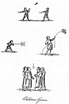
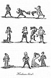
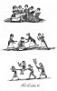
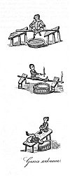

  
[Intangible Textual Heritage](../../../index) 
[Legends/Sagas](../../index)  [England](../index)  [Index](index) 
[Previous](spe20) 

------------------------------------------------------------------------

p. 300

### CHAPTER IV

Popular manly Pastimes imitated by Children--Horses--Racing and
Chacing--Wrestling and other Gymnastic Sports--Marbles and
Span-counter--Tops, etc.--The Devil among the Tailors--Even or
Odd--Chuck-halfpenny--Duck and Drake--Baste the Bear--Hunt the Slipper,
etc.--Sporting with
Insects--Kites--Windmills--Bob-cherry--Hoodman-blind--Hot-cockles--Cock-fighting--Anonymous
Pastimes--Mock Honours at Boarding-schools--Houses of Cards--Questions
and
Commands--Handy-dandy--Snap-dragon--Push-pin--Crambo--Lotteries--Creag--Queke-board,
and other minor games.

POPULAR MANLY PASTIMES IMITATED BY CHILDREN.--Most of the popular
pastimes mentioned in the preceding pages were imitated by the younger
part of the community, and in some degree, at least, became the sports
of children. Archery, and the use of missive weapons of all kinds, were
formerly considered as an essential part of a young man's education; for
which reason the bow, the sling, the spear, and other military
instruments, were put into his hands at a very early period of his life;
he was also encouraged in the pursuit of such sports as promoted
muscular strength, or tended to make him acquainted with the duties of a
soldier. When the bow and the sling were laid aside in favour of the
gun, prudence naturally forbad the putting an instrument of so dangerous
a nature into the hands of children; they however provided themselves a
substitute for the gun, and used a long hollow tube called a trunk, in
which they thrust a small pointed arrow, contrived to fit the cavity
with great exactness, and then blowing into the trunk with all their
might, the arrow was driven through it and discharged at the other end
by the expansion of the compressed air. Sometimes pellets of clay were
used instead of the arrows. Dr Johnson in his Dictionary, under the
article trunk, has this quotation from Ray: "In a shooting trunk, the
longer it is to a certain limit, the swifter and more forcibly the air
drives the pellet." The trunks were succeeded by pot-guns made with
hollow pieces of elder, or of quills, the pellets being thrust into them
by the means of a ramrod. These were also called pop-guns; and perhaps
more properly, from the popping noise they made in discharging the
pellets. Big bouncing words are compared to pot-gun reports in a comedy
called *The Knave in Graine*, printed in 1640. [1](#fn_949)

HORSES.--Most boys are exceedingly delighted with riding, either on
horses or in carriages, and also upon men's shoulders, which we have
already seen to be a very ancient sport; and I trust there are but few
of my readers who have not seen them with a bough or a wand substituted
for a horse, and highly pleased in imitating the galloping and prancing
of that noble animal. This is an amusement of great antiquity, well
known in Greece; and if report speaks truth, some of the greatest men
have joined in it, either to relax the

p. 301

vigour of their own minds for a time, or to delight their children. The
Persian ambassadors found Agesilaus, the Lacedemonian monarch, employed
in this manner. [1](#fn_950) Socrates also did
the same, for which it seems his pupil Alcibiades used to laugh at
him. [2](#fn_951) If we turn to the eighteenth
plate we shall see two boys, each of them having two wands, the one
serves for a horse, and the other for a spear, and thus equipped they
are justing together. Again upon the fourteenth plate a boy is mounted
upon a wooden horse, drawn by two of his companions, and tilting at the
quintain; and here we may remark that the bohourts, the tournaments, and
most of the other superior pastimes have been subjected to youthful
imitation, and that toys were made on purpose to train up the young
nobility in the knowledge and pursuit of military pastimes. Nay, some
writers, and not without the support of ancient documents, derive the
origin of all these splendid spectacles from the sportive exercises of
the Trojan boys.

RACING AND CHACING.--Contending with each other for superiority in
racing on foot is natural to children; and this emulation has been
productive of many different amusements, among which the following seem
to be the most prominent.

Base, or Prisoners' Bars, is described in a preceding part of this work.

Hunt the Fox.--In this game one of the boys is permitted to run out, and
having law given to him, that is, being permitted to go to a certain
distance from his comrades before they pursue him, their object is to
take him if possible before he can return home. We have the following
speech from an idle boy in *The longer thou livest the more Fool thou
art*, an old comedy, written towards the close of the sixteenth
century; [3](#fn_952)

"And also when we play and hunt the fox,  
I outrun all the boys in the schoole."

Hunt the Hare is the same pastime under a different denomination.

Harry-racket, or Hide and Seek, called also Hoop and Hide; where one
party of the boys remain at a station called their home, while the
others go out and hide themselves; when they are hid one of them cries
hoop, as a signal for those at home to seek after them. If they who are
hidden can escape the vigilance of the seekers and get home uncaught,
they go out to hide again; but so many of them as are caught, on the
contrary, become seekers, and those who caught them have the privilege
of hiding themselves.

\* There are various references to the common sport of Hide and Seek,
usually under the title *All-hid*, in late Elizabethan and Stuart days.
It is thus referred to in Decker's *Satiromastix*:--"Our
unhandsome-faced poet does play at Bo-peep with your Grace, and cries
All-hid, as boys do."

Thread the Tailor's Needle.--In this sport the youth of both sexes

p. 302

frequently join. As many as choose to play lay hold of hands, and the
last in the row runs to the top, where passing under the arms of the two
first, the rest follow: the first then becoming the last, repeats the
operation, and so on alternately as long as the game continues.

Cat after Mouse; performed indiscriminately by the boys and the girls.
All the players but one holding each other's hands form a large circle;
he that is exempted passes round, and striking one of them, immediately
runs under the arms of the rest; the person so struck is obliged to
pursue him until he be caught, but at the same time he must be careful
to pass under the arms of the same players as he did who touched him, or
he forfeits his chance and stands out, while he that was pursued claims
a place in the circle. When this game is played by an equal number of
boys and girls, a boy must touch a girl, and a girl a boy, and when
either of them be caught they go into the middle of the ring and salute
each other; hence is derived the name of kiss in the ring.

Barley-brake.--The excellency of this sport seems to have consisted in
running well.

\* Barley-brake is supposed to have its name from being originally
played in a field amid the barley mows or small stacks, one of which was
fixed on as the goal, whilst another was the prison or (as usually
termed in this pastime) the "hell." In Sir Philip Sidney's *Arcadia*,
Herrick's *Hesperides*, and Suckling's poems there are accounts of this
game, all of which refer to the "hell." Barley-brake is also several
times named in Massinger's plays. The game much resembled a certain form
of Prisoners' Base. In the Tragedy of Hoffmann, 1632, the two games are
named together as though equivalents:--

"I'll run a little course at Base, or Barley-brake."

Puss in the Corner.--A certain number of boys or girls stand singly at
different distances; suppose we say for instance one at each of the four
corners of a room, a fifth is then placed in the middle; the business of
those who occupy the corners is to keep changing their positions in a
regular succession, and of the out-player, to gain one of the corners
vacated by the change before the successor can reach it: if done he
retains it, and the loser takes his place in the middle.

Leap Frog.--One boy stoops down with his hands upon his knees and others
leap over him, every one of them running forward and stooping in his
turn. The game consists in a continued succession of stooping and
leaping. It is mentioned by Shakspeare in King Henry the Fifth; "If I
could win a lady at leap-frog, I should quickly leap into a wife": by
Jonson in the comedy of Bartholomew Fair, "A leap-frogge chance now";
and by several other more modern writers.

WRESTLING AND OTHER GYMNASTIC SPORTS.--To the foregoing pastimes we may
add Wrestling, which was particularly practised by the boys in the
counties

p. 303

of Cornwall and Devon. Upon the sixth plate we find two lads contending
for mastery at this diversion.

Hopping and standing upon one leg are both of them childish sports, but
at the same time very ancient, for they were practised by the Grecian
youth; one they called *akinetinda*, [1](#fn_953) which was a struggle between the
competitors who should stand motionless the longest upon the sole of his
foot; the other denominated *ascoliasmos*, was dancing or hopping upon
one foot, [2](#fn_954) the conqueror being he
could hop the most frequently, and continue the performance longer than
any of his comrades; and this pastime is alluded to by the author of the
old comedy, *The longer thou livest the more Fool thou art*, wherein a
boy boasting of his proficiency in various school games, adds,

"And I hop a good way upon my one legge."

Among the school-boys in my memory there was a pastime called
Hop-Scotch, [3](#fn_955) which was played in
this manner: a parallelogram about four or five feet wide, and ten or
twelve feet in length, was made upon the ground and divided laterally
into eighteen or twenty different compartments, which were called beds;
some of them being larger than others. The players were each of them
provided with a piece of a tile, or any other flat material of the like
kind, which they cast by the hand into the different beds in a regular
succession, and every time the tile was cast, the player's business was
to hop upon one leg after it, and drive it out of the boundaries at the
end where he stood to throw it; for, if it passed out at the sides, or
rested upon any one of the marks, it was necessary for the cast to be
repeated. The boy who performed the whole of this operation by the
fewest casts of the tile was the conqueror.

Skipping.--This amusement is probably very ancient. It is performed by a
rope held by both ends, that is, one end in each hand, and thrown
forwards or backwards over the head and under the feet alternately. Boys
often contend for superiority of skill in this game, and he who passes
the rope about most times without interruption is the conqueror. In the
hop season, a hop-stem stripped of its leaves is used instead of a rope,
and in my opinion it is preferable.

Trundling the hoop is a pastime of uncertain origin, but much in
practice at present, and especially in London, where the boys appear
with their hoops in the public streets, and are sometimes very
troublesome to those who are passing through them.

Swimming, sliding, and of late years skating, may be reckoned among the
boys' amusements; also walking upon stilts, swinging, and the pastime of
the meritot and see-saw, or tetter-totter, which have been mentioned
already, together with most of the games played with the ball, as well
as nine-pins and skittles.

p. 304

MARBLES AND SPAN-COUNTER.--Marbles seem to have been used by the boys as
substitutes for bowls, and with them they amuse themselves in many
different manners. I believe originally nuts, round stones, or any other
small things that could be easily bowled along, were used as marbles.
Those now played with seem to be of more modern invention. It is said of
Augustus when young, that by way of amusement he spent many hours in
playing with little Moorish boys with nuts. [1](#fn_956) The author of one of the Tatlers calls
it "a game of marbles not unlike our common taw." [2](#fn_957)

Taw, wherein a number of boys put each of them one or two marbles in a
ring and shoot at them alternately with other marbles, and he who
obtains the most of them by beating them out of the ring is the
conqueror.

Nine holes; which consists in bowling of marbles at a wooden bridge with
nine arches. There is also another game of marbles where four, five, or
six holes, and sometimes more, are made in the ground at a distance from
each other; and the business of every one of the players is to bowl a
marble by a regular succession into all the holes, which he who
completes in the fewest bowls obtains the victory.

Boss out, or boss and span, also called hit or span, wherein one bowls a
marble to any distance that he pleases, which serves as a mark for his
antagonist to bowl at, whose business it is to hit the marble first
bowled, or lay his own near enough to it for him to span the space
between them and touch both the marbles; in either case he wins, if not,
his marble remains where it lay and becomes a mark for the first player,
and so alternately until the game be won.

Span-counter is a pastime similar to the former, but played with
counters instead of marbles. I have frequently seen the boys for want of
both perform it with stones. This sport is called in French tapper, a
word signifying to strike or hit, because if one counter is struck by
the other, the game is won.

\* The following is a list of the present (1902) best known marble
games:--Bounce About, Bounce Eye, Conqueror, Die Shot, Fortifications,
Handers, Increase Pound, Knock Out, Long Taw, Picking the Plums,
Pyramid, Rising Taw, Spanners, Three Holes, and Tip-Shears.

TOPS, ETC.--THE DEVIL AMONG THE TAILORS.--The top was used in remote
times by the Grecian boys. It is mentioned by Suidas, and called in
Greek τροχος, and in Latin turbo. It was well known at Rome in the days
of Virgil, [3](#fn_958) and with us as early at
least as the fourteenth century, when its form was the same as it is
now, and the manner of using it can admit of but little if any
difference. Boys whipping of tops occur in the marginal paintings of the
MSS. written at this period. [4](#fn_959) It
was probably in use long before.

In a manuscript at the Museum [5](#fn_960) I
met with the following anecdote of Prince Henry, the eldest son of James
I., and the author assures us it is

p. 305

perfectly genuine; [1](#fn_961) his words are
these: "The first tyme that he the prince went to the towne of Sterling
to meete the king, seeing a little without the gate of the towne a stack
of corne in proportion not unlike to a topp wherewith he used to play;
he said to some that were with him, 'loe there is a goodly topp';
whereupon one of them saying, 'why doe you not play with it then?' he
answered, 'sett you it up for me and I will play with it.'"

In Northbrooke's *Treatise against Dicing, etc.*, printed in 1579, the
young are urged to follow Cato's advice, namely, "playe with the Toppe
and flee Dice-playing."

We have hitherto been speaking of the whip-top; for the peg-top, I
believe, must be ranked among the modern inventions, and probably
originated from the tee-totums and whirligigs, which seem all of them to
have some reference to the tops, saving only that the usage of the
tee-totum may be considered as a kind of petty gambling, it being marked
with a certain number of letters: and part of the stake is taken up, or
an additional part put down, according as those letters lie uppermost.
The author of *Martin Scriblerus* mentions this toy in a whimsical
manner: "He found that marbles taught him percussion, and whirligigs the
axis and peritrochia, and tops the centrifugal motion." When I was a boy
the tee-totum had only four sides, each of them marked with a letter; a
T for take all; an H for half, that is of the stake; an N for nothing;
and a P for put down, that is, a stake equal to that you put down at
first. Toys of this kind are now made with many sides and letters.

There is a childish pastime which may well be inserted here, generally
known by the ridiculous appellation of the Devil among the Tailors; it
consists of nine small pins placed like skittles in the midst of a
circular board, surrounded by a ledge with a small recess on one side,
in which a peg-top is set up by means of a string drawn through a
crevice in the recess; the top when loosed spins about among the pins
and beats some, or all of them, down before its motion ceases; the
players at this game spin the top alternately, and he who first beats
down the pins to the number of one-and-thirty is the conqueror. This
game, I am told, is frequently to be seen at low public-houses, where
many idle people resort and play at it for beer and trifling stakes of
money.

EVEN OR ODD--CHUCK-HALFPENNY--DUCK AND DRAKE.--Even or Odd is another
childish game of chance well known to the ancients, and called in Greek
Αρτιαζειν, and in Latin *par vel impar*.

The play consists in one person concealing in his hand a number of any
small pieces, and another calling even or odd at his pleasure; the
pieces are then exposed, and the victory is decided by counting them; if
they correspond with the call, the hider loses; if the contrary, of
course he wins. The Grecian boys used beans, nuts, almonds, and money;
in fact anything that can be easily concealed in the hand will answer
the purpose.

Cross and Pile is mentioned some pages back. Here we may add
Chuck-farthing,

p. 306

played by the boys at the commencement of the last century; it probably
bore some analogy to pitch and hustle. There is a letter in the
*Spectator* supposed to be from the father of a romp, who, among other
complaints of her conduct, says, "I catched her once at eleven years old
at chuck-farthing among the boys." [1](#fn_962)
I have seen a game thus denominated played with half-pence, every one of
the competitors having a like number, either two or four, and a hole
being made in the ground with a mark at a given distance for the players
to stand, they pitch their halfpence singly in succession towards the
hole, and he whose halfpenny lies the nearest to it has the privilege of
coming first to a second mark much nearer than the former, and all the
halfpence are given to him; these he pitches in a mass towards the hole,
and as many of them as remain therein are his due; if any fall short or
jump out of it, the second player, that is, he whose halfpenny in
pitching lay nearest to the first goer's, takes them and performs in
like manner; he is followed by the others so long as any of the
half-pence remain.

Duck and Drake, is a very silly pastime, though inferior to few in point
of antiquity. It is called in Greek, Εποστρακισμος [2](#fn_963) and was anciently played with flat
shells, which the boys threw into the water, and he whose shell
rebounded most frequently from the surface before it finally sunk, was
the conqueror. With us a part of a tile, a potsherd, or a flat stone,
are often substituted for the shells.

To play at ducks and drakes is a proverbial expression for spending
one's substance extravagantly. In the comedy called Green's *Tu Quoque*,
one of the characters, speaking of a spendthrift, says, "he has thrown
away as much in ducks and drakes as would have bought some five thousand
capons."

\* In Butler's *Hudibras* occur the lines:

"What figur’d slates are best to make,  
On watery surface Duck or Drake."

BASTE THE BEAR--HUNT THE SLIPPER, ETC.--Baste, or buffet the bear with
hammer and block, are rather appendages to other games than games by
themselves, being punishments for failures, that ought to have been
avoided; the first is nothing more than a boy couching down, who is
laden with the clothes of his comrades and then buffeted by them; the
latter takes place when two boys have offended, one of which kneeling
down bends his body towards the ground, and he is called the block; the
other is named the hammer, and taken up by four of his comrades, one at
each arm and one at each leg, and struck against the block as many times
as the play requires.

Hunt the Slipper.--In this pastime a number of boys and girls
indiscriminately sit down upon the ground in a ring, with one of their
companions standing on the outside; a slipper is then produced by those
seated in the ring, and passed about from one to the other underneath
their clothes as briskly as possibly, so as to prevent the player
without from knowing where it is; when

 

[  
Click to enlarge](img/pl38.jpg)  
Children's Games  

 

p. 307

he can find it, and detain it, the person in whose possession it was, at
that time, must change place with him, and the play recommences.

Shuttle-cock has been spoken of in a former chapter; an ancient
representation of the game is given upon the [thirty-eighth
plate](#img_pl38).

Sporting with Insects.--On the [thirty-eighth plate](#img_pl38) we see a
boy playing with some large insect to which is fastened a string or
thread. It is from a manuscript of early fourteenth century date. [1](#fn_964)

This barbarous sport is exceedingly ancient. We find it mentioned by
Aristophanes in the comedy of *The Clouds*. [2](#fn_965) It is called in the Greek Μηλολονθη,
rendered in the Latin scarabæus, which seems to have been the name of
the insect. But the Grecian boys were less cruel in the operation than
those of modern times, for they bound the thread about the legs of the
beetle, instead of thrusting a pin through its tail, as is the custom of
English boys with cockchafers. We are also told that the former
frequently amused themselves in the same manner with little birds,
substituted for the beetles. [3](#fn_966)

The Kite is a paper machine well known in the present day, which the
boys fly into the air and retain by means of a long string. It received
its denomination from having originally been made in the shape of a bird
called a kite. Paper kites are not restricted to any particular form;
they appear in a great diversity of figures, and not unfrequently in the
similitude of men and boys. I have been told, that in China the flying
of paper kites is a very ancient pastime, and practised much more
generally by the children there than it is in England. From that country
perhaps it was brought to us, but the time of its introduction is
uncertain.

\* In the Oxford Dictionary, the earliest references to *Kite*, as
applied to the toy from its hovering in the air like the bird, is from
Butler's *Hudibras* (1664):

"As a Boy one night did flie his Tarsel of a Kite,  
The strangest long-wing’d Hawk that flies."

\[paragraph continues\] It was evidently well known in England, though
not by that name, in 1634, when John Bate gave directions for flying a
kite to carry fireworks, "raising it against the wind in an open field."
Two lively cuts are given of it (one is reproduced on [plate
thirty-six](spe20.htm#img_pl36)), with directions how to make it, but no
name is assigned to the ærial machine. [4](#fn_967)

The Paper Windwill, which appears upon the [thirty-eighth
plate](#img_pl38), is taken from a painting which is nearly five hundred
years old; though it differs very little in its form from those used by
the children at present.

BOB-CHERRY.--This is "a play among children," says Johnson, "in which
the cherry is hung so as to bob against the mouth," or rather so high as
to oblige them to jump in order to catch it in their mouth, for which
reason the candidate is often unsuccessful. Hence the point in the
passage which Johnson

p. 308

quotes from Arbuthnot. "Bob-cherry teaches at once two noble virtues,
patience and constancy; the first in adhering to the pursuit of one end,
the latter in bearing a disappointment."

At the bottom of the thirty-eighth plate we see a sport of this kind of
fourteenth century date, where four persons are playing, but the object
they are aiming at is much larger than a cherry, and was probably
intended to represent an apple. [1](#fn_968)
"It was customary," we are told by Mr Brand, on the eve of All-Hallows,
for the young people in the north to dive for apples, or catch at them
when stuck at one end of a kind of hanging beam, at the other extremity
of which is fixed a lighted candle, and that with their mouths, only
having their hands tied behind their back." [2](#fn_969)

HOODMAN BLIND--HOT COCKLES.--*Hoodman Blind*, more commonly called Blind
Man's Buff, is where a player is blinded and buffeted by his comrades
until he can catch one of them, which done, the person caught is blinded
in his stead. This pastime was known to the Grecian youth, and called by
them Μυια χαλκι. [3](#fn_970) It is called
Hoodman's Blind because the players formerly were blinded with their
hoods. In the *Two Angry Women of Abington*, a comedy, this pastime is
called the Christmas-sport of Hobman-Blind.

The manner in which Hoodman Blind was anciently performed with us
appears from three different representations, given upon the fortieth
plate, all from the same Bodleian MS.

The players who are blinded have their hoods reversed upon their heads
for that purpose, and the hoods of their companions are separately bound
in a knot to buffet them.

\* Gay says concerning this pastime:

"As once I played at Blindman's Buff, it hapt  
About my Eyes the Towel thick was wrapt.  
I miss’d the Swains, and seized on Blouzelind,  
True speaks that antient Proverb, 'Love is blind.'"

*Hot Cockles*, from the French hautes-coquilles, is a play in which one
kneels, and covering his eyes lays his head in another's lap and guesses
who struck him. Gay describes this pastime in the following lines:

"As at Hot Cockles once I laid me down,  
And felt the weighty hand of many a clown,  
Buxoma gave a gentle tap, and I  
Quick rose, and read soft mischief in her eye."

"The Χυτρινδα of the Grecians," says Arbuthnot, "is certainly not our
hot cockles, for that was by pinching, not by striking"; but the
description of the chytrinda, as it is given by an ancient writer, bears
little or no resemblance to the game of hot cockles, but is similar to
another equally well known with us, and called frog in the middle. The
chytrinda took place in this manner:--A

 

[  
Click to enlarge](img/pl39.jpg)  
Hoodman Blind  

 

p. 309

single player, called χοτρα, kotra, and with us the frog, being seated
upon the ground, was surrounded by his comrades who pulled or buffeted
him until he could catch one of them; which done the person caught took
his place, and was buffeted in like manner. [1](#fn_971) I scarcely need to add, that the frog in
the middle, as it is played in the present day, does not admit of any
material variation. There was another method of playing this game,
according to the same author; but it bears no reference to either of
those above described. Upon the [thirty-ninth plate](#img_pl39) the
reader will find both the pastimes above mentioned, which are also taken
from the Bodleian MS.

COCK-FIGHTING.--I have already spoken at large upon cock-fighting, and
throwing at cocks. I shall only observe that the latter, especially, was
a very common pastime among the boys of this country till within these
few years; and at the bottom of the thirty-fourth plate we have the copy
of a curious delineation, which I take to represent a boyish triumph.

The hero supposed to have won the cock, or whose cock escaped unhurt
from the danger to which he had been exposed, is carried upon a long
pole by two of his companions; he holds the bird in his hands, and is
followed by a third comrade, who bears a flag emblazoned with a cudgel,
the dreadful instrument used upon these occasions. The original painting
occurs in the manuscript mentioned in the preceding article.

ANONYMOUS PASTIMES--MOCK HONOURS AT BOARDING SCHOOLS.--Upon the
[forty-first plate](#img_pl41) are two representations of a pastime, the
name of which is unknown to me; but the purpose of it is readily
discovered.

At the top we see a young man seated upon a round pole which may readily
turn either way, and immediately beneath him is a vessel nearly filled
with water; he holds a taper in each hand, and one of them is lighted,
and his business, I presume, is to bring them both together and light
the other, being careful at the same time not to lose his balance, for
that done, he must inevitably fall into the water. This is from the
Bodleian MS.

In the representation in the centre of the same plate, taken from a
beautiful fourteenth century book of prayers in the possession of Mr F.
Douce, the task assigned to the youth is still more difficult, as well
from the manner in which he is seated, as from the nature of the
performance, which here he has completed: that is, to reach forward and
light the taper held in his hands from that which is affixed to the end
of the pole, and at a distance from him.

At the bottom of the plate, also from a drawing in Mr Douce's book of
prayers, is a representation of two boys seated upon a form by the side
of a water- tub; both of them with their hands fixed below their knees,
and one bending backwards in the same position, intending, I presume, to
touch the water without immerging his head, or falling into it, and
afterward to recover his position.

This trick being done by the one was probably imitated by the other; I
speak however from conjecture only. If it be necessary for him who
stoops to

p. 310

take any thing out of the water, the pastime will bear some analogy to
the just-mentioned diving for apples.

In some great Boarding Schools for the fair sex, it is customary, upon
the introduction of a novice, for the scholars to receive her with much
pretended solemnity, and decorate a throne in which she is to be
installed, in order to hear a set speech, addressed to her by one of the
young ladies in the name of the rest. The throne is wide enough for
three persons to sit conveniently, and is made with two stools, having a
tub nearly filled with water between them, and the whole is covered by a
counterpane or blanket, ornamented with ribands and other trifling
fineries, and drawn very tightly over the two stools, upon each of which
a lady is seated to keep the blanket from giving way when the new
scholar takes her place; and these are called her maids of honour. The
speech consists of high-flown compliments calculated to flatter the
vanity of the stranger; and as soon as it is concluded, the maids of
honour rising suddenly together, the counterpane of course gives way,
and poor miss is unexpectedly immerged in the water.

HOUSES OF CARDS--QUESTIONS AND
COMMANDS--HANDY-DANDY--SNAPDRAGON--PUSH-PIN--CRAMBO--LOTTERIES.--*Building*
of houses *with cards*, and such like [materials](errata.htm#3), is a
very common amusement with children, as well as drawing little waggons,
carts, and coaches; and sometimes boys will harness dogs and other
animals, and put them to their waggons in imitation of horses. Something
of this kind is alluded to by Horace, who writes thus in one of his
satires: [1](#fn_972)

           "Ædificare cassus, plostello adjungere mures."  
To build little houses, and join mice to the diminutive waggons.

*Questions and Commands*, a childish pastime, which though somewhat
different in the modern modification, most probably derived its origin
from the basilinda, Βασιλινδα, [2](#fn_973) of
the Greeks, in which we are told a king, elected by lot, commanded his
comrades what they should perform.

Handy-dandy, a "play," says Johnson, "in which children change hands and
places"; this seems clear enough according to the following quotation
from Shakspeare (King Lear, act iv. sc. 6): "See how yond justice rails
upon yond simple thief! hark in thine ear; change places; and
handy-dandy which is the justice and which is the thief"; to which is
added another from Pope's *Scriblerus*, "neither cross and pile, nor
ducks and drakes, are quite so ancient as handy-dandy."

\* A truer explanation is that it is a childish play, still (1902)
practised, wherein something is placed or shaken in one or other of the
hands, and a guess is made as to the hand in which it is retained.

*Snap-dragon*. This sport is seldom exhibited but in winter, and chiefly
at Christmas-time; it is simply heating of brandy or some other ardent
spirit in a dish with raisins; when the brandy being set on fire, the
young folks of both

 

[  
Click to enlarge](img/pl40.jpg)  
Hot Cockles &c.  

 

p. 311

sexes standing round it pluck out the raisins, and eat them as hastily
as they can, but rarely without burning their hands, or scalding their
mouths.

*Push pin* is a very silly sport, being nothing more than simply pushing
one pin across another.

*Crambo* is a diversion wherein one gives a word, to which another finds
a rhyme; this, with other trifling amusements, is mentioned in a paper
belonging to the Spectator. [1](#fn_974) "A
little superior to these," that is, to persons engaged in
cross-purposes, questions, and commands, "are those who can play at
crambo, or cap-verses." In this we trace some vestige of a more ancient
pastime, much in vogue in the fourteenth and [fifteenth](errata.htm#4)
centuries, called the A B C of Aristotle; which is strongly recommended
by the author, one "Mayster Bennet," not only to children, but also to
persons of man's estate, if ignorant of letters. The proem to this
curious alliterative alphabet is to the following effect:

"Whoever will be wise and command respect let him learn his letters, and
look upon the A B C of Aristotle, against which no argument will hold
good: It is proper to be known by clerks and knights, and may serve to
amend a mean man, for often the learning of letters may save his life.
No good man will take offence at the amendment of evil, therefore let
every one read this arrangement and govern himself thereby.

Hearkyn and heare every man and child how that I begynne.

A to amerous, to adventurous; ne anger the too much.  
B to bold, to busy, and board thou not too brode.  
C to curtes, to cruel, and care not too sore.  
D to dull, to dreadfull, and drynk thou not too oft.  
E to ellynge, to excellent; ne to ernestfull neyther.  
F to fierce, ne to familier but frendely of chere.  
G to glad, to gloryous, and gealosy thou shalt hate.  
H to hasty, to hardy, ne too bevy yn thyne herte.  
I to jettyng, to jangling, and jape not too oft.  
K to keeping, to kynd, and ware knaves taches among.  
L to lothe, to lovyng, to lyberall of goods.  
M to medlurs, to merry but as manner asketh.  
N to noyous, to nyce, ne nought to newe fangle.  
O to orpyd, to oveyrthwarte, and othes do the hate.  
P to preysyng, to prevy, ne peerless with prynces.  
Q to queynt, to querelous, but quyene wele thee may.  
R to ryetous, to revelyng, ne rage not too moche.  
S to strange, ne to stervyng, nor stare not too brode.  
T to taylours, ne tayle wyse, for temperance yt hatyth.  
V to venemous, to violent, and waste nat too mych.  
W to wyld, ne wrathful, and ne too wyse deeme thee.  
                 For fear of a fall.  
A measurable meane way is best for us all. Explicit." [2](#fn_975)

*Lotteries*, in which toys and other trifling prizes were included to be
drawn for by children, were in fashion formerly, but by degrees, and
especially since

p. 312

the establishment of the State Lottery, they have been magnified into a
dangerous species of gambling, and are very properly suppressed by the
legislature. They were in imitation of the State Lotteries, with prizes
of money, proportionable to the value of the tickets, and drawn in like
manner. These lotteries are called little goes.

CREAG--QUEKE-BOARD, AND OTHER MINOR GAMES.--*Creag* is a game mentioned
in a computus dated the twenty-eighth of Edward I., A.D. 1300, and said
to have been played by his son Prince Edward.

\* It was a form of nine pins.

*Queke Borde*, with *Hand yn* and *Hand oute*, are spoken of as new
games, and forbidden by a statute made in the seventeenth year of Edward
IV.

\* The former of this was probably a gambling game with a checker or
chess board.

*White and Black*, and also *Making and Marrying* are prohibited by a
public act established in the second and third years of Philip and Mary.

*Figgum* is said to be a juggler's game in the comedy of *Bartholomew
Fayre* by Ben Jonson, acted in 1614; to which is added, "the devil is
the author of wicked Figgum." In the same play mention is made of crambe
(probably crambo), said to be "another of the devil's games."

*Mosel the Pegge*, and playing for the hole about the churchyard, are
spoken of as boys' games, in a comedy called *The longer thou livest the
more Fool thou art*, written in the reign of Queen Elizabeth.

\* This may have been the same as *Pegge Morrell*, described on page
[258](spe19.htm#page_258).

*Penny-Pricke* appears to have been a common game in the fifteenth
century, and is reproved by a religious writer of that period. [1](#fn_976)

\* The game consisted in throwing at pence, which were placed on pieces
of stick called holes, with a piece of iron. It is thus named in 1616:--

"Their idle hours (I meane all houres beside  
Their hours to eatt, to drinke, drab, sleepe, and ride)  
They spend at shove-board, or at penny-pricke." [2](#fn_977)

*Pick-point*, *Venter-point*, *Blow-point*, and *Gregory*, occur in a
description of the children's games in the sixteenth century. [3](#fn_978) Blow-point was probably blowing an arrow
through a trunk at certain numbers by way of lottery. To these may be
added another pastime, called Drawing Dun out of the Mire. Chaucer
probably alludes to this pastime in the Manciple's Prologue, where the
host seeing the cook asleep, exclaims, "Syr, what dunne is in the mire."

\* Brand quotes the following lines from "Humors Ordinaire" (1600):--

"At shove-groatt, Venter-point, or Bord and Pile,  
At leaping o’er a Midsummer Bone-fier,  
Or at the drawing Dun out of the myer."

 

[  
Click to enlarge](img/pl41.jpg)  
Games Unknown  

 

p. 313

\* It was a mere Christmas gambol with a great log of wood. [1](#fn_979)

*Mottoes*, *Similes*, and *Cross Purposes*, are placed among the
children's games in a paper belonging to the *Spectator*. [2](#fn_980) And the *Parson has lost his cloak*, in
another, where a supposed correspondent writes thus: "I desire to know
if the merry game of the parson has lost his cloak is not much in vogue
amongst the ladies this Christmas, because I see they wear hoods of all
colours, which I suppose is for that purpose." [3](#fn_981)

------------------------------------------------------------------------

### Footnotes

[300:1](spe21.htm#fr_950) Garrick's Collection,
G. vol. ii.

[301:1](spe21.htm#fr_951) Plut. in Apophthegm.
Laced. et Ælian. Var. Hist. lib. xii. cap. 15.

[301:2](spe21.htm#fr_952) Val. Max, lib. viii.
cap. 8.

[301:3](spe21.htm#fr_953) Garrick's Collect. I.
vol. xviii.

[303:1](spe21.htm#fr_954) Joan. Meursi, de Lud.
Græc.

[303:2](spe21.htm#fr_955) Pollux, lib. ix. cap.
7.

[303:3](spe21.htm#fr_956) The second half of
the name of this undying game comes from *scotch*, an incised line or
scratch.

[304:1](spe21.htm#fr_957) Sueton., in Vita Aug.
cap. 83.

[304:2](spe21.htm#fr_958) No. 112.

[304:3](spe21.htm#fr_959) The poet has drawn a
simile from this pastime. Æneid, vii. 378.

[304:4](spe21.htm#fr_960) An example of this is
given at the bottom of [plate eleven](spe10.htm#img_pl11).

[304:5](spe21.htm#fr_961) Harl. Lib. No. 6391.

[305:1](spe21.htm#fr_962) Harl. Lib. No. 6391.

[306:1](spe21.htm#fr_963) Vol. vi. No. 466.

[306:2](spe21.htm#fr_964) Pollux, lib. ix. cap.
7.

[307:1](spe21.htm#fr_965) Roy. Lib. No. 2, B.
vii.

[307:2](spe21.htm#fr_966) Act ii. scene the
last.

[307:3](spe21.htm#fr_967) Pollux, lib. ix. cap.

[307:4](spe21.htm#fr_968) Bate's *Mysteries of
Nature and Art*, pp. 100-102.

[308:1](spe21.htm#fr_969) Roy. Lib. No. 2, B.
vii.

[308:2](spe21.htm#fr_970) Addition to Bourne's
Vulg. Antiq.

[308:3](spe21.htm#fr_971) Pollux. lib. ix. cap.
7.

[309:1](spe21.htm#fr_972) Pollux, lib. ix. cap.
7.

[310:1](spe21.htm#fr_973) Lib. ii. sat. 3, line
47.

[310:2](spe21.htm#fr_974) Pollux, lib. ix. cap.
7.

[311:1](spe21.htm#fr_975) Vol. vii. No. 504.

[311:2](spe21.htm#fr_976) Harl. MSS. 1706, 541.

[312:1](spe21.htm#fr_977) Harl. MS. 2391.

[312:2](spe21.htm#fr_978) Scot's *Philomythil*.

[312:3](spe21.htm#fr_979) Harl. MS. 2125.

[313:1](spe21.htm#fr_980) "Hazlitt's edit. of
Brand's *Popular Antiquities*, iii. 308.

[313:2](spe21.htm#fr_981) Vol. iii. No. 245.

[313:3](spe21.htm#fr_982) Vol. iv. 278.
