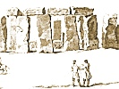

  
[Intangible Textual Heritage](../../../index.md)  [Legends &
Sagas](../../index)  [England](../index)  [Index](index.md) 
[Previous](str04)  [Next](str06.md) 

------------------------------------------------------------------------

  
*Stonehenge, A Temple Restor'd to the British Druids*, by William
Stukeley, \[1740\], at Intangible Textual Heritage

------------------------------------------------------------------------

p. 15

  [  
Click to enlarge](img/pl08.jpg.md)  
Plate 8. North Prospect from Stonehenge  
P. a barrow opened by Lord Pembroke. S. by W. Stukeley.  

### CHAP. III.

*The admeasurement of the ground-plot; and outer circle of the temple,
and imposts over it. Of the principal line of the work, running down the
avenue, and single entrance, into the area, or court. The imposts are
jointed exquisitely by mortaise and tenon. The temple at Persepolis a
building of this sort*.

LET us now set about an examination of the measures of the temple
itself. Take a staff 10 foot 4 inches and ¾ long. Divide it into six
equal parts. These are the cubits of the ancients. Each cubit is divided
into six parts. These are palms. Thus have we the original measure of
the founders of *Stonehenge*. We will take Mr. *Webb's* measures, and
compare ’em herewith. [TAB. XI.](str06.htm#img_pl11.md)TAB. XI. the ground-plot.

Mr. *Webb* says, p. 55. that the whole work of *Stonehenge* being of a
circular form, is 110 foot in diameter. But to be precise, ’tis 108 and
somewhat more, and his own scale in his ground-plot shows the same. This
is the diameter from outside to outside, which in our ground-plot is the
principal diameter. The thickness of the stones of the outward circle,
he says, p. 59. are 3 foot and an half. Hence the inner diameter becomes
almost 102 feet English. If the reader pleases to measure 102 feet upon
the comparative scales, which I TAB. VI.
gave of the *English* foot and *Hebrew* cubit, being the measure us’d by
the Druids, or in the scales at the bottom of the ground-plot, he will
find that it amounts exactly to 60 cubits. 30 cubits being the *radius*
wherewith they struck the circle upon the turf, which is the inner
circumference of that work. *That* sufficiently defin’d their
ground-plot. For tho’ they intended in general, that the thickness of
the stones of this outer circle should be 3 foot and a half; but to
speak more properly, 2 cubits (which is the same measure) yet they were
more careful of one side only, of that dimension. And the chief business
being withinside this temple, they set the best face of the stones
inwards, upon that ground-line; the other face was suited as well as the
scantlings they could get, best answer’d. *Webb's* 3 foot and a half is
precisely 3 foot 5 inches, and somewhat more, making compleatly 2 Druid
cubits, as you find by the scales. They that carefully view
*Stonehenge*, will easily see, that the stones of the inside both of the
outward circle and of the cell, are the smoothest, best wrought, and
have the handsomest appearance. For so the polite architects of the
eastern part of the world, bestow’d more elegance within their temples
than without. Not as our modern *London* builders, who carve every
moulding, and crowd every ornament, which they borrow out of books, on
the outside of our publick structures, that they may more commodiously
gather the dust and smoke. The truth is, good sense and observation of
nature, produces the same ideas in all ages and all nations. Our Druids
observ’d, that God almighty in forming the body of a man, made all the
external parts great, bold, round, with ornament sufficient; but where
the beauty chiefly consisted in the fitness of the proportions, in
symmetry and plainness. In the inside, he has display’d all the
*minutiæ* of divine skill. They have done the like, according to their
way, in *Stonehenge*. So even as to the outward appearance, I find they
took care to set those stones that had the best outward face, toward the
front or entrance. And to embarrass the general scheme of the work, they
made use of two centers instead of one, but 2 cubits distance from one
another; perhaps to make the thing intricate and as magical: besides the
advantage it gives to the oval form of the included cell.

p. 16

Observe, in laying down the ground-plot and projecting this outer
circle, we said it was 110 feet, (gross measure) in diameter. We
remember what is before-mention’d, that the learned *Greaves* measur’d
two galleries in the greater pyramid, in like manner, each 110 feet. So
the bishop of London says, from the grand entrance of *Stonehenge*, to
the work is 35 yards: so he says the diameter of the circle at
*Rowldrich* in *Oxfordshire*, is 35 yards: all this while 60 Druid or
Egyptian cubits are meant. So the length of *Solomon*'s temple was 60
cubits, whereof the *Ædes* 40 cubits, the *sanctum sanctorum* 20.

The intention of the founders of *Stonehenge* was this. The whole circle
was to consist of 30 stones, each stone was to be 4 cubits broad, each
interval 2 cubits. 30 times 4 cubits is twice 60: 30 times 2 cubits is
60. So that thrice 60 cubits compleats a circle whose diameter is 60. A
stone being 4 cubits broad, and 2 cubits thick is double the interval,
which is a square of 2 cubits. Change the places between the stones and
their intervals, and it will make a good ground-plot for a circular
portico of *Greek* or *Roman* work. For supposing these intervals to be
square plinths of 2 cubits each side, and columns properly set upon
them: it will admit of 3 diameters for the intercolumniation, which is
the diastyle manner in architecture. But to talk of pycnostyle with Mr.
*Webb*, and call these stones of ours pillars or pillasters, where they
are twice as broad as the space between them, and to call this an order,
is monstrous.

Thus a stone and an interval in this outward circle of *Stonehenge*,
makes 3 squares; 2 allotted to the stone, 1 to the interval; which for
stability and beauty withal, in such a work as ours, is a good
proportion. The curiosity of the work, and the general orthography of
the outward circle, I have design’d in TAB.
XII.  
TAB. v.*Plate* [XII.](str06.htm#img_pl12.md) and it may be seen in
the seven stones now remaining at the grand entrance. Which show what
strictly was the intent of the founders, and where they took the liberty
to relax of that strictness, and that with judgment; so as to produce a
good effect. I shall explain it from Mr. *Webb's* own measures, that I
may give the truth its full advantage. P. 59. he says, the stones which
made the outward circle are 7 foot in breadth. Observe that 7 foot makes
4. cubits of the Druids. He says, they are 15 foot and a half high. You
find that exactly 9 cubits. P. 61. he says, the architraves lying round
about upon them, are 2 foot and a half high, *i.e.* our cubit and half.
He mentions their breadth to be 3 foot and half; equal to the thickness
of the upright, *i.e.* our two cubits. They are jointed in the middle of
each perpendicular stone. Hence tho’ he has not mention’d the length of
these architraves, we gather them to be 6 cubits long. This is spoke of
their inward length, for outwardly they must needs be somewhat longer,
as being an ark of a larger circle. I must observe about these
architraves, as Mr. *Webb* calls them, that they are more properly
call’d imposts or cornishes; for they are not made to support any thing
above them, as is the nature of an architrave, but for the stability and
ornament of what supports them, which is the nature of imposts and
cornishes. Tho’ these bodies of stone here, never had or were intended
to have, any mouldings upon them, like *Greek* and *Roman* works; they
are wrought perfectly plain, and suitable to the stones that support
them. I observe further, the chizeling of our upright stones, is only
above ground. For the 4 or 5 foot in length below ground, is left in the
original natural form. And that the upright stones are made very
judiciously to diminish a little, every way; so that at top they are but
3 cubits and a half broad, and so much narrower as to suffer their
imposts, to hang over a little, or project (in properer terms) over the
heads of the uprights, both within side and without. By this means these
uprights are in much less danger of falling or swerving any way: and the
imposts, which are not broader than the thickness of the stones at
bottom, which support them, have a graceful effect, by projecting a
little, without danger of surcharging them. We see here plain, natural,
easy geometry, what we may call the

  [  
Click to enlarge](img/pl09.jpg.md)  
Plate 9. Southwest Prospect from Stonehenge  
A. The barrow Ld. Pembroke open’d. BB. those I open’d. C.
Bushbarrow. D. a cavity in the vallum.  

p. 17

first rudiment of art, deduc’d from common reason: but they that can
find any *Roman* delicacy herein, must, I freely own, have a much nicer
eye and talk, than I can pretend to. The Druids had, from patriarchal
times, made their altars or temples of rude unpolish’d stones. But now
hearing, probably from *Phœnician* traders, of the glories of
*Solomon*'s temple, at least of other temples made artfully in imitation
of it; such as those of *Sesostris* in *Egypt*, and others about
*Phœnicia:* they thus made a small approach to square scantlings and
stones wrought. And this seems to have been the first and the last work
of theirs of this kind, that I can hear of, either in the *Britanic*
isles, or on the continent. And no doubt but it must give them so high a
reputation, that even the people of *Gaul* themselves could not help
owning to *Cæsar*, that the discipline of these men was first begun
here, and carry’d on with such success, that they sent their youth from
the continent hither, as to an academy, to be initiated in their
learning. We are not to suppose these words are to be strictly taken, as
if the Druids here began their institution: but that being an oriental
manner of religion, and much different from that on the *Gallic*
continent, what they had of it there, was deriv’d from *Britain*. It
appear’d as much new to them, who were chiefly idolaters, as in many
ages preceding, *Abraham*'s religion appear’d new to the inhabitants of
*Phœnicia* and *Egypt:* who were then not much tinctur’d with idolatry.
Nor, probably, had the Druids much opportunity of building another such
work, as *Stonehenge*, between its foundation and the *Roman* times.
Because, I apprehend, the encroachments of the *Gallic* nations from the
continent, seating themselves in *Britain*, about 200 years before
*Cæsar*'s invasion, had molested the Druids much, in these southern
counties: and drove them with the old *Britons*, farther northward and
westward. But of this we will treat more particularly afterwards, when
we offer our opinion, of the time when it was made.

In the orthographic plate, [TAB. XII.](str06.htm#img_pl12.md) we may see
the strict geometry of theTAB. XII. work
of this outward circle, and the artful variation therefrom, in order to
make the aperture of the grand entrance somewhat wider than the rest.
Mr. *Webb* does not take notice of this particular; and he might have
triumph’d in it. For ’tis no less than a *Vitruvian* rule, to relax the
intercolumniation just in the middle of the portico, in the front of a
temple, and over-against the door. He speaks of it in *Lib*. III. 2.
when talking of the *Eustyle ratio*, the best for use, appearance and
strength: he directs the intercolumniation to be of two diameters and ¼;
but the middle intercolumniation of three diameters. By which means the
approach to the door will be much more commodious, and nothing
diminish’d of beauty in aspect. And this is the reality of the case
before us.

But alas, our *British* priests knew nothing of *Vitruvius*; they
deduc’d this knack from an authority much ancienter than him, *viz*.
from pure natural reason, and good sense. Nor does this hurt the whole
of the work. The aperture ought strictly to have been two cubits equal
to the rest, but they advanc’d it to two cubits and a half. This only
crowds the next intervals on each side a small matter nearer, the rest
preserving their true distance quite round. And in the work itself, ’tis
obvious enough to the naked eye. Again, there is another remarkable
particular observ’d by our priests. Because the aperture of the
principal entrance we are speaking of, is wider than the rest: they have
made the impost over it thicker than the rest, and ’tis equally obvious
to the naked eye. This was the more effectually to secure it from
breaking. But this additional thickness they have put below. They were
sensible it would have produc’d an ill effect at top, by breaking the
line of that noble cincture. It must be own’d this was extremely well
adjusted. And the breadth of the stone that hangs over head in this
place is astonishing. See *Plate* [VII.](str04.htm#img_pl07.md) call’d a
TAB. VII. peep into the *sanctum
sanctorum*. I had the greatest pleasure imaginable, in the year 1723,
*July*, in being here for several days together, with the learned
*Heneage* Lord *Winchelsea*. I have just reason to boast of that
intimacy he indulg’d

p. 18

me in; and his memory must for ever be dear to me, for his noble
qualities. TAB. VII. My Lord and I were
very careful in taking the measures of *Stonehenge*; and with great
grief we observ’d, the stones here represented in that Plate, TAB. V. and [TAB. V.](str04.htm#img_pl05.md) the
front view, to be much deviated forwards from their true perpendicular,
and in the utmost danger of falling. ’Tis to be fear’d some indiscreet
people have been digging about the great entrance, with ridiculous hopes
of finding treasure, and loosen’d thereby the chalky foundation. We
found by measure, that the upper edge of the impost overhangs no less
than 2 foot 7 inches, which is very considerable in a height of 18. The
whole breadth at the foundation is but 3 foot and a half. And this noble
front is now chiefly kept up by the masonry of the mortaise and tenon of
the imposts.

Thro’ the middle of the principal entrance, runs the principal line of
the whole work; the diameter from north-east to south-west. This line
cuts the [middle](errata.htm#0.md) of the altar, length of the cell, the
entrance, the entrance into the court, and so runs down the middle of
the avenue, to the bottom of the valley for almost 2000 feet together.
This is very apparent to any one at first sight, and determines this for
the only principal entrance of the temple. All the other intervals of
the stones of the outer circle, have no preheminence in any respect.
There is no such thing as three entrances, which Mr. *Webb's* scheme
suggests. He might as well have pretended there are 6, for so many
points of his triangles meet in intervals, at the verge of the outer
circle. Upon this line are all the principal centers that compose the
work, it varies a small matter from true north-east.

The contrivance of our artificers in making mortaises and tenons,
between the upright stones and the imposts is admirable, but so contrary
to any practice of the *Romans*, that it alone is enough to disqualify
their claim to the work. Much judgment and good sense is shewn in the
management of them. The centers of the tenons are 2 cubits distant from
each other, upon each upright. By this means there is 4 cubits distance
from the center of the tenon of one stone, to the center of the tenon of
its next neighbour, across the intervals, or in one impost. Divide the
upper face of an upright into its 2 squares, the center of a tenon is in
the center of that square. Divide the under face of an impost, into its
3 squares, the correspondent mortaises are in the centers of the two
outermost squares, and this was the strict geometrical method us’d by
the founders: so that the stones fitted, as soon as plac’d in their true
situations. These tenons and mortaises of this outer circle are round,
and fit one another very aptly. The tenons and mortaises, are to inches
and a half in diameter, which is 3 palms, or half a cubit. They rather
resemble half an egg, than an hemisphere. These most effectually keep
both uprights and imposts from luxation, and they must have used great
labour that threw them down. Sir *Robert Sibbald* speaks of a rocking
stone in *Ireland*, contriv’d with mortaise and tenon like ours: of
which Mr. *Toland* gives us an account, with other like, the works of
the Druids.

TAB. XII.The whole height of upright and
impost is 10 cubits and a half. The uprights 9 cubits, the impost 1
cubit and a half, so that the impost is a 6th part of the height of the
upright. If we measure on the outside, the collective breadth of two
upright stones, and the interval between them, ’tis 10 cubits and a half
equal to the whole height; and the interval is half the breadth of a
stone, the thickness of a stone is half its breadth. That impost which
lies over the grand entrance, we said, was deeper and longer than the
rest. *Abraham Sturges* an architect, and myself measured it, in
presence of Lord *Winchelsea*. Its middle length is 11 feet 10 inches,
which is 6 cubits 4 palms; 2 foot 11 inches high, which is 1 cubit 4
palms. They have likewise added a little to its breadth, more than the
rest, being 3 foot 9 inches, which is 2 cubits and a palm. *N. B.* The
scale of my drawing is adapted for the inside of the circle, upon which
the proportions in geometry are built: so that the outward

  [  
Click to enlarge](img/pl10.jpg.md)  
Plate 10. South-East Prospect from Stonehenge  

p. 19

breadths of the uprights and lengths of the imposts are somewhat more,
than by the scale appears there. The intelligent reader knows this must
be the consequence, in arks of a larger circle.

Nothing in nature could be of a more simple idea than this vast circle
of stones, and its crown-work or *corona* at top; and yet its effect is
truly majestic and venerable, which is the main requisite in sacred
structures. A single stone is a thing worthy of admiration, but the
boldness and great relievo of the whole *compages*, can only be rightly
apprehended, from view of the original. On the outside, the imposts are
rounded a little to humour the curvity of the circle, and within they
are strait, tho’ they ought to be a little curv’d. This makes them
somewhat broader in the middle, than at the end, and broader than the 2
cubits, which is the thickness of the upright stones, upon an
ichnography. So that within, the crown-work makes a polygon of 30 sides.
But this little artifice without debating the beauty of the work in the
least, adds much strength to the whole, and to the imposts in
particular. We may guess their proportions are well chose, when so many
of them are thrown down by violence, and not broke in the fall. And
their greater breadth in the middle, or that part that covers the
intervals, adds to the solemnity of the place, by the shadow they
present at the bottom. The whole affair of jointing in this building is
very curious, and seems to be the oldest and only specimen of this kind
of work in the world. There is nothing, that I know of, comes in
competition with it, but the celebrated ruins at *Persepolis*. [TAB.
XXXV](str14.htm#img_pl35.md). It is compos’d TAB.
XXXV. of great stones laid across one another, as *Stonehenge*:
but not with mortaise and tenon. The vulgar and learned too, generally
take it for the remains of the palace of the *Persian* monarchs, burnt
by *Alexander* the great; but it is really an open temple like ours, and
made much in the same manner. But the stones are well squar’d,
ornamented with mouldings and carvings, and the whole of them are
squares, not round works as here. *Persepolis* is a mixture, between the
ancient patriarchal round form of open temples, and the square form
introduc’d under the *Jewish* dispensation, in opposition to the former,
which were generally degenerated into idolatrous purposes. But of this I
shall speak more perhaps hereafter, when I treat of the most ancient
temples.

Of the outer circle at *Stonehenge* which in its perfection consisted of
60 stones, 30 uprights and 30 imposts, there are more than half the
uprights, *viz*. 17 left standing. 11 of these uprights remain,
continuous, by the grand entrance, five imposts upon them. One upright
at the back of the temple or on the south-west, leans upon a stone of
the inner circle. There are six more lying upon the ground, whole or in
pieces. So that 24 out of 30 are still visible at the place. There is
but one impost more in its proper place. And but two lying upon the
ground, so that 22 are carried off. Hence I infer, this temple was not
defac’d when christianity prevailed. But some rude and sacrilegious
hands carried the stones away for other uses. However it cannot but be
the highest pleasure imaginable to a regular mind, to walk round and
contemplate the stately ruins which I have endeavour’d to preserve in
the outside views, such as [TAB. XIII.](str07.htm#img_pl13.md) from the
south-west, and so of the rest. TAB. XIII.
But we may say with *Lucan*,

*Jam magis atque magis præceps agit omnia fatum*.

------------------------------------------------------------------------

[Next: Chapter IV](str06.md)
