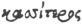

  
[Intangible Textual Heritage](../../../index.md)  [Legends &
Sagas](../../index)  [England](../index)  [Index](index.md) 
[Previous](str12)  [Next](str14.md) 

------------------------------------------------------------------------

  
*Stonehenge, A Temple Restor'd to the British Druids*, by William
Stukeley, \[1740\], at Intangible Textual Heritage

------------------------------------------------------------------------

p. 47

### CHAP. XI.

*Of the original name of* Stonehenge*, and a conjecture of the general
time of building such kind of works. Of* Wansdike*, by whom made and
when. Of* Vespasian's *camp.* Stonehenge *was call’d the* Ambers*, or
Main* Ambres: *which mean the anointed stones, i.e. the consecrated, the
sacred stones? The meaning of the word* Ambrosia*. The* Tyrian Hercules
*brought the* Druids *hither, with* Abraham's *religion.* Apher *a
grandson of* Abraham's*, his companion*.

I Have inform’d the reader, to the best of my skill, what was, and what
is the state of *Stonehenge*, both above, and below ground. I apprehend,
it will be expected, that I should say somewhat, concerning the
antiquity and time of erecting these works, especially of *Stonehenge*.
But what can we say, of a matter so very remote? where the oldest
memoirs and reports of the oldest nation inhabiting the island, can give
us no satisfaction about it: but are as far to seek, as to the founders
of this wonderful work, as we are, at this time, and are forced to apply
to magic: in order to account for it. Notwithstanding, I shall endeavour
to satisfy the readers curiosity, in this point, as well as I can; by
giving him my own opinion about it. Not doubting of his candour, in so
arduous an attempt: which may perhaps be an amusement to him, whether it
gains his belief, or not. Therefore, I shall recite, in short, what
occurs to me, on this subject. 1. As to the antiquity of these temples
in general. 2. Of the time of founding *Stonehenge*.

The former will anticipate, in some sort, what I promis’d, in treating
of the temples of the Druids in general. But I am naturally led to it,
here, by observing, that the name of the adjacent town of *Ambersbury*,
points out a relation to the work of *Stonehenge*, and to the ancient
name of it. For as we took notice at first, the present name of
*Stonehenge*, is purely *Saxon*, given by our latest ancestors, by a
people wholly strangers to the purport of the thing, that had no notion,
no report of its having once been a sacred place; and signifies no more
than hanging-stones, or a stone-gallows. The ancient *Britons* call’d it
*choir-gaur*, which the *Monks* latiniz’d into *chorea gigantum*, the
giants dance; a name suited to the marvelous notion they had of the
structure, or of the reports of magic, concern’d in raising it. But I
had rather chuse to think *choir gaur* in *Welsh*, truly means, the
great church; the cathedral, in our way of speaking. A general title,
which the *Welsh* inhabitants, the remnants of the *Belgæ*, conquer’d by
the *Romans*, gave it; as well knowing the true use of it, and even
frequenting it in a religious way. Tho’ they had driven off the first
possessors of it, and the builders: I mean in *Divitiacus* his time, or
sooner, before the *Roman* invasion.

There is a very plain reason: that *Stonehenge* was built, before the
*Wansdike* was made, and *that* was the last boundary of the *Belgic*
kingdom in *Britain*. The stones of which *Stonehenge* is compos’d, were
fetcht from beyond that boundary, consequently *then* an enemies
country. It seems not improbable, that the *Wansdike* was made, when
this *Belgic* kingdom was at its height, and that time we may well guess
at, from *Cæsar*. "He tells us in *Bell. Gall. Lib*. II. 4. the *Belgæ*
are of *German* original. By force of arms, they possess’d themselves of
the countries, south of the *Rhine* and towards the ocean, driving out
the *Gauls*. They were a very warlike nation, and could produce 100 000
men in arms. That one of their kings *Divitiacus*, in the memory

p. 48

of some then living, obtain’d the government, both of great part of Gaul
and in Britain too." I believe the *Belgæ* and *Sicambri*, all one
people of *German* original. Our *Welsh* call themselves *Cymri*, and
from them *Cumberland* has its name. It is very just to think this
*Wansdike* was made in the time of *Divitiacus*, both because of the
greatness of the work, suiting so potent a prince, and because it is the
laic boundary: after that time, the *Roman* power swallowing up all
divisions.

I judge, we may reasonably place the time of making the *Wansdike*,
about 50 years before *Cæsar* wrote, we may say AUC. 650. *Divitiacus*
probably ordered it to be made in person. And it seems to have been
drawn from the upper end of the *Tees* river, about *Whit-church*, and
*Andover*, in *Hampshire:* to the *Avon* river, about *Bristol*. These
two rivers and the *Wansdike* separated the *Belgic* kingdom from the
old *Celtic Britons*. They by this means, were driven from this
beautiful country, and from their stately temple of *Stonehenge*, by
these powerful invaders. It is remarkable enough, that the inhabitants
of *Somersetshire*, the ancient seat of the *Belgæ*, retain still the
*Belgic*, liquidating pronunciation, *v* consonant for *f*. *z* for *s*.

The *Devizes* is a town in the middle of the length of *Wansdike*, very
probably erected, among others, to secure this ditch or fortification.
It seems to have been the capital fort or frontier town, and to have its
name from the king, as a trophy or monument of his power: built by him
in person. *Anonymus Ravennas* may possibly call it *Punctuobice*, but
we have no certainty, that his copy retains the word uncorrupt, or that
he transcribed it right: nor what alteration the *Romans* made in the
original word, nor what was made in the later and barbarous times.
However there seems enough therein, as well as in the present name of
the town, to countenance our conjecture. The former part of the word
*punctuo*, which Mr. *Baxter* thinks monstrous, may come, perhaps, from
the *German* word *pooghen*, which signifies an arduous work, and might
regard the castle here, which is said to have been once, the strongest
in *Europe*. *Neubringensis* calls it *Divisæ*. They tell us legendary
forces of its being built by an old *British* king.

*Divisus* was probably the name of this *Belgic* Monarch, or *Duiguis:*
as *Gluiguis* king of *Demetia* in *Wales* is wrote *Glivisus* in
*Toland*, p. 186. and the termination may have been form’d into *Latin*,
from the *Celtic* word *taeog dux*. Whence, perhaps, the *Etruscan*
*Tages*, so much boasted of in their antiquities; likewise the modern
*Doge* of *Venice*. So that *Divitiacus* may well be *Divisus dux*. The
name of the *Wansdike*, I shewed to be purely *Celtic*, [p.
4](str03.htm#page_4.md).

It is an ancient oriental custom to make these boundary ditches. Thus
the land belonging to the several tribes of *Israel* was marked out by a
ditch, as we read in the accounts of the holy land. Particularly the
author of *le voyage de la terre sainte*, printed 1675. Paris, p. 57.
says, "he travell’d five or six miles along such a ditch going from
*Joppa* to *Jerusalem*, which parted the tribes of *Benjamin* and
*Judah*." ’Tis recited *Joshua* XV.

The monkish writers make much ado about *Aurelius Ambrosius*, a
christian king of the *Britons* (in the time of our great ancestor
*Hengist*) building *Stonehenge*, by the help of *Merlin Ambrosius* the
magician, in memory of the *British* nobility slain treacherously by
*Hengist*, at *Ambresbury*. Some say the fact was committed *ad pagum
Ambri*, others call it *cœnobium Ambrij*, others *ad montem Ambrij*. One
while they refer the name to *Ambrosius*, another time to an Abbot
*Ambrius*, and this was among our *Roman* *British* ancestors, who were
christians. They add too, that *Merlin* fetch’d these stones out of
*Ireland*, that they had been brought before, out of *Africa* into
*Ireland:* that he set them up here in the same form, by art magic; and
that the stones were of a medicinal Virtue. These matters we read in
*Girald. Cambrens*. de admirand. Hib. c. 18. *Higden*'s Polychron. v.
*Geoff. Monmouth* VIII. *Matt .Westminster*, &c.

  [  
Click to enlarge](img/pl25.jpg.md)  
The Approach to Radfin fronting the Avenue of Stonehenge 8. June 1724.  
A. the avenue. B. the old Kings barrows. C. The new Kings barrows. D.
Vespasians camp. E. the beginning of the avenue.  

p. 49

This calls to my memory, what the above-mention’d Dr. *Harwood* inform’d
me, he had heard the great Sir *Christopher Wren* say, that there were
such structures as *Stonehenge*, in *Africa*, being temples dedicate to
*Saturn*. But I need not be tedious in observing, how absurd the
*Monkish* reports are; of a christian king erecting *Stonehenge*, as a
sepulchral monument for the *British* nobility, massacred in the
monastery of *Ambresbury*. At the same time they say, their bodies were
buried in the church-yard of the monastery. Nor how they confound the
names of *Ambrosius* the king, *Ambrius* the abbot, the town, abby and
mountain of *Ambry*, and perhaps of *Merlin* too, for one of them was
call’d *Ambrosius*. But their affirming, the edifice came out of
*Africa* into *Spain*, thence into *Ireland*, thence into *Britain*, and
of its being erected here in the same form, by art magic; and that the
stones are of a medicinal virtue: these notions lead us to the original
truth, of the Druid founders, and that *Stonehenge* had originally, the
name of *Ambres*, and from it the adjacent town of *Ambresbury* had its
name.

To pursue this matter a little further. Between *Stonehenge* and the
town, hanging over the river, upon elevated ground is a fine and ancient
camp, commonly call’d *Vespasian*'s, and not without much probability,
attributed to him. We have often had occasion to mention it before. That
great man, destin’d by providence for executing his final vengeance, on
the people of the *Jews*, and thereby accomplishing our Saviour's
predictions; by his successes in this place, pav’d a road to the
imperial dignity. Having conquer’d the isle of *Wight*, he pursued his
good fortune, higher up into this country, where he made this camp, and
another across the heath, call’d *Yanesbury*; which seems to retain the
latter part of his name. The camp we are speaking of near *Ambresbury*,
is an oblong square, nicely placed upon a flexure of the river, which
closes one side and one end of it. There is an old barrow inclos’d in
it, which, doubtless was one of those belonging to this plain, and to
the temple of *Stonehenge*, before this camp was made. It is pretty to
observe, that the road from *Stonehenge* to *Ambresbury*, runs upon the
true *via prætoria* of the camp. The Generals tent or *prætorium* was in
that part south of the road, between it and the river, toward little
*Ambresbury*. There is another gate of the camp, at the lower end,
northward, the *porta prætoria ordinaria*, in the Roman language. Now I
apprehend, that *Stonehenge* was originally call’d the *Ambres*, from
thence this camp was call’d *Ambresburgh*, and thence the name of the
town underneath.

Mr. *Camden* writes, "that near *Pensans* in *Cornwall*, is a very
remarkable stone, call’d *main Ambre*, which tho’ it be of a vast
bigness, yet you may move it with one finger: notwithstanding a great
number of men cannot remove it from its place. The name is interpreted
the stone of *Ambrosius*." A picture of it in *Norden*'s history of
*Cornwall*, p. 48. I have seen one of these rocking stones, as call’d
commonly, in *Derbyshire*. Mr. *Toland* in his history of the *Druids*,
mentions it too, and says there are such in *Wales* and in *Ireland*,
Sir *Robert Sibbald* mentions them in *Scotland*, all rightly judg’d to
have been done by the Druids. Sir *Robert* speaking of the rocking stone
near *Balvaird* (or the *Bards* town) in *Fife:* "I am inform’d (says
he) that this stone was broken by the usurper *Cromwell*'s soldiers. And
it was discover’d then, that its motion was perform’d, by a yolk
extuberant in the middle of the under surface of the uppermost stone
which was inserted in a cavity, in the surface of the lower stone." This
is the artifice of the stones at *Stonehenge*, but applied here by the
Druids for a moveable principle, as there, for stability. I call them
mortaise and tenon: and before observ’d them to be of an egg-like form;
which Sir *Robert* calls a yolk. The *Main Amber* in *Cornwall* was
likewise destroy’d in the civil wars, by one of *Oliver*'s governors.
These reformers had a notion of these works being superstitious matters.
*Main Ambre* is *lapis Ambrosius*, or *petra Ambrosia*. And that name
leads us to consider the famous

p. 50

*petræ Amhrosiæ*, on the coins of the city of *Tyre*. A specimen of
them, I have drawn on the *Plate* following.

 

These, and many more of the like sort, struck by the city of *Tyre*, in
honour of their founder *Hercules*, may be seen in *Vaillant*'s second
Volume of colony coins, *pag*. 69, 148, 218, 251, 337.

They represent two great, rough stones, call’d *petræ ambrosiæ*, with an
altar before them, and an olive tree; *Hercules* the hero of *Tyre*, the
famous Navigator of antiquity, their founder, sacrificing. On some of
the coins *petræ ambrosiæ* wrote in Greek. He is represented indeed like
the *Greek Hercules*, but in the latter times of the *Roman* empire,
when these coins were struck, they at *Tyre* were as far to seek about
the true meaning and origin of their first antiquities, as we of ours.
And what knowledge they had of them, was from legendary reports of the
*Greeks*, who chiefly, among the heathens, had the knack of writing.
These reports, as we may find in *Nonnus* his *Dionysiacs*, 40. and 41.
acquaint us, that *Hercules* invented shipping, as a latin poet too
intimates, *Tibullus*.

*Prima ratem ventis credere docta Tyrus*.

They acquaint us that he ordered *Tyre* to be built, where the *petræ
ambrosiæ* stood, which were two moveable rocks, standing by an olive
tree. He was to [sacrifice](errata.htm#6.md) on them, and they should
become fixt and stable: rather, the City should be built with happy
auspice, and become permanent.

Here are our *Main Ambres*, made artfully moveable, a kind of altars, or
pillars, the same as the pillars of *Hercules* so fam’d, and as little
understood. They were the original patriarchal altars, for libations and
sacrifices, and mean, in general, their Altars, whether moveable or
immoveable: or as we may speak, their temples, which imply an altar
properly, inclosed with stones and a ditch, or ground dedicated and set
apart for public celebration of religious rites. For the word
*Ambrosius* means in general, consecrated, dedicated to religious use.

Beside the *petræ ambrosiæ* of *Tyre*, and our *main ambres* of
*Britain* and *Ireland*, we meet with another in *Hephæstion*'s History
III. 3. "Speaking of *Hercules*, he mentions the *Gygonian* stone, as he
calls it, near the ocean, which may be mov’d with the stalk of an
*asphodel*, but can’t be remov’d by any force." It seems this word
*Gygonius* is purely *Celtic*. For *gwingog* signifies *motitans*, the
rocking stone; and *gwgon* is what the boys with us call a gig, or
little top. For these *Gygonian* stones are of that shape, pyramidal.

  [  
Click to enlarge](img/pl26.jpg.md)  
Plate 26. (above) Prospect of Vespasians Camp near Ambersbury. Aug. 7
1723  
(below) Prospect from the 7 barrows east of Ambersbury to the opening of
the Avenue of Stonehenge, &c.  
A. the beginning of the avenue.  

p. 51

No wonder these matters are well nigh lost, in the mist of extreme
antiquity, when even the meaning of the word *ambrosius* was hardly
known, either to the antients or moderns, till Mr. *Baxter* discover’d
it, in his glossary. It signifies oil of roses, *rosaceum*: the most
antient kind of perfume. In the 4th *Odyssy*, v. 445. *Edothea* a sea
goddess, teaches *Menelaus* and his companions, to cure the odious smell
of the sea calves.

 

\[paragraph continues\] She put *ambrosia*
to their noses, sweetly smelling. Again, in his hymn to *Venus*, the
graces washt the goddess, and anointed her with oil ambrosial: such as
becomes the immortals.

 

\[paragraph continues\] Lastly, in
*Iliad*. XXIII. *Venus* anoints *Hector*'s body with ambrosial oil of
roses,

 

\[paragraph continues\] Which is a
tautology. For from length of time, they scarce knew the true meaning of
the word in *Homer*'s age.

*Virgil* seems to understand but somewhat of the original meaning of the
word, speaking of *Venus*; her hair was anointed with ointment perfum’d.

*Ambrosiæq*\[*ue*\]*; comæ divinum vertice odorem  
Spiravere* -------------- ---------------------------       Æneid.
\[Book I, l. 403--JBH\]

In *Pliny* Nat. Hist. XIII. 1. we find the *oleum rhodinum* most
antient, common and simple. And this is the true *ambrosia*, which from
its very antient use in sacred rites, had almost lost its meaning; and
was us’d to signify, one while, the food of the gods, another time,
immortality; again, whatever is divine, or appropriate to the gods. But
simply, it signifies oil of roses, still from its first use, in sacred
matters, it imports anointed, in a religious sense; consecrated,
dedicated. Then *main ambres*, *ambres*, *petræ ambrosiæ*, signify the
stones anointed with holy oil, consecrated; or in a general sense a
temple, altar, or place of worship.

The truth is, it was a patriarchal custom to consecrate their altars,
pillars, or in a general word temples, by anointing with oil, either
simple or perfum’d. Rose oil being the oldest, engross’d the general
name of the action; so that a stone anointed with oil of roses, is a
*main amber*, or *lapis ambrosius*. The same is an altar, or stone
dedicate to religious use. The plural number, *petræ ambrosiæ*, import a
church or temple, in our way of speaking.

We have an illustrious instance of this practice in the holy Scriptures,
and the earliest. *Gen*. xxviii. This is not commonly understood by
writers. ’Tis the moving and memorable history of young *Jacob*, sent
away from his father's house alone, to take a long journey to some
unknown relations. He came to a place, call’d afterward *Bethel*, and
sleeping with his head on a stone for a pillow, had a celestial vision;
and a promise from God, of the highest importance to him and all
mankind. Awaking, he thought the place had been holy ground, where,
perhaps, his grandfather *Abraham* had before-time built an altar; an
house of God, or gate of heaven, as he elegantly names it. "Therefore he
rose up early in the morning, which was one circumstance (in

p. 52

patriarchal times) of the work he was going about, and took the stone
that he had put for his pillow, and set it up for a pillar; and poured
oil upon the top of it, and called the place *Beth-el*, *i.e.* the house
of God. Then he vowed, that if God would please to prosper him in his
journey, and bring him back into his own country, he would build a
temple there, and consecrate to God the tythe of his substance, as was
the manner in those times."

This is in reality a votive, patriarchal temple, altar or house of God,
which he not only vows to build, but at the same time endows it. The
stone which *Jacob* anointed, was not an altar properly, lying on the
ground whereon to make a libation, but he set it up as a pillar. It was
one of the upright stones, which the scripture calls pillars, as
standing of itself; a part of the circle of stones, inclosing the altar.
And by the act of anointing, *Jacob* consecrated it, as the manner then
was, defined it for a sacred purpose, as an earnest of his will in good
time to fulfil it. And this he did fulfil, *chap*. xxxv. building the
celebrated temple of *Bethel*. Here *Jeroboam* set up one of his golden
calves. At last it was destroy’d by *Vespasian*.

In Exod. xxiv. 4. "we have an instance of *Moses* rising up early in the
morning and building an altar, and setting up 12 pillars around it."
This was before the tabernacle was made, which introduced the custom of
cover’d temples.

But so famous was that patriarchal temple of *Jacob*'s, which he built
at *Bethel*; that the heathen called all their temples of that sort,
when they were perverted to idolatrous purposes, *Bæthylia*, *lapides
Bætyli*, and the like. Which indeed is but another manner of expressing
*lapis Ambrosius*, or our *Main Ambre*. And according to custom, the
fabulous *Greeks* having lost the true history of its origin, affix’d
many strange stories to it; as of *Saturn* devouring such a stone, wrapt
up in a skin, instead of his Son *Jupiter*: which seems to be form’d
from the memory of praying at these places, in the name of the
mediatorial deity, as the patriarchs did. And *Sanchoniathon* tells us,
the god *Ouranus* deviled *Bætylia*, or animated stones. He means our
rocking stones, *gygonian* stones. I shall show in my discourse on that
subject, that by *Ouranus*, he means righteous *Noah*, who, according to
patriarchal usage, builded an altar unto *Jehovah*, *Gen*. viii. 20.
meaning one of these patriarchal temples. In time, by the corruption of
mankind, these places were desecrated to idolatrous purposes; and
writers pervert the intent of them. So that God Almighty, raising up the
Mosaic Dispensation, was oblig’d to interdict the very use and practice
of these open temples, and introduce the cover’d one of the tabernacle;
by way of opposition to heathenism, as well as with other important
views.

We find now the meaning of anointed stones in antiquity, and the
olive-tree set by the stones on the *Tyrian* coins. As the very learned
Author of *Archæologia Græca* observes, on the affair of consecration,
"they were more or less sumptuous and expensive, as other parts of
divine worship, according to the ability of the worshippers." Young
*Jacob* a traveller us’d plain oil, part of his *viaticum*, others us’d
perfum’d oil, or *ambrosia*. That author cites us from *Athenæus*, the
method of consecrating *Jupiter Ctestias*'s statue with a libation
call’d *ambrosia*: and others by anointing with oil, prayers and
libations, *Exodus* xxx. 22. We have the holy precious ointment made
under the *Jewish* dispensation for the like purpose. And we use such,
for inauguration of our kings, to this day.

The *Tyrian Hercules* who built *Tyre* and set up the *petræ Ambrosiæ*
in those coins, (if I mistake not) liv’d as early as the time, of
*Jacob*'s anointing the stone at *Bethel*. The great *Bochart*, who
penetrated very deep into the *Phœnician* learning, looks upon it as a
clear matter, that in *Joshua*'s time, the *Phœnicians* sent innumerable
colonies, into the mediterranean coasts, and even to the ocean. In the
preface to his admirable work *Canaan*, he says, "he has a great
suspicion, that colonies went abroad this way, before that time.
Particularly, he asserts, that *Hercules*, in *Eusebius* sirnamed
Desanaus,

  [  
Click to enlarge](img/pl27.jpg.md)  
Plate 27. The Beginning of the Avenue to Stonehenge, where it is Plow’d
up.  
A. The 7 Kings Barrows. B. The Avenue going towards Stonehenge. C. The 6
Old Barrows.  

p. 53

who was famous in *Phœnicia* before the *Exodus*, is the same, who
conquer’d *Antæus* in *Africa:* which in *Eusebius*, is set 56 years
before. He is call’d *Hercules primus*, and that is 63 years before the
*Exodus*, in *Eusebius*'s chronology." Again, he judges it to be 2000
years distance between the later *Roman* times and the first *Hercules*.
Now from *Constantine* the great, 2000 years carries us up to *Jacob*'s
time. And he proves, from *Aristotle de mirabilibus*, that *Hercules*
built *Utica* in *Africa*, at that time; wherein *Eusebius* says he was
famous in *Phœnicia*, and this must be when *Hercules* was old. He
having conquer’d *Antæus* in that country, when he was young.

But I find in the same *Eusebius*, *Prometheus* is set 111 years still
earlier, before the first mention of *Hercules*, this is during the life
of the patriarch *Joseph*. *Prometheus* and *Atlas* were brothers, and
students in Astronomy, with whom the story of *Hercules* is always
conjoin’d. And so high at least, I must place the time of our *Tyrian
Hercules*, who is the same as *Desanaus*. But *Marianus* transcribing
*Eusebius* calls him *Dosenaus*. And *Hesychius* says *Dorsanes* is a
name of *Hercules*, with the *Indians*. But by the *Indians*, it is
likely, the *Phœnicians* and *Arabians* are meant; for the ancient
*Greeks* call all the country to the east of the mediterranean sea,
*India*. And then we may in some measure understand the report of
*Ammianus Marcellinus*, who takes it from *Timagenes*, an old *Greek*
Historian, but a *Syrian* by nation, speaking concerning the peopling of
*Gaul*, "that the more ancient *Hercules* conducted the *Dorienses*, to
the countries bordering on the ocean." Perhaps the *Dosareni* are meant,
an *Arabian* nation, mention’d by *Ptolemy*. A Deity of the *Arabians*
was called *Dusaris* or *Dosaris*, mention’d by *Step. Byzant*, *Suidas*
and *Tertullian*. A difficult word, which *Bochart* cannot trace from
the *Arabian* language; nor is it easy to say, what Deity he was. No
wonder such matters are obscur’d, thro’ so long distance of time. Some
think him *Bacchus*, some *Mars*, and why not *Hercules?* for after
mankind laps’d into idolatry, these three were much confounded.

I find sufficient testimony, of the *Tyrian Hercules* coming from
*Arabia*, about the red sea, or having companions, that were natives of
that country. For this reason they nam’d an island at the city of
*Gadis*, which they built, *Erythia*, *Erythræa*; which *Pliny* IV. 22.
says, was so called from the first possessors, the *Tyrians*, who came
from the *Erythræan* sea: which is the red sea. *Solinus* says the same.
That sea had its name from *Erythras*, as the *Greeks* and the same
*Pliny* write; who is *Edom* or *Esau*, brother of *Jacob*. The words
are synonymous, signifying red. The reports of *Hercules*'s expedition
to that island *Erythræa*, now *Cadiz*, is famous in all the old *Greek*
writers.

This relation we have given of the *Tyrian Hercules*, that he lived
about the time of *Abraham*, or soon after, according to *Eusebius*'s
chronology; that he came from about the red sea, and had companions in
his travels, that lived thereabouts, is much confirm’d by what
*Josephus* writes, from *Alexander Polyhistor*; who cites it from a very
ancient author, called *Cleodemus*, sirnam’d *Malchus*, who wrote a
history of the *Jews*, agreeable with the *Mosaic*. He says, *Abraham*
had several Sons by *Keturah*, he names *Apher*, *Suris* and *Japhra*.
That *Apher* and *Japhra* were auxiliaries to *Hercules*, when he fought
in *Lybia* against *Antæus*. That from *Apher* the country was nam’d
*Africa*. That *Hercules* married his daughter, and begat of her
*Dodorus*. *Josephus* in the same chap. of the first book of his
antiquities, writes, that *Abraham* had six sons born of *Keturah:* men,
heroic and wise. That they and their posterity were settled in
*Troglodytis*, in the country of *Arabia fœlix*, reaching to the red
sea. He makes *Opher* or *Apher* grandson to *Abraham*, by *Midian* his
son. That *Apher* waged war in *Lybia* and conquer’d it, and plac’d his
sons there, who call’d the Country *Africa* from their father, So
*Schindler* in his lexicon, *pag*. 1361.

p. 54

Making proper allowance for relations of such very antient matters,
transmitted by historians of different countries, different languages,
and so often transcribed and translated, before they come down to us;
here is enough to confirm and explain, what we have before advanc’d:
both as to time and place, and matter. And we cannot but see what
relation our *Main Ambres* and the *gygonian* stone by the ocean, have
to the *petræ ambrosiæ*, which *Hercules* set up at *Tyre:* which is the
drift of my discourse. That very *gygonian* stone, for ought I see, may
be our rocking-stone near *Pensans*, it stands by the sea-side. Nor do I
see any absurdity, if we judge, that it was erected there, by *Hercules*
in person. Near it is that other famous Druid temple call’d *Biscawoon*,
consisting of 19 pillars in a circle and a central *kebla*. The entrance
is made of 2 somewhat large stones, than the rest: not improbably one of
the *Herculean* labours. It is affirm’d by the best authors, that our
*Tyrian Hercules*, the more ancienter *Hercules*, built the city of
*Gadis*, at *Cadiz* now. And where-ever *Hercules* came, there we read
of his pillars. Thus *Avienus*.

*Hic Gadir urbs est, dicta Tartessus prius,  
Hic sunt columnæ pertinacis Hercules*.

\[paragraph continues\] *Arrian* II. of
the life of *Alexander*, remarks, "that *Gadis* was built by the
*Phœnicians*. There was a temple of *Hercules*. The form, the sacrifices
and ceremonies there perform’d, are all after the *Phœnician* manner."
*Strabo* in his *Lib*. III. says there were two pillars in this temple,
dedicate to *Hercules*; which the learned *Tristan* in his commentaries
on medals, p. 384. says, he doubts not, but they were *petræ ambrosiæ*,
in imitation of those of the same name, in the temple of *Hercules* of
*Tyre*, which *Herodotus* in *Euterpe* speaks of. He appears to have
been an extraordinary genius, and a man of great piety withal. Therefore
where-ever he came, he made these patriarchal temples, or set up pillars
of stone, as antiquity called them. Just as the patriarchal family did
in the land of *Canaan*. And *Hercules* seems to me, to have been a
great man, raised up by providence, to carry the reform’d patriarchal
religion, to the extremest part of the then known western world. Here, I
suppose, the religion of *Abraham* remain’d pure, for many ages, under
the Druids, till perhaps corrupted by incursions from the continent. It
is remarkable, that the *Romans*, who were so catholic, (different from
those we now absurdly call *Roman* catholics) as to permit all
religions, persecuted only that of the Druids, and the christian: whence
we are naturally led to think, there was a good deal of resemblance.
Indeed, the Druids are accused of human sacrifices. They crucified a man
and burnt him on the altar; which seems to be a most extravagant act of
superstition, deriv’d from some extraordinary notices they had of
mankind's redemption: and perhaps from *Abraham*'s example
misunderstood. But as to human sacrifices simply considered, the
*Romans* themselves and all other nations upon earth at times, practis’d
them.

To this *Hercules*, antiquity affixed very many names, from different
notions of him, retain’d in different countries; and after idolatry took
root, he was worshipp’d under those names of consecration, according to
the old method. For instance, one of his names was *Palæmon*. *Palæmon*,
says *Hesychius*, is *Hercules*. The *Greeks* made him a sea Deity, who
had been so great a sea-captain. They call him *Melicerta*, which is his
*Phœnician* name *Melcartus*, king of the city. *Ovid* tells us the
story in *Met*. IV. *Nonnus* calls him *Afrochiton* starry-robed, from
his being made a constellation in heaven. In the *Gallic* picture of
him, which *Lucian* saw, he is represented with a sphere in one hand,
under the name of *Ogmius*. Mr. *Toland* in his history of the Druids,
shews us the true interpretation of that word, from the *Irish*
language; after the learned had in vain attempted the explication of it.
From thence we infer he brought the use of letters hither. *Cæsar*
informs us, the Druids had them.

  [  
Click to enlarge](img/pl28.jpg.md)  
Plate 28. A direct View of Stonehenge from the union of the two
Avenues.  
A. the wing of the avenue going to Radfin. B. to the Cursus.  

p. 55

\[paragraph continues\] He is called
*Assis*, by the easterns, which signifies the valiant: the same as
*Hæsus* of the *Germans*.

Beside the patriarchal custom of building these places of worship, and
consecrating them with oil, we find many other footsteps of that most
ancient religion, in the history of *Hercules*. *Silius* speaking of the
strange rites used in the *Gaditan* temple of *Hercules*, says, the
priests officiated there barefooted, prais’d chastity, had no statues,
us’d white linen surplices. And it is a notorious custom with the
ancient *Phœnicians*, to pay tithe. Indeed they paid tythe to
*Hercules*. Which only imports, that it was a precept and practice
introduc’d by *Hercules*. And after they had deified *Hercules* they
practis’d it toward him. This was a common method, when idolatry began.
I shall treat more largely of these affairs; when I discourse expressly
of the patriarchal religion. Likewise, I shall prove more fully, from
chronological characters, that this *Hercules* liv’d at the time, we are
speaking of, in the *canon Mosaicæ chronologiæ*. What I now recite,
concerning these matters, I could not well avoid, as they in my
apprehension. relate to the name of *Stonehenge*.

*Pliny* *Nat. Hist*. VII. 56. gives us a testimony, of our *Hercules*,
under the name of *Melcartus*, (as *Bochart* rightly corrects it) first
bringing tin into *Greece*, from the *Cassiterid* islands. By which the
*British* are meant. The tin of *Tyre*, which the merchants of *Greece*,
came to buy, at the fairs of that city, is mention’d *Ezekiel* xxvii.
12. which, no doubt, came from hence. But it is much earlier mention’d,
among lead and other metals, when the *Midianites* had it in *Moses*'s
time, *Numbers* xxxi. 22. the *Chaldee* and *Arabic* version there, use
the word *kastira*, the *Hierosolymitan* *kistara*. No wonder the
*Midianites* should then abound with tin: when we were told by
*Josephus*, that *Apher* son of *Midian*, was one of *Hercules*'s
companions. The LXX. \[i.e., Septuagint--JBH\] in that passage of
*Numbers* call it  
\[κασσίτερος--JBH\]. But tin is mention’d earlier still, in *Job* xix.
24. and *Job* liv’d in this same country, on the borders of *Arabia*.

It is very evident from *Bochart*, that the *Phœnicians*, had sail’d
quite round *Britain*, by what he writes of *Thule*. How then can we
doubt but the great island, which they found in the extremest west, was
*Britain?* but they kept their gainful navigation hither so secret, for
many centuries, that even *Herodotus* the earliest *Greek* writer
professes he knows not, whence the tin comes. *Britain* was the only
country, where it could come from, in any quantity, as *Pliny* says. But
from this great secrecy of the *Phœnicians*, we have lost the high
antiquities of *Britain*, as unknown to the *Greeks*; the only heathen
nation that had the address to commit things to writing. Therefore we
must be content with what small remains of this kind, can be fish’d out
of the wreck of time, by such conjectural methods, as antiquaries cannot
avoid insisting on.

In *Devonshire* is *Hartland* point so call’d corruptly, as the
excellent *Camden* observes, for *Herculis promontorium*. And upon the
*Durham* sea coast is a town on a promontory call’d *Hartlepool*. A
village call’d *Hart* near it. I take it to have been call’d by the
*Greek* traders here *Heracleopolis*. And hence, probably came that fine
old altar in *Greek*, dedicated to the *Tyrian Hercules*, which Mr.
*Roger Gale* and I copied, in *Corbridge* church-yard.

From these and many other considerations of this kind, which I shall
hereafter treat of more largely and professedly: I cannot but join in
opinion with *Franc. Philelphus* in his epistles, and *Lilius Giraldus*
in his *Hercules* mention’d by Mr. *Camden*, in the last quoted passage,
and with many other writers, that the very ancient *Phœnician* or
*Tyrian Hercules* conducted an eastern colony hither, upon the
aborigines; with whom came the Druids, the builders of *Stonehenge* and
the like works among us. And let this suffice for what I promis’d upon
the first head of this chapter, *viz*. to speak of the antiquity of
these works in general. 2. We are to speak of the time of founding
*Stonehenge*.

------------------------------------------------------------------------

[Next: Chapter XII](str14.md)
