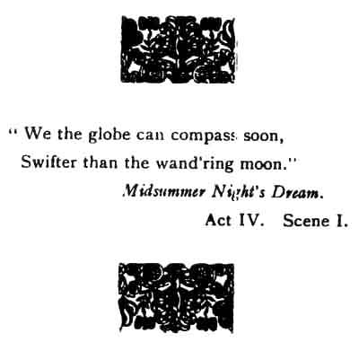

  
[Intangible Textual Heritage](../../../index)  [Sagas and
Legends](../../index)  [English Folklore](../index)  [Index](index) 
[Next](tdp01) 

------------------------------------------------------------------------

# Tales Of The Dartmoor Pixies

#### Glimpses Of Elfin Haunts And Antics

## by William Crossing

###### \[b. 1847 d. 1928\]

#### London, Hood

#### \[1890\]

###### Scanned and redacted by Phillip Brown. Additional formatting and proofing at Intangible Textual Heritage, by John B. Hare. This text is in the public domain. This file may be used for any non-commercial purpose, provided this notice of attribution is left intact.

 

------------------------------------------------------------------------

[Next: Preface](tdp01)
