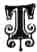

  
[Intangible Textual Heritage](../../../index)  [Sagas and
Legends](../../index)  [English Folklore](../index)  [Index](index) 
[Previous](tdp00)  [Next](tdp02) 

------------------------------------------------------------------------

Preface

 

 \[T\]HE tales related in the
following pages, I have gathered from the peasantry of Dartmoor, and
they may be accepted as representative of the class of stories told of
the elves of superstition--the pixies.

Had my design been simply to have presented the reader with a collection
of these, I might have filled a greater number of pages, but I have had
a different aim in view. What I have endeavoured to do has been to give,
by means of these tales, as clear an idea as possible of the pixy
superstition as it formerly existed, believing that the fanciful notions
of our forefathers should not be regarded as altogether unworthy of
attention, but that upon investigation they will probably be found to
yield something of value to the student of folk-lore.

To this end I have chosen such tales as I considered would best give the
reader an acquaintance with the kind of actions in which the pixies were
said to indulge, at the same time refraining from including any that are
found in the pages of other writers.

That the ideas respecting the elfin race here treated of are of very
different character from what they were a generation or two since is
most true; but it is none the less interesting to note that though the
existence of 'the little goblins is looked upon by the peasant as being
more than doubtful, and in many cases regarded with actual scepticism,
the deeds with which they were formerly credited are not yet entirely
forgotten.

 

Splatton,

South Brent, Devon,

11th June. 1890.

 

------------------------------------------------------------------------

[Next: Chapter I: The Moorland Haunts of the Pixies](tdp02)
