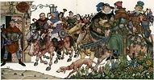

  
[Intangible Textual Heritage](../../../index.md)  [Legends and
Sagas](../../index)  [England](../index)  [Index](index)  [Next](tfc01.md) 

------------------------------------------------------------------------

[Buy this Book on
Kindle](https://www.amazon.com/exec/obidos/ASIN/B002IKKI0C/internetsacredte.md)

------------------------------------------------------------------------

  
*Tales from Chaucer*, by Charles Cowden Clarke, \[1833\], at Intangible
Textual Heritage

------------------------------------------------------------------------

###### TALES FROM CHAUCER TOLD FOR YOUNG PEOPLE BY CHARLES COWDEN CLARKE

# Tales from Chaucer

## The Canterbury Tales by Geoffrey Chaucer:

### selected tales told for young people

### by Charles Cowden Clarke

##### and illustrated with miniatures

### by Arthur Szyk

#### The Heritage Illustrated Bookshelf

#### \[New York: The Heritage Press\]

#### \[1947\]

#### Text originally published London: Effington Wilson \[1833\]

Scanned, proofed, and formatted at Intangible Textual Heritage, July
2009, by John Bruno Hare. This text is in the public domain in the US
because it was published prior to 1923. The 1947 edition artwork is in
the US public domain because its copyright was not renewed in a timely
fashion.

 
[  
Click to enlarge](img/front.jpg.md)  
Frontispiece  

------------------------------------------------------------------------

[Next: Contents](tfc01.md)
