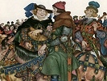

  
[Intangible Textual Heritage](../../../index)  [Legends and
Sagas](../../index)  [England](../index)  [Index](index) 
[Previous](tfc00)  [Next](tfc02) 

------------------------------------------------------------------------

[Buy this Book on
Kindle](https://www.amazon.com/exec/obidos/ASIN/B002IKKI0C/internetsacredte)

------------------------------------------------------------------------

  
*Tales from Chaucer*, by Charles Cowden Clarke, \[1833\], at Intangible
Textual Heritage

------------------------------------------------------------------------

### The Contents

To My Young Readers, PAGE [xi](tfc02.htm#page_xi)

To An Adult Reader, PAGE [xiii](tfc03.htm#page_xiii)

Introduction, PAGE [xv](tfc04.htm#page_xv)

The Prologue, PAGE [1](tfc05.htm#page_1)

The Knight's Tale, PAGE [21](tfc06.htm#page_21)

The Lawyer's Tale, PAGE [54](tfc07.htm#page_54)

The Student's Tale, PAGE [73](tfc08.htm#page_73)

The Wife of Bath's Tale, PAGE [97](tfc09.htm#page_97)

The Squire's Tale, PAGE [106](tfc10.htm#page_106)

The Pardoner's Tale, PAGE [125](tfc11.htm#page_125)

The Nun's Priest's Tale, PAGE [136](tfc12.htm#page_136)

The Cook's Tale of Gamelin, PAGE [148](tfc13.htm#page_148)

The Canon's Yeoman's Tale, PAGE [169](tfc14.htm#page_169)

------------------------------------------------------------------------

[Next: To My Young Readers](tfc02)
