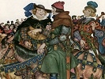

  
[Intangible Textual Heritage](../../../index)  [Legends and
Sagas](../../index)  [England](../index)  [Index](index) 
[Previous](tfc01)  [Next](tfc03) 

------------------------------------------------------------------------

[Buy this Book on
Kindle](https://www.amazon.com/exec/obidos/ASIN/B002IKKI0C/internetsacredte)

------------------------------------------------------------------------

  
*Tales from Chaucer*, by Charles Cowden Clarke, \[1833\], at Intangible
Textual Heritage

------------------------------------------------------------------------

p. xi

### To My Young Readers

I HAVE endeavoured to put these Tales, written by one of the finest
poets that ever lived, into modern language and into as easy prose as I
could, without at the same time destroying the poetical descriptions and
strong natural expressions of the author. My object in presenting them
in this new form was, first, that you might become wise and good by the
example of the sweet and kind creatures you will find described in them;
secondly, that you might derive improvement by the beautiful writing
(for I have been careful to use the language of Chaucer whenever I
thought it not too antiquated for modern and young readers); and,
lastly, I hoped to excite in you an ambition to read these same stories
in their original poetical dress when you shall have become so far
acquainted with your own language as to understand, without much
difficulty, the old and now almost forgotten terms.

I can promise those among you who possess an ear for the harmony of
verse that when you come to read the compositions of this great poet you
will then feel how much they have lost by being reduced to my dull
prose—although I have laboured to render my narratives as much like
*poetical* prose as I was able; and, more particularly, to give them the
air of ancient writing newly dressed up. And I believe I may say that I
have in

p. xii

no instance omitted to introduce a beautiful or natural thought when I
could do so with ease and propriety, and without interfering with the
quick progress of the story.

In the original Tales are many long discussions which you would find
uninteresting at any age; and there are, also, quaint or curious
expressions which would not be pleasing to your differently educated
ears: these I have omitted altogether, except when I felt that they
would preserve the old character of the narration, and not to be too
old-fashioned to be misunderstood by you.

The following sentence from Mr. Lamb's preface to his prose tales from
the plays of Shakespeare—a book every one of you should read—will
explain all I would say upon the present occasion.

"Faint and imperfect images," he says, "they must be called (of the
original dramas), because the beauty of his (Shakespeare's) language is
too frequently destroyed by the necessity of changing many of his
excellent words into words far less expressive of his true sense to make
it read something like prose; and even in some places where his verse is
given unaltered, as, hoping from its simple plainness, to cheat the
young readers into a belief that they are reading prose, yet still, his
language being transplanted from its own natural soil and wild poetic
garden, it must want much of its native beauty."

May you, in reading these pages, experience half the pleasure that the
writing of them has afforded

THE AUTHOR.

------------------------------------------------------------------------

[Next: To An Adult Reader](tfc03)
