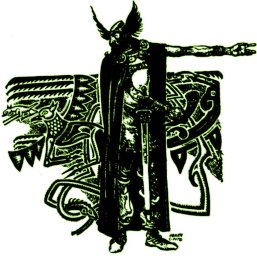

  
[Intangible Textual Heritage](../../../index.md)  [Legends and
Sagas](../../index)  [England](../index.md) 

------------------------------------------------------------------------

<table width="75%">
<colgroup>
<col style="width: 50%" />
<col style="width: 50%" />
</colgroup>
<tbody>
<tr class="odd">
<td width="50%" data-valign="TOP"></td>
<td width="50%" data-valign="CENTER"><h1 id="the-story-of-beowulf" data-align="CENTER">The Story of Beowulf</h1>
<h2 id="by-strafford-riggs" data-align="CENTER">by Strafford Riggs</h2>
<h4 id="not-renewed" data-align="CENTER">[1933, not renewed]</h4></td>
</tr>
</tbody>
</table>

------------------------------------------------------------------------

[Contents](#contents)    [Start Reading](tsb03.md)

------------------------------------------------------------------------

This is a long out-of-print retelling of the Beowulf saga. A prose
translation, it captures the mood of the original without being
self-consciously archaic. The black and white illustrations are stylized
and sometimes a bit cartoonish, and nicely dimensionalize the story.

Thanks to Eliza of [sacredspiral.com](https://www.sacredspiral.com/.md),
for unearthing and transcribing this gem.

------------------------------------------------------------------------

 [Title Page](tsb00.md)  
[Foreword](tsb01.md)  
[Contents](tsb02.md)  
[Part I](tsb03.md)  
[Part II](tsb04.md)  
[Part III](tsb05.md)  
