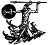

  
[Intangible Textual Heritage](../../../index.md)  [Legends and
Sagas](../../index)  [England](../index)  [Index](index)  [Next](tsb01.md) 

------------------------------------------------------------------------

*The Story of Beowulf*, by Strafford Riggs \[1933\], at Intangible
Textual Heritage

------------------------------------------------------------------------

# THE STORY OF BEOWULF

###### RETOLD FROM THE ANCIENT EPIC

## BY STRAFFORD RIGGS

##### DECORATED BY HENRY PITZ

#### D. APPLETON-CENTURY COMPANY Incorporated

#### NEW YORK

#### \[1933\]

Scanned and proofed by Eliza Yetter, 2006. HTML formatting at Intangible
Textual Heritage, by John Bruno Hare. This text is in the public domain
in the United States because it was not renewed in a timely fashion at
the US Copyright Office.

[  
Click to enlarge](img/illus01.jpg.md)

------------------------------------------------------------------------

[Next: Foreword](tsb01.md)
