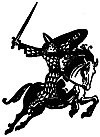

  
[Intangible Textual Heritage](../../../index)  [Legends and
Sagas](../../index)  [England](../index)  [Index](index) 
[Previous](tsb01)  [Next](tsb03) 

------------------------------------------------------------------------

*The Story of Beowulf*, by Strafford Riggs \[1933\], at Intangible
Textual Heritage

------------------------------------------------------------------------

[  
Click to enlarge](img/illus02.jpg)

### The Story of Beowulf

I

WHICH TELLS something of the youth and early manhood of Beowulf, how he
heard of the monster GRENDEL, and of Daneland.

II

WHICH TELLS of Beowulf's reception among the Danes, his encounter with
GRENDEL., and with GRENDEL'S MOTHER.

III

WHICH TELLS of how a DRAGON appeared in Geatsland, and how Beowulf and
Wiglaf destroyed it, and how sleep came to Beowulf.

------------------------------------------------------------------------

[Next: Part I](tsb03)
