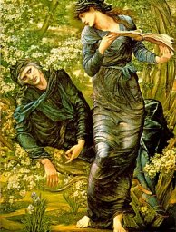

  
[Intangible Textual Heritage](../../../index)  [Legends and
Sagas](../../index)  [England](../index) 

------------------------------------------------------------------------

<table width="75%">
<colgroup>
<col style="width: 50%" />
<col style="width: 50%" />
</colgroup>
<tbody>
<tr class="odd">
<td width="50%" data-valign="TOP"> 
</td>
<td width="50%" data-valign="TOP"><h1 id="the-vita-merlini" data-align="CENTER">The Vita Merlini</h1>
<h2 id="latin-text-by-geoffrey-of-monmouth" data-align="CENTER">Latin text by Geoffrey of Monmouth</h2>
<h2 id="translated-by-john-jay-parry" data-align="CENTER">Translated by John Jay Parry</h2>
<h4 id="copyright-not-renewed" data-align="CENTER">[1925, copyright not renewed]</h4></td>
</tr>
</tbody>
</table>

------------------------------------------------------------------------

This is the Latin text and translation of a narrative of the life of
Merlin by the medieval historian Geoffrey of Monmouth. Thanks to Graeme
K Talboys, who transcribed this text.

------------------------------------------------------------------------

[Title Page](vmtitle)  
[The Life of Merlin](vmeng)  
[Vita Merlini: Latin](vmlat)  
