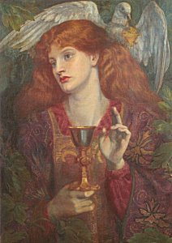

  
[Intangible Textual Heritage](../../index)  [Legends/Sagas](../index.md) 
[Arthur](../eng/index.htm#arthurian.md) 

------------------------------------------------------------------------

<table width="75%">
<colgroup>
<col style="width: 50%" />
<col style="width: 50%" />
</colgroup>
<tbody>
<tr class="odd">
<td data-valign="CENTER" width="50%"></td>
<td data-valign="CENTER" width="50%"><h1 id="from-ritual-to-romance" data-align="CENTER">From Ritual to Romance</h1>
<h2 id="by-jessie-l.-weston" data-align="CENTER">by Jessie L. Weston</h2>
<h4 id="section" data-align="CENTER">[1920]</h4></td>
</tr>
</tbody>
</table>

------------------------------------------------------------------------

[Contents](#contents)    [Start Reading](frr00.md)

------------------------------------------------------------------------

|                                                                                                                           |
|---------------------------------------------------------------------------------------------------------------------------|
|  |

At the advanced age of 70, Jessie Weston, who had spent decades immersed
in the Arthurian canon, wrote this relatively short book to attempt to
explain the roots of the legend of the Holy Grail. She enumerates the
seemingly inexplicable elements of the quest--The Fisher King, The
Wasteland, the Chapel Perilous, and the Grail Cup itself--and ties them
to the symbols and initiatory rites of the ancient mystery religions.
She also attempts to identify the author and locality of the tale. Her
thesis still inspires heated controversy among academics. It is also
claimed that T.S. Elliot's *The Wasteland* was based on this book,
although this has been questioned.

One thing is certain; although this book is one of the bullet-points of
20th century culture, probably very few have read and understood it in
its entirety. Written in a formal academic style, with extensive
passages in a dozen different languages, *From Ritual to Romance* is
frankly a tough, but ultimately very rewarding read.

**Production Notes**: Although this book has been available previously
in etext from several sources, particuarly Project Gutenberg, this is
the first version on the web which preserves the pagination and
italicization of the first edition. This is vital for citation purposes.
Greek and a few other characters have been transcribed in
[Unicode](../../unicode.md), and a number of transcription errors found in
other etexts have been corrected.

--J. Lelievre

------------------------------------------------------------------------

 [Title Page](frr00.md)  
[Preface](frr01.md)  
[Contents](frr02.md)  
[Quotes](frr03.md)  
[Chapter I. Introductory](frr04.md)  
[Chapter II. The Task of the Hero](frr05.md)  
[Chapter III. The Freeing of the Waters](frr06.md)  
[Chapter IV. Tammuz and Adonis](frr07.md)  
[Chapter V. Medieval and Modern Forms of Nature Ritual](frr08.md)  
[Chapter VI. The Symbols](frr09.md)  
[Chapter VII. The Sword Dance](frr10.md)  
[Chapter VIII. The Medicine Man](frr11.md)  
[Chapter IX. The Fisher King](frr12.md)  
[Chapter X. The Secret of the Grail (1): The Mysteries](frr13.md)  
[Chapter XI. The Secret of the Grail (2): The Naassene
Document](frr14.md)  
[Chapter XII. Mithra and Attis](frr15.md)  
[Chapter XIII. The Perilous Chapel](frr16.md)  
[Chapter XIV. The Author](frr17.md)  
