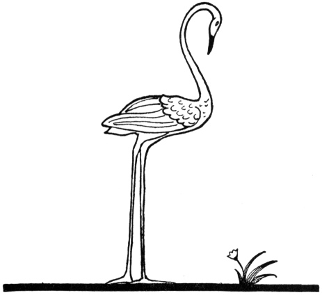
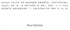

  
[Intangible Textual Heritage](../../index.md)  [Legends and
Sagas](../index)  [Index](index)  [Next](ftmg01.md) 

------------------------------------------------------------------------

[Buy this Book on
Kindle](https://www.amazon.com/exec/obidos/ASIN/B002HWRKVG/internetsacredte.md)

------------------------------------------------------------------------

  
*Fairy Tales of Modern Greece*, by Theodore P. Gianakoulis and Georgia
H. MacPherson, \[1930\], at Intangible Textual Heritage

------------------------------------------------------------------------

# FAIRY TALES OF MODERN GREECE

## BY THEODORE P. GIANAKOULIS AND GEORGIA H. MacPHERSON

 

### DRAWINGS BY HENRIETTE REISS

#### E. P. DUTTON & CO., INC.

#### NEW YORK CITY

#### \[1930\]

Scanned, proofed and formatted at Intangible Textual Heritage, July
2009, by John Bruno Hare. This text is in the public domain in the US
because its copyright was not renewed in a timely fashion

  [  
Click to enlarge](img/front.jpg.md)  
''Stop!'' He was directly above me now and he planted himself in my way.
(See page 24)  

  [  
Click to enlarge](img/cover.jpg.md)  
Front cover and spine  

  [  
Click to enlarge](img/title.jpg.md)  
Title Page  

 
[  
Click to enlarge](img/verso.jpg.md)  
Verso  

------------------------------------------------------------------------

[Next: Contents](ftmg01.md)
