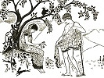

  
[Intangible Textual Heritage](../../index)  [Legends and
Sagas](../index)  [Index](index)  [Previous](ftmg06)  [Next](ftmg08) 

------------------------------------------------------------------------

[Buy this Book on
Kindle](https://www.amazon.com/exec/obidos/ASIN/B002HWRKVG/internetsacredte)

------------------------------------------------------------------------

  
*Fairy Tales of Modern Greece*, by Theodore P. Gianakoulis and Georgia
H. MacPherson, \[1930\], at Intangible Textual Heritage

------------------------------------------------------------------------

p. 48

 

### IV

### FAIRIES OF THE WATERFALL

IT WAS not yet dawn when Màro was awakened by voices calling her. She
thought it was her three friends who always went with her early every
Wednesday morning to the waterfall in the Peneus stream. Hastily she
dressed, gathered up her washing, as usual, and hurried in the faint
moonlight down the path to the oak forest.

Màro was surprised not to find her friends waiting for her along the
way.

"Perhaps it is late," she thought, "and they are already at the
waterfall."

But when she reached the familiar stones beside the pool at the foot of
the fall where they always did their washing together, she was still all
alone and daylight had not yet appeared in the eastern sky. Màro did not
understand. She stood hesitating on the stones, not knowing whether to
begin her work or to return home.

p. 49

  [  
Click to enlarge](img/04900.jpg)  
She thought she saw the forms of three maidens combing out their long
hair.  

p. 50 p. 51

As she glanced toward the waterfall she thought she saw the forms of
three maidens, combing out their long hair. She looked again, but she
could see only the oak leaves shivering in the breeze. She dipped her
hands in the water and began her washing.

"Will you not let us help you?" came a soft voice unknown to Màro. Three
forms appeared to move among the trees near the water. She was
frightened, but the strange shapes disappeared again among the thick
shadows. She went on with her work.

"We shall help you. Let us help you," spoke the voice quite close to
Màro. She started up trembling, to see three maidens standing at the
edge of the pool. Their bright hair had a glint of green like the green
of the oak leaves; the blue of water shimmered in their eyes, and their
clinging garments were caught with pink blossoms like the wild
*neroloulouda* water flowers, that grew beside the waterfall. They were
mirrored in the pool as they combed their long hair with golden combs.

"Do not be frightened," said one of them. "We wish to help you."

The other two came forward silently. They took the clothes from Màro's
hands; they whitened her dresses snow-white, and the work was done
before dawn. Màro thanked them. As she started away, the maiden who had
spoken and who had looked on while the others worked, approached for the
first time and said:

p. 52

"We shall help you again, but do not tell anyone about us. Do you
understand? You must not speak of us to anyone."

Màro promised. On the way home she met old Kyroula, the sorceress of
Plaka, wandering over the hillsides in search of medicinal herbs. She
was the doctor for Plaka and many neighboring villages. She made her own
preparations and she alone knew the secret of their application. From
beneath her bag of magics which always weighted down her shoulders, the
old woman looked curiously at Màro.

"You have been out alone in the woods very early," she remarked.

"I have been washing," answered Màro without stopping.

"And you have finished it already by yourself?" persisted Kyroula. Màro,
remembering her promise, walked on without a reply.

A few days later when Màro was gathering wood in the oak grove, she came
upon the three strange maidens, washing and combing their greenish
golden hair with their golden combs. When they saw Màro they approached.
Swiftly and silently the two began to pick up wood and give it to her,
until in a few moments she had all that she could carry. The maidens
walked with her to the waterfall, where they paused and the one who had
spoken before held out to her a small, beautifully carved box of
polished wood.

"We wish to give you a gift," she said with a smile like a ripple upon
placid water. "It is candy such as you have never tasted."

p. 53

Màro was perplexed. She remembered hearing of *magemena koufetta*, the
candy of forgetfulness, which makes the one who eats of it forget all
his earthly life and become a fairy. Although these lovely creatures had
been helpful to her and she wished not to offend them, nevertheless she
refused the gift. Without another word the maidens vanished.

Màro was afraid she had made them angry. But they came again and many
times after that, when she was washing or gathering wood or watching her
cattle. The two would help her, while the third sat a little way off,
combing out her long hair. Sometimes as Màro sat in the fields, they
would embroider or knit beautiful lace for her. They would walk back
with her as far as the waterfall in the oak wood, where they
disappeared. Even when she was with her friends from the village, the
maidens would often join her. Then they would not speak to her and, to
her amazement, her, friends were never aware of their presence.

One summer evening as Màro was driving her cattle home, she passed near
the waterfall in the stream Peneus. The three maidens were washing and
combing their hair at the edge of the pool. When they saw Màro they
began talking earnestly together. An anxious look came into their faces.
The fading light shimmered green on their hair as they shook their heads
at one another. Suddenly they grew silent and advanced to her smiling.

"We have some gifts for you, Màro," said the one who

p. 54

always spoke. "We think they will be useful to you and if you accept
them, you will make us very happy." She held out a three-circled
bracelet of gold.

"Take it," she urged as Màro hesitated; "it is for you."

The second maiden offered ear rings, each with three jewelled pendants,
and the third presented an apron of silk with three scallops embroidered
in wild flowers. Màro did not understand the strange manners of the
maidens, but seeing no harm in the gifts, she accepted them.

"Will you let us see you again in three days?" asked the first maiden.
"We should like to see you wearing our gifts, but be careful. Let no
mortal's eye behold them and no ear hear of them until we have seen
you."

When they had her promise, the maidens vanished and Màro went home
thinking how beautiful she would look in her new things.

"No girl in Thessaly ever had a treasure like mine," she thought as she
hid them where no one might see them.

It was not until some days later that she remembered her gifts. Then she
realized that the appointed time had passed when she was to let the
maidens see her. It was too late. She looked regretfully at the apron,
the ear rings and the bracelet and, wrapping them carefully, she laid
them away once more.

Màro forgot the treasures for almost three years. One summer day she
happened upon them while her three girl friends were calling upon her
and she was showing them some of her needlework. She let them see the
gifts also.

p. 55

"Oh, how wonderful!" they exclaimed. "Why don't you wear them, Màro?
You'd look lovely in them."

Màro followed the suggestion of her friends. She had not seen the
strange maidens after she had failed to meet them and she supposed that
they, angered by her forgetfulness, would never visit her again.

The next day when she set forth toward the waterfall, she was wearing
the bracelet, the ear rings and the apron. It was at the edge of the oak
wood that she met the old sorceress with her magic bag on her back.
Every one knew that in it were moon herbs, night flowers, a bat's tooth,
a turtle's bone, a dragon's claw, a snake's wing and hemlock. Only once
had Kyroula used the hemlock. That was for an old man, at his death
hour, whose soul did not wish to leave his body. The villagers stood a
little in awe of Kyroula, with her mysterious bag and her lore of
fairies and the spirit world.

As Kyroula moved slowly by, her keen eyes took in all the details of
Màro's dress. Màro felt uncomfortable.

"The gifts of fairies bring evil," muttered Kyroula.

"What are you saying?" asked Màro, pausing in the path. Kyroula shook
her head as she looked at the lovely ornaments.

"Fairy gifts," she said. "You are in the fairies’ power. Take them off,
Màro, take them off. Burn them at midnight. They are bewitched. Evil!
Evil!" The old woman moved on beneath her burden, leaving Màro to wonder
what she had meant.

p. 56

"These are such beautiful things," she thought. "How could they do
harm?" and she went her way into the forest.

The day was very hot. Not a leaf moved. The people of Plaka were
harvesting in the barley fields. The monotonous song of the harvest fly
was the only sound. Suddenly a great wind circled over the village three
times and, passing to the oak woods, died away. A single, sharp cry was
heard from the woods and then silence.

The people dropped their work and ran to the forest. They could see a
girl darting among the trees pursued by three swift, furious creatures.
They raised a shout. The girl fell to the ground and the three forms
vanished. When the villagers came near, they recognized Màro lying
beside the waterfall, speechless, her hair disheveled, her shoulders
bare where her garments had been torn from her and showing the marks of
a lash. Kyroula now arrived. She had heard the wind circling over the
village and she knew it to be an omen of evil.

"Do not touch her," she commanded the people. "Turn your faces to the
sun and kneel." All obeyed for they knew the wisdom of Kyroula. Swiftly
she took the bag from her back. She drew out her magic glass and,
muttering mystic words, applied the contents of the bag to Màro.

"Now you may go," she said to the villagers. They dispersed. Kyroula
remained with the girl three days and three nights. On the third night
she burned the fairy gifts at midnight near the waterfall. All the while
she continued her

p. 57

incantations and magic applications. Her power did not fail. Màro
regained her voice and her strength returned.

The people of Plaka never forgot that incident. Ever after they called
Màro the *Neraidomagemene*, fairy-bewitched.

 

------------------------------------------------------------------------

[Next: V. The Fairy Comb](ftmg08)
