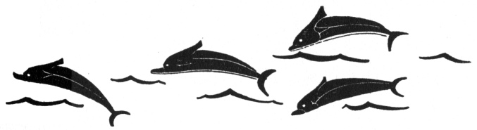

  
[Intangible Textual Heritage](../../index)  [Legends and
Sagas](../index)  [Index](index)  [Previous](ftmg07)  [Next](ftmg09) 

------------------------------------------------------------------------

[Buy this Book on
Kindle](https://www.amazon.com/exec/obidos/ASIN/B002HWRKVG/internetsacredte)

------------------------------------------------------------------------

  
*Fairy Tales of Modern Greece*, by Theodore P. Gianakoulis and Georgia
H. MacPherson, \[1930\], at Intangible Textual Heritage

------------------------------------------------------------------------

p. 58

 

### V

### THE FAIRY COMB

GALANIS, the curly-haired fisherman, found himself at the entrance of a
strange, rocky cavern. He was leaning against one side of the opening,
staring dazedly out at the pale sea and sky of dawn. There was upon him
weariness like the reaction to a great exhilaration. How had he come
there? What had been happening to him?

As Galanis stood motionless, dumbfounded, daylight came slowly upon the
island of Ithaca. He heard the voices of fishermen on the shore below
and the barking of dogs upon the hills, and he realized that he must go
back to his fishing boat, moored to the rocky banks. He started forward
uncertainly. The flash of a jewel caught his eye and he saw a bright,
jewel-studded comb lying at his feet.

He began to remember. As he picked up the comb and turned it over in his
hands, he recalled the maiden who had worn it in her shining golden
hair. She was not a mortal maiden; he was sure of it. Yet he, Galanis
the fisherman, had danced with her, had held her for a moment on his
lap,

p. 59

had touched her bright hair and brushed her white fingers with his
lips—  Oh, what a night it had been!

It all came back to him now. In the calm of the early evening he had
lain half asleep in his little fishing boat, watching the full moon
rise. Faint voices and the music of plashing water floated to him from
the open sea and seemed part of his half-waking dream. After a little
time the sounds came again, startling him from the light sleep into
which he had fallen. He thought he saw vague, foam-like forms moving
upon the water. He could not sleep again. Something strange was stirring
beneath the calm moon and the white stars.

He lit a cigarette to keep him company and at the flare of the match,
twelve forms darted toward him. He could not see them clearly. They were
like maidens, graceful, glimmering with jewels, yet pale, shadow-like.
They danced in the air around and around as they approached him, to the
rhythm of their own singing. Nearer and nearer they came; they brushed
him as they whirled by and he could distinguish their words.

        "To Odysseus’ Cave we go,  
         To the Marmarospelo.

"Come with us where joy is free  
 And endless as the careless sea.  
 Come with us while the sky is bright,  
 Dance, with heart and footstep light.

p. 60

        "To Odysseus’ Cave we go,  
         To the Marmarospelo.

"The stars will watch while we play,  
 The sea will wait till another day.  
 Hark, hark to our music sweet,  
 Dance, dance to its lilting beat.

        "To Odysseus’ Cave we go,  
         To the Marmarospelo.

Galanis was breathless. All power left him. Unresisting he followed the
maidens along a rocky path, overgrown with thyme, to the Marmarospelo,
Marble Cave, where Odysseus is said to have taken refuge. The scraggy
opening yawned black, and for a moment they were swallowed up within it.
Then a weird blue light shone through all the marble passages of the
cavern. Music as of another world drifted around them. The dance was on,
fantastic, care-free, mad. Galanis remembered lily-pale faces,
shimmering garments, jewelled combs in shining hair, movement to a wild,
pulsating rhythm. His head whirled; his eyes were dazzled. The fairest
of the maidens was upon his lap, gazing at him with her soft,
inscrutable smile. He longed to speak to her, to caress her rippling
hair, to touch her white hands.

Suddenly dawn. The music stopped, the blue light paled. The maidens, one
by one, vanished silently, mysteriously. The one Galanis held lingered
till the last. She arose to go, but he caught her back by her long hair.
She reached out her hand to free herself and he touched his lips to her
lily fingers.

p. 61

  [  
Click to enlarge](img/06100.jpg)  
She shrieked and fled like a wild dart of light.  

p. 62 p. 63

\[paragraph continues\] She shrieked and
fled like a wild dart of light out of the cave, leaving him alone with
the hollow echoes of her cry.

But now he had found her comb. She would return for it and he would see
her again. He would speak to her this time, he would take her in his
arms and never let her go from him. He hid the comb in his clothing and
went back to his fishing boat and his work. But all that day he was
impatient, filled with memories of the night and longings to see the
maiden again.

When darkness came, he hastened to the Marmarospelo. Within a niche at
the opening, he waited. Nothing stirred upon the water or among the
rocks. The moon showed a deserted world and the still hours went by.
Galanis slept. In the pale dawn he awoke and heard the voices of
fishermen on the shore below and the barking of dogs upon the hills. The
maiden had not come back. Sadly he looked at the comb. That day he did
not return to his boat. He sat among the rocks on the shore, thinking he
would never see her again.

On the third night Galanis went early to the Marble Cave. There was new
hope in his heart. He waited again in his niche, but this time he did
not sleep. After a long while he heard steps of sandalled feet in the
darkness. Then a dim, fluttering brightness drew near him. He arose. It
was she, the maiden whose hand he had brushed with his lips, the one he
loved. He stretched his arms toward her with glad eagerness.

"Why did you stay away so long?" he asked.

p. 64

She did not speak and he saw there was grief in her eyes. He took her
hands and tried to comfort her. Slowly, coldly, she drew her hands away,
saying:

"My comb—where is my comb?"

"Won't you dance to-night?" Galanis asked.

"Give me my comb," she answered.

"What makes you sad? Won't you tell me?" he pleaded.

The maiden on her knees before him begged him for her comb. Swiftly he
bent down, his arms were about her, he kissed her three times.

"Oh, pity me, pity me!" she moaned. "Give me my comb." No other word
would she speak.

Galanis drew forth the comb and reluctantly held it out to her.

"I want you to be happy," he said.

As the maiden touched it, she uttered a shriek and fled like a dart of
light beyond the vision of Galanis. He dashed down the rocky path to the
sea, calling after her. He was still standing there at dawn, when he
heard the voices of fishermen near him on the shore and the barking of
dogs upon the hills.

Galanis did not return to his fishing boat that day, nor ever again. He
forgot his work, he forgot his home, he did not recognize his friends
when he came upon them. For many days he wandered, pale and haggard,
along the shore and about the Marmarospelo, sometimes muttering to
himself, sometimes calling, calling. Then he disappeared and was not
seen again.

p. 65

Every full moon night, it is said, one can see at the entrance of the
cave a weeping maiden with a jewelled comb in her golden hair. It is the
mortal-kissed fairy, whom Galanis loved, but whom he condemned by his
kiss to exile. Never again may she return to the fairy palace and her
companions. She hides in the cave and for her sin she weeps eternally.

 

------------------------------------------------------------------------

[Next: VI. A Fairy Wedding](ftmg09)
