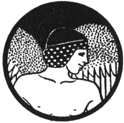

  
[Intangible Textual Heritage](../../index.md)  [Legends and
Sagas](../index)  [Index](index)  [Previous](ftmg08)  [Next](ftmg10.md) 

------------------------------------------------------------------------

[Buy this Book on
Kindle](https://www.amazon.com/exec/obidos/ASIN/B002HWRKVG/internetsacredte.md)

------------------------------------------------------------------------

  
*Fairy Tales of Modern Greece*, by Theodore P. Gianakoulis and Georgia
H. MacPherson, \[1930\], at Intangible Textual Heritage

------------------------------------------------------------------------

p. 66

 

### VI

### A FAIRY WEDDING

IT IS said that one May day long ago, the hills of Eurostena smiled with
rare and remarkable beauty. The pines of Maze and the fir trees of
Trikkala bloomed, the wild thistles grew soft and lovely, ferns wore a
yellow crown, the perfumes of wild flowers were heavy on the air, and
all the land was filled with joy.

Although many years have passed, the day is not forgotten, and from
generation to generation the story of this day, as first related by
Vassos of Trikkala, is throughout the countryside remembered and told
again and again. It was the wedding day of Neraidos, a fairy youth, and
Neraida, a fairy maid.

Vassos of Trikkala, after searching for thirty-three years, had at last
found the *Neraidovotano*, a fairy plant by which he was able to
communicate with the fairy world. He knew

p. 67

  [  
Click to enlarge](img/06700.jpg.md)  
Vassos was seen on the hill of Trikkala running or rather gliding above
the earth.  

p. 68 p. 69

all fairy secrets; he had helped or cured many mortal youths who had
hopelessly loved fairy maidens. On this day, the third of May, just at
noon, Vassos was seen on that hill of Trikkala called the Pine Hill,
running or rather gliding above the earth with the swiftness of a bird.
Those who saw him had time only to be amazed, when he was lost to sight.

On the third day following, when he appeared in the village of Trikkala,
the villagers thronged about him to hear what had happened.

"It was a fairy wedding," he said. "All the fairy world knew it. The
hills of Trikkala and the mountains of Eurostena knew it. I was invited;
fairies came for me while I was drinking at the Fairy Spring. I heard,
as though far off, their drums and violins and the music of strange
instruments. Then the clouds became like chariots, sinking lower and
lower to come near me, while the music swelled and echoed around me and
seemed to draw me on and up, until the clouds were all about me. They
were filled with beautiful maidens, who took me away and away, across
the Corinthian Gulf and other seas, across green fields and blue
waters."

Vassos did not know the spot where the cloud-chariots descended to
earth, though he thought it might be Mount Pendos in Thessaly. On the
top of the mountain, where no human foot had ever stepped, arose the
fairy palace, gleaming gold in the sunshine, with silver towers and
spires fading into the clouds.

Within, the rooms of varied colors and the long, flower-festooned halls
were crowded with innumerable guests. Vassos

p. 70

was unable to describe the beauty of these fairy people, for their
faces, though like those of human beings, could not be clearly
distinguished, and their clothes like milky foam transcended all
description.

Colored lights played through the palace, at one moment
[tingeing](errata.htm#0.md) all things with gold, the next with rose, then
violet, crimson, green and lavender. The music of harps and violins and
the steps of the dance changed with the shifting colors, but laughter
and joy went on ceaselessly. In each room a thousand candles burned in
candlesticks of crystal and burnished gold, while the bright silver
walls like mirrors reflected their brilliance. The smoke of incense rose
on all sides and the air was laden with its piquant odor.

In one of the great halls a table of crystal set in silver held fairy
food heaped on chased silver platters. It was impossible to tell of what
the food was made. Vassos knew only that it was white and soft and so
light that it seemed to melt away as soon as he tasted it, leaving the
memory of a rich, yet delicate flavor that he could never forget.

For three days the wedding continued and all the while there was music,
feasting and dancing. Neraida and also Neraidos, whose face was like a
girl's, had a beauty surpassing all mortal beauty. On their heads were
crowns of gold; their clothes were distinguished from those of the other
fairies by the silver lace and jewels of all kinds that sparkled
whenever they moved. The bride and groom were always on horseback; food
was handed up to them on golden trays;

p. 71

fairies sang continually, dancing, scattering blossoms and twining
ribbons around them.

Ceaselessly one heard, rising and falling with wave-like rhythm, the
gentle tinkling of glasses as they were clinked together. The guests
drank cherry-red nectar from crystal glasses etched with flowers and
fairy faces. On the third day, after all had drunk for the last time to
the health of the bride and groom, the glasses were broken and with a
crash of crystal the festivities came to an end.

"I do not remember how it happened," finished Vassos, "but at noon I
found myself back on the Pine Hill of Trikkala, proud to have been the
only mortal guest at the fairy wedding."

 

------------------------------------------------------------------------

[Next: VII. The Fairy Ring](ftmg10.md)
