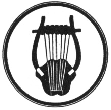
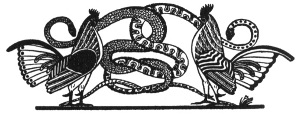

  
[Intangible Textual Heritage](../../index.md)  [Legends and
Sagas](../index)  [Index](index)  [Previous](ftmg10)  [Next](ftmg12.md) 

------------------------------------------------------------------------

[Buy this Book on
Kindle](https://www.amazon.com/exec/obidos/ASIN/B002HWRKVG/internetsacredte.md)

------------------------------------------------------------------------

  
*Fairy Tales of Modern Greece*, by Theodore P. Gianakoulis and Georgia
H. MacPherson, \[1930\], at Intangible Textual Heritage

------------------------------------------------------------------------

p. 83

 

### VIII

### THE FAIRIES’ THEFT

THE people of Petsà were threshing their wheat on the hard, dry,
sun-baked threshing floors. Suddenly out of the stillness came a strange
cry. They saw, coming down one of the foothills of Mount Kellene, three
shepherds carrying a limp burden. Behind them came shepherdesses
wringing their hands, while dogs leaped and barked around them.

"The priest, the priest! Go for the priest!" shouted one of the
shepherds. It could then be seen that they were carrying a young girl.

"Tasoula!" someone cried. "It is Tasoula, daughter of Petros!"

A boy darted away to find the priest. The shepherds moved slowly on to
Petros’ house, while the villagers followed, talking and asking
questions excitedly. Tasoula was very white and she lay very still with
her eyes closed—her eyes that were always bright and laughing—and there
was

p. 84

a strange look about her, as though she would never move again. Around
her bed, the crowd became silent and one of the shepherds spoke.

"I was watching the sheep on Saint Elias Hill," he said, "when I looked
across to the Sotera Hill and saw something white under the tallest pine
tree. 'Fairies,' I said to myself, but I wasn't sure. I called Yannis
and Stephanos," indicating the other shepherds, "and they said, 'Yes, it
is fairies! It's a fairy ring around that pine tree!'"

"I saw Tasoula first," broke in the one called Stephanos. "I saw her in
the center of the ring, trying to get away from the fairies."

"We ran toward her," went on the first shepherd, "but the fairies at the
same moment started the other way, dancing round and round without
touching the ground, and dragging Tasoula with them. Faster and faster
they went till they looked like white birds skimming along the ground.
Above a spring they stopped a moment and we saw them no more. When we
reached the spot, Tasoula was lying there on the ground as if she were
asleep."

"We tried to wake her." Yannis took up the story. "But she didn't speak
or move or even open her eyes. We are afraid," lowering his voice and
speaking very slowly, "we are afraid the fairies have taken her soul
with them and left her body because it isn't beautiful enough!"

There were murmurs from the crowd, some of surprise, some of agreement,
but before any word could be spoken, the priest arrived, and the people
fell back to let him enter.

p. 85

  [  
Click to enlarge](img/08500.jpg.md)  
He moved solemnly to Tasoula's bed and held his cross above her.  

p. 86 p. 87

"Evil, evil!" he cried in a kind of chant as he moved solemnly to
Tasoula's bed and held his cross above her. "Evil, evil, depart from
this house!"

After he had prayed, the priest burned incense and went all through the
house, swinging his censor and chanting, "Evil, depart. Evil, depart."
Tasoula remained white and motionless. The priest left, shaking his
head.

A hush had fallen over the whole village, as though everyone were
waiting, waiting. Few of the people returned to their work. They sat on
the ground near the house of Petros and talked in low tones about
fairies. When Grandmother Adamis joined them, they begged her to speak
because they knew she had seen fairies.

Grandmother told of her experience which Tasoula's accident recalled.
When she was about sixteen years old, she was considered one of the
prettiest girls in the village of Petsà. It was one lovely May day when
she, a shepherdess, was watching her sheep high on the hills of Sotera.
At noon she climbed to the pine-crowned peak of the mountain to drink at
the spring called Kreovreshe and to rest under the shadow of a pine.

The sheep had gathered in the deep shade, the goat bells were hushed,
the dogs lay still, and only the wind stirred, bearing the perfume of
wild roses and of pines. The girl was lulled to sleep, but in a few
moments she was awakened by hundreds of beautiful beings, airy and
shadow-like, approaching from all sides. She heard the clear notes of
their flutes and the gentle beating of their drums drawing nearer

p. 88

and nearer. She seemed to be in a very wave of sound and of light,
dancing forms. She was caught up on the wave and lifted high, high above
spring and fields and sheep. With the fairy maidens circling about her,
playing and singing as they rose and descended and rose again in slow
rhythm, the shepherdess was borne onward into the west.

Music and motion stopped. She found herself on the side of the
Neraidorahe, Fairy Hill, before the great, black openings like monster's
jaws. Through one of these she was led to a garden, within the mountain,
where flowers and sunshine and the plashing of fountains made the heart
glad. There was music in bird songs, chanting voices and the buzzing of
bees, while streams of silver, crystal cataracts, and youths and maidens
in graceful dance, were a delight to the eyes. Fairies with white veils
who were subjects, and fairies with red caps, who were princesses,
grouped themselves about a throne of brilliant jewels. The fairies who
had escorted the shepherdess led her by flower-strewn paths to the
throne, where she saw the queen of the fairies.

The queen was dressed in pure white robes, her long, golden hair falling
about her, and on her head she wore a circlet of gold entwined with
flowers that never fade.

"Would you not like to be a fairy?" asked the queen, "and live with me
in this garden where the sun never ceases to shine and where it is
summer all the year?"

"My gracious queen," said the shepherdess trembling, "do not be angry
because I refuse. I have a lover who will be

p. 89

waiting for me at the foot of the Sotera. I beg you to let me go back to
him."

The queen paid no heed to these words. "Take her," she ordered the
servants. "Take from her the clothes of mortals and dress her in fairy
garments!"

The girl, weeping, was whirled away from the queen's presence. The
servant fairies were about to remove her dress when they discovered the
bag of incense which she always wore in a ribbon around her neck. This
little bag, *felahtare*, contained incense from Mount Levanos, a bit of
candle that had burned on Easter before the portrait of the Virgin, a
leaf from a wild fairy plant, a petal from a hundred-petaled rose and an
amethyst stone. The bag had been hung about her neck by her godfather on
the day of her baptism, to protect her from all evil.

The fairies released their prisoner suddenly with cries of alarm. "We
dare not touch it! We dare not touch it! A curse would fall upon us!"

Instead of fairy robes, the shepherdess was given cream and the finest
honey from Crete. When she had eaten, the fairies carried her back over
hills and fields and streams, and set her down beside the Kreovreshe
near where her sheep were feeding. The watch dog that had guarded them
in her absence came to her, barking, and the fairies disappeared.

Twilight began to fall as Grandmother Adamis ended her story. The priest
returned for his third visit to the house of Petros. Tasoula's mother
still knelt at the bedside, moaning,

p. 90

while the women who stood about wailed in despair. Tasoula was lying
just as she had been since she was carried in, when all at once she gave
a little sigh and opened her eyes.

She seemed startled as she looked about. Then she realized where she was
and after she had been given a little food and wine, she was able to
tell what had happened.

Six beautiful fairy maidens had appeared before her while she was
drinking from the spring at the foot of the tallest pine. It was the
very Kreovreshe where the fairies had appeared to Grandmother Adamis.
The maidens begged Tasoula to dance with them and when she refused, they
grew very angry and by joining hands they formed a ring around her so
that she could not escape. They took her up, up, dancing all the time
and never touching the ground, until they reached the highest peak of
all the mountains. There was snow, deep snow, everywhere, and it was
bitterly cold, but they danced in the snow and made Tasoula dance with
them.

Then their anger seemed to have left them. They whispered together a
little while, looking at her. Then the tallest, the most beautiful,
waved her handkerchief above the ground. The snow melted and a great,
black hole opened beneath their feet. They dropped into the mountain and
went whirling down, down, down. It was dark and terrible. Tasoula could
not see, but she felt the fairies holding to her and their voices
echoing through the passage rang in her ears. All at once they were out
again in the hot sunshine on the side of the Sotera.

p. 91

"The fairies laughed and flew away," Tasoula said, "and then I don't
know how it was, but when I started to the

spring to drink again, I was here!"

"She doesn't know it was only her soul they took with

them," whispered a neighbor.

"No," agreed another. "They would have stolen her body, too, if she had
been more beautiful. We would never have seen her again."

 

------------------------------------------------------------------------

[Next: IX. The Haunted Ship](ftmg12.md)
