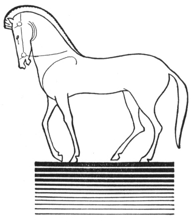

  
[Intangible Textual Heritage](../../index.md)  [Legends and
Sagas](../index)  [Index](index)  [Previous](ftmg14.md) 

------------------------------------------------------------------------

[Buy this Book on
Kindle](https://www.amazon.com/exec/obidos/ASIN/B002HWRKVG/internetsacredte.md)

------------------------------------------------------------------------

  
*Fairy Tales of Modern Greece*, by Theodore P. Gianakoulis and Georgia
H. MacPherson, \[1930\], at Intangible Textual Heritage

------------------------------------------------------------------------

p. 117

 

### XII

### THE FAIRY MOTHER

AT THE foot of the Pseloretes on the island of Crete, there once grew up
a youth called Kapetanakis, because his father, whose death made him an
orphan, had been a *kapetan* or leader. Kapetanakis was a beautiful boy
and he could bring forth such sweet sounds from his lyre that the
flowers on the hillside smiled and danced.

From the time that Kapetanakis was quite young, he would climb to the
highest hill of the Pseloretes, named *Thanatorahe* or Death's Hill,
where he would sit for hours playing his lyre under the deep-blue Cretan
sky and gazing

p. 118

down at the gray-blue sea that gives to Crete its name of the Blue
Island. Sometimes the maidens of the village would leave their work to
listen to his music which filled all the lands of Crete. The villagers
might have supposed him an eagle, so high would he sit on the
Thanatorahe, but they all knew him and gave him not a moment's thought.

Kapetanakis was always lonely. He felt that there was no one and nothing
to love him except the hills of the Pseloretes. Often he would gaze far
out to the Mediterranean as though he heard, above the sound of his
playing, something calling him from the silent waters.

One noon in autumn while he was lying half asleep in the dark shadows of
the fir trees near the *Onerovreshe*, Spring of Dreams, he heard
singing, the music of flutes and the throbbing of a drum from somewhere
among the hills. He sat up. "Perhaps," he thought, "someone is coming to
me at last and I shall not be lonely any more." The sounds drew nearer
and he saw to his amazement three strange maidens, with long veils that
sparkled with gems. Their dresses were of some silvery, silken fabric
and their golden sandals were adorned with jewels whose gleam seemed to
flash to the opposite shore.

The maidens approached, two playing flutes and the third singing and
gently beating a drum. They danced around the Onerovreshe without
appearing to see him, passed on from hill to hill, from spring to
spring, circling like flower petals eddied by a light wind, flitted over
Mount Ida, and skimmed across the Mediterranean to vanish on the
horizon.

p. 119

As a breeze, sighing among the mountains, leaves only a murmur behind
it, so they passed, leaving in his soul only the echo of their music and
the memory of their bright, shimmering garments.

The next day at the same hour, Kapetanakis took his place again at the
Onerovreshe and played on his three-stringed lyre, trying to catch the
silver, bell-like beauty of those melodies. Sounds of unearthly
sweetness floated up to him and he saw again the three strange maidens
dancing over the *Aerorahe*, Hill of the Winds, and coming toward him.
He held his breath; the lyre fell from his hands. Nearer and nearer
danced the maidens till he breathed the perfume of their garments and
felt the air stirred by their swift movements. Wild with joy he leaped
up to dance with them, only to see them flit lightly away, circle about
the Thanatorahe, and pass far beyond, growing smaller and smaller, till
they disappeared where sky and Mediterranean meet.

"What are they?" he asked of the spring. "Why do they come?" he asked of
the fir trees. "They do not even see me! Oh, if they would stay, if they
would speak to me!" He looked about at the rocks and hills and sky, but
silence was everywhere.

On the third day at noon Kapetanakis waited again at the spring with
anxious eyes and pounding heart. Faint on the softly stirring air came
the elfin music of the flutes. Kapetanakis scarcely breathed. Then he
saw the glint of gems and the swirl of airy garments. The music swelled
to a wave of sound that seemed to engulf the whole mountain.

p. 120

\[paragraph continues\] Now the three
veiled maidens were on the Hill of the Winds, now on the Hill of Death.
Kapetanakis stood up as they drew near and held out his hands to them.
He cried out to them to stop, but they did not notice him and his voice
was drowned in the harmony of sweet sound. Once more they circled about
him, scattering their perfume on the air and their mysterious radiance
on his soul, and once more they started away.

He could not let them go. Madly he plunged after them and seized the
veil of the one nearest. There was a shriek. The two others darted with
the speed of a kite straight to the sea and vanished, while the third
swayed, her face unveiled, gazing after them in terror and dismay.

Kapetanakis stood amazed. He saw before him a maiden whose beauty
rivaled that of Aphrodite. What was she? What were the two who had fled?
He wanted to ask, but he feared his voice would make her fly away after
the others. At the end of a long moment she turned slowly toward him and
the look in her eyes was of such hopeless sadness that he instinctively
dropped to his knees.

"Oh, do not be sad," he begged. "Only stay with me and I shall make you
happy!"

The maiden was silent.

"Speak!" he pleaded. "Speak to me and tell me that you will stay and be
happy!"

Still the maiden did not answer. For three days it continued, his
pleading and her silence. Finally she looked at him, her eyes full of
grief and reproach, and said, "Why did you do this?"

p. 121

Kapetanakis had never heard a voice so angelic. The love that had been
stirred by her beauty at the first moment he saw it was now awakened
into life.

"Speak again!" he cried. "I am happy only when I hear your voice. I love
you, Agnoste. I want you for my wife."

She whom he called Agnoste, Unknown One, was thoughtfully silent for a
time. Then she said, "I shall marry you on one condition."

"Only one!" he exclaimed joyously. "What is it?"

"I am a fairy. You have me in your power. The condition is that I shall
never speak again."

Kapetanakis tried to hide his disappointment. "I would accept any
condition," he answered solemnly.

They were married. Three years passed. They built a little home at the
foot of a hill and an elf-like child was born to them. Kapetanakis had
hoped from the beginning that his love would melt the seal on that
heavenly voice and that he would hear it in song and laughter and words
of love. But all these three years Agnoste's silence had hung like a
shadow upon his soul. She only followed him about, gazing at him with a
fixed expression.

Even to the child, Agnoste never spoke. But this fairy child, with her
great far-seeing eyes and her strangely quiet, graceful ways, seemed not
wounded by her mother's cold silence, as was Kapetanakis.

"It cannot last," he said to himself as he looked back over the three
long years. He must find some way to make Agnoste forget the condition
she had imposed upon him. Perhaps if she once broke her silence—

p. 122

He had heard that in great crises or stress of great emotion one did
unexpected, almost unbelievable, things. He reasoned that what rouses a
mother most is danger to her child and that, of all elements, fire is
the most terrible. Then his idea came. It was desperate, but another day
of this silence, he thought, would madden him. Still he would try
pleading once more.

That evening he sat at Agnoste's feet as she worked in the candle light,
and with all the fervor of his soul he sang his song of entreaty.

"Oh, speak to me, dear one;  
   Lonely has been my life.  
 I long for the music of words,  
   For the voice of my wife.

"Long years for love I waited,  
   Lonely my life and sad.  
 Long years for gladness I waited:  
   You spoke and I was glad.

"My joy lived only a moment.  
   For my joy, long gone, I cry.  
 Let me hear your voice, beloved;  
   Speak to me or I die."

Agnoste, smiling faintly, shook her head in silence. His plea had been
useless.

It was autumn again. The next morning was fine and clear. Kapetanakis
left the house early, taking a rocky path

p. 123

  [  
Click to enlarge](img/12300.jpg.md)  
Agnoste darted straight through the flames.  

p. 124 p. 125

up the Thanatorahe. There was suppressed excitement in every movement,
though he said no word. When he looked back he saw, as he expected,
Agnoste following with the child in her arms.

They reached the top of the hill. It was partly wooded and on the north
side among some fallen trees were dry, dead leaves leaped by the wind.
He set to work furiously, gathering branches and leaves to make a pile
on the rocky, wind-swept south side. Not knowing his intention, Agnoste
laid the child down and helped him. Kapetanakis set fire to the heap and
together they watched the flames leap half way to the sky.

Then Kapetanakis went to the spot where his child lay sleeping and took
it in his arms.

"Surely, surely," he thought, "she must speak when she thinks I am about
to cast our child into the flames!" He approached the pile, lifted the
child high, gave a swinging movement with his body and arms, as though
he were ready to hurl it into the fire.

Like an angel with wings invisible, Agnoste leaped into the air, caught
the child from him, darted straight through the flames and without a
sound flew over the hills and was lost on the gray-blue horizon of the
Mediterranean. Weird sounds of tumult came from the fire which, like a
snuffed candle, the instant Kapetanakis turned to it, died out. For
hours he stood motionless before its ashes. Then with a violent waking
of all his forces, he set out on a wild search for his wife and child.

p. 126

Kapetanakis was not seen sitting eagle-like on the Thanatorahe, nor his
lyre heard among the hills. He climbed mountain peaks; he wandered
through woods and fields; he followed the sunset, seeking the palace of
the fairies in the sea.

One noon after many years the people of the island saw once again
Kapetanakis high on the Hill of Death. The notes of his lyre were sweet
as in the old days, but sad, with despairing, heart-breaking sadness.
When the villagers reached the rock on which he had been sitting, he was
gone. They did not see him again.

 

 

 

 

 

 
