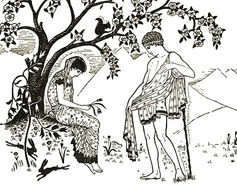

  
[Intangible Textual Heritage](../../index)  [Legends and
Sagas](../index) 

------------------------------------------------------------------------

[Buy this Book on
Kindle](https://www.amazon.com/exec/obidos/ASIN/B002HWRKVG/internetsacredte)

------------------------------------------------------------------------

<table width="75%">
<colgroup>
<col style="width: 50%" />
<col style="width: 50%" />
</colgroup>
<tbody>
<tr class="odd">
<td width="50%" data-valign="TOP"></td>
<td width="50%" data-valign="CENTER"><h1 id="fairy-tales-of-modern-greece" data-align="CENTER">Fairy Tales of Modern Greece</h1>
<h2 id="by-theodore-p.-gianakoulis-and-georgia-h.-macpherson" data-align="CENTER">by Theodore P. Gianakoulis and Georgia H. MacPherson</h2>
<h4 id="section" data-align="CENTER">[1930]</h4></td>
</tr>
</tbody>
</table>

------------------------------------------------------------------------

[Contents](#contents)    [Start Reading](ftmg00)    [Page
Index](pageidx)    [Text \[Zipped\]](ftmg.txt.gz)

------------------------------------------------------------------------

|                                                                                                                           |
|---------------------------------------------------------------------------------------------------------------------------|
|  |

This is a wonderful collection of stories about Greek fairies. Similar
to the northern fairies, they are not adverse to interacting with
mortals. However, there is always some *proviso*, such as the fairy
bride who is forbidden to speak, and drives her husband mad (The Fairy
Mother). The tragedy can also turn the other way, such as the fairy
maiden exiled from the fairy palace by one kiss from a mortal (The Fairy
Comb). Greek fairies avoid guns (i.e. metal), crosses, and talismans,
just like their northern counterparts. They have sanctuaries, sometimes
on mountain peaks, sometimes in the ocean. The Greek fairies described
here are obvious descendants of the nature elementals of ancient
mythology.--J.B. Hare.

------------------------------------------------------------------------

 [Title Page](ftmg00)  
[Contents](ftmg01)  
[Illustrations](ftmg02)  
[Foreword](ftmg03)  
[I. The Fairy Hunter](ftmg04)  
[II. Fairy Gardens](ftmg05)  
[III. The Fairy Wife](ftmg06)  
[IV. Fairies of the Waterfall](ftmg07)  
[V. The Fairy Comb](ftmg08)  
[VI. A Fairy Wedding](ftmg09)  
[VII. The Fairy Ring](ftmg10)  
[The Fairies’ Theft](ftmg11)  
[IX. The Haunted Ship](ftmg12)  
[X. The Wonder of Skoupa](ftmg13)  
[XI. The First of May](ftmg14)  
[XII. The Fairy Mother](ftmg15)  
