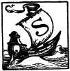
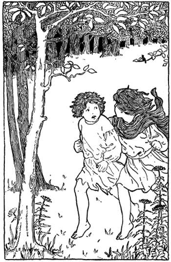

  
[Intangible Textual Heritage](../../index.md)  [Legends and
Sagas](../index)  [Index](index)  [Previous](chap05)  [Next](chap07.md) 

------------------------------------------------------------------------

[Buy this Book on
Kindle](https://www.amazon.com/exec/obidos/ASIN/B002H9XSSI/internetsacredte.md)

------------------------------------------------------------------------

  
*Folk Tales From the Russian*, by Verra Xenophontovna Kalamatiano de
Blumenthal, \[1903\], at Intangible Textual Heritage

------------------------------------------------------------------------

p. 118

### BABA YAGA

|                       |
|-----------------------|
|  |

SOMEWHERE, I cannot tell you exactly where, but certainly in vast
Russia, there lived a peasant with his wife and they had twins — a son
and daughter. One day the wife died and the husband mourned over her
very sincerely for a long time. One year passed, and two years, and even
longer. But there is no order in a house without a woman, and a day came
when the man thought, "If I marry again possibly it would turn out all
right." And so he did, and had children by his second wife.

The stepmother was envious of the stepson and daughter and began to use
them hardly. She scolded them without any reason, sent them away from
home as often as she wished, and gave them scarcely enough to eat.
Finally she wanted to get rid of them altogether. Do you know what it
means to allow a wicked thought to enter one's heart?

p. 119

The wicked thought grows all the time like a poisonous plant and slowly
kills the good thoughts. A wicked feeling was growing in the
stepmother's heart, and she determined to send the children to the
witch, thinking sure enough that they would never return.

"Dear children," she said to the orphans, "go to my grandmother who
lives in the forest in a hut on hen's feet. You will do everything she
wants you to, and she will give you sweet things to eat and you will be
happy."

The orphans started out. But instead of going to the witch, the sister,
a bright little girl, took her brother by the hand and ran to their own
old, old grandmother and told her all about their going to the forest.

"Oh, my poor darlings!" said the good old grandmother, pitying the
children, "my heart aches for you, but it is not in my power to help
you. You have to go not to a loving grandmother, but to a wicked witch.
Now listen to me, my darlings," she continued; "I will give you a hint:
Be kind and good to every

p. 120

one; do not speak ill words to any one; do not despise helping the
weakest, and always hope that for you, too, there will be the needed
help."

The good old grandmother gave the children some delicious fresh milk to
drink and to each a big slice of ham. She also gave them some
cookies—there are cookies everywhere—and when the children departed she
stood looking after them a long, long time.

The obedient children arrived at the forest and, oh, wonder! there stood
a hut, and what a curious one! It stood on tiny hen's feet, and at the
top was a rooster's head. With their shrill, childish voices they called
out loud:

"Izboushka, Izboushka! turn thy back to the forest and thy front to us!"

The hut did as they commanded. The two orphans looked inside and saw the
witch resting there, her head near the threshold, one foot in one
corner, the other foot in another corner, and her knees quite close to
the ridge pole.

"Fou, Fou, Fou!" exclaimed the witch; "I feel the Russian spirit."

p. 121

The children were afraid, and stood close, very close together, but in
spite of their fear they said very politely:

"Ho, grandmother, our stepmother sent us to thee to serve thee."

"All right; I am not opposed to keeping you, children. If you satisfy
all my wishes I shall reward you; if not, I shall eat you up."

Without any delay the witch ordered the girl to spin the thread, and the
boy, her brother, to carry water in a sieve to fill a big tub. The poor
orphan girl wept at her spinning-wheel and wiped away her bitter tears.
At once all around her appeared small mice squeaking and saying:

"Sweet girl, do not cry. Give us cookies and we will help thee."

The little girl willingly did so.

"Now,"gratefully squeaked the mice, "go and find the black cat. He is
very hungry; give him a slice of ham and he will help thee."

The girl speedily went in search of the cat and saw her brother in great
distress about the tub, so many times he had filled

p. 122

the sieve, yet the tub was still dry. The little birds passed, flying
near by, and chirped to the children:

"Kind-hearted little children, give us some crumbs and we will advise
you."

The orphans gave the birds some crumbs and the grateful birds chirped
again:

"Some clay and water, children dear!"

Then away they flew through the air.

The children understood the hint, spat in the sieve, plastered it up
with clay and rilled the tub in a very short time. Then they both
returned to the hut and on the threshold met the black cat. They
generously gave him some of the good ham which their good grandmother
had given them, petted him and asked:

"Dear Kitty-cat, black and pretty, tell us what to do in order to get
away from thy mistress, the witch?"

"Well," very seriously answered the cat, "I will give you a towel and a
comb and then you must run away. When you hear the witch running after
you, drop the towel behind your back and a large river will appear in
place of the towel.

p. 123

If you hear her once more, throw down the comb and in place of the comb
there will appear a dark wood. This wood will protect you from the
wicked witch, my mistress."

Baba Yaga came home just then.

"Is it not wonderful?" she thought; "everything is exactly right."

"Well," she said to the children, "today you were brave and smart; let
us see to-morrow. Your work will be more difficult and I hope I shall
eat you up."

The poor orphans went to bed, not to a warm bed prepared by loving
hands, but on the straw in a cold corner. Nearly scared to death from
fear, they lay there, afraid to talk, afraid even to breathe. The next
morning the witch ordered all the linen to be woven and a large supply
of firewood to be brought from the forest.

The children took the towel and comb and ran away as fast as their feet
could possibly carry them. The dogs were after them, but they threw them
the cookies that were left; the gates did not open themselves, but the
children smoothed them with oil; the birch tree near the

p. 124

path almost scratched their eyes out, but the gentle girl fastened a
pretty ribbon to it. So they went farther and farther and ran out of the
dark forest into the wide, sunny fields.

The cat sat down by the loom and tore the thread to pieces, doing it
with delight. Baba Yaga returned.

"Where are the children?" she shouted, and began to beat the cat. "Why
hast thou let them go, thou treacherous cat? Why hast thou not scratched
their faces?"

The cat answered: "Well, it was because I have served thee so many years
and thou hast never given me a bite, while the dear children gave me
some good ham."

The witch scolded the dogs, the gates, and the birch tree near the path.

"Well," barked the dogs, "thou certainly art our mistress, but thou hast
never done us a favor, and the orphans were kind to us."

The gates replied:

"We were always ready to obey thee, but thou didst neglect us, and the
dear children smoothed us with oil."

p. 125

 

*"The children ran away as fast as their feet could possibly carry
them"*

p. 126

The birch tree lisped with its leaves, "Thou hast never put a simple
thread over my branches and the little darlings adorned them with a
pretty ribbon."

Baba Yaga understood that there was no help and started to follow the
children herself. In her great hurry she forgot to look for the towel
and the comb, but jumped astride a broom and was off. The children heard
her coming and threw the towel behind them. At once a river, wide and
blue, appeared and watered the field. Baba Yaga hopped along the shore
until she finally found a shallow place and crossed it.

Again the children heard her hurry after them and so they threw down the
comb. This time a forest appeared, a dark and dusky forest in which the
roots were interwoven, the branches matted together, and the tree-tops
touching each other. The witch tried very hard to pass through, but in
vain, and so, very, very angry, she returned home.

The orphans rushed to their father, told him all about their great
distress, and thus concluded their pitiful story:

p. 127

"Ah, father dear, why dost thou love us less than our brothers and
sisters?"

The father was touched and became angry. He sent the wicked stepmother
away and lived a new life with his good children. From that time he
watched over their happiness and never neglected them any more.

How do I know this story is true? Why, one was there who told me about
it.

 

------------------------------------------------------------------------

[Next: Dimian the Peasant](chap07.md)
