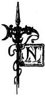
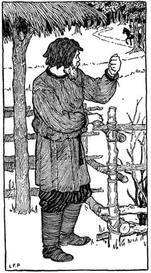
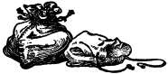

  
[Intangible Textual Heritage](../../index.md)  [Legends and
Sagas](../index)  [Index](index)  [Previous](chap06)  [Next](chap08.md) 

------------------------------------------------------------------------

[Buy this Book on
Kindle](https://www.amazon.com/exec/obidos/ASIN/B002H9XSSI/internetsacredte.md)

------------------------------------------------------------------------

  
*Folk Tales From the Russian*, by Verra Xenophontovna Kalamatiano de
Blumenthal, \[1903\], at Intangible Textual Heritage

------------------------------------------------------------------------

p. 128

### DIMIAN THE PEASANT

|                       |
|-----------------------|
|  |

NOT long ago, or perchance very long ago, I do not know for sure, there
lived in a village, some place in Russia, a peasant—a moujik. And this
peasant was a stubborn and a quick-tempered fellow, and his name was
Dimian.

He was harsh by nature, this Dimian, and wanted everything to go his own
way. If any one talked or acted against him, Dimian's fists were soon
prepared for answer.

Sometimes, for instance, he would invite one of his neighbors and treat
his guest with fine things to eat and to drink. And the neighbor in
order to maintain the old custom would pretend to refuse. Dimian would
at once begin the dispute: "Thou must obey thy host!" Once it happened
that a shrewd fellow called on him. Our moujik Dimian covered the table
with the very best he had and rejoiced over the good time he foresaw.

p. 129

 

*"Well, I struck a snag"*

p. 130

The fellow guest speedily ate everything up. Dimian was rather amazed,
but brought out his kaftan.

"Take off thy sheepskin," said he to the guest; "put on my new kaftan."

In proposing it he thought within himself:

"I will bet that this time he will not dare accept; then I will teach
him a lesson."

But the fellow quickly put on the new kaftan, tightened it with the
belt, shook his curly head and answered:

"Have my thanks, uncle, for thy gift. How could I dare not take it? Why,
one must obey his host's bidding."

Dimian's temper was rising, and he wanted at any rate to have his own
way. But what to do? He hastened to the stable, brought out his best
horse, and said to his guest:

"Thou art welcome to all my belongings," and within himself he thought,
"He certainly will refuse this time, and then my turn will come."

But the fellow did not refuse, and smilingly answered:

p. 131

"In thy house thou art the ruler," and quickly he jumped on the horse's
back and shouted to Dimian, the peasant:

"Farewell, master! no one pushed thee into the trap but thyself," and
with these words the fellow was off.

Dimian looked after him and shook his head.

"Well, I struck a snag," said he.

 

------------------------------------------------------------------------

[Next: The Golden Mountain](chap08.md)
