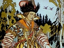
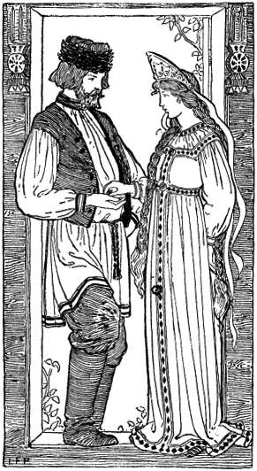
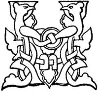
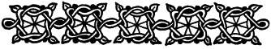
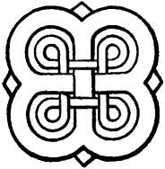

  
[Intangible Textual Heritage](../../index)  [Legends and
Sagas](../index)  [Index](index)  [Next](foreword) 

------------------------------------------------------------------------

[Buy this Book on
Kindle](https://www.amazon.com/exec/obidos/ASIN/B002H9XSSI/internetsacredte)

------------------------------------------------------------------------

  
*Folk Tales From the Russian*, by Verra Xenophontovna Kalamatiano de
Blumenthal, \[1903\], at Intangible Textual Heritage

------------------------------------------------------------------------

p. 4

 *  
"She gave him a touchstone and flint"  
*(See page 134)

p. 5

# FOLK TALES FROM THE RUSSIAN

RETOLD BY  
VERRA XENOPHONTOVNA  
KALAMATIANO DE BLUMENTHAL

\[1903\]

Scanned, proofed and formatted at Intangible Textual Heritage by John
Bruno Hare, March 2002. This text is in the public domain in the US
because it was published prior to 1923.

 

p. 6

p. 7

p. 8

p. 9

 

### THE TABLE OF CONTENTS

|                           |                                 |
|---------------------------|---------------------------------|
|                           | PAGE |
| *Foreword*                | [7](#page_7)                    |
| *A List of Illustrations* | [10](listill.htm#page_10)       |
| *Dedication*              | [11](dedicati.htm#page_11)      |
| *Notes*                   | [149](notes.htm#page_n149)      |
| FOLK TALES                |                                 |
| The Tsarevna Frog         | [13](chap01.htm#page_13)        |
| Seven Simeons             | [27](chap02.htm#page_27)        |
| The Language of the Birds | [66](chap03.htm#page_66)        |
| Ivanoushka the Simpleton  | [77](chap04.htm#page_77)        |
| Woe Bogotir               | [107](chap05.htm#page_107)      |
| Baba Yaga                 | [118](chap06.htm#page_118)      |
| Dimian the Peasant        | [128](chap07.htm#page_128)      |
| The Golden Mountain       | [132](chap08.htm#page_132)      |
| Father Frost              | [141](chap09.htm#page_141)      |

 

------------------------------------------------------------------------

[Next: Foreword](foreword)
