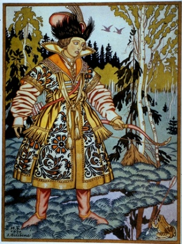

  
[Intangible Textual Heritage](../../index.md)  [Legends and
Sagas](../index.md) 

------------------------------------------------------------------------

[Buy this Book on
Kindle](https://www.amazon.com/exec/obidos/ASIN/B002H9XSSI/internetsacredte.md)

------------------------------------------------------------------------

<table width="75%">
<colgroup>
<col style="width: 50%" />
<col style="width: 50%" />
</colgroup>
<tbody>
<tr class="odd">
<td width="50%" data-valign="TOP"></td>
<td width="50%" data-valign="CENTER"><h1 id="folk-tales-from-the-russian" data-align="CENTER">Folk Tales From the Russian</h1>
<h4 id="by-verra-xenophontovna-kalamatiano-de-blumenthal" data-align="CENTER">by Verra Xenophontovna Kalamatiano de Blumenthal</h4>
<h5 id="section" data-align="CENTER">[1903]</h5></td>
</tr>
</tbody>
</table>

------------------------------------------------------------------------

[Contents](#contents)    [Start Reading](ftftr.md)    [Page
Index](pageidx)    [Text \[Zipped\]](ftr.txt.gz.md)

------------------------------------------------------------------------

|                                                                                                                           |
|---------------------------------------------------------------------------------------------------------------------------|
|  |

This is a short collection of Russian folklore, including the famous
Tale of Baba Yaga, the witch who lives in the wood in a moveable hut
with hen's feet.

------------------------------------------------------------------------

 [Title Page and Contents](ftftr.md)  
[Foreword](foreword.md)  
[A List of Illustrations](listill.md)  
[Dedication](dedicati.md)  
[Notes](notes.md)  
[The Tsarevna Frog](chap01.md)  
[Seven Simeons](chap02.md)  
[The Language of the Birds](chap03.md)  
[Ivanoushka the Simpleton](chap04.md)  
[Woe Bogotir](chap05.md)  
[Baba Yaga](chap06.md)  
[Dimian the Peasant](chap07.md)  
[The Golden Mountain](chap08.md)  
[Father Frost](chap09.md)  
