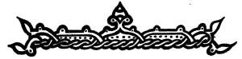

  
[Intangible Textual Heritage](../../index)  [Legends and
Sagas](../index)  [Index](index)  [Previous](foreword) 
[Next](dedicati) 

------------------------------------------------------------------------

[Buy this Book on
Kindle](https://www.amazon.com/exec/obidos/ASIN/B002H9XSSI/internetsacredte)

------------------------------------------------------------------------

  
*Folk Tales From the Russian*, by Verra Xenophontovna Kalamatiano de
Blumenthal, \[1903\], at Intangible Textual Heritage

------------------------------------------------------------------------

p. 10

 

<table data-border="0" width="80%">
<colgroup>
<col style="width: 50%" />
<col style="width: 50%" />
</colgroup>
<tbody>
<tr class="odd">
<td colspan="2" width="100%"><h3 id="a-list-of-illustrations" data-align="center">A LIST OF ILLUSTRATIONS</h3></td>
</tr>
<tr class="even">
<td colspan="2" width="100%">
PAGE
</td>
</tr>
<tr class="odd">
<td width="50%">
"She gave him a touchstone and flint"
</td>
<td width="50%">
<em>Frontispiece</em>
</td>
</tr>
<tr class="even">
<td width="50%">
The Tsarevna Frog
</td>
<td width="50%">
<a href="chap01.htm#img_image009">12</a>
</td>
</tr>
<tr class="odd">
<td width="50%">
"Hunters, grooms, and servants rushed in all 
directions"
</td>
<td width="50%">
<a href="chap02.htm#img_image013">34</a>
</td>
</tr>
<tr class="even">
<td width="50%">
Ivan learns the language of the birds
</td>
<td width="50%">
 
</td>
</tr>
<tr class="odd">
<td width="50%">
"The old man went begging from town to town"
</td>
<td width="50%">
 
</td>
</tr>
<tr class="even">
<td width="50%">
"One brother was sent to watch the turkeys"
</td>
<td width="50%">
<a href="chap04.htm#img_image020">105</a>
</td>
</tr>
<tr class="odd">
<td width="50%">
The rich brother
</td>
<td width="50%">
<a href="chap05.htm#img_image022">109</a>
</td>
</tr>
<tr class="even">
<td width="50%">
"The children ran away as fast as their little 
feet could possibly carry them"
</td>
<td width="50%">
<a href="chap06.htm#img_image024">125</a>
</td>
</tr>
<tr class="odd">
<td width="50%">
"Well, I struck a snag"
</td>
<td width="50%">
<a href="chap07.htm#img_image027">129</a>
</td>
</tr>
<tr class="even">
<td width="50%">
"Old Frost gave the gentle girl many beautiful, 
beautiful things"
</td>
<td width="50%">
<a href="chap09.htm#img_image032">144</a>
</td>
</tr>
</tbody>
</table>

 

------------------------------------------------------------------------

[Next: Dedication](dedicati)
