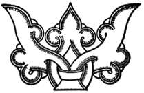
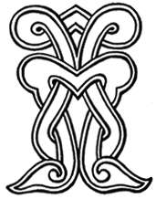

  
[Intangible Textual Heritage](../../index.md)  [Legends and
Sagas](../index)  [Index](index)  [Previous](dedicati)  [Next](chap01.md) 

------------------------------------------------------------------------

[Buy this Book on
Kindle](https://www.amazon.com/exec/obidos/ASIN/B002H9XSSI/internetsacredte.md)

------------------------------------------------------------------------

  
*Folk Tales From the Russian*, by Verra Xenophontovna Kalamatiano de
Blumenthal, \[1903\], at Intangible Textual Heritage

------------------------------------------------------------------------

p. 149

 

NOTES

(*The numbers refer to pages in the text.*)

[13](chap01.htm#page_13). A *tsarstvo* is the domain of a *tsar* (czar.md),
which is the title of an absolute monarch in Russia. The word *tsar,*
derived from the Roman name and title, Cæsar, may be translated emperor,
king, or prince. A number of words are formed from it by adding
different syllables: Tsarevitch, the tsar's son, prince; Tsarevna, the
tsar's daughter, princess; Tsaritza, the tsar's wife, queen or empress.

[14](chap01.htm#page_14.md). *Boyar* was the word formerly used to mean a
Russian nobleman; so a *boyar-house* is a lord's house; *boyarishnia,* a
lord's daughter. The *terem* was that part of the boyar-house in which
the women's rooms were situated.

[16](chap01.htm#page_16.md). In Russia there is a fatherly relation
existing between the ruler and his subjects which is shown in such
phrases as "the tsar father," "their father sovereign," etc. The Russian
language has many diminutives, or terms of endearment. For instance, the
Tzar is often affectionately called "the little father" by his subjects.

[17](chap01.htm#page_17.md). *"Once said, quickly done."* This is the
Russian idiom. Observe how much more lively it is than our own "No
sooner said than done."

[29](chap02.htm#page_29.md). *The holy icons* are pictures or mosaics of
Christ, or the Virgin Mary, or of some saint or martyr of the Russian
church. In every Russian house there is one or more, hung in a prominent
place. Every one who enters the house at once bows and utters a prayer
before the icons before he does anything else. This is an old Russian
custom which is still kept up by peasants.

p. 150

[29](chap02.htm#page_29.md). *Strong green wine.* This is the phrase still
used by Russian story-tellers to describe the drink which it was an
honor to receive from the royal hand. Its strength was magical in that
it was not acquired by keeping, but was always the same.

[35](chap02.htm#page_35.md). *For a cloudy day* is the Russian idiom very
similar to our own.

[37](chap02.htm#page_37.md). *It is a peasant's trade* is a Russian saying
which means, "It doesn't amount to much."

[46](chap02.htm#page_46.md). *Moujik,* a peasant: his duties are those of a
farm laborer, yet this phrase would not be a fair translation. This
word, which is rendered "tiller of the soil," has no exact equivalent in
English.

[48](chap02.htm#page_48.md). *Korolevitch,* from *korol:* king. The endings
*evitch* and *evna* show descent, korolevitch meaning son of a king;
korolevna meaning daughter of a king.

[53](chap02.htm#page_53.md). *Dutch trumpet,* i. e., an imported trumpet.
Anything foreign is "Dutch" to the Russian peasant.

[60](chap02.htm#page_60.md). *Honey drink,* a drink made by fermenting
honey and water. It is quite common in Russia, and is about the same as
our mead.

[65](chap02.htm#page_65.md). Russian and other Slavonic tales often have
queer endings, similar to the one here given by the story-teller at the
end of the story, which is no part of the tale. To the Russian they give
a poetic touch, a little sense of confusion and mystery which is
certainly delightful.

[66](chap03.htm#page_66.md). *Holy Russia.* To the Russian his country is
sacred; everything outside is profane by comparison. The phrase suggests
the *Holy Roman Empire* of history, or the *Celestial Kingdom* of the
Chinese.

[81](chap04.htm#page_81.md). In the peasant's house there is often a large
stove of brick or tile on which the family sleep in cold weather.

[83](chap04.htm#page_83.md). *A day in and an equal day out,* the Russian
idiom. Observe how very like our own.

[113](chap05.htm#page_113.md). *Kabak,* a drinking saloon.

[115](chap05.htm#page_115.md). The *ruble* is the principal coin of Russia,
as

p. 151

the dollar is in the United States. It is equal to 100 copecks, and at
this time (1903) is worth only about 50 cents.

[116](chap05.htm#page_116.md). *Honey to drink,* i. e., fermented honey, or
mead. (See note to p. [60](chap02.htm#page_60)..md)

[118](chap06.htm#page_118.md). *Baba,* a peasant woman, or grandmother;
granny. *Yaga,* witch. *Baba Yaga,* therefore, is the familiar
"Grandmother Witch."

[120](chap06.htm#page_120.md). *Izba,* a hut. *Izboushka,* a tiny hut.

[143](chap09.htm#page_143.md). *Schouba,* a large fur-lined cloak.

[145](chap09.htm#page_145.md). *Sarafan,* the Russian national costume for
women.

 

p. 152

 

------------------------------------------------------------------------

[Next: The Tsarevna Frog](chap01.md)
