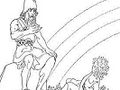
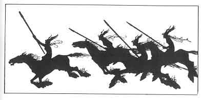

  
[Intangible Textual Heritage](../../../index)  [Legends and
Sagas](../../index)  [Iceland](../index)  [Index](index) 
[Previous](coo00)  [Next](coo02) 

------------------------------------------------------------------------

[Buy this Book at
Amazon.com](https://www.amazon.com/exec/obidos/ASIN/B0025VKZFM/internetsacredte)

------------------------------------------------------------------------

  
*The Children of Odin*, by Padraic Colum, \[1920\], at Intangible
Textual Heritage

------------------------------------------------------------------------

 

# CONTENTS

|      |                                                                          |                           |
|------|--------------------------------------------------------------------------|---------------------------|
|      | PART I *The Dwellers in Asgard*                                          |                           |
| 1\.  | Far Away and Long Ago                                                    | [3](coo02.htm#page_3)     |
| 2\.  | The Building of the Wall                                                 | [6](coo03.htm#page_6)     |
| 3\.  | Iduna and Her Apples: How Loki Put the Gods in Danger                    | [13](coo04.htm#page_13)   |
| 4\.  | Sif's Golden Hair: How Loki Wrought Mischief in Asgard                   | [27](coo05.htm#page_27)   |
| 5\.  | How Brock Brought judgment on Loki                                       | [34](coo06.htm#page_34)   |
| 6\.  | How Freya Gained Her Necklace and How Her Loved One Was Lost to Her      | [44](coo07.htm#page_44)   |
| 7\.  | How Frey Won Gerda, the Giant Maiden, and How He Lost His Magic Sword    | [51](coo08.htm#page_51)   |
| 8\.  | Heimdall and Little Hnossa: How All Things Came to Be                    | [62](coo09.htm#page_62)   |
| 9\.  | The All-Father's Forebodings: How He Leaves Asgard                       | [69](coo10.htm#page_69)   |
|      | PART II *Odin the Wanderer*                                              |                           |
| 1\.  | Odin Goes to Mimir's Well: His Sacrifice for Wisdom                      | [77](coo11.htm#page_77)   |
| 2\.  | Odin Faces an Evil Man                                                   | [82](coo12.htm#page_82)   |
| 3\.  | Odin Wins for Men the Magic Mead                                         | [90](coo13.htm#page_90)   |
| 4\.  | Odin Tells to Vidar, His Silent Son, the Secret of His Doings            | [99](coo14.htm#page_99)   |
| 5\.  | Thor and Loki in the Giants' City                                        | [102](coo15.htm#page_102) |
| 6\.  | How Thor and Loki Befooled Thrym the Giant                               | [116](coo16.htm#page_116) |
| 7\.  | Aegir's Feast: How Thor Triumphed                                        | [124](coo17.htm#page_124) |
| 8\.  | The Dwarf's Hoard, and the Curse that It Brought                         | [136](coo18.htm#page_136) |
|      | PART III *The Witch's Heart*                                             |                           |
| 1\.  | Foreboding in Asgard                                                     | [151](coo19.htm#page_151) |
| 2\.  | Loki the Betrayer                                                        | [155](coo20.htm#page_155) |
| 3\.  | Loki Against the Aesir                                                   | [164](coo21.htm#page_164) |
| 4\.  | The Valkyrie                                                             | [169](coo22.htm#page_169) |
| 5\.  | The Children of Loki                                                     | [174](coo23.htm#page_174) |
| 6\.  | Baldur's Doom                                                            | [180](coo24.htm#page_180) |
| 7\.  | Loki's Punishment                                                        | [193](coo25.htm#page_193) |
|      | PART IV *The Sword of the Volsungs and the Twilight of the Gods*         |                           |
| 1\.  | Sigurd's Youth                                                           | [199](coo26.htm#page_199) |
| 2\.  | The Sword Gram and the Dragon Fafnir                                     | [208](coo27.htm#page_208) |
| 3\.  | The Dragon's Blood                                                       | [215](coo28.htm#page_215) |
| 4\.  | The Story of Sigmund and Signy                                           | [223](coo29.htm#page_223) |
| 5\.  | The Story of Sigmund and Sinfiotli                                       | [233](coo30.htm#page_233) |
| 6\.  | The Story of the Vengeance of the Volsungs and of the Death of Sinfiotli | [239](coo31.htm#page_239) |
| 7\.  | Brynhild in the House of Flame                                           | [245](coo32.htm#page_245) |
| 8\.  | Sigurd at the House of the Nibelungs                                     | [250](coo33.htm#page_250) |
| 9\.  | How Brynhild Was Won for Gunnar                                          | [255](coo34.htm#page_255) |
| 10\. | The Death of Sigurd                                                      | [260](coo35.htm#page_260) |
| 11\. | The Twilight of the Gods                                                 | [265](coo36.htm#page_265) |

 

------------------------------------------------------------------------

[Next: 1. Far Away and Long Ago](coo02)
