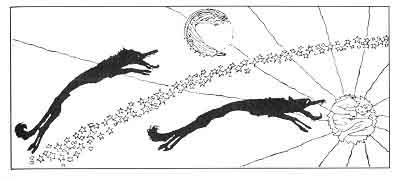

  
[Intangible Textual Heritage](../../../index)  [Legends and
Sagas](../../index)  [Iceland](../index)  [Index](index) 
[Previous](coo01)  [Next](coo03) 

------------------------------------------------------------------------

[Buy this Book at
Amazon.com](https://www.amazon.com/exec/obidos/ASIN/B0025VKZFM/internetsacredte)

------------------------------------------------------------------------

  
*The Children of Odin*, by Padraic Colum, \[1920\], at Intangible
Textual Heritage

------------------------------------------------------------------------

p. 3

 

# PART I

# THE DWELLERS IN ASGARD

### 1. FAR AWAY AND LONG AGO

ONCE there was another Sun and another Moon; a different Sun and a
different Moon from the ones we see now. Sol was the name of that Sun
and Mani was the name of that Moon. But always behind Sol and Mani
wolves went; a wolf behind each. The wolves caught on them at last and
they devoured Sol and Mani. And then the world was in darkness and cold.

In those times the Gods lived, Odin and Thor, Hödur and Baldur, Tyr and
Heimdall, Vidar and Vali, as well as Loki, the doer of good and the doer
of evil. And the beautiful Goddesses were living then, Frigga, Freya,
Nanna, Iduna, and Sif. But in the days when the Sun and Moon were
destroyed the Gods were destroyed too--all the Gods except Baldur who
had died before that time, Vidar and Vali, the sons of Odin, and Modi
and Magni, the sons of Thor.

p. 4

At that time, too, there were men and women in the world. But before the
Sun and the Moon were devoured and before the Gods were destroyed,
terrible things happened in the world. Snow fell on the four corners of
the earth and kept on falling for three seasons. Winds came and blew
everything away. And the people of the world who had lived on in spite
of the snow and the cold and the winds fought each other, brother
killing brother, until all the people were destroyed.

Also there was another earth at that time, an earth green and beautiful.
But the terrible winds that blew leveled down forests and hills and
dwellings. Then fire came and burnt the earth. There was darkness, for
the Sun and the Moon were devoured. The Gods had met with their doom.
And the time in which all these things happened was called Ragnarök, the
Twilight of the Gods.

Then a new Sun and a new Moon appeared and went traveling through the
heavens; they were more lovely than Sol and Mani, and no wolves followed
behind them in chase. The earth became green and beautiful again, and in
a deep forest that the fire had not burnt a woman and a man wakened up.
They had been hidden there by Odin and left to sleep during Ragnarök,
the Twilight of the Gods.

Lif was the woman's name, and Lifthrasir was the man's. They moved
through the world, and their children and their children's children made
people for the new earth. And of the Gods were left Vidar and Vali, the
sons of Odin, and Modi and Magni, the sons of Thor; on the

p. 5

new earth Vidar and Val, found tablets that the older Gods had written
on and had left there for them, tablets telling of all that had happened
before Ragnarök, the Twilight of the Gods.

And the people who lived after Ragnarök, the Twilight of the Gods, were
not troubled, as the people in the older days were troubled, by the
terrible beings who had brought destruction upon the world and upon men
and women, and who from the beginning had waged way upon the Gods.

------------------------------------------------------------------------

[Next: 2. The Building of the Wall](coo03)
