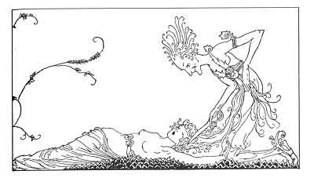

  
[Intangible Textual Heritage](../../../index)  [Legends and
Sagas](../../index)  [Iceland](../index)  [Index](index) 
[Previous](coo04)  [Next](coo06) 

------------------------------------------------------------------------

[Buy this Book at
Amazon.com](https://www.amazon.com/exec/obidos/ASIN/B0025VKZFM/internetsacredte)

------------------------------------------------------------------------

  
*The Children of Odin*, by Padraic Colum, \[1920\], at Intangible
Textual Heritage

------------------------------------------------------------------------

p. 27

 

### 4. SIF'S GOLDEN HAIR: HOW LOKI WROUGHT MISCHIEF IN ASGARD

ALL who dwelt in Asgard, the Æsir and the Asyniur, who were the Gods and
the Goddesses, and the Vanir, who were the friends of the Gods and the
Goddesses, were wroth with Loki. It was no wonder they were wroth with
him, for he had let the Giant Thiassi carry off Iduna and her golden
apples. Still, it must be told that the show they made of their wrath
made Loki ready to do more mischief in Asgard.

One day he saw a chance to do mischief that made his heart rejoice. Sif,
the wife of Thor, was lying asleep outside her house. Her beautiful
golden hair flowed all round her. Loki knew how much Thor loved that
shining hair, and how greatly Sif prized it because of Thor's love. Here

p. 28

was his chance to do a great mischief. Smilingly, he took out his shears
and he cut off the shining hair, every strand and every tress. She did
not waken while her treasure was being taken from her. But Loki left
Sif's head cropped and bare.

Thor was away from Asgard. Coming back to the City of the Gods, he went
into his house. Sif, his wife, was not there to welcome him. He called
to Sif, but no glad answer came from her. To the palaces of all the Gods
and Goddesses Thor went, but in none of them did he find Sif, his
golden-haired wife.

When he was coming back to his house he heard his name whispered. He
stopped, and then a figure stole out from behind a stone. A veil covered
her head, and Thor scarce knew that this was Sif, his wife. As he went
to her she sobbed and sobbed. "O Thor, my husband," she said, "do not
look upon me. I am ashamed that you should see me. I shall go from
Asgard and. from the company of the Gods and Goddesses, and I shall go
down to Svartheim and live amongst the Dwarfs. I cannot bear that any of
the Dwellers in Asgard should look upon me now."

"O Sif," cried Thor, "what has happened to change you?"

"I have lost the hair of my head," said Sif, "I have lost the beautiful
golden hair that you, Thor, loved. You will not love me any more, and so
I must go away, down to Svartheim and to the company of the Dwarfs. They
are as ugly as I am now."

Then she took the veil off her head and Thor saw that

p. 29

all her beautiful hair was gone. She stood before him, shamed and
sorrowful, and he grew into a mighty rage. "Who was it did this to you,
Sif?" he said. "I am Thor, the strongest of all the Dwellers in Asgard,
and I shall see to it that all the powers the Gods possess will be used
to get your fairness back. Come with me, Sif." And taking his wife's
hand in his, Thor went off to the Council House where the Gods and the
Goddesses were.

Sif covered her head with her veil, for she would not have the Gods and
Goddesses look upon her shorn head. But from the anger in Thor's eyes
all saw that the wrong done to Sif was great indeed. Then Thor told of
the cutting of her beautiful hair. A whisper went round the Council
House. "It was Loki did this--no one else in Asgard would have done a
deed so shameful," one said to the other.

"Loki it was who did it," said Thor. "He has hidden himself, but I shall
find him and I will slay him."

"Nay, not so, Thor," said Odin, the Father of the Gods. "Nay, no Dweller
in Asgard may slay another. I shall summon Loki to come before us here.
It is for you to make him (and remember that Loki is cunning and able to
do many things) bring back to Sif the beauty of her golden hair."

Then the call of Odin, the call that all in Asgard have to harken to,
went through the City of the Gods. Loki heard it, and he had to come
from his hiding-place and enter the house where the Gods held their
Council. And when he looked on Thor and saw the rage that was in his

p. 30

eyes, and when he looked on Odin and saw the sternness in the face of
the Father of the Gods, he knew that he would have to make amends for
the shameful wrong he had done to Sif.

Said Odin, "There is a thing that you, Loki, have to do: Restore to Sif
the beauty of her hair."

Loki looked at Odin, Loki looked at Thor, and he saw that what was said
would have to be done. His quick mind searched to find a way of
restoring to Sif the beauty of her golden hair.

"I shall do as you command, Odin All-Father," he said.

But before we tell you of what Loki did to restore the beauty of Sif's
golden hair, we must tell you of the other beings besides the Gods and
the Goddesses who were in the world at the time. First, there was the
Vanir. When the Gods who were called the Æsir came to the mountain on
which they built Asgard, they found other beings there. These were not
wicked and ugly like the Giants; they were beautiful and friendly; the
Vanir they were named.

Although they were beautiful and friendly the Vanir had no thought of
making the world more beautiful or more happy. In that way they differed
from the Æsir who had such a thought. The Æsir made peace with them, and
they lived together in friendship, and the Vanir came to do things that
helped the Æsir to make the world more beautiful and more happy. Freya,
whom the Giant wanted to take away with the Sun and the Moon as a reward
for the building of the wall round Asgard, was of the Vanir.

p. 31

\[paragraph continues\] The other beings
of the Vanir were Frey, who was the brother of Freya, and Niörd, who was
their father.

On the earth below there were other beings--the dainty Elves, who danced
and fluttered about, attending to the trees and flowers and grasses. The
Vanir were permitted to rule over the Elves. Then below the earth, in
caves and hollows, there was another race, the Dwarfs or Gnomes, little,
twisted creatures, who were both wicked and ugly, but who were the best
craftsmen in the world.

In the days when neither the Æsir nor the Vanir were friendly to him
Loki used to go down to Svartheim, the Dwarfs' dwelling below the earth.
And now that he was commanded to restore to Sif the beauty of her hair,
Loki thought of help he might get from the Dwarfs.

Down, down, through the winding passages in the earth he went, and he
came at last to where the Dwarfs who were most friendly to him were
working in their forges. All the Dwarfs were master-smiths, and when he
came upon his friends he found them working hammer and tongs, beating
metals into many shapes. He watched them for a while and took note of
the things they were making. One was a spear, so well balanced and made
that it would hit whatever mark it was thrown at no matter how bad the
aim the thrower had. The other was a boat that could sail on any sea,
but that could be folded up so that it would go into one's pocket. The
spear was called Gungnir and the boat was called Skidbladnir.

Loki made himself very agreeable to the Dwarfs, praising

p. 32

their work and promising them things that only the Dwellers in Asgard
could give, things that the Dwarfs longed to possess. He talked to them
till the little, ugly folk thought that they would come to own Asgard
and all that was in it.

At last Loki said to them, "Have you got a bar of fine gold that you can
hammer into threads--into threads so fine that they will be like the
hair of Sif, Thor's wife? Only the Dwarfs could make a thing so
wonderful. Ah, there is the bar of gold. Hammer it into those fine
threads, and the Gods themselves will be jealous of your work."

Flattered by Loki's speeches, the Dwarfs who were in the forge took up
the bar of fine gold and flung it into the fire. Then taking it out and
putting it upon their anvil they worked on the bar with their tiny
hammers until they beat it into threads that were as fine as the hairs
of one's head. But that was not enough. They had to be as fine as the
hairs on Sif's head, and these were finer than anything else. They
worked on the threads, over and over again, until they were as fine as
the hairs on Sif's head. The threads were as bright as sunlight, and
when Loki took up the mass of worked gold it flowed from his raised hand
down on the ground. It was so fine that it could be put into his palm,
and it was so light that a bird might not feel its weight.

Then Loki praised the Dwarfs more and more, and he made more and more
promises to them. He charmed them all, although they were an unfriendly
and a suspicious folk. And before he left them he asked them for the
spear

p. 33

and the boat he had seen them make, the spear Gungnir and the boat
Skidbladnir. The Dwarfs gave him these things, though in a while after
they wondered at themselves for giving them.

Back to Asgard Loki went. He walked into the Council House where the
Dwellers in Asgard were gathered. He met the stern look in Odin's eyes
and the rageful look in Thor's eyes with smiling good humor. "Off with
thy veil, O Sif," he said. And when poor Sif took off her veil he put
upon her shorn head the wonderful mass of gold he held in his palm. Over
her shoulders the gold fell, fine, soft, and shining as her own hair.
And the Æsir and the Asyniur, the Gods and the Goddesses, and the Van
and Vana, when they saw Sif's head covered again with the shining web,
laughed and clapped their hands in gladness. And the shining web held to
Sif's head as if indeed it had roots and was growing there.

------------------------------------------------------------------------

[Next: 5. How Brock Brought Judgment on Loki](coo06)
