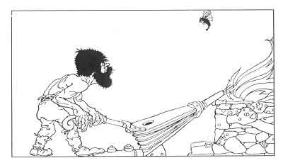

  
[Intangible Textual Heritage](../../../index.md)  [Legends and
Sagas](../../index)  [Iceland](../index)  [Index](index.md) 
[Previous](coo05)  [Next](coo07.md) 

------------------------------------------------------------------------

[Buy this Book at
Amazon.com](https://www.amazon.com/exec/obidos/ASIN/B0025VKZFM/internetsacredte.md)

------------------------------------------------------------------------

  
*The Children of Odin*, by Padraic Colum, \[1920\], at Intangible
Textual Heritage

------------------------------------------------------------------------

p. 34

 

### 5. HOW BROCK BROUGHT JUDGMENT ON LOKI

IT was then that Loki, with the wish of making the Æsir and the Vanir
friendly to him once more, brought out the wonderful things he had
gained from the Dwarfs--the spear Gungnir and the boat Skidbladnir. The
Æsir and the Vanir marveled at things so wonderful. Loki gave the spear
as a gift to Odin, and to Frey, who was chief of the Vanir, he gave the
boat Skidbladnir.

All Asgard rejoiced that things so wonderful and so helpful had been
brought to them. And Loki, who had made a great show in giving these
gifts, said boastingly:

"None but the Dwarfs who work for me could make such things. There are
other Dwarfs, but they are as unhandy as they are misshapen. The Dwarfs
who are my

p. 35

servants are the only ones who can make such wonders." Now Loki in his
boastfulness had said a foolish thing. There were other Dwarfs besides
those who had worked for him, and one of these was there in Asgard. All
unknown to Loki he stood in the shadow of Odin's seat, listening to what
was being said. Now he went over to Loki, his little, unshapely form
trembling with rage--Brock, the most spiteful of all the Dwarfs.

"Ha, Loki, you boaster," he roared, "you lie in your words. Sindri, my
brother, who would scorn to serve you, is the best smith in Svartheim."

The Æsir and the Vanir laughed to see Loki outfaced by Brock the Dwarf
in the middle of his boastfulness. As they laughed Loki grew angry.

"Be silent, Dwarf," he said, "your brother will know about smith's work
when he goes to the Dwarfs who are my friends, and learns something from
them."

"He learn from the Dwarfs who are your friends! My brother Sindri learn
from the Dwarfs who are your friends!" Brock roared, in a greater rage
than before. "The things you have brought out of Svartheim would not be
noticed by the Æsir and the Vanir if they were put beside the things
that my brother Sindri can make."

"Sometime we will try your brother Sindri and see what he can do," said
Loki.

"Try now, try now," Brock shouted. "I'll wager my 'head against yours,
Loki, that his work will make the Dwellers in Asgard laugh at your
boasting."

"I will take your wager," said Loki. "My head against

p. 36

yours. And glad will I be to see that ugly head of yours off your
misshapen shoulders."

"The Æsir will judge whether my brother's work is not the best that ever
came out of Svartheim. And they will see to it that you will pay your
wager, Loki, the head off your shoulders. Will ye not sit in judgment, O
Dwellers in Asgard?"

"We will sit in judgment," said the Æsir. Then, still full of rage,
Brock the Dwarf went down to Svartheim, and to the place where his
brother Sindri worked.

There was Sindri in his glowing forge, working with bellows and anvil
and hammers beside him, and around him masses of metal--gold and silver,
copper and iron. Brock told his tale, how he had wagered his head
against Loki's that Sindri could make things more wonderful than the
spear and the boat that Loki had brought into Asgard.

"You were right in what you said, my brother," said Sindri, "and you
shall not lose your head to Loki. But the two of us must work at what I
am going to forge. It will be your work to keep the fire so that it will
neither blaze up nor die down for a single instant. If you can keep the
fire as I tell you, we will forge a wonder. Now, brother, keep your
hands upon the bellows, and keep the fire under your control."

Then into the fire Sindri threw, not a piece of metal, but a pig's skin.
Brock kept his hands on the bellows, working it so that the fire neither
died down nor blazed up for a single instant. And in the glowing fire
the pigskin swelled itself into a strange shape.

But Brock was not left to work the bellows in peace. In

p. 37

to the forge flew a gadfly. It lighted on Brock's hands and stung them.
The Dwarf screamed with pain, but his hands still held the bellows,
working it to keep the fire steady, for he knew that the gadfly was
Loki, and that Loki was striving to spoil Sindri's work. Again the
gadfly stung his hands, but Brock, although his hands felt as if they
were pierced with hot irons, still worked the bellows so that the fire
did not blaze up or die down for a single instant.

Sindri came and looked into the fire. Over the shape that was rising
there he said words of magic. The gadfly had flown away, and Sindri bade
his brother cease working. He took out the thing that had been shaped in
the fire, and he worked over it with his hammer. It was a wonder
indeed--a boar, all golden, that could fly through the air, and that
shed light from its bristles as it flew. Brock forgot the pain in his
hands and screamed with joy. "This is the greatest of wonders," he said.
"The Dwellers in Asgard will have to give the judgment against Loki. I
shall have Loki's head!"

But Sindri said, "The boar Golden Bristle may not be judged as great a
wonder as the spear Gungnir or the boat Skidbladnir. We must make
something more wonderful still. Work the bellows as before, brother, and
do not let the fire die down or blaze up for a single instant."

Then Sindri took up a piece bf gold that was so bright it lightened up
the dark cavern that the Dwarfs worked in. He threw the piece of gold
into the fire. Then he went to make ready something else and left Brock
to work the bellows.

The gadfly flew in again. Brock did not know it was

p. 38

there until it lighted on the back of his neck. It stung him till Brock
felt the pain was wrenching him apart. But still he kept his hands on
the bellows, working it so that the fire neither blazed up nor died down
for a single instant. When Sindri came to look into the fire, Brock was
not able to speak for pain.

Again Sindri said magic words over the gold that was being smelted in
the fire. He took it out of the glow and worked it over on the
main-anvil. Then in a while he showed Brock something that looked like
the circle of the sun. "A splendid armring, my brother," he said. "An
armring for a God's right arm. And this ring has hidden wonders. Every
ninth night eight rings like itself will drop from this armring, for
this is Draupnir, the Ring of Increase."

"To Odin, the Father of the Gods, the ring shall be given," said Brock.
"And Odin will have to declare that nothing so wonderful or so
profitable to the Gods was ever brought into Asgard. O Loki, cunning
Loki, I shall have thy head in spite of thy tricks."

"Be not too hasty, brother," said Sindri. "What we have done so far is
good. But better still must be the thing that will make the Dwellers in
Asgard give the judgment that delivers Loki's head to thee. Work as
before, brother, and do not let the fire blaze up or die down for a
single instant."

This time Sindri threw into the fire a bar of iron. Then he went away to
fetch the hammer that would shape it. Brock worked the bellows as
before, but only his hands

p. 39

were steady, for every other part of him was trembling with expectation
of the gadfly's sting.

He saw the gadfly dart into the forge. He screamed as it flew round and
round him, searching out a place where it might sting him most
fearfully. It lighted down on his forehead, just between his eyes. The
first sting it gave took the sight from his eyes. It stung again and
Brock felt the blood flowing down. Darkness filled the cave. Brock tried
to keep his hands steady on the bellows, but he did not know whether the
fire was blazing up or dying down. He shouted and Sindri hurried up.

Sindri said the magic words over the thing that was in the fire. Then he
drew it out. "An instant more," he said, "and the work would have been
perfect. But because you let the fire die down for an instant the work
is not as good as it might have been made." He took what was shaped in
the fire to the main-anvil and worked over it. Then when Brock's
eyesight came back to him he saw a great hammer, a hammer all of iron.
The handle did not seem .to be long enough to balance the head. This was
because the fire had died down for an instant while it was being formed.

"The hammer is Miölnir," said Sindri, "and it is the greatest of the
things that I am able to make. All in Asgard must rejoice to see this
hammer. Thor only will be able to wield it. Now I am not afraid of the
judgment that the Dwellers in Asgard will give."

"The Dwellers in Asgard will have to give judgment for us," Brock cried
out. "They will have to give judgment

p. 40

for us, and the head of Loki, my tormentor, will be given me."

"No more wonderful or more profitable gifts than these have ever been
brought into Asgard," Sindri said. "Thy head is saved, and thou wilt be
able to take the head of Loki who was insolent to us. Bring it here, and
we will throw it into the fire in the forge."

The Æsir and the Vanir were seated in the Council House of Asgard when a
train of Dwarfs appeared before them. Brock came at the head of the
train, and he was followed by a band of Dwarfs carrying things of great
weight. Brock and his attendants stood round the throne of Odin, and
harkened to the words of the Father of the Gods.

"We know why you have come into Asgard from out of Svartheim," Odin
said. "You have brought things wonderful and profitable to the Dwellers
in Asgard. Let what you have brought be seen, Brock. If they are more
wonderful and more useful than the things Loki has brought out of
Svartheim, the spear Gungnir and the boat Skidbladnir, we will give
judgment for you."

Then Brock commanded the Dwarfs who waited on him to show the Dwellers
in Asgard the first of the wonders that Sindri had made. They brought
out the boar, Golden Bristle. Round and round the Council House the boar
flew, leaving a track of brightness. The Dwellers in Asgard said one to
the other that this was a wonder indeed. But none would say that the
boar was a better thing to have in Asgard than the spear that would hit
the mark

p. 41

no matter how badly it was flung, or the boat Skidbladnir that would
sail on any sea, and that could be folded up so small that it would fit
in any one's pocket: none would say that Golden Bristle was better than
these wonders.

To Frey, who was Chief of the Vanir, Brock gave the wondrous boar.

Then the attending Dwarfs showed the armring that was as bright as the
circle of the Sun. All admired the noble ring. And when it was told how
every ninth night this ring dropped eight rings of gold that were like
itself, the Dwellers in Asgard spoke aloud, all saying that Draupnir,
the Ring of Increase, was a wonder indeed. Hearing their voices raised,
Brock looked triumphantly at Loki who was standing there with his lips
drawn closely together.

To Odin, the Father of the Gods, Brock gave the noble armring.

Then he commanded the attending Dwarfs to lay before Thor the hammer
Miölnir. Thor took the hammer up and swung it around his head. As he did
so he uttered a great cry. And the eyes of the Dwellers in Asgard
lightened up when they saw Thor with the hammer Miölnir in his hands;
their eyes lightened up and from their lips came the cry, "This is a
wonder, a wonder indeed! With this hammer in his hand none can withstand
Thor, our Champion. No greater thing has ever come into Asgard than the
hammer Miölnir."

Then Odin, the Father of the Gods, spoke from his throne, giving
judgment. "The hammer Miölnir that the Dwarf Brock has brought into
Asgard is a thing wonderful

p. 42

indeed and profitable to the Gods. In Thor's hands it can crush
mountains, and hurl the Giant race from the ramparts of Asgard. Sindri
the Dwarf has forged a greater thing than the spear Gungnir and the boat
Skidbladnir. There can be no other judgment."

Brock looked at Loki, showing his gnarled teeth. "Now, Loki, yield your
head, yield your head," he cried.

"Do not ask such a thing," said Odin. "Put any other penalty on Loki for
mocking you and tormenting you. Make him yield to you the greatest thing
that it is in his power to give."

"Not so, not so," screamed Brock. "You Dwellers in Asgard would shield
one another. But what of me? Loki would have taken my head had I lost
the wager. Loki has lost his head to me. Let him kneel down now till I
cut it off."

Loki came forward, smiling with closed lips. "I kneel before you,
Dwarf," he said. "Take off my head. But be careful. Do not touch my
neck. I did not bargain that you should touch my neck. If you do, I
shall call upon the Dwellers in Asgard to punish you."

Brock drew back with a snarl. "Is this the judgment of the Gods?" he
asked.

"The bargain you made, Brock," said Odin, "was an evil one, and all its
evil consequences you must bear."

Brock, in a rage, looked upon Loki, and he saw that his lips were
smiling. He stamped his feet and raged. Then he went up to Loki and
said, "I may not take your head, but I can do something with your lips
that mock me."

p. 43

"What would you do, Dwarf?" asked Thor.

"Sew Loki's lips together," said Brock, "so that he can do no more
mischief with his talk. You Dwellers in Asgard cannot forbid me to do
this. Down, Loki, on your knees before me."

Loki looked round on the Dwellers in Asgard and he saw that their
judgment was that he must kneel before the Dwarf. He knelt down with a
frown upon his brow. "Draw your lips together, Loki," said Brock. Loki
drew his lips together while his eyes flashed fire. With an awl that he
took from his belt Brock pierced Loki's lips. He took out a thong and
tightened them together. Then in triumph the Dwarf looked on Loki.

"O Loki," he said, "you boasted that the Dwarfs who worked for you were
better craftsmen than Sindri, my brother. Your words have been shown to
be lies. And now you cannot boast for a while."

Then Brock the Dwarf, with great majesty, walked out of the Council
House of Asgard, and the attending Dwarfs marched behind him in
procession. Down the passages in the earth the Dwarfs went, singing the
song of Brock's triumph over Loki. And in Svartheim it was told forever
after how Sindri and Brock had prevailed.

In Asgard, now that Loki's lips were closed, there was peace and a
respite from mischief. No one amongst the Æsir or the Vanir were sorry
when Loki had to walk about in silence with his head bent low.

------------------------------------------------------------------------

[Next: 6. How Freya Gained Her Necklace and How Her Loved One was Lost
to Her](coo07.md)
