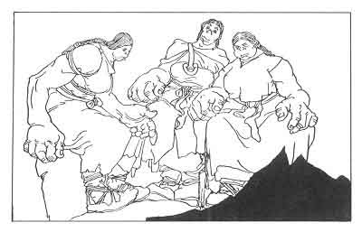

  
[Intangible Textual Heritage](../../../index.md)  [Legends and
Sagas](../../index)  [Iceland](../index)  [Index](index.md) 
[Previous](coo06)  [Next](coo08.md) 

------------------------------------------------------------------------

[Buy this Book at
Amazon.com](https://www.amazon.com/exec/obidos/ASIN/B0025VKZFM/internetsacredte.md)

------------------------------------------------------------------------

  
*The Children of Odin*, by Padraic Colum, \[1920\], at Intangible
Textual Heritage

------------------------------------------------------------------------

p. 44

 

### 6. HOW FREYA GAINED HER NECKLACE AND HOW HER LOVED ONE WAS LOST TO HER

YES, Loki went through Asgard silent and with head bent, and the
Dwellers in Asgard said one unto the other, "This will teach Loki to
work no more mischief." They did not know that what Loki had done had
sown the seeds of mischief and that these seeds were to sprout up and
bring sorrow to the beautiful Vana Freya, to Freya whom the Giant wanted
to carry off with the Sun and the Moon as payment for his building the
wall around Asgard.

Freya had looked upon the wonders that Loki had brought into Asgard--the
golden threads that were Sif's

p. 45

hair, and Frey's boar that shed light from its bristles as it flew. The
gleam of these golden things dazzled her, and made her dream in the day
time and the night time of the wonders that she herself might possess.
And often she thought, "What wonderful things the Three Giant Women
would give me if I could bring myself to go to them on their
mountaintop."

Long ere this, when the wall around their City was not yet built, and
when the Gods had set up only the court with their twelve seats and the
Hall that was for Odin and the Hall that was for the Goddesses, there
had come into Asgard Three Giant Women.

"''They came after the Gods had set up a forge and had begun to work
metal for their buildings. The metal they worked was pure gold. With
gold they built Gladsheim, the Hall of Odin, and with gold they made all
their dishes and household ware. Then was the Age of Gold, and the Gods
did not grudge gold to anyone. Happy were the Gods then, and no shadow
nor foreboding lay on Asgard.

But after the Three Giant Women came the Gods began to value gold and to
hoard it. They played with it no more. And the happy innocence of their
first days departed from them.

At last the Three were banished from Asgard. The Gods turned their
thoughts from the hoarding of gold, and they built up their City, and
they made themselves strong.

And now Freya, the lovely Vanir bride, thought upon the Giant Women and
on the wonderful things of gold

p. 46

they had flashed through their hands. But not to Odur, her husband, did
she speak her thoughts; for Odur, more than any of the other dwellers in
Asgard, was wont to think on the days of happy innocence, before gold
came to be hoarded and valued. Odur would not have Freya go near the
mountaintop where the Three had their high seat.

But Freya did not cease to think upon them and upon the things of gold
they had. "Why should Odur know I went to them?" she said to herself.
"No one will tell him. And what difference will it make if I go to them
and gain some lovely thing for myself? I shall not love Odur the less
because I go my own way for once."

Then one day she left their palace, leaving Odur, her husband, playing
with their little child Hnossa. She left the palace and went down to the
Earth. There she stayed for a while, tending the flowers that were her
charge. After a while she asked the Elves to tell her where the mountain
was on which the Three Giant Women stayed.

The Elves were frightened and would not tell her, although she was queen
over them. She left them and stole down into the caves of the Dwarfs. It
was they who showed her the way to the seat of the Giant Women, but
before they showed her the way they made her feel shame and misery.

"We will show you the way if you stay with us here," said one of the
Dwarfs.

"For how long would you have me stay?" said Freya.

"Until the cocks in Svartheim crow," said the Dwarfs, closing round her.
"We want to know what the company of one of the Vanir is like." "I will
stay," Freya said.

p. 47

Then one of the Dwarfs reached up and put his arms round her neck and
kissed her with his ugly mouth. Freya tried to break away from them, but
the Dwarfs held her. "You cannot go away from us now until the cocks of
Svartheim crow," they said.

Then one and then another of the Dwarfs pressed up to her and kissed
her. They made her sit down beside them on the heaps of skins they had.
When she wept they screamed at her and beat her. One, when she would not
kiss him on the mouth, bit her hands. So Freya stayed with the Dwarfs
until the cocks of Svartheim crew.

They showed her the mountain on the top of which the Three banished from
Asgard had their abode. The Giant Women sat overlooking the World of
Men. "What would you have from us, wife of Odur?" one who was called
Gulveig said to her.

"Alas! Now that I have found you I know that I should ask you for
nought," Freya said.

"Speak, Vana," said the second of the Giant Women.

The third said nothing, but she held up in her hands a necklace of gold
most curiously fashioned. "How bright it is!" Freya said. "There is
shadow where you sit, women, but the necklace you hold makes brightness
now. Oh, how I should joy to wear it!"

"It is the necklace Brisingamen," said the one who was called Gulveig.

"It is yours to wear, wife of Odur," said the one who held it in her
hands.

Freya took the shining necklace and clasped it round her throat. She
could not bring herself to thank the Giant

p. 48

\[paragraph continues\] Women, for she saw
that there was evil in their eyes. She made reverence to them, however,
and she went from the mountain on which they sat overlooking the World
of Men.

In a while she looked down and saw Brisingamen and her misery went from
her. It was the most beautiful thing ever made by hands. None of the
Asyniur and none other of the Vanir possessed a thing so beautiful. It
made her more and more lovely, and Odur, she thought, would forgive her
when he saw how beautiful and how happy Brisingamen made her.

She rose up from amongst the flowers and took leave of the slight Elves
and she made her way into Asgard. All who greeted her looked long and
with wonder upon the necklace that she wore. And into the eyes of the
Goddesses there came a look of longing when they saw Brisingamen.

But Freya hardly stopped to speak to anyone. As swiftly as she could she
made her way to her own palace. She would show herself to Odur and win
his forgiveness. She entered her shining palace and called to him. No
answer came. Her child, the little Hnossa, was on the floor, playing.
Her mother took her in her arms, but the child, when she looked on
Brisingamen, turned away crying.

Freya left Hnossa down and searched again for Odur. He was not in any
part of their palace. She went into the houses of all who dwelt in
Asgard, asking for tidings of him. None knew where he had gone to. At
last Freya went back to their palace and waited and waited for Odur to
return. But Odur did not come.

p. 49

One came to her. It was a Goddess, Odin's wife, the queenly Frigga. "You
are waiting for Odur, your husband," Frigga said. "Ah, let me tell you
Odur will not come to you here. He went, when for the sake of a shining
thing you did what would make him unhappy. Odur has gone from Asgard and
no one knows where to search for him."

"I will seek him outside of Asgard," Freya said. She wept no more, but
she took the little child Hnossa and put her in Frigga's arms. Then she
mounted her car that was drawn by two cats, and journeyed down from
Asgard to Midgard, the Earth, to search for Odur her husband.

Year in and year out, and over all the Earth, Freya went searching and
calling for the lost Odur. She went as far as the bounds of the Earth,
where she could look over to Jötunheim, where dwelt the Giant who would
have carried her off with the Sun and the Moon as payment for the
building of the wall around Asgard. But in no place, from the end of the
Rainbow Bifröst, that stretched from Asgard to the Earth, to the
boundary of Jötunheim, did she find a trace of her husband Odur.

At last she turned her car toward Bifröst, the Rainbow Bridge that
stretched from Midgard, the Earth, to Asgard, the Dwelling of the Gods.
Hemidall, the Watcher for the Gods, guarded the Rainbow Bridge. To him
Freya went with a half hope fluttering in her heart.

"O Heimdall," she cried, "O Hemidall, Watcher for the Gods, speak and
tell me if you know where Odur is."

"Odur is in every place where the searcher has not

p. 50

come; Odur is in every place that the searcher has left; those who seek
him will never find Odur," said Heimdall, the Watcher for the Gods.

Then Freya stood on Bifröst and wept. Frigga, the queenly Goddess, heard
the sound of her weeping, and came out of Asgard to comfort her.

"Ah, what comfort can. you give me, Frigga?" cried Freya. "What comfort
can you give me when Odur will never be found by one who searches for
him?"

"Behold how your daughter, the child Hnossa, has grown," said Frigga.
Freya looked up and saw a beautiful maiden standing on Bifröst, the
Rainbow Bridge. She was young, more youthful than any of the Vanir or
the Asyniur, and her face and her form were so lovely that all hearts
became melted when they looked upon her.

And Freya was comforted in her loss. She followed Frigga across Bifröst,
the Rainbow Bridge, and came once again into the City of the Gods. In
her own palace in Asgard Freya dwelt with Hnossa, her child.

Still she wore round her neck Brisingamen, the necklace that lost her
Odur. But now she wore it, not for its splendor, but as a sign of the
wrong she had done. She weeps, and her tears become golden drops as they
fall on the earth. And by poets who know her story she is called The
Beautiful Lady in Tears.

------------------------------------------------------------------------

[Next: 7. How Frey Won Gerda, the Giant Maiden, and How He Lost His
Magic Sword](coo08.md)
