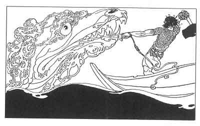

  
[Intangible Textual Heritage](../../../index)  [Legends and
Sagas](../../index)  [Iceland](../index)  [Index](index) 
[Previous](coo16)  [Next](coo18) 

------------------------------------------------------------------------

[Buy this Book at
Amazon.com](https://www.amazon.com/exec/obidos/ASIN/B0025VKZFM/internetsacredte)

------------------------------------------------------------------------

  
*The Children of Odin*, by Padraic Colum, \[1920\], at Intangible
Textual Heritage

------------------------------------------------------------------------

p. 124

 

### 7. AEGIR'S FEAST: HOW THOR TRIUMPHED

THE time between midday and evening wore on while the Æsir and the Vanir
gathered for the feast in old Ægir's hall listened to the stories that
Loki told in mockery of Thor. The night came, but no banquet was made
ready for the Dwellers in Asgard. They called to Ægir's two
underservants, Fimaffenger and Elder, and they bade them bring them a
supper. Slight was what they got, but they went to bed saying, "Great
must be the preparations that old Ægir is making to feast us tomorrow."

The morrow came and the midday of the morrow, and still the Dwellers in
Asgard saw no preparations being made for the banquet. Then Frey rose up
and went to seek old Ægir, the Giant King of the Sea. He found him

p. 125

sitting with bowed head in his inner hall. "Ho, Ægir," he said, "what of
the banquet that you have offered to the Dwellers in Asgard?"

Old Ægir mumbled and pulled at his beard. At last he looked his guest in
the face and told why the banquet was not being made ready. The mead for
the feast was not yet brewed. And there was little chance of being able
to brew mead that would do for all, for Ægir's hall was lacking a mead
kettle that would contain enough.

When the Æsir and the Vanir heard this they were sorely disappointed.
Who now, outside of Asgard, would give them a feast? Ægir was the only
one of the Giants who was friendly to them, and Ægir could not give them
full entertainment.

Then a Giant youth who was there spoke up and said, "My kinsman, the
Giant Hrymer, has a mead kettle that is a mile wide. If we could bring
Hrymer's kettle here, what a feast we might have!"

"One of us can go for that kettle," Frey said.

"Ah, but Hrymer's dwelling is beyond the deepest forest and behind the
highest mountain," the Giant youth said, "and Hrymer himself is a rough
and a churlish one to call on."

"Still, one of us should go," Frey said.

"I will go to Hrymer's dwelling," said Thor, standing up. "I will go to
Hrymer's dwelling and get the mile-wide kettle from him by force or
cunning." He had been sitting subdued under the mocking tales that Loki
told of him and he was pleased with this chance to make his prowess

p. 126

plain to the Æsir and the Vanir. He buckled on the belt that doubled his
strength. He drew on the iron gloves that enabled him to grasp Miölnir.
He took his hammer in his hands, and he signed to the Giant youth to
come with him and be his guide.

The Æsir and the Vanir applauded Thor as he stepped out of old Ægir's
hall. But Loki, mischievous Loki, threw a gibe after him. "Do not let
the hammer out of your hands this time, bride of Thrym," he shouted.

Thor, with the Giant youth to guide him, went through the deepest forest
and over the highest mountain. He came at last to the Giant's dwelling.
On a hillock before Hrymer's house was a dreadful warden; a Giant crone
she was, with heads a-many growing out of her shoulders. She was
squatting down on her ankles, and her heads, growing in bunches, were
looking in different directions. As Thor and the Giant youth came near
screams and yelps came from all her heads. Thor grasped his hammer and
would have flung it at her if a Giant woman, making a sign of peace, had
not come to the door of the dwelling. The youthful Giant who was with
Thor greeted her as his mother.

"Son, come within," said she, "and you may bring your fellow farer with
you."

The Giant crone--she was Hrymer's grandmother--kept up her screaming and
yelping. But Thor went past her and into the Giant's dwelling.

When she saw that it was one of the Dwellers in Asgard who had come with
her son the Giant woman grew fearful

p. 127

for them both. "Hrymer," she said, "will be in a rage to find one of the
Æsir under his roof. He will strive to slay you."

"It is not likely he will succeed," Thor said, grasping Miölnir, the
hammer that all the Giant race knew of and dreaded.

"Hide from him," said the Giant woman. "He may injure my son in his rage
to find you here."

"I am not wont to hide from the Giants," Thor said.

"Hide only for a little while! Hide until Hrymer has eaten," the Giant
woman pleaded. "He comes back from the chase in a stormy temper. After
he has eaten he is easier to deal with. Hide until he has finished
supper."

Thor at last agreed to do this. He and the Giant youth hid behind a
pillar in the hall. They were barely hidden when they heard the clatter
of the Giant's steps as he came through the courtyard. He came to the
door. His beard was like a frozen forest around his mouth. And he
dragged along with him a wild bull that he had captured in the chase. So
proud was he of his capture that he dragged it into the hall.

"I have taken alive," he shouted, "the bull with the mightiest head and
horns. 'Heaven--breaking' this bull is called. No Giant but me could
capture it." He tied the bull to the post of the door and then his eyes
went toward the pillar behind which Thor and the Giant youth were
hiding. The pillar split up its whole length at that look from Hrymer's
eyes. He came nearer. The pillar of stone broke across. It fell with the
crossbeam it supported and

p. 128

all the kettles and cauldrons that were hanging on the beam came down
with a terrible rattle.

Then Thor stepped out and faced the wrathful Giant. "It is I who am
here, friend Hrymer," he said, his hands resting on his hammer.

Then Hrymer, who knew Thor and knew the force of Thor's hammer, drew
back. "Now that you are in my house, Asa Thor," he said, "I will not
quarrel with you. Make supper ready for Asa Thor and your son and
myself," said he to the Giant woman.

A plentiful supper was spread and Hrymer and Thor and the Giant youth
sat down to three whole roast oxen. Thor ate the whole of one ox.
Hrymer, who had eaten nearly two himself, leaving only small cuts for
his wife and his youthful kinsman, grumbled at Thor's appetite. "You'll
clear my fields, Asa Thor," he said, "if you stay long with me."

"Do not grumble, Hrymer," Thor said. "Tomorrow I'll go fishing and I'll
bring you back the weight of what I ate."

"Then instead of hunting I'll go fishing with you tomorrow, Asa Thor,"
said Hrymer. "And don't be frightened if I take you out on a rough sea."

Hrymer was first out of bed the next morning. He came with the pole and
the ropes in his hand to where Thor was sleeping. "Time to start earning
your meal, Asa Thor," said he.

Thor got out of bed, and when they were both in the courtyard the Giant
said, "You'll have to provide a bait

p. 129

for yourself. Mind that you take a bait large enough. It is not where
the little fishes are, the place where I'm going to take you. If you
never saw monsters before you'll see them now. I'm glad, Asa Thor, that
you spoke of going fishing."

"Will this bait be big enough?" said Thor, laying his hands on the horns
of the bull that Hrymer had captured and brought home, the bull with the
mighty head of horns that was called "Heaven-breaking." "Will this bait
be big enough, do you think?"

"Yes, if you're big enough to handle it", said the Giant.

Thor said nothing, but he struck the bull full in the middle of the
forehead with his fist. The great creature fell down dead. Thor then
twisted the bull's head off. "I have my bait and I'm ready to go with
you, Hrymer," he said.

Hrymer had turned away to hide the rage he was in at seeing Thor do such
a feat. He walked down to the boat without speaking. "You may row for
the first few strokes," said Hrymer, when they were in the boat, "but
when we come to where the ocean is rough, why I'll take the oars from
you."

Without saying a word Thor made a few strokes that took the boat out
into the middle of the ocean. Hrymer was in a rage to think that he
could not show himself greater than Thor. He let out his line and began
to fish. Soon he felt something huge on his hook. The boat rocked and
rocked till Thor steadied it. Then Hrymer drew into the boat the largest
whale that was in these seas.

p. 130

"Good fishing," said Thor, as he put his own bait on the line.

'It's something for you to tell the Æsir, " said Hrymer.

"I thought as you were here I'd show you something bigger than
salmon-fishing."

"I'll try my luck now," said Thor.

He threw out a line that had at the end of it the mighty horned head of
the great bull. Down, down the head went. It passed where the whales
swim, and the whales were afraid to gulp at the mighty horns. Down, down
it went till it came near where the monster serpent that coils itself
round the world abides. It reared its head up from its serpent coils as
Thor's bait came down through the depths of the ocean. It gulped at the
head and drew it into its gullet. There the great hook stuck. Terribly
surprised was I the serpent monster. It lashed the ocean into a fury.
But still the hook stayed. Then it strove to draw down to the depths of
the ocean the boat of those who had hooked it. Thor put his legs across
the boat and stretched them till they touched the bottom bed of the
ocean. On the bottom bed of the ocean Thor stood and he pulled and he
pulled on his line. The serpent monster lashed the ocean into fiercer
and fiercer storms and all the world's ships were hurled against each
other and wrecked and tossed. But it had to loosen coil after coil of
the coils it makes around the world. Thor pulled and pulled. Then the
terrible head of the serpent monster appeared above the waters. It
reared over the boat that Hrymer sat in and that Thor straddled across.
Thor dropped the line and took up Miölnir, his mighty hammer. He raised
it to strike the

p. 131

head of the serpent monster whose coils go round the world. But Hrymer
would not have that happen. Rather than have Thor pass him by such a
feat he cut the line, and the head of the serpent monster sank back into
the sea. Thor's hammer was raised. He hurled it, hurled that hammer that
always came back to his hand. It followed the sinking head through
fathom after fathom of the ocean depth. It struck the serpent monster a
blow, but not such a deadly blow as would have been struck if the water
had not come between. A bellow of pain came up from the depths of the
ocean, such a bellow of pain that all in Jötunheim were affrighted.

"This surely is something to tell the Æsir of," said Thor, "something to
make them forget Loki's mockeries."

Without speaking Hrymer turned the boat and rowed toward the shore,
dragging the whale in the wake. He was in such a rage to think that one
of the Æsir had done a feat surpassing his that he would not speak. At
supper, too, he remained silent, but Thor talked for two, boasting
loudly of his triumph over the monster serpent.

"No doubt you think yourself very powerful, Asa Thor," Hrymer said at
last. "Well, do you think you are powerful enough to break the cup that
is before you?"

Thor took up the cup and with a laugh he hurled it against the stone
pillar of the house. The cup fell down on the floor without a crack or a
dint in it. But the pillar was shattered with the blow.

The Giant laughed. "So feeble are the folk of Asgard!" he said.

Thor took up the cup again and flung it with greater

p. 132

force against the stone pillar. And again the cup fell to the ground
without a crack or a dint.

Then he heard the woman who was the mother of the Giant youth sing
softly, as she plied her wheel behind him:

\#dir\#Not at the pillar of the stead,  
But at Hrymer's massy head:  
When you next the goblet throw,  
Let his head receive the blow.\#/dir\#

\[paragraph continues\] Thor took the cup
up again. He flung it, not at the pillar this time, but at Hrymer's
head. It struck the Giant full on the forehead and fell down on the
floor in pieces. And Hrymer's head was left without a dint or a crack.

"Ha, so you can break a cup, but can you lift up my mile-wide kettle?"
cried the Giant.

"Show me where your mile-wide kettle is and I shall try to lift it,"
cried Thor.

The Giant took up the flooring and showed him the mile-wide kettle down
in the cellar. Thor stooped down and took the kettle by the brim. He
lifted it slowly as if with a mighty effort.

"You can lift, but can you carry it?" said the Giant.

"I will try to do that," said Thor. He lifted the kettle up and placed
it on his head. He strode to the door and out of the house before the
Giant could lay hands on him. Then when he was outside he started to
run. He was across the mountain before he looked behind him. He heard a
yelping and a screaming and he saw the Giant

p. 133

crone with the bunch of heads running, running after him. Up hill and
down dale Thor raced, the mile-wide kettle on his head and the Giant
crone in chase of him. Through the deep forest he ran and over the high
mountain, but still Bunch-of-Heads kept him in chase. But at last,
jumping over a lake, she fell in and Thor was free of his pursuer.

And so back to the Æsir and the Vanir Thor came in triumph, carrying on
his head the mile-wide kettle. And those of the Æsir and the Vanir who
had laughed most at Loki's mockeries rose up and cheered for him as he
came in. The mead was brewed, the feast was spread, and the greatest
banquet that ever the Kings of the Giants gave to the Dwellers in Asgard
was eaten in gladness.

A strange and silent figure sat at the banquet. It was the figure of a
Giant and no one knew who he was nor where he had come from. But when
the banquet was ended Odin, the Eldest of the Gods, turned toward this
figure and said, "O Skyrmir, Giant King of Utgard, rise up now and tell
Thor of all you practiced upon him when he and Loki came to your City."

Then the stranger at the banquet stood up, and Thor and Loki saw he was
the Giant King in whose halls they had had the contests. Skyrmir turned
toward them and said:

"O Thor and O Loki, I will reveal to you now the deceits I practiced on
you both. It was I whom ye met on the Moorland on the day before ye came
into Utgard. I gave you my name as Skyrmir and I did all I might do to
prevent

p. 134

your entering our City, for the Giants dreaded a contest of strength
with Asa Thor. Now hear me, O Thor. The wallet I gave for you to take
provisions out of was tied with magic knots. No one could undo them by
strength or cleverness. And while you were striving to undo them I
placed a mountain of rock between myself and you. The hammer blows,
which as you thought struck me, struck the mountain and made great
clefts and gaps in it. When I knew the strength of your tremendous blows
I was more and more in dread of your coming into our City.

"I saw you would have to be deceived by magic. Your lad Thialfi was the
one whom I first deceived. For it was not a Giant youth who raced
against him, but Thought itself. And even you, O Loki, I deceived. For
when you tried to make yourself out the greatest of eaters I pitted
against you, not a Giant, but Fire that devours everything.

"You, Thor, were deceived in all the contests. After you had taken the
drinking horn in your hands we were all affrighted to see how much you
were able to gulp down. For the end of that horn was in the sea, and
Ægir, who is here, can tell you that after you had drunk from it, the
level of the sea went down.

"The cat whom you strove to lift was Nidhögg, the dragon that gnaws at
the roots of Ygdrassil, the Tree of Trees. Truly we were terrified when
we saw that you made Nidhögg budge. When you made the back of the cat
reach the roof of our palace we said to ourselves, 'Thor is the
mightiest of all the beings we have known.'

p. 135

"Lastly you strove with the hag Ellie. Her strength seemed marvelous to
you, and you thought yourself disgraced because you could not throw her.
But know, Thor, that Ellie whom you wrestled with was Old Age herself.
We were terrified again to see that she who can overthrow all was not
able to force you prone upon the ground."

So Skyrmir spoke and then left the hall. And once more the Æsir and the
Vanir stood up and cheered for Thor, the strongest of all who guarded
Asgard.

------------------------------------------------------------------------

[Next: 8. The Dwarfs Hoard, and the Curse that it Brought](coo18)
