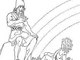
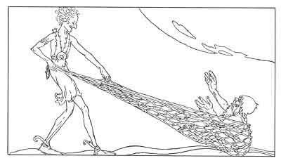

  
[Intangible Textual Heritage](../../../index)  [Legends and
Sagas](../../index)  [Iceland](../index)  [Index](index) 
[Previous](coo17)  [Next](coo19) 

------------------------------------------------------------------------

[Buy this Book at
Amazon.com](https://www.amazon.com/exec/obidos/ASIN/B0025VKZFM/internetsacredte)

------------------------------------------------------------------------

  
*The Children of Odin*, by Padraic Colum, \[1920\], at Intangible
Textual Heritage

------------------------------------------------------------------------

p. 136

 

### 8. THE DWARFS HOARD, AND THE CURSE THAT IT BROUGHT

NOW old Ægir's feast was over and all the Æsir and the Vanir made ready
for their return to Asgard. Two only went on another way--Odin, the
Eldest of the Gods, and Loki the Mischievous.

Loki and Odin laid aside all that they had kept of the divine power and
the divine strength. They were going into the World of Men, and they
would be as men merely. Together they went through Midgard, mingling
with men of all sorts, kings and farmers, outlaws and true men, warriors
and householders, thralls and councillors, courteous men and men who
were ill-mannered. One day they came to the bank of a mighty river and
there they rested, listening to the beat of iron upon iron in a place
near by.

Presently, on a rock in the middle of the river, they saw

p. 137

an otter come. The otter went into the water and came back to the rock
with a catch of salmon. He devoured it there. Then Odin saw Loki do a
senseless and an evil thing. Taking up a great stone he flung it at the
otter. The stone struck the beast on the skull and knocked him over
dead.

"Loki, Loki, why hast thou done a thing so senseless and so evil?" Odin
said. Loki only laughed. He swam across the water and came back with the
creature of the river. "Why didst thou take the life of the beast?" Odin
said.

"The mischief in me made me do it," said Loki. He drew out his knife and
ripping the otter up he began to flay him. When the skin was off the
beast he folded it up and stuck it in his belt. Then Odin and he left
that place by the river.

They came to a house with two smithies beside it, and from the smithies
came the sound of iron beating upon iron. They went within the house and
they asked that they might eat there and rest themselves.

An old man who was cooking fish over a fire pointed out a bench to them.
"Rest there," said he, "and when the fish is cooked I will give you
something good to eat. My son is a fine fisher and he brings me salmon
of the best."

Odin and Loki sat on the bench and the old man went on with his cooking.
"My name is Hreidmar," he said, I, and I have two sons who work in the
smithies without. I have a third son also. It is he who does the fishing
for us. Arid who may ye be, O wayfaring men?"

Loki and Odin gave names to Hreidmar that were not

p. 138

the names by which they were known in Asgard or on Midgard. Hreidmar
served fish to them and they ate. "And what adventures have ye met upon
your travels?" Hreidmar asked. "Few folk come this way to tell me of
happenings."

"I killed an otter with a cast of a stone," Loki said with a laugh.

"You killed an otter!" Hreidmar cried. "Where did you kill one?"

"Where I killed him is of no import to you, old man," said Loki. "His
skin is a good one, however. I have it at my belt."

Hreidmar snatched the skin out of Loki's belt. As soon as he held the
skin before his eyes he shrieked out, "Fafnir, Regin, my sons, come here
and bring the thralls of your smithies. Come, come, come!"

"Why dost thou make such an outcry, old man?" said Odin.

"Ye have slain my son Otter," shrieked the old man. "This in my hands is
the skin of my son."

As Hreidmar said this two young men bearing the forehammers of the
smithies came in followed by the thralls. "Strike these men dead with
your forehammers, O Fafnir, O Regin," their father cried. "Otter, who
used to stay in the river, and whom I changed by enchantment into a
river beast that he might fish for me, has been slain by these men."

"Peace," said Odin. "We have slain thy son, it would seem, but it was
unwittingly that we did the deed. We will give a recompense for the
death of thy son."

p. 139

"What recompense will ye give?" said Hreidmar, looking at Odin with eyes
that were small and sharp.

Then did Odin, the Eldest of the Gods, say a word that was unworthy of
his wisdom and his power. He might have said, "I will bring thee a
draught of Munir's well water as a recompense for thy son's death." But
instead of thinking of wisdom, Odin All-Father thought of gold. "Set a
price on the life of thy son and we will pay that price in gold," he
said.

"Maybe ye are great kings traveling through the world," Hreidmar said.
"If ye are ye will have to find gold that will cover every hair upon the
skin of him whom ye have killed."

Then did Odin, his mind being fixed upon the gold, think upon a certain
treasure, a treasure that was guarded by a Dwarf. No other treasure in
the nine worlds would be great enough to make the recompense that
Hreidmar claimed. He thought upon this treasure and he thought on how it
might be taken and yet he was ashamed of his thought.

"Dost thou, Loki, know of Andvari's hoard?" he said.

"I know of it," said Loki sharply, "and I know where it is hidden. Wilt
thou, Odin, win leave for me to fetch Andvari's hoard?"

Odin spoke to Hreidmar. "I will stay with thee as a hostage," he said,
"if' thou wilt let this one go to fetch a treasure that will cover the
otter's skin hair by hair."

"I will let this be done," said old Hreidmar with the sharp and cunning
eyes. "Go now, 11 said he to Loki. Then Loki went from the house.

p. 140

Andvari was a Dwarf who, in the early days, had gained for himself the
greatest treasure in the nine worlds. So that he might guard this
treasure unceasingly he changed himself into a fish--into a pike--and he
swam in the water before the cave where the hoard was hidden.

All in Asgard knew of the Dwarf and of the hoard he guarded. And there
was a thought amongst all that this hoard was not to be meddled with and
that some evil was joined to it. But now Odin had given the word that it
was to be taken from the Dwarf. Loki set out for Andvari's cave
rejoicingly. He came to the pool before the cave and he watched for a
sight of Andvari. Soon he saw the pike swimming cautiously before the
cave.

He would have to catch the pike and hold him till the treasure was given
for ransom. As he watched the pike became aware of him. Suddenly he
flung himself forward in the water and went with speed down the stream.

Not with his hands and not with any hook and line could Loki catch that
pike. How, then, could he take him? Only with a net that was woven by
magic. Then Loki thought of where he might get such a net.

Ran, the wife of old Ægir, the Giant King of the Sea, had a net that was
woven by magic. In it she took all that was wrecked on the sea. Loki
thought of Ran's net and he turned and went back to Ægir's hall to ask
for the Queen. But Ran was seldom in her husband's dwelling. She was now
down by the rocks of the sea.

He found Ran, the cold Queen, standing in the flow of the sea, drawing
out of the depths with the net that she

p. 141

held in her hands every piece of treasure that was washed that way. She
had made a heap of the things she had drawn out of the sea, corals and
amber, and bits of gold and silver, but still she was plying her net
greedily.

"Thou knowst me, Ægir's wife," said Loki to her.

"I know thee, Loki," said Queen Ran.

"Lend me thy net," said Loki.

"That I will not do," said Queen Ran.

"Lend me thy net that I may catch Andvari the Dwarf who boasts that he
has a greater treasure than ever thou wilt take out of the sea," said
Loki.

The cold Queen of the sea ceased plying her net. She looked at Loki
steadily. Yes, if he were going to catch Andvari she would lend her net
to him. She hated all the Dwarfs because this one and that one had told
her they had greater treasures than ever she would be mistress of. But
especially she hated Andvari, the Dwarf who had the greatest treasure in
the nine worlds.

"There is nothing more to gather here," she said, "and if thou wilt
swear to bring me back my net by tomorrow I shall lend it to you."

"I swear by the sparks of Muspelheim that I will bring thy net back to
thee by tomorrow, O Queen of Ægir," Loki cried. Then Ran put into his
hands the Magic Net. Back then he went to where the Dwarf, transformed,
was guarding his wondrous hoard.

Dark was the pool in which Andvari floated as a pike; dark it was, but
to him it was all golden with the light of his wondrous treasure. For
the sake of this hoard he had

p. 142

given up his companionship with the Dwarfs and his delight in making and
shaping the things of their workmanship. For the sake of his hoard he
had taken on himself the dumbness and deafness of a fish.

Now as he swam about before the cave he was aware again of a shadow
above him. He slipped toward the shadow of the bank. Then as he turned
round he saw a net sweeping toward him. He sank down in the water. But
the Magic Net had spread out and he sank into its meshes.

Suddenly he was out of the water and was left gasping on the bank. He
would have died had he not undone his transformation.

Soon he appeared as a Dwarf. "Andvari, you are caught; it is one of the
Æsir who has taken you," he heard his captor say.

"Loki," he gasped.

"Thou art caught and thou shalt be held," Loki said to him. "It is the
will of the Æsir that thou give up thy hoard to me."

"My hoard, my hoard!" the Dwarf shouted. "Never will give up my hoard."

"I hold thee till thou givest it to me," said Loki.

"Unjust, unjust," shouted Andvari. "It is only thou, Loki, who art
unjust. I will go to the throne of Odin and I will have Odin punish thee
for striving to rob me of my treasure."

"Odin has sent me to fetch thy hoard to him," said Loki.

"Can it be that all the Æsir are unjust? Ah, yes. In the

p. 143

beginning of things they cheated the Giant who built the wall round
their City. The Æsir are unjust."

Loki had Andvari in his power. And after the Dwarf had raged against him
and defied him, he tormented him; at last, trembling with rage and with
his face covered with tears, Andvari took Loki into his cavern, and,
turning a rock aside, showed him the mass of gold and gems that was his
hoard.

At once Loki began to gather into the Magic Net lumps and ingots and
circlets of gold with gems that were rubies and sapphires and emeralds.
He saw Andvari snatch at something on the heap, but he made no sign of
marking it. At last all was gathered into the net, and Loki stood there
ready to bear the Dwarf's hoard away.

"There is one thing more to be given," said Loki, "the ring that you,
Andvari, snatched from the heap."

"I snatched nothing," said the Dwarf. But he shook with anger and his
teeth gnashed together and froth came on his lips. "I snatched nothing
from the heap."

But Loki pulled up his arm and there fell to the ground the ring that
Andvari had hidden under his armpit.

It was the most precious thing in all the hoard. Had it been left with
him Andvari would have thought that he still possessed a treasure, for
this ring of itself could make gold. It was made out of gold that was
refined of all impurities and it was engraven with a rune of power.

Loki took up this most precious ring and put it on his finger. Then the
Dwarf screamed at him, turning his thumbs toward him in a curse:

p. 144

\#dir\#The ring with the rune  
Of power upon it:  
May it weigh down your fortune,  
And load you with evil,  
You, Loki, and all  
Who lust to possess  
The ring I have cherished.\#/dir\#

As Andvari uttered this curse Loki saw a figure rise up in the cave and
move toward him. As this figure came near he knew who it was: Gulveig, a
Giant woman who had once been in Asgard.

Far back in the early days, when the Gods had come to their holy hill
and before Asgard was built, three women of the Giants had come amongst
the Æsir. After the Three had been with them for a time, the lives of
the Æsir changed. Then did they begin to value and to hoard the gold
that they had played with. Then did they think of war. Odin hurled his
spear amongst the messengers that came from the Vanir, and war came into
the world.

The Three were driven out of Asgard. Peace was made with the Vanir. The
Apples of Lasting Youth were grown in Asgard. The eagerness for gold was
curbed. But never again were the Æsir as happy as they were before the
women came to them from the Giants.

Gulveig was one of the Three who had blighted the early happiness of the
Gods. And, behold, she was in the cave where Andvari had hoarded his
treasure and with a smile upon her face she was advancing toward Loki.

p. 145

"So, Loki," she said, "thou seest me again. And Odin who sent thee to
this cave will see me again. Lo, Loki! I go to Odin to be thy messenger
and to tell him that thou comest with Andvari's hoard."

And speaking so, and smiling into his face, Gulveig went out of the cave
with swift and light steps. Loki drew the ends of the Magic Net together
and gathering all the treasures in its meshes he, too, went out.

Odin, the Eldest of the Gods, stood leaning on his spear and looking at
the skin of the otter that was spread out before him. One came into the
dwelling swiftly. Odin looked and saw that she who had come in on such
swift, glad feet was Gulveig who, once with her two companions, had
troubled the happiness of the Gods. Odin raised his spear to cast it at
her.

"Lay thy spear down, Odin," she said. "I dwelt for long in the Dwarf's
cave. But thy word unloosed me, and the curse said over Andvari's ring
has sent me here. Lay thy spear down, and look on me, O Eldest of the
Gods.

"Thou didst cast me out of Asgard, but thy word has brought me to come
back to thee. And if ye two, Odin and Loki, have bought yourselves free
with gold and may enter Asgard, surely I, Gulveig, am free to enter
Asgard also."

Odin lowered his spear, sighing deeply. "Surely it is so, Gulveig," he
said. "I may not forbid thee to enter Asgard. Would I had thought of
giving the man Kvasir's Mead or Mimir's well water rather than this gold
as a recompense."

As they spoke Loki came into Hreidmar's dwelling. He laid on the floor
the Magic Net. Old Hreidmar with his

p. 146

sharp eyes, and huge Fafnir, and lean and hungry-looking Regin came in
to gaze on the gold and gems that shone through the meshes. They began
to push each other away from gazing at the gold. Then Hreidmar cried
out, "No one may be here but these two kings and I while we measure out
the gold and gems and see whether the recompense be sufficient. Go
without, go without, sons of mine."

Then Fafnir and Regin were forced to go out of the dwelling. They went
out slowly, and Gulveig went with them, whispering to both.

With shaking hands old Hreidmar spread out the skin that once covered
his son. He drew out the ears and the tail and the paws so that every
single hair could be shown. For long he was on his hands and knees, his
sharp eyes searching, searching over every line of the skin. And still
on his knees he said, "Begin now, O kings, and cover with a gem or a
piece of gold every hair on the skin that was my son s.

Odin stood leaning on his spear, watching the gold and gems being paid
out. Loki took the gold--the ingots, and the lumps and the circlets; he
took the gems--the rubles, and the emeralds and the sapphires, and he
began to place them over each hair. Soon the middle of the skin was all
covered. Then he put the gems and the gold over the paws and the tail.
Soon the otter-skin was so glittering that one would think it could
light up the world. And still Loki went on finding a place where a gem
or a piece of gold might be put.

At last he stood up. Every gem and every piece of gold

p. 147

had been taken out of the net. And every hair on the otter's skin had
been covered with a gem or a piece of gold.

And still old Hreidmar on his hands and knees was peering over the skin,
searching, searching for a hair that was not covered. At last he lifted
himself up on his knees. His mouth was open, but he was speechless. He
touched Odin on the knees, and when Odin bent down he showed him a hair
upon the lip that was left uncovered.

"What meanest thou?" Loki cried, turning upon the crouching man.

"Your ransom is not paid yet--look, here is, still a hair uncovered. You
may not go until every hair is covered with gold or a gem."

"Peace, old man," said Loki roughly. "All the Dwarf's hoard has been
given thee."

"Ye may not go until every hair has been covered," Hreidmar said again.

"There is no more gold or gems," Loki answered.

"Then ye may not go," cried Hreidmar, springing up.

It was true. Odin and Loki might not leave that dwelling until the
recompense they had agreed to was paid in full. Where now would the Æsir
go for gold?

And then Odin saw the gleam of gold on Loki's finger: it was the ring he
had forced from Andvari. "Thy fingerring," said Odin. "Put thy
fingerring over the hair on the otter's skin."

Loki took off the ring that was engraved with the rune of Power, and he
put it on the lip-hair of the otter's skin. Then Hreidmar clapped his
hands and screamed aloud.

p. 148

\[paragraph continues\] Huge Fafnir and
lean and hungry-looking Regin came within, and Gulveig came behind them.
They stood around the skin of the son and the brother that was all
glittering with gold and gems. But they looked at each other more than
they looked on the glittering mass, and very deadly were the looks that
Fafnir and Regin cast upon their father and cast upon each other.

Over Bifröst, the Rainbow Bridge, went all of the Æsir and the Vanir
that had been at old Ægir's feast--Frey and Freya, Frigga, Iduna, and
Sif; Tyr with his sword and Thor in his chariot drawn by the goats. Loki
came behind them, and behind them all came Odin, the Father of the Gods.
He went slowly with his head bent, for he knew that an unwelcome one was
following--Gulveig, who once had been cast out of Asgard and whose
return now the Gods might not gainsay.

------------------------------------------------------------------------

[Next: 1. Foreboding in Asgard](coo19)
